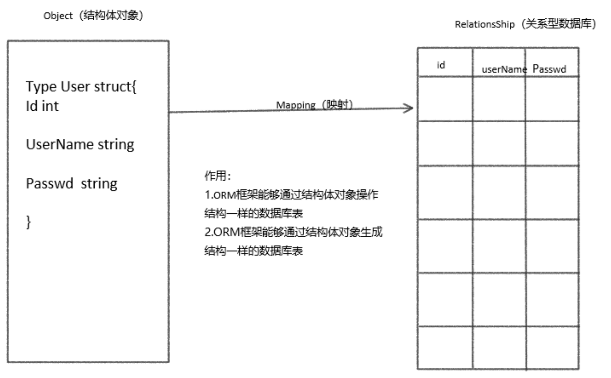

# ORM介绍

`beego ORM` 是一个强大的 `Go` 语言 `ORM` 框架。她的灵感主要来自 `Django ORM` 和 `SQLAlchemy`。

目前该框架仍处于开发阶段，可能发生任何导致不兼容的改动。

**已支持数据库驱动：**

- `MySQL`：[github.com/go-sql-driver/mysql](https://github.com/go-sql-driver/mysql)
- `PostgreSQL`：[github.com/lib/pq](https://github.com/lib/pq)
- `Sqlite3`：[github.com/mattn/go-sqlite3](https://github.com/mattn/go-sqlite3)

以上数据库驱动均通过基本测试，但我们仍需要您的反馈。

**`ORM` 特性：**

- 支持 Go 的所有类型存储
- 轻松上手，采用简单的 CRUD 风格
- 自动 Join 关联表
- 跨数据库兼容查询
- 允许直接使用 `SQL` 查询／映射
- 严格完整的测试保证 `ORM `的稳定与健壮

更多特性请在文档中自行品读。


`Beego`中内嵌了`ORM`框架，用来操作数据库。那么`ORM`框架是什么呢？`ORM`框架是`Object-RelationShip Mapping`的缩写，中文叫**关系对象映射**，他们之间的关系，我们用图来表示：



**作用**

1. 通过对象操作数据表
2. 通过对象生成与对象相同属性的数据表


## 快速入门

### 简单使用

#### 模型与记录

使用结构体来描述一条记录的字段，需要一定的约束条件。
```go
package models

import (
	"github.com/beego/beego/v2/client/orm"
	_ "github.com/go-sql-driver/mysql"
)


// Model Struct

type User struct {
	Id   int  // 默认主键
	Name string `orm:"size(100)"`  // 约束条件
}

func init() {
	// set default database
	orm.RegisterDataBase("default", "mysql", "root:dyp1996@tcp(127.0.0.1:3306)/beego?charset=utf8&loc=Local")

	// register model
	orm.RegisterModel(new(User))

	// create table
	orm.RunSyncdb("default", false, true)
}
```
**相关函数介绍**
1. 数据库连接: `orm.RegisterDataBase(aliasName, driverName, dataSource string, params ...DBOption)`
    * `aliasName`: 数据库别名，必须有且唯一的别名为`default`。
    * `driverName`: 数据库驱动
    * `dataSource`: 资源地址，`"username:password@tcp(ip:port)/db_name?charset=utf8&loc=Local"`
    * `params`: 一个`func(al *alias)`类型的切片

2. 模型注册: `orm.RegisterModel(models ...interface{})`
    * `models`: 模型（数据表）
    
3. 运行数据库(建表): `orm.RunSyncdb(name string, force, verbose bool)`
    * `name`: 数据库别名
    * `force`: 强制(是否强制建表)
    * `verbose`: 视图(是否看见创建表过程)
    
#### 简单的增删查改

```go
package main

import (
	"github.com/beego/beego/v2/client/orm"
	"log"
	"main/models"
)

func Insert(u *models.User) {
	o := orm.NewOrm() // 获取default数据库

	// 插入数据库
	id, err := o.Insert(u)
	if err != nil {
		log.Fatalln("插入数据失败，失败原因：", err)
		return
	}
	log.Print("插入数据成功，返回数据id为：", id)
}

func InsertMany() {
	o := orm.NewOrm()
	users := []models.User{
		{Name: "slene"},
		{Name: "astaxie"},
		{Name: "unknown"},
	}
	successNums, err := o.InsertMulti(100, users)
	if err != nil {
		log.Fatalln("插入失败，成功条数: ", successNums)
		return
	}
	log.Println("成功条数: ", successNums)
}

func Select(name string) (u *models.User, err error) {
	o := orm.NewOrm()
	u = &models.User{Name: name}
	err = o.Read(u, "name")
	if err != nil {
		log.Fatalln("数据查找失败，失败原因：", err)
		return nil, err
	}
	return
}

func Update(oldName, newName string) {
	o := orm.NewOrm()
	u, err := Select(oldName)
	if err != nil {
		return
	}

	u.Name = newName
	num, err := o.Update(u)
	if err != nil {
		log.Fatalln("修改数据失败，失败原因：", err)
		return
	}
	log.Println("影响的数据行数", num)
}

func Delete(name string) {
	o := orm.NewOrm()
	u, err := Select(name)
	if err != nil {
		return
	}
	num, err := o.Delete(u)
	if err != nil {
		log.Fatalln("删除数据失败，失败原因：", err)
		return
	}
	log.Println("影响的数据行数：", num)
}
```
**相关函数介绍**
1. 获取默认数据库: `o := orm.NewOrm()`
   
2. 插入数据: `o.Insert(md interface{})/o.InsertMulti(bulk int, mds interface{})`
    * `md`: 数据对象指针
    * 返回值
      * 插入数据的`id`/成功条数
      * 错误，出现错误，插入失败
    
3. 查询数据: `o.Read(md interface{}, cols ...string)`
    * `md`: 数据对象指针
    * `cols`: 查询的列，默认以`id`查询
    * 返回值
      * 错误，出现错误，表示查询数据失败

4. 修改数据: `o.Update(md interface{}, cols ...string)`
    * `md`: 修改后数据对象的指针
    * 返回值
        * 影响数据的行数
        * 错误，出现错误表示修改数据失败
    
5. 删除数据`o.Delete(md interface{}, cols ...string)`
    * `md`: 数据对象的指针
    * 返回值
        * 影响数据的行数
        * 错误，出现错误表示删除数据失败
    
#### 关联查询
当满足条件的数据有多条时，使用此方法查询
```go
func SelectWthRe()  {
	o := orm.NewOrm()
	var users []*models.User
	qs := o.QueryTable("user")
	num, err := qs.Filter("name", "dyp").All(&users)
	if err != nil {
		log.Fatalln("关联查询失败，失败原因: ", err)
		return
	}
	log.Println("查询出的数据条数为", num)
}
```
**相关函数**
1. 获取整张表的`QuerySeter`对象: `qs := o.QueryTable(ptrStructOrTableName interface{})`
   * `ptrStructOrTableName`: 可以是表名、表模型指针
   * 返回值
      * `QuerySeter`对象，整张表的数据
   
2. 过滤数据: `qs.Filter(field string, value ...interface{})`
   * 根据 `field==value` 来过滤数据

3. 获取所有数据: `qs.All(container interface{}, cols ...string)`
   * `container`: 容器地址
   * `cols`: 数据对象需要列
   * 返回值
      * 总数居条数
      * 错误
   
#### SQL 查询
当您无法使用 ORM 来达到您的需求时，也可以直接使用 SQL 来完成查询／映射操作。
```go
func ExecuteSQL(sql string) {
	o := orm.NewOrm()
	var maps []orm.Params
	num, err := o.Raw(sql).Values(&maps)
	if err != nil {
		log.Fatalln("sql语句执行失败，失败原因: ", err)
		return
	}
	log.Println("查询到的数据条数为: ", num)
	for _,term := range maps{
		fmt.Println(term["id"],":",term["name"])
	}
}
```
**相关函数**
1. 执行sql语句: `o.Raw(sql)`
   * `sql`: 要执行的sql语句
   * 返回值
      * sql语句查询出来的数据对象(`RawSeter`)
   
2. 获取数据: `rs.Values(container *[]Params, cols ...string)`
   * `container`: 数据容器，`*orm.Params`类型的切片
   * 返回值
      * 总数居条数
      * 错误
