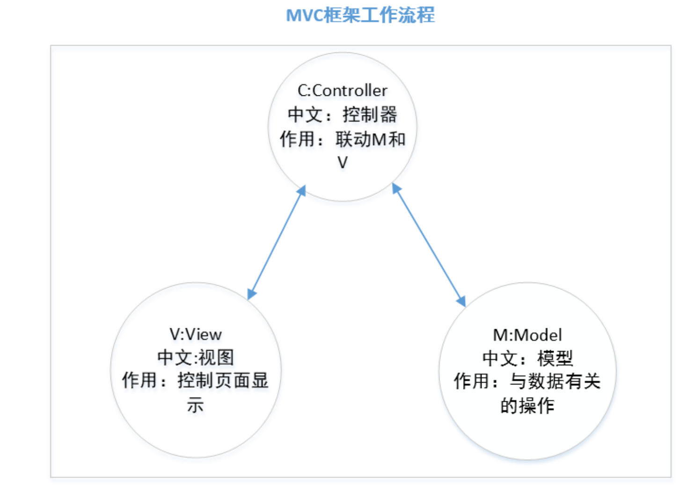
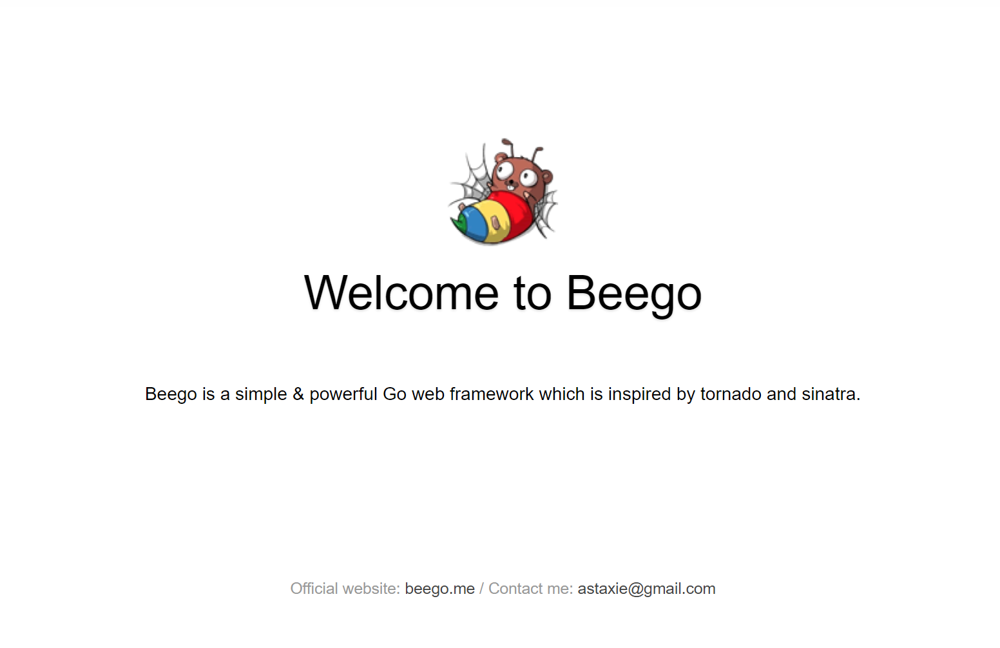
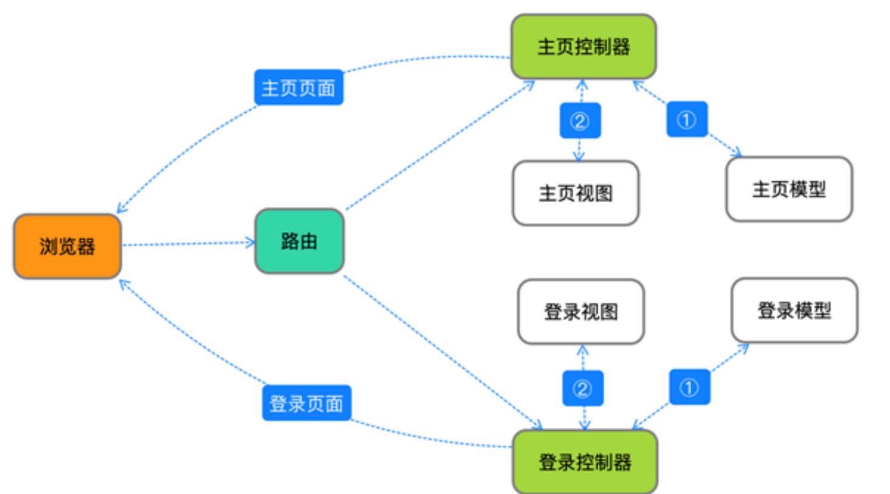

# beego
beego是一个由谢孟军开发的go语言web框架。

所谓的框架就是别人写好的代码，我们可以直接使用！这个代码是专门针对某一个开发方向定制的，
例如：我们要做一个网站，利用 beego 框架就能非常快的完成网站的开发，
如果没有框架，每一个细节都需要我们处理，开发速度会大大降低。

`go`语言常用的`web`框架：`beego`,`gin`,`echo`等等，那为什么我们选择beego呢？

第一，`beego`是中国人开发的，开发文档比较详细，`beego`官网网址: https://beego.me/ 。

第二，现在公司里面用beego的也比较多，比如今日头条，百度云盘，腾讯，阿里等。

# mvc架构

`Beego`是`MVC`架构。`MVC` 是一种应用非常广泛的体系架构，几乎所有的编程语言都会使用到，
而且所有的程序员在工作中都会遇到！用 `MVC` 的方式开发程序，可以让程序的结构更加合理和清晰。
我们画图说明



`beego`具体是如何内嵌`MVC`呢？我们搭起环境通过代码分析。

# beego安装与项目创建

## beego创建

需要安装`Beego`源码和`Bee`开发工具

```shell
$ go get -u -v github.com/astaxie/beego  // 源码包
$ go get -u -v github.com/beego/bee  // 命令工具
```

`beego`源码大家都了解，就是框架的源码。

`Bee`开发工具带有很多`Bee`命令。比如 `bee new` 创建项目， `bee run` 运行项目等。

用`bee`运行项目，项目自带**热更新**（是现在后台程序常用的一种技术，即在服务器运行期间，可以不停服替换

静态资源。替换`go`文件时会自动重新编译。）

安装完之后，`bee`可执行文件默认存放在 `$GOPATH/bin` 里面，所以需要把 `$GOPATH/bin` 添加到您的环境变量

中才可以进行下一步

```shell
$ cd ~ 

$ vim .bashrc //在最后一行插入 

export PATH="$GOPATH/bin:$PATH" //然后保存退出 

$ source .bashrc
```

## 创建项目

使用`bee`工具进行项目创建。如下命令是创建项目
```shell
bee new projectName
```

生成的项目目录结构如下:
```
.
├─conf 
├─controllers
├─models
├─routers
├─static
│  ├─css
│  ├─img
│  └─js
├─tests
└─views
```
进入项目根目录 执行 `bee run` 命令启动项目，
在浏览器输入网址：`127.0.0.1:8080`，显示如下：



## 各个目录介绍

```
.
├─conf 
├─controllers
├─models
├─routers
├─static
│  ├─css
│  ├─img
│  └─js
├─tests
└─views
```

* **conf**:放的是项目有关的配置文件

* **controllers**:存放主要的业务代码

* **main.go**:项目的入口文件

* **models**:存放的是数据库有关内容

* **routers**:存放路由文件，**路由作用是根据不同的请求指定不同的控制器**

* **static**：存放静态资源，包括图片，html页面，css样式，js文件等

* **tests**:测试文件

* **views**: 存放视图有关内容

#  beego快速体验

快速体体验`MVC`架构。
在`controllers/default.go`中修改内容如下
```go
package controllers

import (
   beego "github.com/beego/beego/v2/server/web"
)

type MainController struct {
   beego.Controller
}

func (c *MainController) Get() {
   c.Data["Website"] = "beego.me"
   c.Data["Email"] = "astaxie@gmail.com"
   c.Data["Test"]="hello world"
   c.TplName = "test.html"
}
```
在`views`目录中新建一个`html`文件
```html
<!DOCTYPE html>
<html lang="en">
<head>
    <meta charset="UTF-8">
    <title>beego quick test</title>
</head>
<body>
<h1>{{.Test}}</h1>
</body>
</html>
```
重启`beego`在访问，可以发送内容已经替换成了我们自己定义的内容。

# beego运行流程



1. 浏览器发出请求

2. 路由拿到请求，并给相应的请求指定相应的控制器

3. 找到指定的控制器之后，控制器看是否需要查询数据库

4. 如果需要查询数据库就找model取数据

5. 如果不需要数据库，直接找view要视图

6. 控制器拿到视图页面之后，把页面返回给浏览器

**根据文字流程分析代码流程**

1. 从项目的入口main.go开始

2. 找到router.go文件的Init函数

3. 找到路由指定的控制器文件default.go的Get方法

4. 然后找到指定视图的语法，整个项目就串起来啦。

# post请求案例

**修改模板**

```html
<!DOCTYPE html>
<html lang="en">
<head>
    <meta charset="UTF-8">
    <title>beego quick test</title>
</head>
<body>
<h1>{{.Response}}</h1>

<form action="/" method="post" enctype="application/x-www-form-urlencoded">

    <button type="submit">点击提交数据</button>

</form>

</body>
</html>
```
**修改控制器**
```go
package controllers

import (
   beego "github.com/beego/beego/v2/server/web"
)

type MainController struct {
   beego.Controller
}

func (c *MainController) Get() {
   c.Data["Website"] = "beego.me"
   c.Data["Email"] = "astaxie@gmail.com"
   c.Data["Response"]="Post请求实验"
   c.TplName = "test.html"
}

func (c *MainController) Post() {
   c.Data["Response"] = "post请求已经到达"
   c.TplName = "test.html"
}
```

**`beego`通过内部语法给不同的`http`请求指定了不同的方法**

