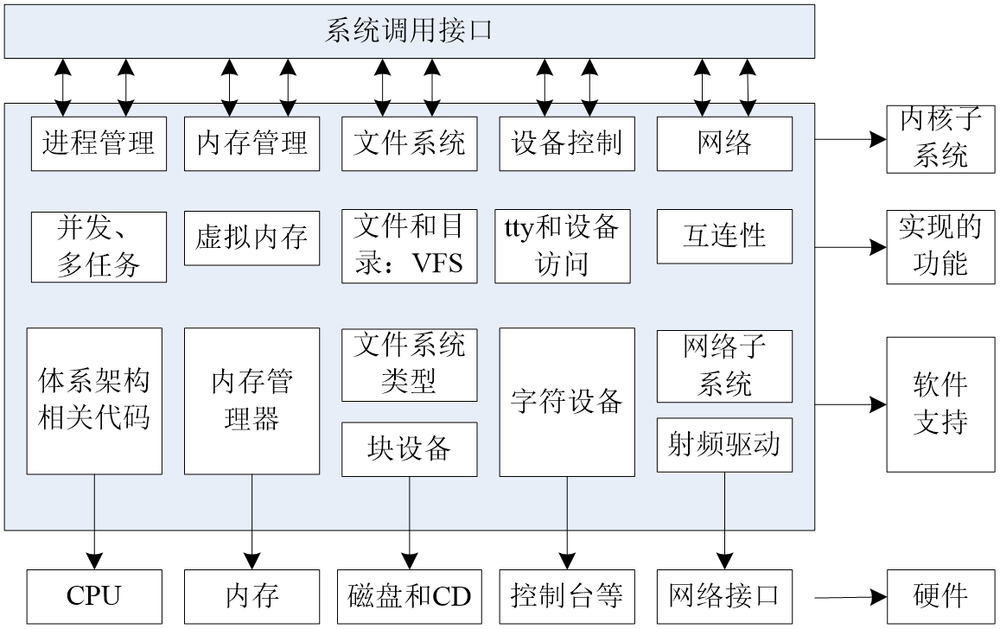

# 一 操系统简介

操作系统在计算机系统中承上启下的地位：**向下封装硬件，向上提供操作接口**

# 二 Unix/Linux操作系统介绍

## 2.1 Unix操作系统

1. 1965：贝尔实验室（`Bell Labs`）加入一项由通用电气和麻省理工学院合作的计划，
   该计划要建立一套多使用者、多任务、多层次的`MULTICS`操作系统。
   后来因为项目太为复杂失败。

2. 1969：其主要开发者`Thompson`（后被称为`UNIX`之父）和`Ritchie`领导一组开发者，
   开发了一个新的多任务操作系统—`UNICS`，后来被改名为`Unix`，最初的`Unix`是用`B`
   语言和汇编语言混合编写而成

3. 1971：两人在贝尔实验室共同发明了`C`语言，并于`1973`用`C`语言重写了`Unix`。

4. 1974：`UNIX`第一次出现在贝尔实验室以外。此后`UNIX`被政府机关，研究机构，
   企业和大学注意到，并逐渐流行开来。

5. 1980：有两个最主要的`Unix`的版本线，一个是`Berkeley`的`BSD UNIX`，
   另一个是`AT&T`的`Unix`，两者的竞争最终引发了`Unix`的战争，
   最终导致`Unix`出现各种各样的变种。

6. 1982：`AT&T`基于版本`7`开发了`UNIX System Ⅲ`的第一个商业版本，并不再开源。

7. `1992~2001`：由于版权问题，`AT&T`公司与`BSD`开发组开始了一场将近`10`年的版权官司。
   `UNIX`由于其昂贵的费用，仅局限于大型机的应用；`BSD`因为版权问题，失去了宝贵的发展时期。

## 2.2 Linux家族
1. `Minix（mini-UNIX）`最初是由`Andrew Tanenbaum`教授，仿照`4.3BSD`的源代码，
   白手起家完成了`12000`行`C`语言的编写工作这个系统只是一个教学工具，
   没有什么实际应用价值。

2. `1990`年，`Linus Torvalds`决定编写一个自己的`Minix`内核，初名为`Linus' Minix`，
   意为`Linus`的`Minix`内核，后来改名为`Linux`，此内核于`1991`年正式发布，
   并逐渐引起人们的注意。

3. `Linux`操作系统的诞生、发展、和成长过程依赖于五个重要支柱：`unix`操作系统、
   `minix`操作系统、`GNU`计划、`POSIX`标准和互联网。

4. `GNU`计划：`GNU`是“`GNU is Not Unix`”的递归缩写，由`Richard M.Stallman`
   于`1984`年创办,旨在开发一个免费、类`unix`的操作系统`-GNU`系统及其开发工具；
   `Emacs`编辑系统、`BASH shell`程序、`GCC`、`GDB`等开发工具都是`GNU`组织的产品。

5. `1992`年`Linux`与其他`GNU`软件结合，完全自由的操作系统正式诞生。
   该操作系统往往被称为“`GNU/Linux`”或简称

6. `POSIX`标准：`POSIX`标准定义了操作系统应该为应用程序提供的接口标准，
   `POSIX`标准用来统一`Unix`、`Linux`各分支编程接口，以提高其通用型和可移植性。
