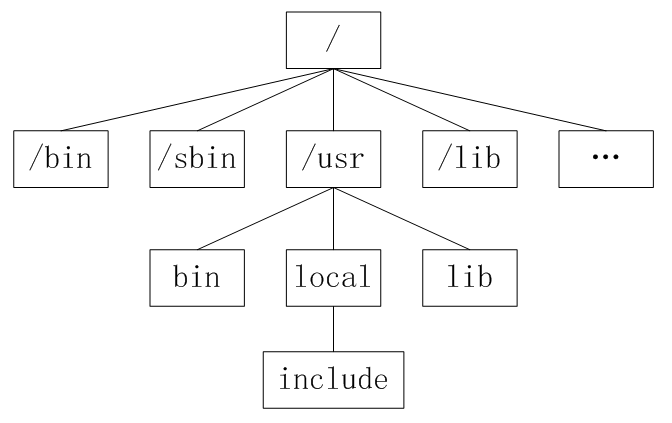
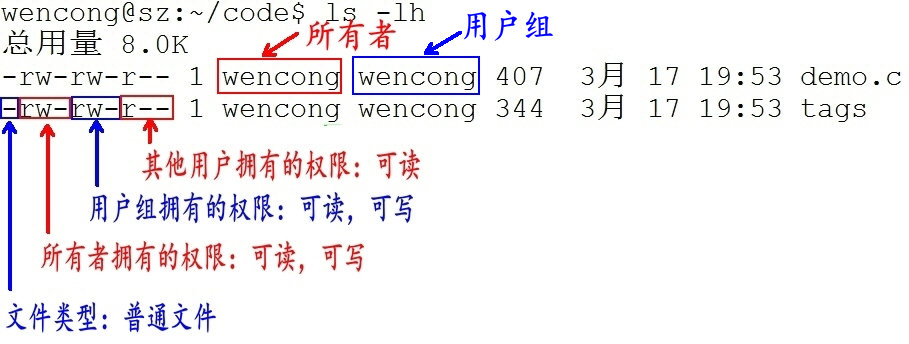

# Linux文件系统

`Unix/Linux`路径由到达定位文件的目录组成。在`Unix/Linux`系统中组成路径的目录分割符
为斜杠“`/`”，而`DOS`则用反斜杠“`\`”来分割各个目录。

路径分为绝对路径和相对路径：
* 绝对路径
    1. 绝对路径是从目录树的树根“`/`”目录开始往下直至到达文件所经过的所有节点目录。
    2. 下级目录接在上级目录后面用“`/`”隔开。
    3. 注意：绝对路径都是从“`/`”开始的，所以第一个字符一定是“`/`”。

* 相对路径
    1. 相对路径是指目标目录相对于当前目录的位置。
    2. 如果不在当前目录下，则需要使用两个特殊目录“`.`”和“`..`”了。
       目录“`.`”指向当前目录，而目录“`..`”指上一级目录。

## linux的目录结构
* `/`：根目录，一般根目录下只存放目录，在Linux下有且只有一个根目录。所有的东西都是从这里开始。
  当你在终端里输入“`/home`”，你其实是在告诉电脑，先从`/`（根目录）开始，再进入到`home`目录。
* `/bin`: `/usr/bin`: 可执行二进制文件的目录，如常用的命令`ls、tar、mv、cat`等。
* `/boot`：放置`linux`系统启动时用到的一些文件，
  如`Linux`的内核文件：`/boot/vmlinuz`，系统引导管理器：`/boot/grub`。
* `/dev`：存放`linux`系统下的设备文件，访问该目录下某个文件，相当于访问某个设备，
  常用的是挂载光驱 `mount` `/dev/cdrom` `/mnt`。
* `/etc`：系统配置文件存放的目录，不建议在此目录下存放可执行文件，
  重要的配置文件有 `/etc/inittab`、`/etc/fstab`、`/etc/init.d`、
  `/etc/X11`、`/etc/sysconfig`、`/etc/xinetd.d`。
* `/home`：系统默认的用户家目录，新增用户账号时，用户的家目录都存放在此目录下，
  `~`表示当前用户的家目录，`~edu` 表示用户 `edu` 的家目录。
* `/lib`: `/usr/lib`: `/usr/local/lib`：系统使用的函数库的目录，
  程序在执行过程中，需要调用一些额外的参数时需要函数库的协助。
* `/lost+fount`：系统异常产生错误时，会将一些遗失的片段放置于此目录下。
* `/mnt`: `/media`：光盘默认挂载点，通常光盘挂载于 `/mnt/cdrom` 下，
  也不一定，可以选择任意位置进行挂载。
* `/opt`：给主机额外安装软件所摆放的目录。
* `/proc`：此目录的数据都在内存中，如系统核心，外部设备，网络状态，
  由于数据都存放于内存中，所以不占用磁盘空间，比较重要的目录有`/proc/cpuinfo`、
  `/proc/interrupts`、`/proc/dma`、`/proc/ioports`、`/proc/net/*` 等。
* `/root`：系统管理员`root`的家目录（宿主目录）。
* `/sbin`: `/usr/sbin`: `/usr/local/sbin`：放置系统管理员使用的可执行命令，
  如`fdisk`、`shutdown`、`mount` 等。与 `/bin` 不同的是，
  这几个目录是给系统管理员 `root`使用的命令，一般用户只能"查看"而不能设置和使用。
* `/tmp`：一般用户或正在执行的程序临时存放文件的目录，任何人都可以访问，
  重要数据不可放置在此目录下。
* `/srv`：服务启动之后需要访问的数据目录，
  如 `www`服务需要访问的网页数据存放在 `/srv/www` 内。
* `/usr`：应用程序存放目录，`/usr/bin` 存放应用程序，`/usr/share` 存放共享数据，
  `/usr/lib` 存放不能直接运行的，却是许多程序运行所必需的一些函数库文件。
  `/usr/local`: 存放软件升级包。`/usr/share/doc`: 系统说明文件存放目录。
  `/usr/share/man`:  程序说明文件存放目录。
  `/usr/include`:存放头文件。
* `/var`：放置系统执行过程中经常变化的文件，
  如随时更改的日志文件 `/var/log`，`/var/log/message`：所有的登录文件存放目录，
  `/var/spool/mail`：邮件存放的目录，`/var/run`:程序或服务启动后，
  其`PID`存放在该目录下。

## 一切皆文件
`Unix/Linux`对数据文件(`*.mp3`、`*.bmp`)，程序文件(`*.c`、`*.h`、`*.o`)，
设备文件（LCD、触摸屏、鼠标），网络文件( socket ) 等的管理都抽象为文件，
使用统一的方式方法管理。

在`Unix/Linux`操作系统中也必须区分文件类型，通过文件类型可以判断文件属于可执行文件、
文本文件还是数据文件。在`Unix/Linux`系统中文件可以没有扩展名。

### 文件分类

通常，`Unix/Linux`系统中常用的文件类型有`7`种：
1. 普通文件 `-`
2. 目录文件 `d` 
3. 管道文件 `p` 
4. 套接字文件 `s`
5. 软链接文件 `l`
6. 块设备文件 `b` 
7. 字符设备文件 `c`

**普通文件**

普通文件是计算机操作系统用于存放数据、程序等信息的文件，一般都长期存放于外存储器
（磁盘、磁带等）中。普通文件一般包括文本文件、数据文件、可执行的二进制程序文件等。

在`Unix/Linux`中可以通过`file`命令来查看文件的类型。如果`file`文件后面携带文件名，
则查看指定文件的类型，如果携带通配符“`*`”，则可以查看当前目录下的所有文件的类型。

**目录文件**

`Unix/Linux`系统把目录看成是一种特殊的文件，利用它构成文件系统的树型结构。

目录文件只允许系统管理员对其进行修改，用户进程可以读取目录文件，但不能对它们进行修改。

每个目录文件至少包括两个条目，“`..`”表示上一级目录，“`.`”表示该目录本身。

**设备文件**

`Unix/Linux`系统把每个设备都映射成一个文件，这就是设备文件。
它是用于向`I/O`设备提供连接的一种文件，分为字符设备和块设备文件。

字符设备的存取以一个字符为单位，块设备的存取以字符块为单位。
每一种`I/O`设备对应一个设备文件，存放在`/dev`目录中，
如行式打印机对应`/dev/lp`，第一个软盘驱动器对应`/dev/fd0`。

**管道文件**

管道文件也是`Unix/Linux`中较特殊的文件类型，这类文件多用于进程间的通信。

**软链接文件**

似于 `windows` 下的快捷方式，链接又可以分为软链接（符号链接）和硬链接。

## 用户与权限

### 用户
通过设定权限可以从以下三种访问方式限制访问权限：

* 只允许用户自己访问（**所有者**）

  所有者就是创建文件的用户，用户是所有用户所创建文件的所有者，
  用户可以允许所在的用户组能访问用户的文件。

* 允许一个预先指定的用户组中的用户访问（**用户组**）

  用户都组合成用户组，例如，某一类或某一项目中的所有用户都能够被系统管理员归
  为一个用户组，一个用户能够授予所在用户组的其他成员的文件访问权限。

* 允许系统中的任何用户访问（**其他用户**）

  用户也将自己的文件向系统内的所有用户开放，在这种情况下，系统内的所有用户都能够
  访问用户的目录或文件。在这种意义上，系统内的其他所有用户就是 other 用户类

### 权限
用户能够控制一个给定的文件或目录的访问程度，一个文件或目录可能有读、写及执行权限：
* 读权限（`r`）

  对文件而言，具有读取文件内容的权限；对目录来说，具有浏览目录的权限。

* 写权限（`w`）
  
  对文件而言，具有新增、修改文件内容的权限；对目录来说，具有删除、移动目录内文件的权限。

* 可执行权限（`x`）

  对文件而言，具有执行文件的权限；对目录了来说该用户具有进入目录的权限。

## 文件信息示例

