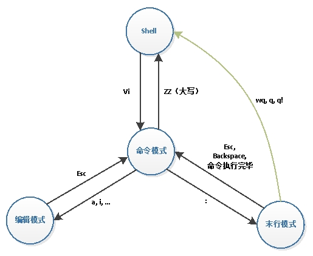
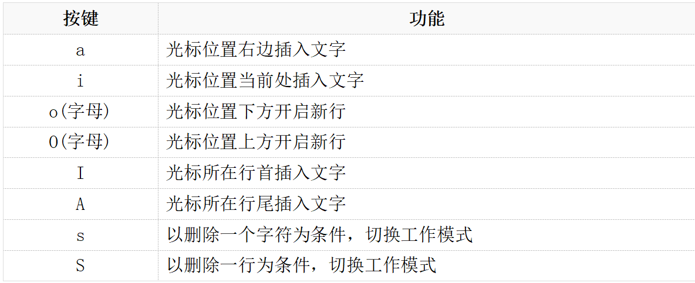
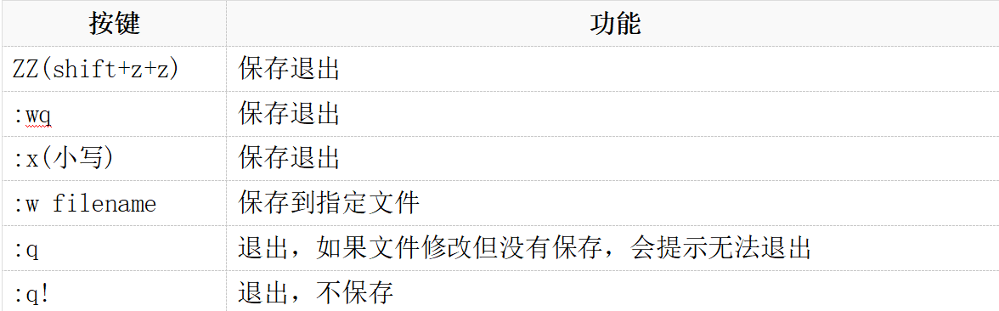

# vim

`vi`有三种基本工作模式：
* 命令模式
* 文本输入模式
* 末行模式。

**三模式转化图**


## 进入vim命令
打开文件，并进入命令模式: `vim [参数] file`

常用参数
* `vim +n file`: 打开文件并定位到第`n`行
* `vim +/pattern file`: 打开文件并定位到字符串`pattern`

## 光标移动
* `h` 或 向左箭头键(`←`): 光标向左移动一个字符  
* `j` 或 向下箭头键(`↓`): 光标向下移动一个字符  
* `k` 或 向上箭头键(`↑`): 光标向上移动一个字符  
* `l` 或 向右箭头键(`→`): 光标向右移动一个字符

**一次移动多行**
* `nj`: 向下移动`n`行
* `nk`: 向上移动`n`行
* `n<Enter>`: 向下移动`n`行

**一行的首位移动**
* `0`: 移动到光标所在行的行首
* `$`: 移动到光标所在行的行尾

**移动指定字符个数**
* `n<space>`: 按下数字后再按空格键，光标会向右移动这一行的`n`个字符

**指定移动到行**
* `G`: 移动到最后一行
* `nG`: 移动到第`n`行
* `gg`: 移动到第一行
* `:n`: 跳转到`n`行

**翻页**
* `[Ctrl] + [f]`: 屏幕『向下』移动一页，相当于 `[Page Down]`按键
* `[Ctrl] + [b]`: 屏幕『向上』移动一页，相当于 `[Page Up]` 按键

## 进入编辑模式


## 退出编辑模式 esc

## 退出vim


## 复制 剪切 粘贴

**剪切**
* `x`(小写): 剪切光标后一个字符
* `X`(大写): 剪切光标前一个字符
* `nx`: 连续向后剪切`n`个字符
* `nX`: 连续向前剪切`n`个字符

* `dd`: 剪切光标所在的一整行
* `ndd`: 剪切光标开始及之后的`n`行
* `d1G`: 剪切 *第一行到光标所在行* 的数据
* `dG`: 剪切 *光标所在行到最后一行* 的数据
* `d$`: 剪切到 *光标所在行行尾* 的数据
* `d0`: 剪切到 *光标所在行的行首* 的数据
* `dw`: 剪切一个单词(光标需要定位到单词首字母)

**复制**
* `yy`: 复制光标所在的一整行
* `nyy`: 复制光标开始及之后的`n`行
* `y1G`: 复制 *第一行到光标所在行* 的数据
* `yG`: 复制 *光标所在行到最后一行* 的数据
* `y$`: 复制到 *光标所在行行尾* 的数据
* `y0`: 复制到 *光标所在行的行首* 的数据
* `yw`: 赋值一个单词(光标需要定位到单词首字母)

**粘贴**
* `p`(小写): 粘贴在光标所在行的下一行
* `P`(大写): 粘贴在光标所在行的上一行

**撤销与重复**
* `u`: 撤销上一次操作
* `[Ctrl]+r`: 重复上一次操作

## 搜索与替换

**搜索**
* `/word`: 向光标之后搜索`word`
* `?word`: 向光标之前搜索`word`
* `n`: 重复前一个搜寻的动作
* `N`: 反向重复前一个搜寻的动作

**替换**
* `:n1,n2s/word1/word2/g`: 将`n1`行到`n2`行之间的所有`word1`替换为`word2`
* `:1,$s/word1/word2/g 或 :%s/word1/word2/g`: 全文替换
* `:1,$s/word1/word2/gc 或 :%s/word1/word2/gc`: 全文替换，替换去循环是否确认

## 可视化操作
* `v`: 进入可视化模式，可以移动光标选择。之后可以紧接着相关命令操作(复制 删除等操作)


## 排版
* 命令模式下输入: `gg=G` 自动排版


# 远程连接

## ssh

远程连接: `ssh -p port username@host` 或者 `ssh -l username hostip`

## 远程文件复制 scp

|参数|含义|
|:---:|:---:|
|`RemoteUserName`|远程用户名|
|`RemoteHostIp`|远程`ip`|
|`RemoteFile`|远程文件，可带上路径|
|`FileName`|拷贝到本地后的名字，可带上路径，不带路径拷贝到当前目录|

**本地文件复制到远程**
```
scp FileName RemoteUserName@RemoteHostIp:RemoteFile  
```
* 如果复制目录请加上选项`-r`

**远程文件复制到本地**
```
scp RemoteUserName@RemoteHostIp:RemoteFile FileName
```
* 如果复制目录请加上选项`-r`


