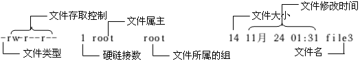
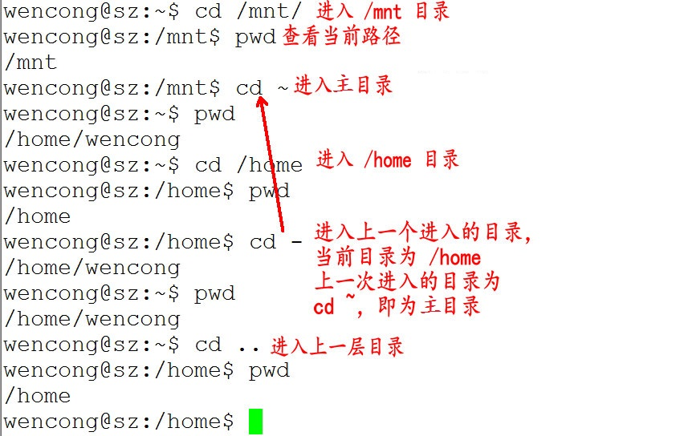
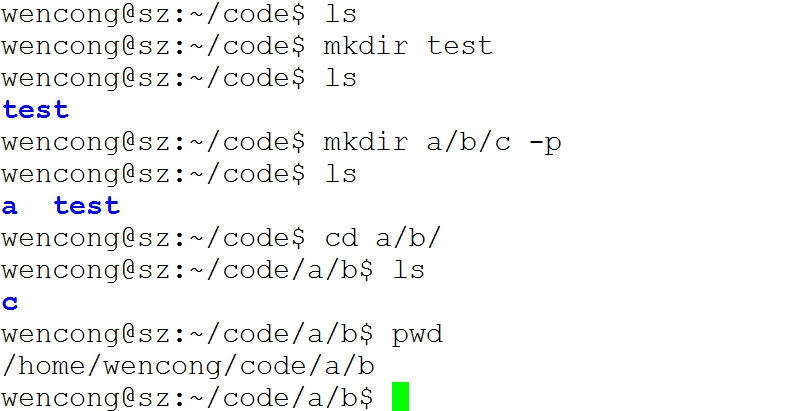
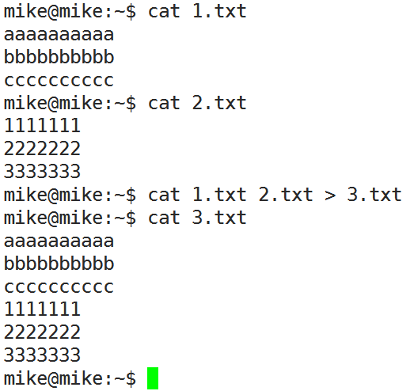
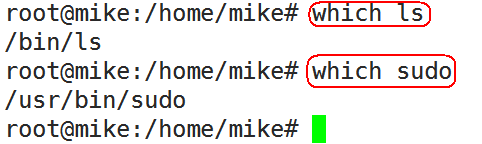

## 查看文件信息 `ls`

`ls`是英文单词`list`的简写，其功能为列出目录的内容，是用户最常用的命令之一，
它类似于`DOS`下的`dir`命令。

`Linux`文件或者目录名称最长可以有`256`个字符，“`.`”代表当前目录，
“`..`”代表上一级目录，以“`.`”开头的文件为隐藏文件，需要用 `-a` 参数才能显示。

|参数|含义|
|:---:|:---:|
|`-a`|显示指定目录下所有子目录与文件，包括隐藏文件|
|`-l`|以列表方式显示文件的详细信息|
|`-h`|配合 `-l` 以人性化的方式显示文件大小|




## 输出重定向命令 `>`

`Linux`允许将命令执行结果重定向到一个文件，本应显示在终端上的内容保存到指定文件中。

`>`输出重定向会**覆盖**原来的内容，`>>`输出重定向则会**追加**到文件的尾部。

## 帮助文档 man和 --help
### --help
一般是 `Linux` 命令自带的帮助信息，并不是所有命令都自带这个选项。

如我们想查看命令 `ls` 的用法：`ls --help`

### man
`man` 是 `Linux` 提供的一个手册，包含了绝大部分的命令、函数使用说明。

该手册分成很多章节（`section`），使用`man` 时可以指定不同的章节来浏览不同的内容。
`man` 中各个 `section` 意义如下：
1. Standard commands（标准命令）

2. System calls（系统调用，如open,write）

3. Library functions（库函数，如printf,fopen）

4. Special devices（设备文件的说明，/dev下各种设备）

5. File formats（文件格式，如passwd）

6. Games and toys（游戏和娱乐）

7. Miscellaneous（杂项、惯例与协定等，例如Linux档案系统、网络协定、ASCII 码；environ全局变量）

8. Administrative Commands（管理员命令，如ifconfig）

|功能键|功能|
|:---:|:---:|
空格键|显示手册页的下一屏|
|`Enter`键|一次滚动手册页的一行|  
|`b`|回滚一屏|
|`f`|前滚一屏| 
|`q`|退出man命令|
|`h`|列出所有功能键|
|`/word`|搜索word字符串|

## 分屏读取文件

### more
查看内容时，在信息过长无法在一屏上显示时，会出现快速滚屏，使得用户无法看清文件的内容，
此时可以使用`more`命令，每次只显示一页，按下空格键可以显示下一页，
按下`q`键退出显示，按下`h`键可以获取帮助。

### less

## 管道 `|`
管道：一个命令的输出可以通过管道做为另一个命令的输入。

管道我们可以理解现实生活中的管子，管子的一头塞东西进去，另一头取出来，
这里“ `|` ”的左右分为两端，**左端塞东西(写)，右端取东西(读)**。

## 清屏 clear

`clear`作用为清除终端上的显示(类似于`DOS`的 `3`清屏功能)，也可使用快捷键：
`Ctrl + l` ( `“l”` 为字母 )。

## 切换工作目录： cd
在使用`Unix/Linux`的时候，经常需要更换工作目录。
`cd`命令可以帮助用户切换工作目录。`Linux`所有的**目录和文件名大小写敏感**。

`cd`后面可跟绝对路径，也可以跟相对路径。如果省略目录，则**默认切换到当前用户的主目录**。



## 显示当前路径：pwd
使用`pwd`命令可以显示当前的工作目录，该命令很简单，直接输入`pwd`即可，后面不带参数。

## 创建目录：mkdir
通过`mkdir`命令可以创建一个新的目录。参数`-p`可递归创建目录。

需要注意的是新建目录的名称不能与当前目录中已有的目录或文件同名，
并且目录创建者必须对当前目录具有写权限。



## 删除目录 rmdir
可使用`rmdir`命令删除一个目录。**必须离开目录，并且目录必须为空目录**，
不然提示删除失败。

## 删除文件 rm
可通过`rm`删除文件或目录。使用`rm`命令要小心，因为**文件删除后不能恢复**。
为了防止文件误删，可以在`rm`后使用`-i`参数以逐个确认要删除的文件。

常用参数

|参数|含义
|:---:|:---:|
|`-i`|以进行交互式方式执行|
|`-f`|强制删除，忽略不存在的文件，无需提示|
|`-r`|递归地删除目录下的内容，删除文件夹时必须加此参数|

## 建立链接文件 ln
* `Linux`链接文件类似于`Windows`下的快捷方式。
* 链接文件分为软链接和硬链接。
* 软链接：软链接不占用磁盘空间，源文件删除则软链接失效。
* 硬链接：**硬链接只能链接普通文件**，不能链接目录。

```
硬链接： ln 源文件 链接文件 

软连接： ln -s 源文件 链接文件  
```

## 查看或者合并文件内容 cat

* 如果反写`cat`，查看的内容将倒序展示。

## 拷贝文件 cp
`cp`命令的功能是将给出的文件或目录复制到另一个文件或目录中，相当于`DOS`下的`copy`命令。

**常用选项**

|选项|含义|
|:---:|:---:|
`-a`|该选项通常在复制目录时使用，它保留链接、文件属性，并递归地复制目录，简单而言，保持文件原有属性。|
`-f`|覆盖已经存在的目标文件而不提示|
`-i`|交互式复制，在覆盖目标文件之前将给出提示要求用户确认|
`-r`|若给出的源文件是目录文件，则cp将递归复制该目录下的所有子目录和文件，目标文件必须为一个目录名。|
`-v`|显示拷贝进度|

## 移动文件 mv
用户可以使用`mv`命令来移动文件或目录，也可以给文件或目录重命名。

**常用选项**

|选项|含义|
|:---:|:---:|
|`-f`|禁止交互式操作，如有覆盖也不会给出提示|
|`-i`|确认交互方式操作，如果mv操作将导致对已存在的目标文件的覆盖，系统会询问是否重写，要求用户回答以避免误覆盖文件|
|`-v`|显示移动进度|

## 获取文件类型 file
`Linux`系统文件类型不是根据文件扩展名分类的，通过`file`命令可以确认文件具体类型

## 归档 压缩与解压

### 归档管理 tar
计算机中的数据经常需要备份，`tar`是`Unix/Linux`中最常用的备份工具，
此命令可以**把一系列文件归档到一个大文件中，也可以把档案文件解开以恢复数据**。
```
tar  [参数]  打包文件名  文件
```

**常用参数**

|参数|含义|
|:---:|:---:|
|`-c`|生成档案文件，创建打包文件|
|`-v`|列出归档解档的详细过程，显示进度|
|`-f`|指定档案文件名称，f后面一定是.tar文件，所以必须放选项最后|
|`-t`|列出档案中包含的文件|
|`-x`|解开档案文件|

**除了f需要放在参数的最后，其它参数的顺序任意**

### 文件压缩解压 gzip
```
gzip  [选项]  被压缩文件
```
**常用选项**

|选项|含义|
|:---:|:---:|
|`-d`|解压|
|`-r`|压缩所有子目录|

* `tar`与`gzip`命令结合使用实现文件打包、压缩。
* `tar`只负责打包文件，但不压缩，用`gzip`压缩`tar`打包后的文件，
  其扩展名一般用`xxxx.tar.gz`。

在`tar`命令中增加一个选项(`-z`)可以调用`gzip`实现了一个压缩的功能，
实行一个先打包后压缩的过程。

* 压缩命令: `tar -zcvf 压缩包包名 文件1 文件2 ...`
* 解压命令: `tar -zxvf 压缩包包名`
* 解压到指定目录: `tar -zxvf 压缩包包名 -C 要保存的目录`


### 文件压缩解压 bzip2
* `tar`与`bzip2`命令结合使用实现文件打包、压缩(用法和`gzip`一样)。
* `tar`只负责打包文件，但不压缩，用`bzip2`压缩`tar`打包后的文件，
  其扩展名一般用`xxxx.tar.bz2`。
* 在`tar`命令中增加一个选项(`-j`)可以调用`bzip2`实现了一个压缩的功能，
  实行一个先打包后压缩的过程。

* 压缩用法：`tar -jcvf 压缩包包名 文件...`
* 解压用法：`tar -jxvf 压缩包包名`

### 文件压缩解压 zip uzip

* 通过`zip`压缩文件的目标文件不需要指定扩展名，默认扩展名为`zip`。
* 压缩文件：`zip  [-r] 目标文件(没有扩展名) 源文件`
* 解压文件：`unzip -d 解压后目录文件 压缩文件`

类似的，`Linux`同样支持`rar`格式文件的压缩。不过需要事先安装`rar`工具。
* 压缩： `rar a -r xxx.rar 待压缩文件群`
* 解压缩：`rar x xxx.rar`

## 查看命令位置 which


