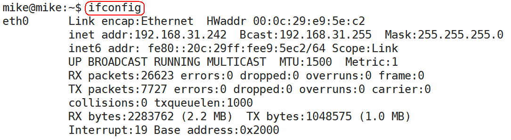
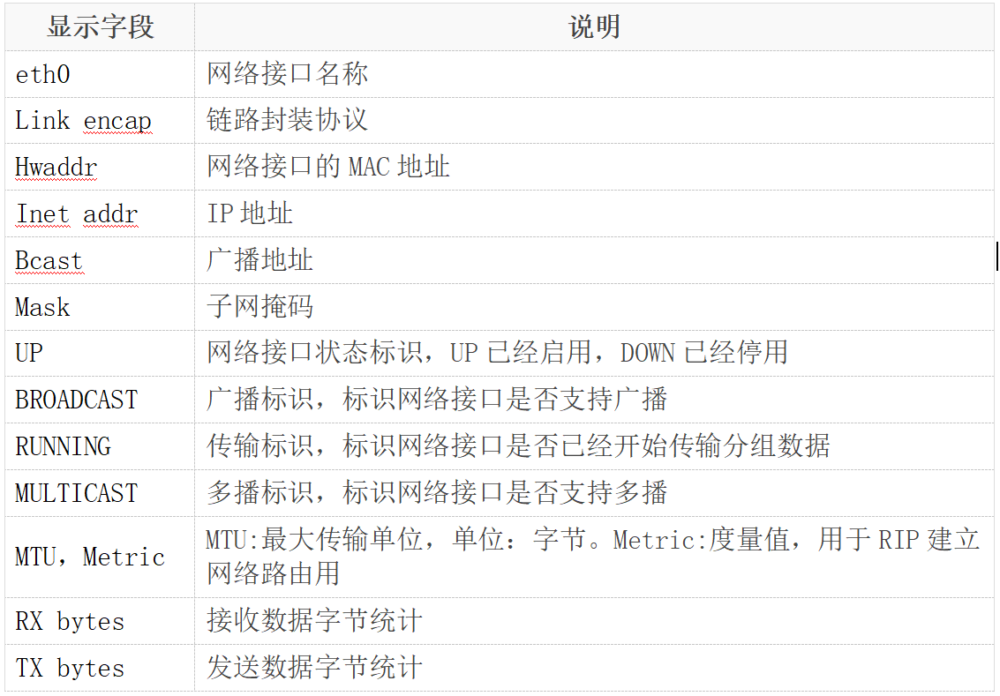
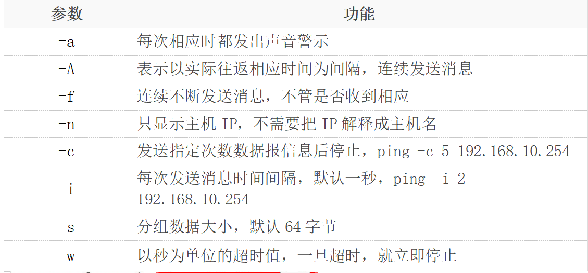

## 查看进程信息 ps
进程是一个具有一定独立功能的程序，它是操作系统动态执行的基本单元。

`ps`命令可以查看进程的详细状况，常用选项(选项可以不加“`-`”)如下：

|选项|含义|
|:---:|:---:|
|`-a`|显示终端上的所有进程，包括其他用户的进程|
|`-u`|显示进程的详细状态|
|`-x`|显示没有控制终端的进程|
|`-w`|显示加宽，以便显示更多的信息|
|`-r`|只显示正在运行的进程|


## 终止进程 kill
`kill`命令 *指定进程号* 的进程，需要配合 `ps` 使用
```
kill [-signal] pid
```

查询信号: `kill -l`
```
1) SIGHUP(reload 不关闭程序重新加载配置文件)
2) SIGINT(终止进程)	 3) SIGQUIT	 4) SIGILL	 5) SIGTRAP
6) SIGABRT	 7) SIGBUS	 8) SIGFPE	 9) SIGKILL(强制关闭进程)	10) SIGUSR1
11) SIGSEGV	12) SIGUSR2	13) SIGPIPE	14) SIGALRM	15) SIGTERM(终止正在运行的进程)
16) SIGSTKFLT	17) SIGCHLD	18) SIGCONT(继续运行) 19) SIGSTOP(后台休眠)	20) SIGTSTP
21) SIGTTIN	22) SIGTTOU	23) SIGURG	24) SIGXCPU	25) SIGXFSZ
26) SIGVTALRM	27) SIGPROF	28) SIGWINCH	29) SIGIO	30) SIGPWR
31) SIGSYS	34) SIGRTMIN	35) SIGRTMIN+1	36) SIGRTMIN+2	37) SIGRTMIN+3
38) SIGRTMIN+4	39) SIGRTMIN+5	40) SIGRTMIN+6	41) SIGRTMIN+7	42) SIGRTMIN+8
43) SIGRTMIN+9	44) SIGRTMIN+10	45) SIGRTMIN+11	46) SIGRTMIN+12	47) SIGRTMIN+13
48) SIGRTMIN+14	49) SIGRTMIN+15	50) SIGRTMAX-14	51) SIGRTMAX-13	52) SIGRTMAX-12
53) SIGRTMAX-11	54) SIGRTMAX-10	55) SIGRTMAX-9	56) SIGRTMAX-8	57) SIGRTMAX-7
58) SIGRTMAX-6	59) SIGRTMAX-5	60) SIGRTMAX-4	61) SIGRTMAX-3	62) SIGRTMAX-2
63) SIGRTMAX-1	64) SIGRTMAX
```

**常用信号**

* `1` 不关闭程序重新加载配置文件
* `2` 终止进程
* `9` 强制关闭进程
* `15` 终止正在运行的进程
* `19` 后台休眠
* `18` 继续运行

按照pid: `kill -n pid`

按照名称：`killall -n name` 没桌面，该命令不生效

按照名称：`pkill -n name`

## 后台程序 &、jobs、fg
* 用户可以将一个前台执行的程序调入后台执行，方法为：`命令 &`
* 如果程序已经在执行，`ctrl+z`可以将程序调入后台
* `jobs`查看后台运行程序
* `fg 编号`（编号为通过`jobs`查看的编号），将后台运行程序调出到前台

## 关机重启 reboot、shutdown、init

|命令|含义|
|:---:|:---:|
|`reboot`|重新启动操作系统  |
|`shutdown –r now`	|重新启动操作系统， shutdown会给别的用户提示  |
|`shutdown -h now`	|立刻关机，其中now相当于时间为0的状态  |
|`shutdown -h 20:25`|	系统在今天的20:25 会关机  |
|`shutdown -h +10`	|系统再过十分钟后自动关机  |
|`init 0`	|关机  |
|`init 6` 	|重启|

## 字符界面和图形界面切换
在`redhat`平台下，可通过命令进行切换
* `init 3`	切换到字符界面  
* `init 5`	切换到图形界面

通过快捷键切换（适用大部分平台）
* `Ctrl + Alt + F3`	切换到字符界面
* `Ctrl + Alt + F1`	切换到图形界面

## 查看或配置网卡信息 ifconfig

如果，我们只是敲：ifconfig，它会显示所有网卡的信息




我们可以通过`ifconfig`配置网络参数：
* 只有`root`才能用`ifconfig`配置参数，其他用户只能查看网络配置
* `ifconfig 网络接口名称 [地址协议类型] [address] [参数]`
* 地址协议类型如：`inet(IPv4),inet6(IPv6)`等
* 如:`ifconfig eth0 inet 192.168.10.254 netmask 255.255.255.0 up`

常用参数：

|参数|功能|
|:---:|:---:|
|`-a`|显示所有网络接口状态|
|`inet  [IP地址]`|设置IP地址|
|`netmask [子网掩码]`|设置子网掩码|  
|`up`|启用网络接口|
|`down`|关闭网络接口|


## 查看或配置网卡信息 ip

* 查看`ip`
    * `ip a`

* 增加`ip`地址
    * `ip a add 192.168.21.23/24 dev ens33`

* 删除`ip`
    * `ip a del 192.168.21.23/24 dev ens33`

* 增加`ip`地址并增加别名
    * `ip a add 192.168.21.23/24 dev ens33 label ens33:0`

* 删除
    * `ip a del 192.168.21.23/24 dev ens33 label ens33:0`

## 测试远程主机连通性 ping
* `ping`通过`ICMP`协议向远程主机发送`ECHO_REQUEST`请求，
  期望主机回复`ECHO_REPLY`消息
* 通过`ping`命令可以检查是否与远程主机建立了`TCP/IP`连接

**常用参数**



## 虚拟机网络连接

1. 桥接: 直接连接物理网
2. net: 共享主机，借助主机的`ip`访问物联网

