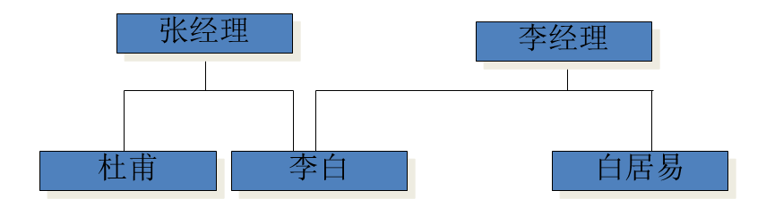
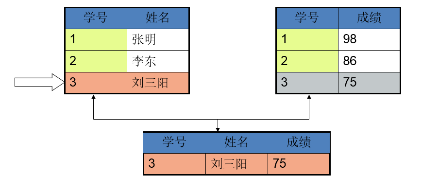

# 一、存储数据的演变过程

1. 文件存储; 基于文件存储数据的格式千差万别，每个人定义的数据格式都可能不同
   > 1. 文件位置不确定
   > 2. 数据格式不确定

2. 基于文件存储并限制数据存储的位置
   > 1. 文件位置确定，方便数据集的查询

3. `pickle`和`JSON`限制数据保存格式
   > 1. 限制数据保存格式，方便了数据的查询

4. 将数据基于网络传输到同一台服务器(数据库)
   > 1. 数据保存在同一个地方，可能导致数据丢失
   > 2. 所有的数据操作都在服务器上面进行操作

5. 数据库集群(数据传输上来后，同步到不同的服务器上)
   > 1. 解决数据可能丢失问题
   > 2. 将数据同步到不同的服务器上

**数据库的本质**: 基于网络通信的数据管理程序
>  **常见的数据库管理程序**
> 1. 关系型数据库(SQL数据库)\[数据之间存在 **约束** ， 存储数据表现形式为 **表格形式** \]
>     * MySQL: 免费开源
>     * oracle: 闭源收费贵, 大公司才用得起
>     * db2
>     * access
>     * sql server
> 
> 2. 非关系型数据库(Non-SQL数据库)\[存储数据通常以`key-value`形式存储 \]
>     * redis
>     * mongodb
>     * memcache
> 
> **关系型数据库通常用于保存数据，非关系型数据用于缓存数据**

# 二 数据库模型

## 2.1 层次模型

**缺点**

1. 查找不同类的数据效率低了（导航的结构的缺点）
2. 数据不完整（不能区分到底是一个李白还是两个李白）

## 2.2 网状模型

网状模型解决了层次数据的数据不完整的问题，但是 **没有解决层次模型的导航问题**。

## 2.3 关系型数据模型

**特点**
1. 每个表都是独立的(保证数据的独立性)

 

2. 表与表之间通过公共字段来建立关系

**优点**: 解决了导航问题，并且数据完整性得到解决

**缺点**: 多表查询效率低了

