# redis高可用

在 WEB 服务器中，**高可用**是指**服务器正常访问的时间**，衡量标准在**多长时间内可以提供正常服务**。

在 Redis 层面，**高可用**除了保证提供**正常服务(主从分离、快速容灾技术等)**，还需要考虑**数据容量扩展、数据安全**等

在 Redis 中，实现**高可用**的技术主要包括**持久化、复制、哨兵、集群**

* **持久化**: 持久化是 *最简单* 的高可用方法。主要作用是**数据备份**，即将数据存储在硬盘，保证数据不会因进程退出而丢失

* **复制**: 复制是redis高可用的基础，**哨兵**和**集群**都是在**复制的基础**上实现的高可用。复制主要实现了数据的多机备份以及
  对于读操作的负载均衡和简单的故障恢复。缺陷是故障恢复无法自动化，写操作无法负载均衡，存储受到单机的限制

* **哨兵**: 复制基础上，哨兵实现了**自动化的故障恢复**。 缺陷是 **写操作** 无法负载均衡，存储能力收单机限制
    * 在每台redis服务器上启动哨兵进程，从服务器哨兵监控主服务器哨兵；当主服务器哨兵宕机后，从服务器哨兵会选择一个从服务器作为主服务器

* **集群**: 通过集群，redis解决了写操作无法负载均衡以及存储能力受单机限制问题，实现了完善的高可用方案


## 一 数据持久化

数据持久化的方式有两种: `rdb`和`aof`

### 1.1 `rdb`方式

```shell
save 900 1  # 900s内有1次更新，就会持久化
save 300 10 # 300s内有10次更新，就会持久化
save 60 10000  # 60s内有10000次更新，就会持久化
stop-writes-on-bgsave-error yes
rdbcompression yes
rdbchecksum yes
dbfilename dump.rdb  # 数据保存的文件
dir ./  # 数据保存的目录
```

* **优点**
    - 生成二进制文件
    - 系统会默认的多长时间保存一次
    - 直接手动保存
    - 制作快照
    - 可以用作备份
    - 比较适合做灾难恢复
    - 主进程会`fork`一个子进程出来，子进程用来负责保存数据

* **缺点**
    - 如果说数据需要 *尽量保存* 下来，则不适合实用rdb
    - 在数据量庞大的时候，对系统消耗过大

* `save` 保存数据

* `flushall` 删除数据
* `flushdatabase`

### 1.2 `aof`方式

- **优点**
    - 持久化更好, 数据实时保存
    - `aof`将所有的操作都追加到一个文件中，`redis-check-aof`修复`aof`文件
    - 文件易读

- **缺点**
    - 文件会越来越大
    - `aof`的速度会比`rdb`慢，`aof`使用的是`fsync`
    - 文件易读

`aof`数据持久化配置

```shell
appendonly yes
appendfilename "appendonly.aof"  # aof文件，保存的是执行过的命令
appendfsync everysec  # 每秒添加
```

## 二 redis主从复制

只需要在**从服务器**上进行配置(在redis配置文件中添加)

```shell
slaveof ip port  # 指定主服务器的ip和端口
masterauth <password>  # 验证主服务器密码，没有密码则不需要
```

`config set masterauth password`: 从服务器执行，校验主服务器密码

- **基于异步**的，平均每秒钟从服务器都会主服务器发送复制的情况
- 一个主可以多个从
- 不止主服务器可以有从服务器，从服务器也可以有从服务器
- 复制功能不会阻塞主服务器
- 复制功能也不会阻塞从服务器

**主从复制** 同时存在以下几个问题：

1. 一旦 **主节点宕机**，**从节点** 晋升成 **主节点**，同时需要修改 **应用方** 的 **主节点地址**， 还需要命令所有 **从节点** 去 **复制** 新的主节点，整个过程需要 **人工干预**。

2. **主节点** 的 **写能力** 受到 **单机的限制**。

3. **主节点** 的 **存储能力** 受到 **单机的限制**。

4. **原生复制** 的弊端在早期的版本中也会比较突出，比如：`Redis` **复制中断** 后，
   **从节点** 会发起 `psync`。此时如果 **同步不成功**，则会进行 **全量同步**，
   **主库** 执行 **全量备份** 的同时，可能会造成毫秒或秒级的 **卡顿**。

## 三 哨兵

`Redis Sentinel` 是 `Redis` 高可用 的实现方案。`Sentinel` 是一个管理多个 `Redis` 实例的工具， 它可以实现对 `Redis` 的 **监控、通知、自动故障转移**
。下面先对 `Redis Sentinel` 的 **基本概念** 进行简单的介绍。

<div class="table-box">
  <table>
    <thead>
    <tr>
      <th>基本名词</th>
      <th>逻辑结构</th>
      <th>物理结构</th>
    </tr>
    </thead>
    <tbody>
    <tr>
      <td>Redis数据节点</td>
      <td>主节点和从节点</td>
      <td>主节点和从节点的进程</td>
    </tr>
    <tr>
      <td>主节点(master)</td>
      <td>Redis主数据库</td>
      <td>一个独立的Redis进程</td>
    </tr>
    <tr>
      <td>从节点(slave)</td>
      <td>Redis从数据库</td>
      <td>一个独立的Redis进程</td>
    </tr>
    <tr>
      <td>Sentinel节点</td>
      <td>监控Redis数据节点</td>
      <td>一个独立的Sentinel进程</td>
    </tr>
    <tr>
      <td>Sentinel节点集合</td>
      <td>若干Sentinel节点的抽象组合</td>
      <td>若干Sentinel节点进程</td>
    </tr>
    <tr>
      <td>Redis Sentinel</td>
      <td>Redis高可用实现方案</td>
      <td>Sentinel节点集合和Redis数据节点进程</td>
    </tr>
    <tr>
      <td>应用客户端</td>
      <td>泛指一个或多个客户端</td>
      <td>一个或者多个客户端进程或者线程</td>
    </tr>
    </tbody>
  </table>
</div>

**哨兵架构图**
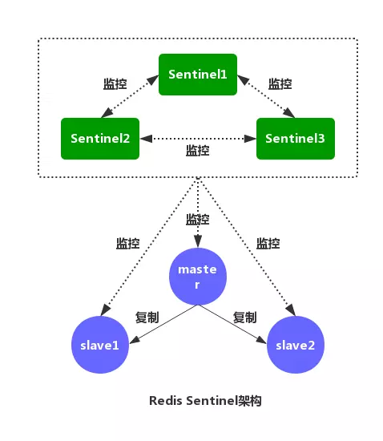

### 3.1 Redis Sentinel的主要功能

`Sentinel` 的主要功能包括 **主节点存活检测、主从运行情况检测、自动故障转移 （failover）、主从切换**。
`Redis` 的 `Sentinel` 最小配置是 **一主一从**。

`Redis` 的 `Sentinel` 系统可以用来管理多个 `Redis` 服务器，该系统可以执行以下四个任务

1. **监控**: `Sentinel` 会不断的检查 **主服务器** 和 **从服务器** 是否正常运行

2. **通知**: 当被监控的某个 `Redis` 服务器出现问题，`Sentinel` 通过 `API` **脚本** 向 **管理员** 或者其他的 **应用程序** 发送通知

3. **自动故障转移**: 当 **主节点** 不能正常工作时，`Sentinel` 会开始一次 **自动的** 故障转移操作，它会将与 **失效主节点**
   是 **主从关系** 的其中一个 **从节点** 升级为新的 **主节点**，并且将其他的 **从节点** 指向 **新的主节点**。

4. **配置提供者**：在 `Redis Sentinel` 模式下，**客户端应用** 在初始化时连接的是 `Sentinel` 节点集合，从中获取 **主节点** 的信息

#### 3.1.1 主观下线和客观下线

默认情况下，每个 `Sentinel` 节点会以 **每秒一次** 的频率对 `Redis` 节点和 **其它** 的 `Sentinel` 节点发送 `PING` 命令， 并通过节点的 **回复** 来判断节点是否在线。

* **主观下线**：**主观下线** 适用于所有 **主节点** 和 **从节点**。如果在 `down-after-milliseconds` 毫秒内，
  `Sentinel` 没有收到 **目标节点** 的有效回复，则会判定 **该节点** 为 **主观下线**

* **客观下线**：**客观下线** 只适用于 **主节点**。如果 **主节点** 出现故障，`Sentinel` 节点会通过
  `sentinel is-master-down-by-addr` 命令，向其它 `Sentinel` 节点询问对该节点的 **状态判断**。 如果超过 `<quorum>` 个数的节点判定 **主节点**
  不可达，则该 `Sentinel` 节点会判断 **主节点** 为 **客观下线**。

#### 3.1.2 Sentinel的通信命令

`Sentinel` 节点连接一个 `Redis` 实例的时候，会创建 `cmd` 和 `pub/sub` 两个 **连接**。`Sentinel` 通过 `cmd` 连接给
`Redis` 发送命令，通过 `pub/sub` 连接到 `Redis` 实例上的其他 `Sentinel` 实例

`Sentinel` 与 `Redis` **主节点** 和 **从节点** 交互的命令，主要包括

<div class="table-box">
  <table>
    <thead>
    <tr>
      <th>命令</th>
      <th>作 用</th>
    </tr>
    </thead>
    <tbody>
    <tr>
      <td>PING</td>
      <td><code>Sentinel</code> 向 <code>Redis</code> 节点发送 <code>PING</code> 命令，检查节点的状态</td>
    </tr>
    <tr>
      <td>INFO</td>
      <td><code>Sentinel</code> 向 <code>Redis</code> 节点发送 <code>INFO</code> 命令，获取它的 <strong>从节点信息</strong></td>
    </tr>
    <tr>
      <td>PUBLISH</td>
      <td><code>Sentinel</code> 向其监控的 <code>Redis</code> 节点 <code>__sentinel__:hello</code> 这个 <code>channel</code> 发布
        <strong>自己的信息</strong> 及 <strong>主节点</strong> 相关的配置
      </td>
    </tr>
    <tr>
      <td>SUBSCRIBE</td>
      <td><code>Sentinel</code> 通过订阅 <code>Redis</code> <strong>主节点</strong> 和 <strong>从节点</strong> 的 <code>__sentinel__:hello</code>
        这个 <code>channnel</code>，获取正在监控相同服务的其他 <code>Sentinel</code> 节点
      </td>
    </tr>
    </tbody>
  </table>
</div>

`Sentinel` 与 `Sentinel` 交互的命令，主要包括

<div class="table-box">
  <table>
    <thead>
    <tr>
      <th>命令</th>
      <th>作 用</th>
    </tr>
    </thead>
    <tbody>
    <tr>
      <td>PING</td>
      <td><code>Sentinel</code> 向其他 <code>Sentinel</code> 节点发送 <code>PING</code> 命令，检查节点的状态</td>
    </tr>
    <tr>
      <td>SENTINEL:is-master-down-by-addr</td>
      <td>和其他 <code>Sentinel</code> 协商 <strong>主节点</strong> 的状态，如果 <strong>主节点</strong> 处于 <code>SDOWN</code>
        状态，则投票自动选出新的 <strong>主节点</strong></td>
    </tr>
    </tbody>
  </table>
</div>

#### 3.1.3 Redis Sentinel的工作原理
每个 `Sentinel` 节点都需要 **定期执行** 以下任务

1. 每个 `Sentinel` 以 **每秒钟** 一次的频率，向它所知的 **主服务器、从服务器** 
   以及其他 `Sentinel` **实例** 发送一个 `PING` 命令。
   
   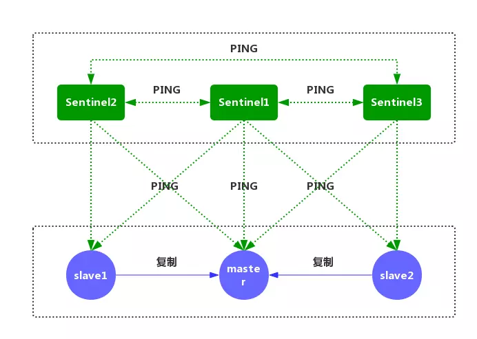
   
2. 如果一个 **实例（instance）** 距离 **最后一次** 有效回复 `PING` 命令的时间超过 `down-after-milliseconds` 所指定的值，那么这个实例会被 `Sentinel` 标记为 
   **主观下线**
   
    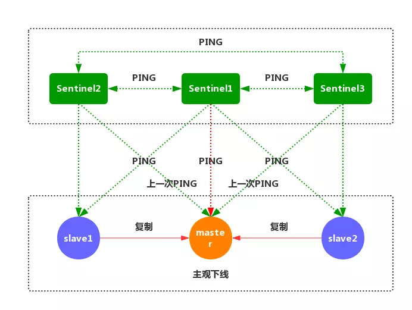
   
3. 如果一个 **主服务器** 被标记为 **主观下线**，那么正在 **监视** 这个 **主服务器** 的所有 `Sentinel` 节点， 
   要以 **每秒一次** 的频率确认 **主服务器** 的确进入了 **主观下线**状态
   
    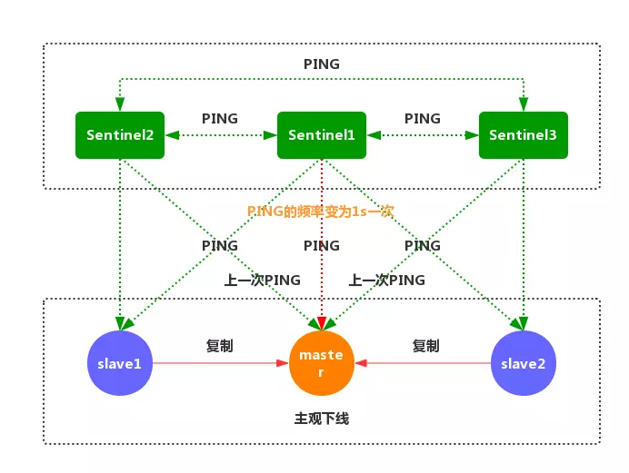
   
4. 如果一个 **主服务器** 被标记为 **主观下线**，并且有 **足够数量** 的 `Sentinel`
   （至少要达到 **配置文件** 指定的数量）在指定的 **时间范围** 内同意这一判断，
   那么这个 **主服务器** 被标记为 **客观下线**
   
    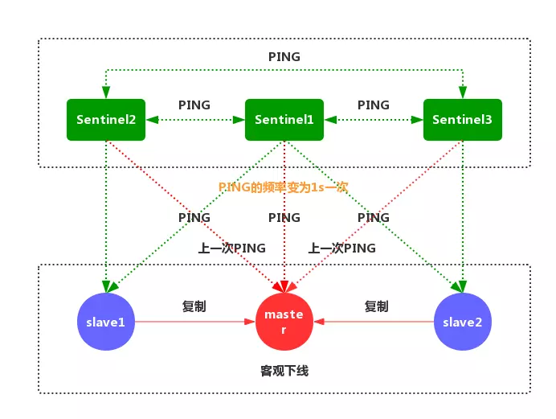
   
5. 在一般情况下， 每个 `Sentinel` 会以每 `10` 秒一次的频率，向它已知的所有 
   **主服务器** 和 **从服务器** 发送 `INFO` 命令。 当一个 **主服务器** 被 
   `Sentinel` 标记为 **客观下线** 时，`Sentinel` 向 **下线主服务器** 的所有 
   **从服务器** 发送 `INFO` 命令的频率， 会从 `10` 秒一次改为 **每秒一次**。
   
    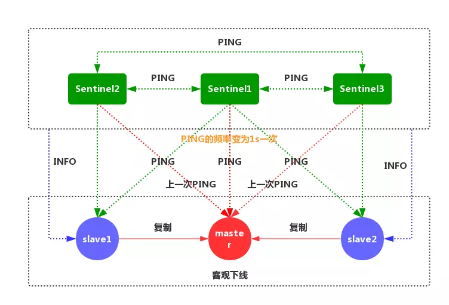
   
6. `Sentinel` 和其他 `Sentinel` 协商 **主节点** 的状态，如果 **主节点** 
   处于 `SDOWN` 状态，则投票自动选出新的 **主节点**。 将剩余的 **从节点** 
   指向 **新的主节点** 进行 **数据复制**
   
    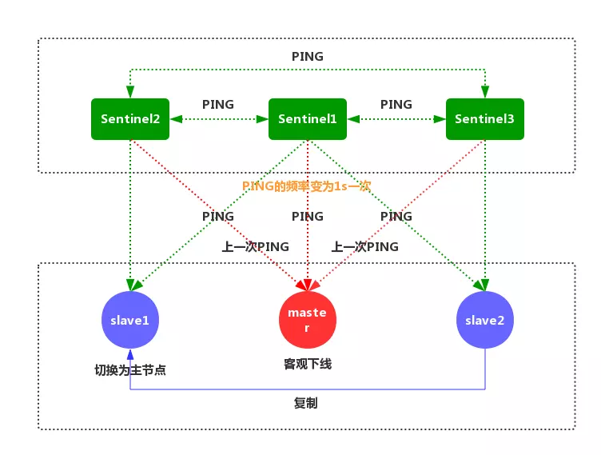
   
7. 当没有足够数量的 `Sentinel` 同意 **主服务器** 下线时， **主服务器** 的 
   **客观下线状态** 就会被移除。 当 **主服务器** 重新向 `Sentinel` 的 `PING` 
   命令返回 **有效回复** 时，主服务器 的 **主观下线状态** 就会被移除。
   
    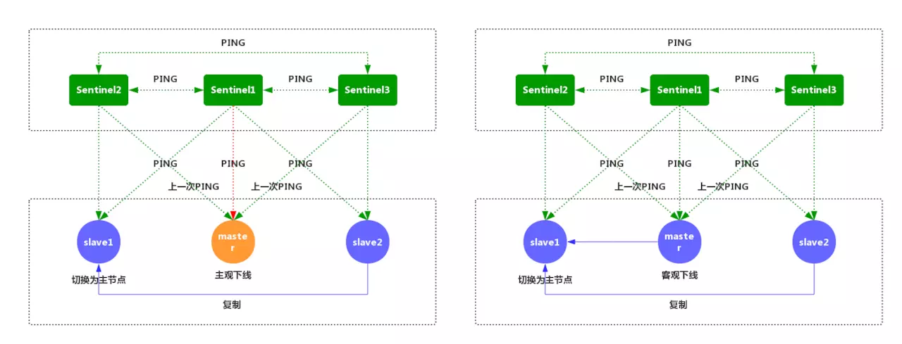

> 注意：一个有效的 `PING` 回复可以是：`+PONG`、`-LOADING` 或者 `-MASTERDOWN`。
> 如果 **服务器** 返回除以上三种回复之外的其他回复，
> 又或者在 **指定时间** 内没有回复 `PING` 命令， 那么 `Sentinel` 
> 认为服务器返回的回复 **无效（non-valid）**。

### 3.2 Redis Sentinel搭建

#### 3.2.1 Redis Sentinel的部署须知

1. 一个稳健的 `Redis Sentinel` 集群，应该使用至少 **三个** `Sentinel` 实例，
   并且保证讲这些实例放到 **不同的机器** 上， 甚至不同的 **物理区域**。

2. `Sentinel` 无法保证 **强一致性**。

3. 常见的 **客户端应用库** 都支持 `Sentinel`。

4. `Sentinel` 需要通过不断的 **测试** 和 **观察**，才能保证高可用。

#### 3.2.2 Redis Sentinel的配置文件

```shell
# 哨兵sentinel实例运行的端口，默认26379  
port 26379
# 哨兵sentinel的工作目录
dir ./
 
# 哨兵sentinel监控的redis主节点的 
## ip：主机ip地址
## port：哨兵端口号
## master-name：可以自己命名的主节点名字（只能由字母A-z、数字0-9 、这三个字符".-_"组成。）
## quorum：当这些quorum个数sentinel哨兵认为master主节点失联 那么这时 客观上认为主节点失联了  
# sentinel monitor <master-name> <ip> <redis-port> <quorum>  
sentinel monitor mymaster 127.0.0.1 6379 2
 
# 当在Redis实例中开启了requirepass <foobared>，所有连接Redis实例的客户端都要提供密码。
# sentinel auth-pass <master-name> <password>  
sentinel auth-pass mymaster 123456  
 
# 指定主节点应答哨兵sentinel的最大时间间隔，超过这个时间，哨兵主观上认为主节点下线，默认30秒  
# sentinel down-after-milliseconds <master-name> <milliseconds>
sentinel down-after-milliseconds mymaster 30000  
 
# 指定了在发生failover主备切换时，最多可以有多少个slave同时对新的master进行同步。这个数字越小，完成failover所需的时间就越长；反之，但是如果这个数字越大，就意味着越多的slave因为replication而不可用。可以通过将这个值设为1，来保证每次只有一个slave，处于不能处理命令请求的状态。
# sentinel parallel-syncs <master-name> <numslaves>
sentinel parallel-syncs mymaster 1  
 
# 故障转移的超时时间failover-timeout，默认三分钟，可以用在以下这些方面：
## 1. 同一个sentinel对同一个master两次failover之间的间隔时间。  
## 2. 当一个slave从一个错误的master那里同步数据时开始，直到slave被纠正为从正确的master那里同步数据时结束。  
## 3. 当想要取消一个正在进行的failover时所需要的时间。
## 4.当进行failover时，配置所有slaves指向新的master所需的最大时间。不过，即使过了这个超时，slaves依然会被正确配置为指向master，但是就不按parallel-syncs所配置的规则来同步数据了
# sentinel failover-timeout <master-name> <milliseconds>  
sentinel failover-timeout mymaster 180000
 
# 当sentinel有任何警告级别的事件发生时（比如说redis实例的主观失效和客观失效等等），将会去调用这个脚本。一个脚本的最大执行时间为60s，如果超过这个时间，脚本将会被一个SIGKILL信号终止，之后重新执行。
# 对于脚本的运行结果有以下规则：  
## 1. 若脚本执行后返回1，那么该脚本稍后将会被再次执行，重复次数目前默认为10。
## 2. 若脚本执行后返回2，或者比2更高的一个返回值，脚本将不会重复执行。  
## 3. 如果脚本在执行过程中由于收到系统中断信号被终止了，则同返回值为1时的行为相同。
# sentinel notification-script <master-name> <script-path>  
sentinel notification-script mymaster /var/redis/notify.sh
 
# 这个脚本应该是通用的，能被多次调用，不是针对性的。
# sentinel client-reconfig-script <master-name> <script-path>
sentinel client-reconfig-script mymaster /var/redis/reconfig.sh
```

#### 3.2.3 Redis Sentinel的节点规划
<div class="table-box">
    <table>
        <thead>
        <tr>
            <th>角色</th>
            <th>IP地址</th>
            <th>端口号</th>
        </tr>
        </thead>
        <tbody>
        <tr>
            <td>Redis Master</td>
            <td>10.206.20.231</td>
            <td>16379</td>
        </tr>
        <tr>
            <td>Redis Slave1</td>
            <td>10.206.20.231</td>
            <td>26379</td>
        </tr>
        <tr>
            <td>Redis Slave2</td>
            <td>10.206.20.231</td>
            <td>36379</td>
        </tr>
        <tr>
            <td>Redis Sentinel1</td>
            <td>10.206.20.231</td>
            <td>16380</td>
        </tr>
        <tr>
            <td>Redis Sentinel2</td>
            <td>10.206.20.231</td>
            <td>26380</td>
        </tr>
        <tr>
            <td>Redis Sentinel3</td>
            <td>10.206.20.231</td>
            <td>36380</td>
        </tr>
        </tbody>
    </table>
</div>

#### 3.2.4 Redis Sentinel的配置搭建

##### 3.2.4.1 Redis-Server的配置管理

分别拷贝三份 `redis.conf` 文件到 `/usr/local/redis-sentinel` 目录下面。
三个配置文件分别对应 `master`、`slave1` 和 `slave2` 三个`Redis` 节点的 
**启动配置**。

```shell
sudo cp /usr/local/redis-4.0.11/redis.conf /usr/local/redis-sentinel/redis-16379.conf
sudo cp /usr/local/redis-4.0.11/redis.conf /usr/local/redis-sentinel/redis-26379.conf
sudo cp /usr/local/redis-4.0.11/redis.conf /usr/local/redis-sentinel/redis-36379.conf
```

分别修改三份配置文件如下:

* 主节点：`redis-16379.conf`
  ```shell
  daemonize yes
  pidfile /var/run/redis-16379.pid
  logfile /var/log/redis/redis-16379.log
  port 16379
  bind 0.0.0.0
  timeout 300
  databases 16
  dbfilename dump-16379.db
  dir ./redis-workdir
  masterauth 123456
  requirepass 123456
  ```
* 从节点1: `redis-26379.conf`
  ```shell
  daemonize yes
  pidfile /var/run/redis-26379.pid
  logfile /var/log/redis/redis-26379.log
  port 26379
  bind 0.0.0.0
  timeout 300
  databases 16
  dbfilename dump-26379.db
  dir ./redis-workdir
  masterauth 123456
  requirepass 123456
  slaveof 127.0.0.1 16379
  ```
* 从节点2：`redis-36379.conf`
  ```shell
  daemonize yes
  pidfile /var/run/redis-36379.pid
  logfile /var/log/redis/redis-36379.log
  port 36379
  bind 0.0.0.0
  timeout 300
  databases 16
  dbfilename dump-36379.db
  dir ./redis-workdir
  masterauth 123456
  requirepass 123456
  slaveof 127.0.0.1 16379
  ```

> 如果要做 **自动故障转移**，建议所有的 `redis.conf` 都设置 `masterauth`。因为 **自动故障** 只会重写 **主从关系**，
> 即 `slaveof`，不会自动写入 `masterauth`。如果 `Redis` 原本没有设置密码，则可以忽略。

##### 3.2.4.2 Redis-Server启动验证

按顺序分别启动 `16379`，`26379` 和 `36379` 三个 `Redis` 节点，
启动命令和启动日志如下

```shell
sudo redis-server /usr/local/redis-sentinel/redis-16379.conf
sudo redis-server /usr/local/redis-sentinel/redis-26379.conf
sudo redis-server /usr/local/redis-sentinel/redis-36379.conf
```

查看 Redis 的启动进程

```shell
ps -ef | grep redis-server
```

查看 Redis 的启动日志

* 节点 `redis-16379`
  ```shell
  cat /var/log/redis/redis-16379.log
  ```
  以下两行日志日志表明，`redis-16379` 作为 `Redis` 的 **主节点**，`redis-26379` 和 `redis-36379` 作为 **从节点**， 从 **主节点** 同步数据。
  ```shell
  7127:M 22 Aug 14:16:48.416 * Slave 127.0.0.1:26379 asks for synchronization
  7127:M 22 Aug 14:16:51.848 * Slave 127.0.0.1:36379 asks for synchronization
  ```
* 节点 `redis-26379`

  ```shell
  cat /var/log/redis/redis-26379.log
  ```
* 节点 `redis-36379`
  ```shell
  cat /var/log/redis/redis-36379.log
  ```

##### 3.2.4.3 Sentinel的配置管理

分别拷贝三份 `redis-sentinel.conf` 文件到 `/usr/local/redis-sentinel` 目录下面。 三个配置文件分别对应 `master`、`slave1` 和 `slave2` 三个 `Redis`
节点的 **哨兵配置**。

```shell
sudo cp /usr/local/redis-4.0.11/sentinel.conf /usr/local/redis-sentinel/sentinel-16380.conf
sudo cp /usr/local/redis-4.0.11/sentinel.conf /usr/local/redis-sentinel/sentinel-26380.conf
sudo cp /usr/local/redis-4.0.11/sentinel.conf /usr/local/redis-sentinel/sentinel-36380.conf
```

* 节点1：`sentinel-16380.conf`
  ```shell
  protected-mode no
  bind 0.0.0.0
  port 16380
  daemonize yes
  sentinel monitor master 127.0.0.1 16379 2
  sentinel down-after-milliseconds master 5000
  sentinel failover-timeout master 180000
  sentinel parallel-syncs master 1
  sentinel auth-pass master 123456
  logfile /var/log/redis/sentinel-16380.log
  ```
* 节点2：`sentinel-26380.conf`
  ```shell
  protected-mode no
  bind 0.0.0.0
  port 26380
  daemonize yes
  sentinel monitor master 127.0.0.1 16379 2
  sentinel down-after-milliseconds master 5000
  sentinel failover-timeout master 180000
  sentinel parallel-syncs master 1
  sentinel auth-pass master 123456
  logfile /var/log/redis/sentinel-26380.log
  ```
* 节点3：`sentinel-36380.conf`
  ```shell
  protected-mode no
  bind 0.0.0.0
  port 36380
  daemonize yes
  sentinel monitor master 127.0.0.1 16379 2
  sentinel down-after-milliseconds master 5000
  sentinel failover-timeout master 180000
  sentinel parallel-syncs master 1
  sentinel auth-pass master 123456
  logfile /var/log/redis/sentinel-36380.log
  ```

##### 3.2.4.4 Sentinel启动验证

按顺序分别启动 `16380`，`26380` 和 `36380` 三个 `Sentinel` 节点，启动命令和启动日志如下

```shell
sudo redis-sentinel /usr/local/redis-sentinel/sentinel-16380.conf
sudo redis-sentinel /usr/local/redis-sentinel/sentinel-26380.conf
sudo redis-sentinel /usr/local/redis-sentinel/sentinel-36380.conf
```

查看 Sentinel 的启动进程

```shell
ps -ef | grep redis-sentinel
```

查看 Sentinel 的启动日志

* 节点 `sentinel-16380`
  ```shell
  cat /var/log/redis/sentinel-16380.log   # 节点 sentinel-16380
  ```
  `sentinel-16380` 节点的 `Sentinel ID` 为 `69d05b86a82102a8919231fd3c2d1f21ce86e000`， 并通过 `Sentinel ID` 把自身加入 `sentinel`
  集群中。

* 节点 `sentinel-26380`
  ```shell
  cat /var/log/redis/sentinel-26380.log 
  ```
  `sentinel-26380` 节点的 `Sentinel ID` 为 `21e30244cda6a3d3f55200bcd904d0877574e506`， 并通过 `Sentinel ID` 把自身加入 `sentinel`
  集群中。此时 `sentinel` 集群中已有 `sentinel-16380` 和 `sentinel-26380` 两个节点

* 节点 `sentinel-36380`
  ```shell
  cat /var/log/redis/sentinel-36380.log 
  ```
  `sentinel-36380` 节点的 `Sentinel ID` 为 `fd166dc66425dc1d9e2670e1f17cb94fe05f5fc7`， 并通过 `Sentinel ID` 把自身加入 `sentinel`
  集群中。此时 `sentinel` 集群中已有 `sentinel-16380，sentinel-26380` 和 `sentinel-36380` 三个节点。

##### 3.2.4.5 Sentinel配置刷新

* 节点1：`sentinel-16380.conf`

  `sentinel-16380.conf` 文件新生成如下的配置项
  ```shell
  # Generated by CONFIG REWRITE
  dir "/usr/local/redis-sentinel"
  sentinel config-epoch master 0
  sentinel leader-epoch master 0
  sentinel known-slave master 127.0.0.1 36379
  sentinel known-slave master 127.0.0.1 26379
  sentinel known-sentinel master 127.0.0.1 26380 21e30244cda6a3d3f55200bcd904d0877574e506
  sentinel known-sentinel master 127.0.0.1 36380 fd166dc66425dc1d9e2670e1f17cb94fe05f5fc7
  sentinel current-epoch 0
  ```
  可以注意到，`sentinel-16380.conf` 刷新写入了 `Redis` 主节点关联的所有 **从节点** `redis-26379` 和 `redis-36379`， 同时写入了其余两个 `Sentinel`
  节点 `sentinel-26380` 和 `sentinel-36380` 的 `IP` 地址，端口号 和 `Sentinel ID`

* 节点2：`sentinel-26380.conf`
  ```shell
  # Generated by CONFIG REWRITE
  dir "/usr/local/redis-sentinel"
  sentinel config-epoch master 0
  sentinel leader-epoch master 0
  sentinel known-slave master 127.0.0.1 26379
  sentinel known-slave master 127.0.0.1 36379
  sentinel known-sentinel master 127.0.0.1 36380 fd166dc66425dc1d9e2670e1f17cb94fe05f5fc7
  sentinel known-sentinel master 127.0.0.1 16380 69d05b86a82102a8919231fd3c2d1f21ce86e000
  sentinel current-epoch 0
  ```
* 节点3: `sentinel-36380.conf`
  ```shell
  # Generated by CONFIG REWRITE
  dir "/usr/local/redis-sentinel"
  sentinel config-epoch master 0
  sentinel leader-epoch master 0
  sentinel known-slave master 127.0.0.1 36379
  sentinel known-slave master 127.0.0.1 26379
  sentinel known-sentinel master 127.0.0.1 16380 69d05b86a82102a8919231fd3c2d1f21ce86e000
  sentinel known-sentinel master 127.0.0.1 26380 21e30244cda6a3d3f55200bcd904d0877574e506
  sentinel current-epoch 0
  ```

##### 3.2.4.6 Sentinel时客户端命令

* `PING sentinel`: 检查其他 `Sentinel` 节点的状态，返回 `PONG` 为正常。

* `SENTINEL masters`: 显示被监控的所有 **主节点** 以及它们的状态

* `SENTINEL master <master_name>`: 显示指定 **主节点** 的信息和状态

* `SENTINEL slaves <master_name>`: 显示指定 主节点 的所有 从节点 以及它们的状态

* `SENTINEL get-master-addr-by-name <master_name>`:

  返回指定 **主节点** 的 `IP` **地址** 和 **端口**。如果正在进行 `failover` 或者 `failover` 已经完成， 将会显示被提升为 **主节点** 的 **从节点** 的 `IP` **地址**
  和 **端口**。

* `SENTINEL reset <pattern>`:

  重置名字匹配该 **正则表达式** 的所有的 **主节点** 的状态信息，清除它之前的 **状态信息**，以及 **从节点** 的信息

* `SENTINEL failover <master_name>`

  强制当前 `Sentinel` 节点执行 `failover`，并且不需要得到其他 `Sentinel` 节点的同意。 但是 `failover` 后会将 **最新的配置** 发送给其他 `Sentinel` 节点

### 3.3. Redis Sentinel故障切换与恢复

#### 3.3.1 Redis CLI客户端跟踪

上面的日志显示，`redis-16379` 节点为 **主节点**，它的进程 `ID` 为 `7127`。为了模拟 `Redis` 主节点故障，强制杀掉这个进程。

```shell
kill -9 7127
```

使用 `redis-cli` 客户端命令进入 `sentinel-16380` 节点，查看 `Redis` 节点 的状态信息

```shell
redis-cli -p 16380
```

查看 `Redis` 主从集群的 **主节点** 信息。可以发现 `redis-26379` 晋升为 **新的主节点**

#### 3.3.2 Redis Sentinel日志跟踪

* 查看任意 Sentinel 节点的日志
* 分析日志，可以发现 redis-16329 节点先进入 sdown 主观下线 状态
* 哨兵检测到 redis-16329 出现故障，Sentinel 进入一个 新纪元，从 0 变为 1
* 三个 Sentinel 节点开始协商 主节点 的状态，判断其是否需要 客观下线
* 超过 quorum 个数的 Sentinel 节点认为 主节点 出现故障，redis-16329 节点进入 客观下线 状态。
* Sentinal 进行 自动故障切换，协商选定 redis-26329 节点作为新的 主节点。
* redis-36329 节点和已经 客观下线 的 redis-16329 节点成为 redis-26479 的 从节点

#### 3.3.3 Redis的配置文件

分别查看三个 redis 节点的配置文件，发生 主从切换 时 redis.conf 的配置会**自动发生刷新**

## 四 集群

`Redis Cluster`集群模式通常具有 **高可用、可扩展性、分布式、容错**等特性。`Redis`分布式方案一般有两种

### 4.1 客户端分区方案

**客户端**自己决定数会被 **存储** 在哪个 `redis` 节点或者从那个 `redis` 节点
**读取数据**。主要思想是采用 **哈希算法** 将`redis`数据的`key`进行散列，
通过`hash`函数，特定的`key`会映射到特定的`redis`节点上。
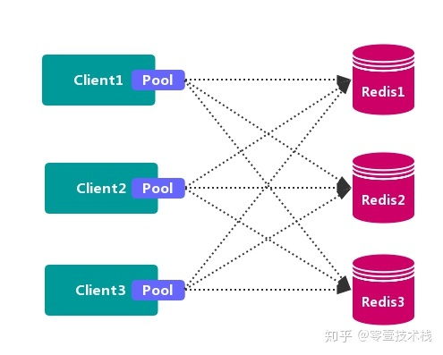

客户端分区方案代表为**Redis Sharding**，是 **Redis Cluster** 出来之前，
业界普遍使用的redis多实例集群方案。

* 优点： 不使用第三方中间件，分区逻辑可控，配置简单，节点之间无关连，线性扩展容易，
  灵活性强

* 缺点: 客户端**无法动态增删**服务节点，客户端需要**自行分发逻辑**，
  客户端之间**无连接共享**，会造成连接浪费。

### 4.2 代理分区方案

客户端发送请求到一个 **代理组件**，**代理**解析客户端的数据，并将请求转发至正确的节点，
最后将结果回复给客户端

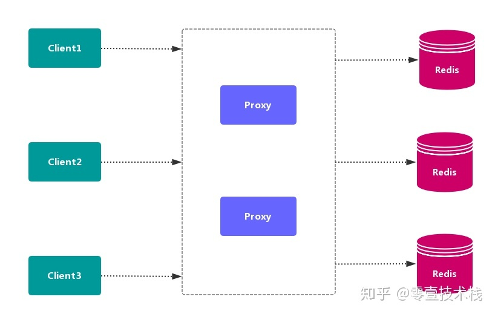

* 优点: 简化客户端分布式逻辑，客户端透明接入，切换成本低，代理的转发和存储分离

* 缺点：多了一层代理层，加重了架构部署复杂度和性能损耗

代理分区主流实现方案有: **`Twemproxy`和`Codis`**

#### 4.2.1 Twemproxy

`Twemproxy` 也叫 `nutcraker`, 是`twitter`开源的一个`redis`和`memcache`的
**中间代理服务器**程序。可以接受来自多个程序 的访问，按照**路由规则**，
转发给后台各个`Redis`服务器，再原路返回。存在 **单点故障问题**，
需要结合`lvs`和`keepalived`做高可用方案


* 优点: 应用范围广，稳定性较高，**中间代理层** 高可用
* 缺点: 无法平滑地**水平扩容**，无 **可视化界面管理**，运维不友好；出现故障，不能自动转移

#### 4.2.2 Codis

`codis`是一个分布式redis解决方案，对于上层应用而言，连接`codis-proxy`和
直接连接原生地`redis-server`没有区别。`Codis`底层会处理请求地转发，
不停机地进行数据迁移等工作。`codis`采用了无状态代理层，对于客户端而言，
一切都是透明地。

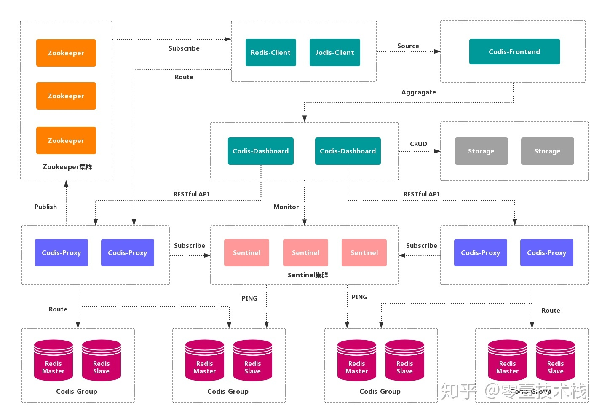

* 优点: 实现上层proxy和底层redis地高可用，数据分片和自动平衡，提供命令接口 和 
  `restful API`. 提供监控和管理界面，可以动态添加和删除redis节点
* 缺点: 部署架构和配置复杂，不支持跨机房和多租户，不支持鉴权管理。

### 4.3 查询路由方案

**客户端随机**地请求任意一个`redis`实例，然后由`Redis`将请求转发给正确地
`redis`节点。`Redis Cluster`实现了一种呼和形式地查询路由， 
但并不是直接将请求从一个`Redis`节点转发到另一个`redis`节点，
而是再客户端地帮助下直接重定向到正确地`redis`节点

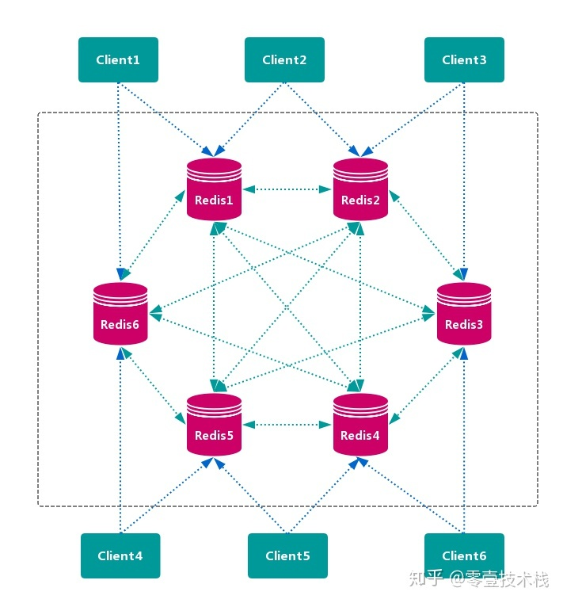

* 优点： **无中心节点**，数据按照 *槽* 存储分布在多个 `Redis` 实例上，可以平滑的进行节点 **扩容/缩容**，支持 **高可用** 和 **自动故障转移**，运维成本低。

* 缺点: 严重依赖 `Redis-trib` 工具，缺乏 **监控管理**，需要依赖 `Smart Client` (**维护连接，缓存路由表**，`MultiOp` 和 `Pipeline` 支持)。`Failover` 节点的 **
  检测过慢**，不如 **中心节点** ZooKeeper 及时。Gossip 消息具有一定开销。无法根据统计区分 **冷热数据**。

****

## 五 数据分布(集群原理)

### 5.1 数据分布理论

**分布式数据库** 首先要解决把 **整个数据集** 按照 **分区规则** 映射到 
**多个节点** 的问题， 即把 **数据集** 划分到 **多个节点** 上，
每个节点负责 **整体数据** 的一个 **子集**。

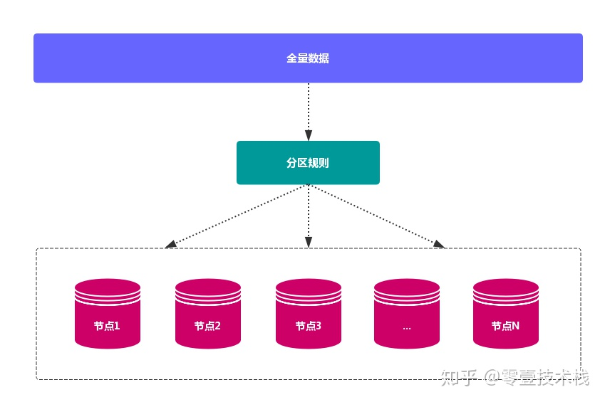

数据分布通常有 **哈希分区** 和 **顺序分区** 两种方式

由于 `Redis Cluster` 采用 **哈希分区规则**，这里重点讨论 **哈希分区**。
常见的 **哈希分区** 规则有几种，下面分别介绍：

#### 5.1.1 节点取余法

使用特定的数据，如 Redis 的 **键** 或 **用户 ID**，再根据 节点数量 `N` 使用公式：
`hash（key）% N` 计算出 **哈希值**， 用来决定数据 **映射** 到哪一个节点上。

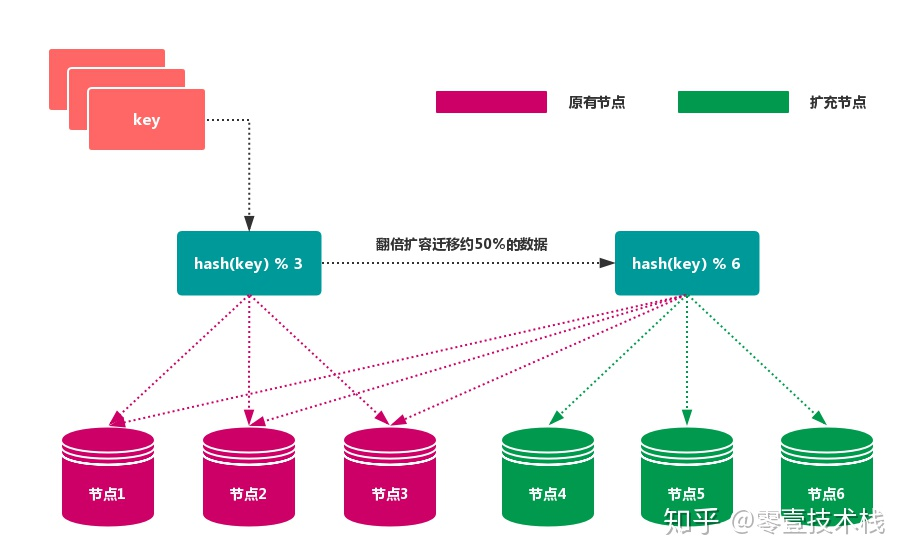

* **优先**：突出优点是 **简单性**，常用于 **数据库** 的 **分库分表规则**。一般采用 
  **预分区** 的方式，提前根据 **数据量** 规划好 **分区数** 比如划分为 512 或 
  1024 张表，保证可支撑未来一段时间的 **数据容量**，再根据 **负载情况** 将 
  **表** 迁移到其他 **数据库** 中。 扩容时通常采用 **翻倍扩容**，避免 
  **数据映射** 全部被 **打乱**，导致 **全量迁移** 的情况。

* **缺点**: 当 **节点数量** 变化时，如 **扩容** 或 **收缩** 节点，
  数据节点 **映射关系** 需要重新计算，会导致数据的 **重新迁移**

#### 5.1.2 一致性哈希分区

**一致性哈希** 可以很好的解决 **稳定性问题**，可以将所有的 **存储节点** 排列在 
**首尾相接** 的 `Hash` 环上， 每个 `key` 在计算 `Hash` 后会 **顺时针** 找到 
**临接** 的 **存储节点** 存放。而当有节点 **加入** 或 **退出** 时， 
仅影响该节点在 `Hash` 环上 **顺时针相邻** 的 **后续节点**

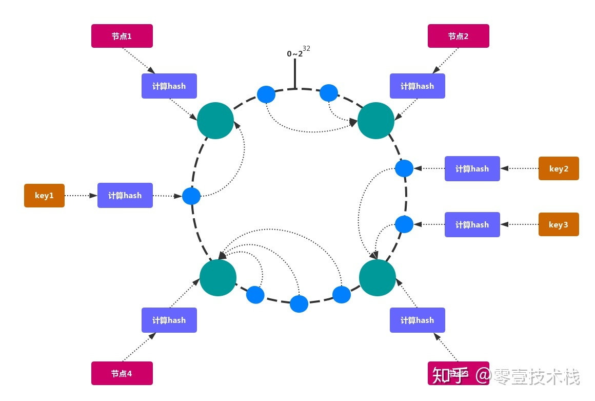

* 优点: **加入** 和 **删除** 节点只影响 **哈希环** 中 **顺时针方向** 的 
  **相邻的节点**，对其他节点无影响。

* 缺点: **加减节点** 会造成 **哈希环** 中部分数据 **无法命中**。当使用 
  **少量节点** 时，**节点变化** 将大范围影响 **哈希环** 中 **数据映射**，
  不适合 **少量数据节点** 的分布式方案。**普通** 的 **一致性哈希分区**
  在增减节点时需要 **增加一倍** 或 **减去一半** 节点才能保证 **数据** 和
  **负载的均衡**。

> 注意：因为 一致性哈希分区 的这些缺点，一些分布式系统采用 **虚拟槽** 对 
> **一致性哈希** 进行改进，比如 Dynamo 系统。

#### 5.1.3 虚拟槽分区

**虚拟槽分区** 巧妙地使用了 **哈希空间**，使用 **分散度良好** 的 **哈希函数** 
把所有数据 **映射** 到一个 **固定范围** 的 整数集合 中， 整数定义为 **槽**
（`slot`）。这个范围一般 **远远大于** 节点数，比如 `Redis Cluster` 
槽范围是 `0 ~ 16383`。**槽** 是集群内 **数据管理** 和 **迁移** 的 
**基本单位**。采用 **大范围槽** 的主要目的是为了方便 **数据拆分** 和 
**集群扩展**。 每个节点会负责 **一定数量的槽**，如图所示：

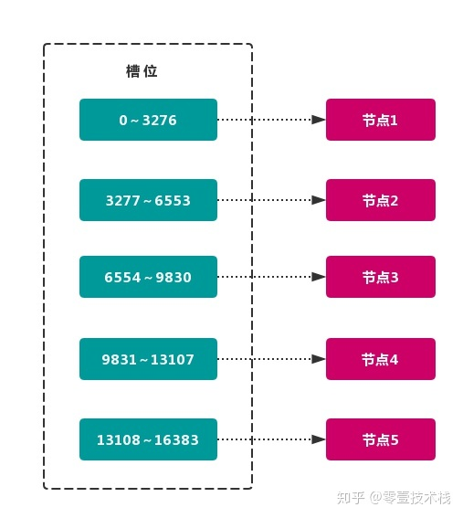

当前集群有 `5` 个节点，每个节点平均大约负责 `3276` 个 **槽**。 由于采用 
**高质量** 的 **哈希算法**，每个槽所映射的数据通常比较 **均匀**， 
将数据平均划分到 `5` 个节点进行 **数据分区**。`Redis Cluster` 就是采用 
**虚拟槽分区**。

* 节点1： 包含 0 到 3276 号哈希槽。
* 节点2：包含 3277 到 6553 号哈希槽。
* 节点3：包含 6554 到 9830 号哈希槽。
* 节点4：包含 9831 到 13107 号哈希槽。
* 节点5：包含 13108 到 16383 号哈希槽

这种结构很容易 **添加** 或者 **删除** 节点。如果 **增加** 一个节点 `6`，就需要从节点 `1 ~ 5` 获得部分 **槽** 分配到节点 `6 `上。 如果想 **移除** 节点 `1`，需要将节点 `1` 中的 **
槽** 移到节点 `2 ~ 5` 上，然后将 **没有任何槽** 的节点 1 从集群中 **移除** 即可。

> 由于从一个节点将 **哈希槽** 移动到另一个节点并不会 **停止服务**，
> 所以无论 **添加删除** 或者 **改变** 某个节点的 **哈希槽的数量** 都不会造成 **集群不可用** 的状态.

### 5.2 Redis的数据分区

`Redis Cluster` 采用 **虚拟槽分区**，所有的 **键** 根据 **哈希函数** 映射到 
`0~16383` 整数槽内， 计算公式：$slot = CRC16（key）% 16383$。
每个节点负责维护一部分槽以及槽所映射的 **键值数据**，

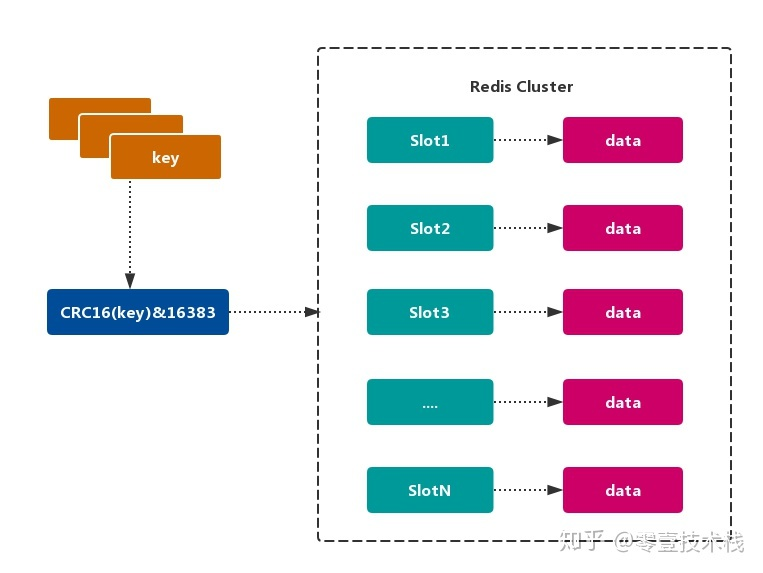

#### 5.2.1 Redis虚拟槽分区的特点

* 解耦 **数据** 和 **节点** 之间的关系，简化了节点 **扩容** 和 **收缩** 难度。
  
* 节点自身 **维护槽的** 映射关系，不需要 **客户端** 或者 **代理服务** 维护 
  **槽分区元数据**。

* 支持 **节点、槽、键** 之间的 **映射查询**，用于 **数据路由、在线伸缩** 等场景。

### 5.3 Redis集群的功能限制

`Redis` 集群相对 **单机** 在功能上存在一些限制，需要 开发人员 提前了解，
在使用时做好规避。

* `key` **批量操作** 支持有限

  类似 `mset、mget` 操作，目前只支持对具有相同 `slot` 值的 `key` 执行 
  **批量操作**。对于 **映射为不同** `slot` 值的`key` 由于执行 `mset、mget` 
  等操作可能存在于多个节点上，因此不被支持.

* `key` **事务操作** 支持有限。

  只支持 **多** `key` 在 **同一节点上** 的 **事务操作**，当多个 `key` 分布在 
  **不同** 的节点上时 **无法** 使用事务功能。

* `key` 作为 **数据分区** 的最小粒度

  不能将一个 **大的键值** 对象如 `hash、list` 等映射到 **不同的节点**。

* 不支持 **多数据库空间**

  **单机** 下的 `Redis` 可以支持 `16` 个数据库（db0 ~ db15），
  **集群模式** 下只能使用 **一个** 数据库空间，即 `db0`。

* **复制结构** 只支持一层

  从节点 **只能复制** 主节点，不支持 **嵌套树状复制** 结构

****

## 六 redis集群配置

`Redis-Cluster` 是 `Redis` 官方的一个 **高可用** 解决方案，`Cluster` 中的 
`Redis` 共有 `2^14（16384）` 个 `slot` **槽**。 创建 `Cluster` 后，
**槽**会 **平均分配** 到每个 `Redis` **节点上**。

下面介绍一下本机启动 `6` 个 `Redis` 的 **集群服务**，并使用 `redis-trib.rb` 
创建 **3主3从** 的 集群。 搭建集群工作需要以下三个步骤：

### 6.1 第一步、准备节点

`Redis` 集群一般由 **多个节点** 组成，节点数量至少为 `6` 个，才能保证组成 
**完整高可用** 的集群。 每个节点需要 **开启配置** `cluster-enabled yes`，
让 `Redis` 运行在 **集群模式** 下。

集群节点规划如下


> 注意：建议为集群内 **所有节点** 统一目录，一般划分三个目录：`conf、data、log`，
> 分别存放 **配置、数据 和 日志** 相关文件。
> 把 `6` 个节点配置统一放在 `conf` 目录下。

#### 6.1.1 创建各个实例目录

```shell
sudo mkdir -p /usr/local/redis-cluster
cd /usr/local/redis-cluster
sudo mkdir conf data log
sudo mkdir -p data/redis-6379 data/redis-6389 data/redis-6380 data/redis-6390 data/redis-6381 data/redis-6391
```

#### 6.1.2 redis配置文件管理

根据以下 **模板** 配置各个实例的 `redis.conf`，以下只是搭建集群需要的 **基本配置**，可能需要根据实际情况做修改。

```shell
# redis后台运行
daemonize yes
# 绑定的主机端口
bind 127.0.0.1
# 数据存放目录
dir /usr/local/redis-cluster/data/redis-6379
# 进程文件
pidfile /var/run/redis-cluster/${自定义}.pid
# 日志文件
logfile /usr/local/redis-cluster/log/${自定义}.log
# 端口号
port 6379
# 开启集群模式，把注释#去掉
cluster-enabled yes
# 集群的配置，配置文件首次启动自动生成
cluster-config-file /usr/local/redis-cluster/conf/${自定义}.conf
# 请求超时，设置10秒
cluster-node-timeout 10000
# aof日志开启，有需要就开启，它会每次写操作都记录一条日志
appendonly yes
```

* redis-6379.conf
  ```shell
  daemonize yes
  bind 127.0.0.1
  dir /usr/local/redis-cluster/data/redis-6379
  pidfile /var/run/redis-cluster/redis-6379.pid
  logfile /usr/local/redis-cluster/log/redis-6379.log
  port 6379
  cluster-enabled yes
  cluster-config-file /usr/local/redis-cluster/conf/node-6379.conf
  cluster-node-timeout 10000
  appendonly yes
  ```
* redis-6389.conf
  ```shell
  daemonize yes
  bind 127.0.0.1
  dir /usr/local/redis-cluster/data/redis-6389
  pidfile /var/run/redis-cluster/redis-6389.pid
  logfile /usr/local/redis-cluster/log/redis-6389.log
  port 6389
  cluster-enabled yes
  cluster-config-file /usr/local/redis-cluster/conf/node-6389.conf
  cluster-node-timeout 10000
  appendonly yes
  ```
* redis-6380.conf
  ```shell
  daemonize yes
  bind 127.0.0.1
  dir /usr/local/redis-cluster/data/redis-6380
  pidfile /var/run/redis-cluster/redis-6380.pid
  logfile /usr/local/redis-cluster/log/redis-6380.log
  port 6380
  cluster-enabled yes
  cluster-config-file /usr/local/redis-cluster/conf/node-6380.conf
  cluster-node-timeout 10000
  appendonly yes
  ```
* redis-6390.conf
  ```shell
  daemonize yes
  bind 127.0.0.1
  dir /usr/local/redis-cluster/data/redis-6390
  pidfile /var/run/redis-cluster/redis-6390.pid
  logfile /usr/local/redis-cluster/log/redis-6390.log
  port 6390
  cluster-enabled yes
  cluster-config-file /usr/local/redis-cluster/conf/node-6390.conf
  cluster-node-timeout 10000
  appendonly yes
  ```
* redis-6381.conf
  ```shell
  daemonize yes
  bind 127.0.0.1
  dir /usr/local/redis-cluster/data/redis-6381
  pidfile /var/run/redis-cluster/redis-6381.pid
  logfile /usr/local/redis-cluster/log/redis-6381.log
  port 6381
  cluster-enabled yes
  cluster-config-file /usr/local/redis-cluster/conf/node-6381.conf
  cluster-node-timeout 10000
  appendonly yes
  ```
* redis-6391.conf
  ```shell
  daemonize yes
  bind 127.0.0.1
  dir /usr/local/redis-cluster/data/redis-6391
  pidfile /var/run/redis-cluster/redis-6391.pid
  logfile /usr/local/redis-cluster/log/redis-6391.log
  port 6391
  cluster-enabled yes
  cluster-config-file /usr/local/redis-cluster/conf/node-6391.conf
  cluster-node-timeout 10000
  appendonly yes
  ```

### 6.2 第二步、环境准备

#### 6.2.1 安装ruby

```shell
sudo brew install ruby
```

#### 6.2.2 准备rubygem redis依赖

```shell
sudo gem install redis
```

#### 6.2.3 拷贝redis-trib.rb到集群根目录

`redis-trib.rb` 是 `redis` 官方推出的管理 `redis` 集群 的工具，集成在 
`redis` 的源码 `src` 目录下， 将基于 `redis` 提供的 **集群命令** 封装成 
**简单、便捷、实用** 的 **操作工具**。

```shell
sudo cp /usr/local/redis-4.0.11/src/redis-trib.rb /usr/local/redis-cluster
```

查看 redis-trib.rb 命令环境是否正确

```shell
./redis-trib.rb 
```

`redis-trib.rb` 是 `redis` 作者用 `ruby` 完成的。`redis-trib.rb` 命令行工具 
的具体功能如下：

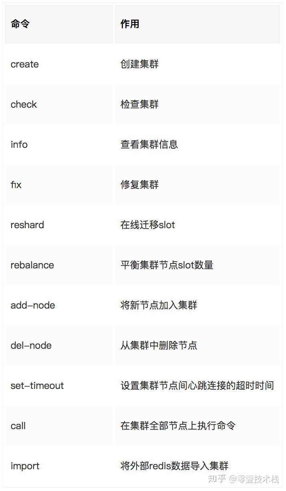

| 命令 | 作用 | 
|:---:|:---:| 
| `create` | 创建集群 | 
| `check` | 检查集群 | 
| `info` | 查看集群信息 | 
| `fix` | 修复集群 | 
| `reshard` | 在线迁移slot | 
| `rebalance` | 平衡集群节点slot数量 | 
| `add-node` | 将新节点加入集群 | 
| `del-node` | 从集群中删除节点 | 
| `set-timeout` | 设置集群节点间心跳连接的超时时间 | 
| `call` | 在集群全部节点上执行命令 | 
| `import` | 将外部redis数据导入集群 |

### 6.3 第三步、安装集群

#### 6.3.1 启动redis服务节点

运行如下命令启动 6 台 redis 节点：

```shell
sudo redis-server conf/redis-6379.conf
sudo redis-server conf/redis-6389.conf
sudo redis-server conf/redis-6380.conf
sudo redis-server conf/redis-6390.conf
sudo redis-server conf/redis-6381.conf
sudo redis-server conf/redis-6391.conf
```

启动完成后，`redis` 以集群模式启动，查看各个 `redis` 节点的进程状态：

```shell
ps -ef | grep redis-server
```

在每个 `redis` 节点的 `redis.conf` 文件中，我们都配置了 `cluster-config-file` 的文件路径， 集群启动时，`conf` 目录会新生成 **集群** 节点配置文件

#### 6.3.2 redis-trib关联集群节点

按照 **从主到从** 的方式 **从左到右** 依次排列 6 个 redis 节点。

```shell
sudo ./redis-trib.rb create --replicas 1 127.0.0.1:6379 127.0.0.1:6380 127.0.0.1:6381 127.0.0.1:6389 127.0.0.1:6390 127.0.0.1:6391
```

集群创建后，`redis-trib` 会先将 `16384` 个 **哈希槽* 分配到 `3` 个 **主节点**，
即 `redis-6379，redis-6380` 和 `redis-6381`。 然后将各个 **从节点** 指向 
**主节点**，进行 **数据同步**。

```shell
>>> Creating cluster
>>> Performing hash slots allocation on 6 nodes...
Using 3 masters:
127.0.0.1:6379
127.0.0.1:6380
127.0.0.1:6381
Adding replica 127.0.0.1:6390 to 127.0.0.1:6379
Adding replica 127.0.0.1:6391 to 127.0.0.1:6380
Adding replica 127.0.0.1:6389 to 127.0.0.1:6381
>>> Trying to optimize slaves allocation for anti-affinity
[WARNING] Some slaves are in the same host as their master
M: ad4b9ffceba062492ed67ab336657426f55874b7 127.0.0.1:6379
   slots:0-5460 (5461 slots) master
M: df23c6cad0654ba83f0422e352a81ecee822702e 127.0.0.1:6380
   slots:5461-10922 (5462 slots) master
M: ab9da92d37125f24fe60f1f33688b4f8644612ee 127.0.0.1:6381
   slots:10923-16383 (5461 slots) master
S: 25cfa11a2b4666021da5380ff332b80dbda97208 127.0.0.1:6389
   replicates ad4b9ffceba062492ed67ab336657426f55874b7
S: 48e0a4b539867e01c66172415d94d748933be173 127.0.0.1:6390
   replicates df23c6cad0654ba83f0422e352a81ecee822702e
S: d881142a8307f89ba51835734b27cb309a0fe855 127.0.0.1:6391
   replicates ab9da92d37125f24fe60f1f33688b4f8644612ee
```

然后输入 `yes`，`redis-trib.rb` 开始执行 **节点握手** 和 **槽分配** 操作，
输出如下：
```shell
an I set the above configuration? (type 'yes' to accept): yes
>>> Nodes configuration updated
>>> Assign a different config epoch to each node
>>> Sending CLUSTER MEET messages to join the cluster
Waiting for the cluster to join....
>>> Performing Cluster Check (using node 127.0.0.1:6379)
M: ad4b9ffceba062492ed67ab336657426f55874b7 127.0.0.1:6379
   slots:0-5460 (5461 slots) master
   1 additional replica(s)
M: ab9da92d37125f24fe60f1f33688b4f8644612ee 127.0.0.1:6381
   slots:10923-16383 (5461 slots) master
   1 additional replica(s)
S: 48e0a4b539867e01c66172415d94d748933be173 127.0.0.1:6390
   slots: (0 slots) slave
   replicates df23c6cad0654ba83f0422e352a81ecee822702e
S: d881142a8307f89ba51835734b27cb309a0fe855 127.0.0.1:6391
   slots: (0 slots) slave
   replicates ab9da92d37125f24fe60f1f33688b4f8644612ee
M: df23c6cad0654ba83f0422e352a81ecee822702e 127.0.0.1:6380
   slots:5461-10922 (5462 slots) master
   1 additional replica(s)
S: 25cfa11a2b4666021da5380ff332b80dbda97208 127.0.0.1:6389
   slots: (0 slots) slave
   replicates ad4b9ffceba062492ed67ab336657426f55874b7
[OK] All nodes agree about slots configuration.
>>> Check for open slots...
>>> Check slots coverage...
[OK] All 16384 slots covered.
```

执行 **集群检查**，检查各个 `redis` 节点占用的 **哈希槽**（`slot`）的个数以及 
`slot` 覆盖率。`16384` 个槽位中，主节点 `redis-6379`、`redis-6380` 和 
`redis-6381` 分别占用了 `5461`、`5461` 和 `5462` 个槽位。

#### 6.3.3 redis主节点的日志

可以发现，通过 `BGSAVE` 命令，从节点 `redis-6389` 在 **后台** 异步地从 
**主节点** `redis-6379` 同步数据。

```shell
$ cat log/redis-6379.log 
1907:C 05 Sep 16:59:52.960 # oO0OoO0OoO0Oo Redis is starting oO0OoO0OoO0Oo
1907:C 05 Sep 16:59:52.961 # Redis version=4.0.11, bits=64, commit=00000000, modified=0, pid=1907, just started
1907:C 05 Sep 16:59:52.961 # Configuration loaded
1908:M 05 Sep 16:59:52.964 * Increased maximum number of open files to 10032 (it was originally set to 256).
1908:M 05 Sep 16:59:52.965 * No cluster configuration found, I'm ad4b9ffceba062492ed67ab336657426f55874b7
1908:M 05 Sep 16:59:52.967 * Running mode=cluster, port=6379.
1908:M 05 Sep 16:59:52.967 # Server initialized
1908:M 05 Sep 16:59:52.967 * Ready to accept connections
1908:M 05 Sep 17:01:17.782 # configEpoch set to 1 via CLUSTER SET-CONFIG-EPOCH
1908:M 05 Sep 17:01:17.812 # IP address for this node updated to 127.0.0.1
1908:M 05 Sep 17:01:22.740 # Cluster state changed: ok
1908:M 05 Sep 17:01:23.681 * Slave 127.0.0.1:6389 asks for synchronization
1908:M 05 Sep 17:01:23.681 * Partial resynchronization not accepted: Replication ID mismatch (Slave asked for '4c5afe96cac51cde56039f96383ea7217ef2af41', my replication IDs are '037b661bf48c80c577d1fa937ba55367a3692921' and '0000000000000000000000000000000000000000')
1908:M 05 Sep 17:01:23.681 * Starting BGSAVE for SYNC with target: disk
1908:M 05 Sep 17:01:23.682 * Background saving started by pid 1952
1952:C 05 Sep 17:01:23.683 * DB saved on disk
1908:M 05 Sep 17:01:23.749 * Background saving terminated with success
1908:M 05 Sep 17:01:23.752 * Synchronization with slave 127.0.0.1:6389 succeeded
```

#### 6.3.4 redis集群完整性检测

使用 `redis-trib.rb check` 命令检测之前创建的 **两个集群** 是否成功，
`check` 命令只需要给出集群中 **任意一个节点地址**
就可以完成 **整个集群** 的 **检查工作**，命令如下:

```shell
./redis-trib.rb check 127.0.0.1:6379
```

当最后输出如下信息，提示集群 **所有的槽** 都已分配到节点:

```shell
[OK] All nodes agree about slots configuration.
>>> Check for open slots...
>>> Check slots coverage...
[OK] All 16384 slots covered.
```


#### 6.3.5 连接
连接时需要指定`-c`
```shell
redis-cli -c -p 6380
```

****
新版创建集群地命令
```shell
./src/redis-cli --cluster help
./src/redis-cli --cluster create --cluster-replicas 1 127.0.0.1:6380 127.0.0.1:6381 127.0.0.1:6382 127.0.0.1:6383 127.0.0.1:6384 127.0.0.1:6385
create 创建集群
check 检查集群
info  查看集群信息
fix 修复集群
```
