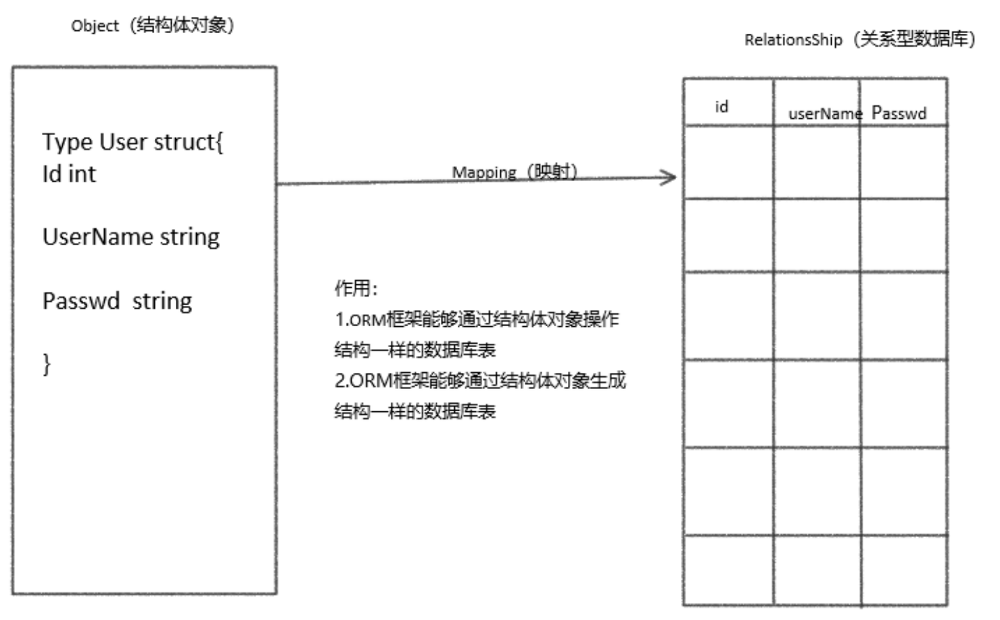

# ORM介绍

`beego ORM` 是一个强大的 `Go` 语言 `ORM` 框架。她的灵感主要来自 `Django ORM` 和 `SQLAlchemy`。

目前该框架仍处于开发阶段，可能发生任何导致不兼容的改动。

**已支持数据库驱动：**

- `MySQL`：[github.com/go-sql-driver/mysql](https://github.com/go-sql-driver/mysql)
- `PostgreSQL`：[github.com/lib/pq](https://github.com/lib/pq)
- `Sqlite3`：[github.com/mattn/go-sqlite3](https://github.com/mattn/go-sqlite3)

以上数据库驱动均通过基本测试，但我们仍需要您的反馈。

**`ORM` 特性：**

- 支持 Go 的所有类型存储
- 轻松上手，采用简单的 CRUD 风格
- 自动 Join 关联表
- 跨数据库兼容查询
- 允许直接使用 `SQL` 查询／映射
- 严格完整的测试保证 `ORM `的稳定与健壮

更多特性请在文档中自行品读。


`Beego`中内嵌了`ORM`框架，用来操作数据库。那么`ORM`框架是什么呢？`ORM`框架是`Object-RelationShip Mapping`的缩写，中文叫**关系对象映射**，他们之间的关系，我们用图来表示：



**作用**

1. 通过对象操作数据表
2. 通过对象生成与对象相同属性的数据表


## 简单使用

```go
package main

import (
    "fmt"
    "github.com/beego/beego/v2/client/orm"
    _ "github.com/go-sql-driver/mysql" // import your used driver
)

// Model Struct
type User struct {
    Id   int
    Name string
}

func init() {
    // set default database
    orm.RegisterDataBase("default", "mysql", "username:password@tcp(127.0.0.1:3306)/db_name?charset=utf8&loc=Local")  // 连接数据库，给定一个别名

    // register model
    orm.RegisterModel(new(User))  // 注册表到orm

    // create table
    orm.RunSyncdb("default", false, true)  // 创建表
}

func main() {
    o := orm.NewOrm()  // 获取orm对象

    user := User{Name: "slene"}  // 获取数据对象

    // insert
    id, err := o.Insert(&user)  // 插入数据
    fmt.Printf("ID: %d, ERR: %v\n", id, err)

    // update
    user.Name = "astaxie"  // 修改对象
    num, err := o.Update(&user)  // 修改表
    fmt.Printf("NUM: %d, ERR: %v\n", num, err)

    // read one
    u := User{Id: user.Id}  // 生成一个对象包含对象的id
    err = o.Read(&u)  // 查询出一个对象
    fmt.Printf("ERR: %v\n", err)

    // delete
    num, err = o.Delete(&u)  // 删除数据库中数据
    fmt.Printf("NUM: %d, ERR: %v\n", num, err)
}
```

* `orm.RegisterDataBase("default", "mysql", "username:password@tcp(127.0.0.1:3306)/db_name?charset=utf8&loc=Local") ` 连接数据库

  * 第一个参数`"default"`: 连接数据库的别名，默认必须要有一个`default`数据库
  * 第二个参数`"mysql"`: 要使用的驱动名
  * 第三个参数，就是`dsn`数据资源地址

* ` orm.RegisterModel(new(User))`: 注册表给数据库。传递的参数是结构体的指针

* `orm.RunSyncdb("default", false, true)` 创建表

  * 第一个参数`"default"`: 之前指定的数据库别名
  * 第二个参数`false`: 指定是否强制创建表，通常指定为`false`

  * 第三个参数`true`:  指定是否显示创建过程。通常指定为`true`

# orm正常使用

在项目的`models`目录下创建文件`model.go`文件，在该文件中定义结构体，和初始化连接等操作

```go
```


