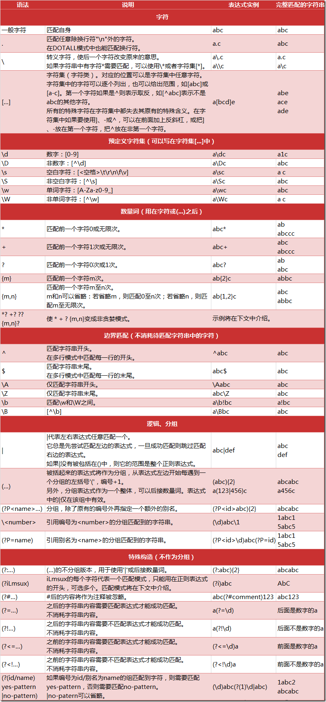
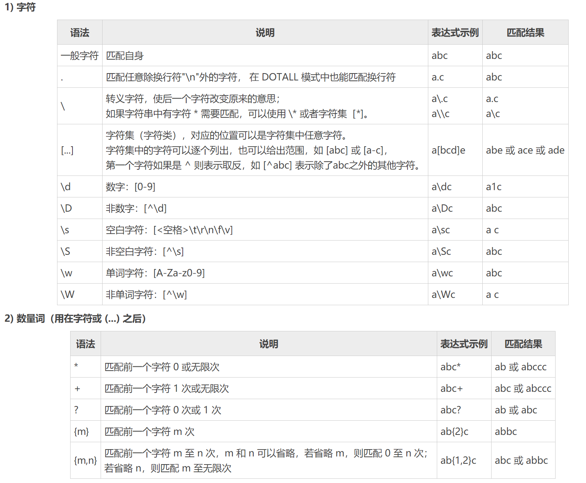
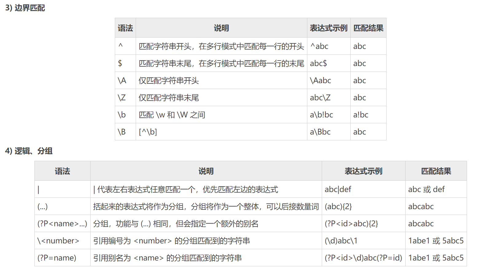
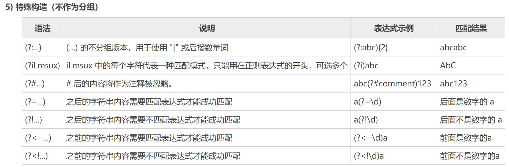

# 一 正则元字符


## 字符与数量词


## 边界匹配与逻辑分组


## 特殊构造


# 二 常见的正则表达式

## 2.1 校验数字的正则表达式
1. 数字：`^[0-9]*$`
2. n位的数字：`^\d{n}$`
3. 至少n位的数字：`^\d{n,}$`
4. `m-n`位的数字：`^\d{m,n}$`
5. 零和非零开头的数字：`^(0|[1-9][0-9]*)$`
6. 非零开头的最多带两位小数的数字：`^([1-9][0-9]*)+(\.[0-9]{1,2})?$`
7. 带1-2位小数的正数或负数：`^(\-)?\d+(\.\d{1,2})$`
8. 正数、负数、和小数：`^(\-|\+)?\d+(\.\d+)?$`
9. 有两位小数的正实数：`^[0-9]+(\.[0-9]{2})?$`
10. 有1~3位小数的正实数：`^[0-9]+(\.[0-9]{1,3})?$`
11. 非零的正整数：`^[1-9]\d*$` 或 `^([1-9][0-9]*){1,3}$` 或 `^\+?[1-9][0-9]*$`
12. 非零的负整数：`^\-[1-9][]0-9"*$ 或 ^-[1-9]\d*$`
13. 非负整数：`^\d+$` 或 `^[1-9]\d*|0$`
14. 非正整数：`^-[1-9]\d*|0$` 或 `^((-\d+)|(0+))$`
15. 非负浮点数：`^\d+(\.\d+)?$` 或 `^[1-9]\d*\.\d*|0\.\d*[1-9]\d*|0?\.0+|0$`
16. 非正浮点数：`^((-\d+(\.\d+)?)|(0+(\.0+)?))$` 或 `^(-([1-9]\d*\.\d*|0\.\d*[1-9]\d*))|0?\.0+|0$`
17. 正浮点数：`^[1-9]\d*\.\d*|0\.\d*[1-9]\d*$` 或 `^(([0-9]+\.[0-9]*[1-9][0-9]*)|([0-9]*[1-9][0-9]*\.[0-9]+)|([0-9]*[1-9][0-9]*))$`
18. 负浮点数：`^-([1-9]\d*\.\d*|0\.\d*[1-9]\d*)$` 或 `^(-(([0-9]+\.[0-9]*[1-9][0-9]*)|([0-9]*[1-9][0-9]*\.[0-9]+)|([0-9]*[1-9][0-9]*)))$`
19. 浮点数：`^(-?\d+)(\.\d+)?$` 或 `^-?([1-9]\d*\.\d*|0\.\d*[1-9]\d*|0?\.0+|0)$`

## 2.2 校验字符的正则表达式
* 汉字：`^[\u4e00-\u9fa5]{0,}$`
* 英文和数字：`^[A-Za-z0-9]+$` 或 `^[A-Za-z0-9]{4,40}$`
* 长度为3-20的所有字符：`^.{3,20}$`
* 由26个英文字母组成的字符串：`^[A-Za-z]+$`
* 由26个大写英文字母组成的字符串：`^[A-Z]+$`
* 由26个小写英文字母组成的字符串：`^[a-z]+$`
* 由数字和26个英文字母组成的字符串：`^[A-Za-z0-9]+$`
* 由数字、26个英文字母或者下划线组成的字符串：`^\w+$` 或 `^\w{3,20}$`
* 中文、英文、数字包括下划线：`^[\u4E00-\u9FA5A-Za-z0-9_]+$`
* 中文、英文、数字但不包括下划线等符号：`^[\u4E00-\u9FA5A-Za-z0-9]+$` 或 `^[\u4E00-\u9FA5A-Za-z0-9]{2,20}$`
* 可以输入含有`^%&',;=?$\"`等字符：`[^%&',;=?$\x22]+`
* 禁止输入含有`~`的字符：`[^~\x22]+`

## 2.3 特殊需求正则表达式
* Email地址：`^\w+([-+.]\w+)*@\w+([-.]\w+)*\.\w+([-.]\w+)*$`
* 域名：`[a-zA-Z0-9][-a-zA-Z0-9]{0,62}(\.[a-zA-Z0-9][-a-zA-Z0-9]{0,62})+\.?`
* InternetURL：`[a-zA-z]+://[^\s]*` 或 `^http://([\w-]+\.)+[\w-]+(/[\w-./?%&=]*)?$`
* 手机号码：^(13[0-9]|14[5|7]|15[0|1|2|3|4|5|6|7|8|9]|18[0|1|2|3|5|6|7|8|9])\d{8}$
* 电话号码("XXX-XXXXXXX"、"XXXX-XXXXXXXX"、"XXX-XXXXXXX"、"XXX-XXXXXXXX"、"XXXXXXX"和"XXXXXXXX)：`^(\(\d{3,4}-)|\d{3.4}-)?\d{7,8}$`
* 国内电话号码(0511-4405222、021-87888822)：`\d{3}-\d{8}|\d{4}-\d{7}`
* 电话号码正则表达式（支持手机号码，3-4位区号，7-8位直播号码，1－4位分机号）: `((\d{11})|^((\d{7,8})|(\d{4}|\d{3})-(\d{7,8})|(\d{4}|\d{3})-(\d{7,8})-(\d{4}|\d{3}|\d{2}|\d{1})|(\d{7,8})-(\d{4}|\d{3}|\d{2}|\d{1}))$)`
* 身份证号(15位、18位数字)，最后一位是校验位，可能为数字或字符X：`(^\d{15}$)|(^\d{18}$)|(^\d{17}(\d|X|x)$)`
* 帐号是否合法(字母开头，允许5-16字节，允许字母数字下划线)：`^[a-zA-Z][a-zA-Z0-9_]{4,15}$`
* 密码(以字母开头，长度在6~18之间，只能包含字母、数字和下划线)：`^[a-zA-Z]\w{5,17}$`
* 强密码(必须包含大小写字母和数字的组合，不能使用特殊字符，长度在 8-10 之间)：`^(?=.*\d)(?=.*[a-z])(?=.*[A-Z])[a-zA-Z0-9]{8,10}$`
* 强密码(必须包含大小写字母和数字的组合，可以使用特殊字符，长度在8-10之间)：`^(?=.*\d)(?=.*[a-z])(?=.*[A-Z]).{8,10}$`
* 日期格式：`^\d{4}-\d{1,2}-\d{1,2}`
* 一年的12个月(01～09和1～12)：`^(0?[1-9]|1[0-2])$`
* 一个月的31天(01～09和1～31)：`^((0?[1-9])|((1|2)[0-9])|30|31)$`


# 三 Go语言使用正则
go语言中提供支持正则使用的包是`regexp`包，是一个标准包。

## 3.1 匹配
1. 转义: `func QuoteMeta(s string) string`
    * 返回将所有正则元字符转义后的字符串

2. Match匹配: `func Match(pattern string, b []byte) (matched bool, err error)`
    * 查`b`中是否存在匹配`pattern`的子序列

3. MatchString匹配: `func MatchString(pattern string, s string) (matched bool, err error)`
    * 查`s`中是否存在匹配`pattern`的子串
    
4.  MatchReader匹配: `func MatchReader(pattern string, r io.RuneReader) (matched bool, err error)`
    * `MatchReade`r类似`Match`，但匹配对象是`io.RuneReader`

## 3.2 Regexp对象
```
type Regexp struct {
    // 内含隐藏或非导出字段
}
```
`Regexp`代表一个编译好的正则表达式。`Regexp`可以被多线程安全地同时使用

### 3.2.1 预编译Regexp对象

#### Compile
`Compile`方法，返回结果包含`err`字段，采用**最左最短方式**搜索，函数签名如下：
```
func Compile(expr string) (*Regexp, error)
```

#### MustCompile
`MustCompile`同`Compile`一样，只是返回结果没有`err`字段，
出错时直接抛异常，函数签名如下：
```
func MustCompile(str string) *Regexp
```

#### CompilePOSIX
`CompilePOSIX`同`Compile`类似，预编译正则表达式，采用`posix`语法,
**最左最长方式**搜索，不支持`\w,\W`等perl写法，函数签名如下：
```
func CompilePOSIX(expr string) (*Regexp, error)
```

#### MustCompilePOSIX
`MustCompilePOSIX`同`CompilePOSIX`类似，只是返回结果没有`err`字段，
出错时直接抛异常，函数签名如下：
```
func MustCompilePOSIX(str string) *Regexp
```

### 3.2.2 匹配
绑定在`Regexp`对象的匹配方法
#### Match
```
func (reNick *Regexp) Match(b []byte) bool
```
`Match`检查`b`中是否存在匹配`pattern`的子序列。
#### MatchString
```
func (reNick *Regexp) MatchString(s string) bool
```
`MatchString`类似`Match`，但匹配对象是字符串。
#### MatchReader
```
func (reNick *Regexp) MatchReader(r io.RuneReader) bool
```
`MatchReader`类似`Match`，但匹配对象是`io.RuneReader`。

### 3.2.3 查找
查找主要方法有`FindString`、`FindAllString`、`FindStringIndex`

#### FindString
```
func (reNick *Regexp) FindString(s string) string
```
`FindString`返回保管正则表达式`reNick`在`s`中的最左侧的一个匹配结果的字符串。
如果没有匹配到，会返回`""`；但如果正则表达式成功匹配了一个空字符串，也会返回`""`。

#### FindAllString
```
func (reNick *Regexp) FindAllString(s string, n int) []string
```
`FindAllString`返回保管正则表达式`reNick`在`s`中的所有不重叠的匹配结果的`[]string`切片。
如果没有匹配到，会返回`nil`。
* `n`表示匹配次数，`-1`表示匹配所有

#### FindStringIndex
```
func (reNick *Regexp) FindStringIndex(s string) (loc []int)
```
`FindStringIndex`返回保管正则表达式`reNick`在`s`中的最左侧的一个匹配结果的**起止位置**的切片
（显然len(loc)==2）。匹配结果可以通过**起止位置**对`s`做切片操作得到：
`s[loc[0]:loc[1]]`。如果没有匹配到，会返回nil。

#### FindAllStringSubmatch
```
func (reNick *Regexp) FindAllStringSubmatch(s string, n int) [][]string
```
* 参数
    * s: 带解析的字符串
    * n: 匹配次数，-1表示全部匹配
* 返回值类型`[][]string`，示例
  
    ```
    [ 	
    [string1 string2]
    [string1 string2]
    [string1 string2]
    ]
    ```
  * 其中：`string1`: 表示带有匹配参考项的全部字串。`string2`: 表示去除匹配参考项后的字串。
    

### 3.2.4 替换
替换主要方法有`ReplaceAllString`、`ReplaceAllStringFunc`，
其中`ReplaceAllStringFunc`表示使用自定义方法定义替换规则

#### ReplaceAllString
```
func (reNick *Regexp) ReplaceAllString(src, repl string) string
```
`ReplaceAllString`返回`src`的一个拷贝，**将`src`中所有`reNick`的匹配结果都替换为
`repl`**。在替换时，`repl`中的`'$'`符号会按照`Expand`方法的规则进行解释和替换，
例如`$1`会被替换为第一个分组匹配结果。

#### ReplaceAllStringFunc
```
func (reNick *Regexp) ReplaceAllStringFunc(src string, repl func(string) string) string
```
`ReplaceAllStringFunc`返回`src`的一个拷贝，将`src`中所有`reNick`的匹配结果
（设为`matched`）都替换为`repl`(`matched`)。`repl`返回的字符串被直接使用，
不会使用`Expand`进行扩展。

