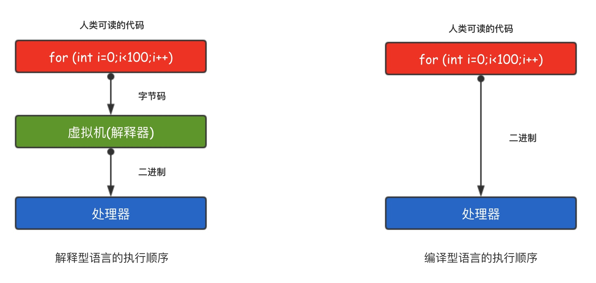
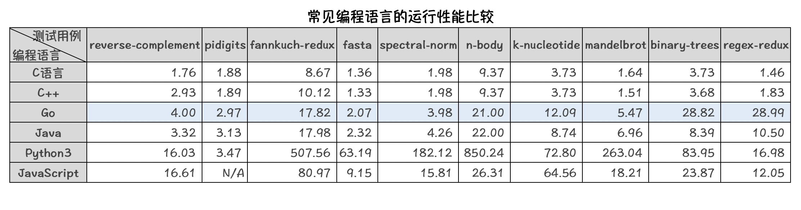

# 一 Go语言为并发而生

硬件制造商正在为处理器添加越来越多的内核以提高性能。所有数据中心都在这些处理器上运行,
更重要的是，今天的应用程序使用多个微服务来维护数据库连接，消息队列和维护缓存。
因此，开发的软件和编程语言应该可以轻松地支持并发性，并且应该能够随着CPU核心数量的增加而可扩展。

但是，大多数现代编程语言（如`Java，Python`等）都来自`90`年代的单线程环境。
虽然一些编程语言的框架在不断地提高多核资源使用效率，例如 `Java` 的 `Netty` 等，
但仍然需要开发人员花费大量的时间和精力搞懂这些框架的运行原理后才能熟练掌握。

`Go`于`2009`年发布，当时多核处理器已经上市。`Go`语言在多核并发上拥有原生的设计优势，
`Go`语言从底层原生支持并发，无须第三方库、开发者的编程技巧和开发经验。

很多公司，特别是中国的互联网公司，即将或者已经完成了使用 `Go` 语言改造旧系统的过程。
经过 `Go` 语言重构的系统能使用更少的硬件资源获得更高的并发和`I/O`吞吐表现。
充分挖掘硬件设备的潜力也满足当前精细化运营的市场大环境。

`Go`语言的并发是基于 `goroutine` 的，`goroutine` 类似于线程，但并非线程。
可以将 `goroutine` 理解为一种虚拟线程。`Go` 语言运行时会参与调度 `goroutine`，
并将 `goroutine` 合理地分配到每个 `CPU` 中，最大限度地使用`CPU`性能。
开启一个`goroutine`的消耗非常小（大约`2KB`的内存），你可以轻松创建数百万个
`goroutine`。

**goroutine的特点**：
* goroutine具有可增长的分段堆栈。这意味着它们只在需要时才会使用更多内存。
* goroutine的启动时间比线程快。
* goroutine原生支持利用channel安全地进行通信。
* goroutine共享数据结构时无需使用互斥锁。

# 二 Go性能强悍

与其他现代高级语言（如`Java/Python`）相比，使用`C，C++`的最大好处是它们的性能。
因为`C/C++`是编译型语言而不是解释的语言。 处理器只能理解二进制文件，`Java`和`Python`
这种高级语言在运行的时候需要先将人类可读的代码翻译成字节码，然后由专门的解释器再转变成处理器
可以理解的二进制文件。

同`C,C++`一样，`Go`语言也是编译型的语言，它直接将人类可读的代码编译成了处理器可以
直接运行的二进制文件，执行效率更高，性能更好。

可以看出，`Go` 语言在性能上更接近于 `Java` 语言，虽然在某些测试用例上不如经过多年优化的 Java 语言，
但毕竟 `Java` 语言已经经历了多年的积累和优化。`Go` 语言在未来的版本中会通过不断的版本优化提高单核运行性能。

# 三 Go语言简单易学

> **语法简洁**
>
> `Go` 语言简单易学，学习曲线平缓，不需要像 `C/C++` 语言动辄需要两到三年的学习期。
> `Go` 语言被称为“互联网时代的C语言”。`Go` 语言的风格类似于`C`语言。其语法在`C`
> 语言的基础上进行了大幅的简化，去掉了不需要的表达式括号，循环也只有 `for` 一种表示方法，
> 就可以实现数值、键值等各种遍历。

> **代码风格统一**
>
> `Go` 语言提供了一套格式化工具——`go fmt`。一些 `Go` 语言的开发环境或者编辑器在保存时，
> 都会使用格式化工具进行修改代码的格式化，这样就保证了不同开发者提交的代码都是统一的格式。(吐槽下：再也不用担心那些看不懂的黑魔法了…)

> **开发效率高**
>
> Go语言实现了开发效率与执行效率的完美结合，
> 让你像写`python`代码（效率）一样编写`C`代码（性能）

