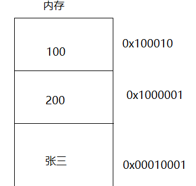

# 一 简介
“Go是一种开源的程序设计语言，它意在使得人们能够方便地构建简单、可靠、
高效率的软件”（来自go官网golang.org）

**go语言特点:**
1. 运行效率高，且简单易学
2. 跨平台
3. 丰富的标准库
4. 可以直接使用c代码
5. 语言层面支持并发

# 二 go程序初识
```go
package main // 导入主函数包
import "fmt"

// 主函数，go程序运行的入口，有且只有一个主函数
func main() {
	fmt.Println("你好")
}
```
* `package package_name`: 该行代码是与目录结构相关
* `import "fmt"`: 导入系统的包
* `func main(){}`: 定义一个主函数，go程序的入口，一个工程只能有一个主函数 
* `fmt.Println("你好")`: 向控制台输出一个字符串

**注释规则**: 注释作用是帮助代码的阅读，提高代码可读写。不会参与程序的执行
* 单行注释 `// comments`
* 多行注释 `/*comments*/`

# 三 变量

* 变量是什么？
    * 变量简单理解就是**程序运行过程中使用的可以发生变化数据**。
    * 数据是存放在内存之中的，变量可以理解为内存空间中保存的数据
* 变量名是什么?
    * 数据是存放在计算机内存中的，存放数据的位置对应这一个内存地址。
      所以**变量名就可以称为内存地址的别名**。
* 内存是什么?
    * 内存是一个物理硬件设备，用于保存计算机运行时需要的数据。数据保存在存储单元里面
      通常一个二进制位表示一个存储单元，只能存放`0`或`1`。
    * 内存的物理地址: 为了能够方便的访问内存，将内存的存储单元按`cpu`的位数(`64`位)进行编号
      这些编号就是内存的物理地址。
    * 内存的虚拟地址: 操作系统对内存进行管理，将内存的存储单元的物理地址映射到了一个虚拟
      地址之上，更加方便我们进行内存的操作。
    * 内存地址: 是一个由**无符号十六进制整型数据表示**。 
    

**计算机中数据的表示参见**[软考程序员-数据的表示与运算](https://gitee.com/duyupeng36/software-programmer/blob/master/%E6%95%B0%E6%8D%AE%E8%A1%A8%E7%A4%BA%E5%8F%8A%E8%BF%90%E7%AE%97.md)



## 3.1 go语言变量的声明与定义
变量的声明与定义的区别在于是否给定了初始值。

**go语言中，变量必须使用才有意义，否则编译不通过**
### 3.1.1 声明
`var 变量名 数据类型`: 是go语言变量声明的语法。
* `var`: 用于声明和定义变量的关键字
* **没有给定初始值默认为`0`**

### 3.1.2 定义
`var 变量名 数据类型 = 初始值`: go语言变量定义的标准语法
* `=`: 赋值号，表示将`=`右边的值给左边的变量

## 3.2 基本数据类型
数据类型就是用于限制变量使用存储空间的大小。基本数据类型有如下几类

|数据类型|名称|长度|零值|说明|
|:---:|:---:|:---:|:---:|:---:|
|`bool`|布尔类型|`1`字节|`false`|只有`true`和`false`两个取值, 不可以使用其他值代替|
|`byte`|字节类型|`1`字节|`0`|`uint8`别名|
|`rune`|字符类型|`4`字节|`0`|存储`Unicode`编码, 相当于`uint32`|
|||
|`int`|有符号整型|`4`字节|`0`|占用`32`位|
|`int8`|有符号整型|`1`字节|`0`|占用`8`位, 范围: `[-128, 127]`|
|`int16`|有符号整型|`2`字节|`0`|占用`16`位, 范围: `[-32768, 32767]`|
|`int32`|有符号整型|`4`字节|`0`|占用`32`位, 范围: `[-2147483648, 2147483647]`|
|`int64`|有符号整型|`8`字节|`0`|占用`64`位, 范围: `[-9223372036854775808, 9223372036854775807]`|
|||
|`uint`|无符号整型|`8`字节|`0`|占用`64`位|
|`uint8`|无符号整型|`1`字节|`0`|占用`8`位, 范围: `[0, 255]`|
|`uint16`|无符号整型|`2`字节|`0`|占用`16`位, 范围: `[0, 65535]`
|`uint32`|无符号整数|`4`字节|`0`|占用`32`位, 范围: `[0, 4294967295]`|
|`uint64`|无符号整数|`8`字节|`0`|占用`64`位, 范围: `[0, 18446744073709551615]`|
|||
|`float32`|浮点数|`4`字节|`0.0`|占用`32`位|
|`float64`|浮点数|`8`字节|`0.0`|占用`64`位|
|||
|`complex64`|复数|`8`字节||`32`位存实部，`32`位存虚部|
|`complex128`|复数|`16`字节||`64`位存实部，`64`位存虚部|
|||
|`uintptr`|指针类型|`4`字节或`8`字节||满足指针存储的`uint32`或`uint64`|
|||
|`string`|字符串| |`""`|`utf-8`编码字符|

## 3.3 案例, 变量的定义与使用

```go
package main // 导入主函数包
import "fmt"

// 主函数，go程序运行的入口，有且只有一个主函数
func main() {
	//fmt.Println("你好")
	var age int  // 声明一个int类型变量
	age = 10 // 给变量赋值

	var name string= "杜宇鹏"
	fmt.Printf("%s: %d", name, age) // 使用变量，输出变量
}
```
**案例，计算长方形的周长和面积**
```go
package main // 导入主函数包
import "fmt"

// 主函数，go程序运行的入口，有且只有一个主函数
func main() {
	var width float32 = 2.8
	var height float32 = 3.4
	var area float32
	var c float32
	area = width * height
	c = (width + height) * 2
	fmt.Printf("%.2f * %.2f = %.2f\n", width, height, area)
	fmt.Printf("(%.2f + %.2f)*2 = %.2f\n", width, height, c)
}
```

## 3.4 其他的变量定义方式
### 3.4.1 自动推到类型
`变量名 := 值`, 该方式定义变量，会根据值的类型，设定变量名的类型。
当变量类型确定后，不能在保存其他类型的值。重新给变量赋值时，需要使用
之前确定的类型数据进行赋值操作。

```go
package main // 导入主函数包
import "fmt"

// 主函数，go程序运行的入口，有且只有一个主函数
func main() {
	pi := 3.1415926
	r := 3.0
	area := pi * r * r

	fmt.Println(area)
}
```
* **go语言中，不同的类型不能进行计算操作**
    * 对于需要不同类型进行计算的情况，需要进行类型转换

### 3.4.2 多变量定义或赋值 
`变量名1, 变量名2, 变量名3, ..., 变量名n = 值1, 值2, 值3, ..., 值n`: 
前面的`n`个变量 都是已经声明的变量

`变量名1, 变量名2, 变量名3, ..., 变量名n := 值1, 值2, 值3, ..., 值n`
前面的`n`个变量 都是不能存在已经声明的变量, 自动根据值推到类型。

**案例，交换变量的值**
```go
package main // 导入主函数包
import "fmt"

// 主函数，go程序运行的入口，有且只有一个主函数
func main() {
	a, b := 10, 20  // 定义两个变量，a, b
	fmt.Println(a, b)  
	temp := a // 申请第三块内存，保存变量a的值
	a = b  // 将b的值赋值给a
	b = temp // 将备份的a赋值给b
	fmt.Println(a, b)
	a,b = b, a  // 直接交换a,b
	fmt.Println(a, b)
	
	a = a + b
	b = a - b  // a=a+b(原来的), a-b=a; 这就可以将a赋值给b
	a = a - b  // a=a+b(原来的), a - b(新的b)=b(原来的b)；这样就可以将b赋值给a
	fmt.Println(a, b)
}
```
### 3.4.3 匿名变量
`_`(下划线)匿名变量，接收变量值后丢弃，不存放在内存

## 3.5 输入与输出
go语言提供了一个标准的输入输出库(`fmt`)，标准输入输出是指在控制台上的输入与输出

### 3.5.1 输出接口

* `fmt.Println(a ...interface{})`: 可以输出多个值，且可以为不同类型的值
  * 每个被输出的值使用`" "`(空格)隔开，输出完成后，**自动追加换行符`\n`**

* `fmt.Print(a ...interface{})`: 可以输出多个值，且可以为不同类型的值
    * 每个被输出的值使用`" "`(空格)隔开，输出完成后，**不追加换行**

* `fmt.Printf(format string, ....interface{})`: 将值安装指定`format`输出
    * 按指定格式`format`输出值，输出结束后，**不追加换行**
    
```go
package main // 导入主函数包
import "fmt"

// 主函数，go程序运行的入口，有且只有一个主函数
func main() {
	a,b,c := 10, 3.1, "dyp"

	fmt.Println(a, b, c)

	fmt.Print(a, b, c)

	fmt.Printf("\n%d,%f,%s\n", a, b, c)

}
```

格式化输出的总结:
`%[flags][width].[precision]typecode`

> 参数解释:
>
> `flags`  ---> 取值为 `+`,` -`,` ' '` ,`0 `;   + 作用为显示插入数字的正负号，- 左对齐，''和0为填充符
>
> `width` ---> 字符宽度
>
> `precision` ---> 保留小数点后的位数   注释：插入数据时浮点数时才生效
>
> `typecode` ---> 转换符(占位符)
>
> 以上四个参数，只有转换符是必须要的，其他均可以不使用。

**常用格式转换符**
<table>
<thead>
    <tr>
        <th>占位符</th>
        <th>说明</th>
    </tr>
</thead>
<tbody align="center">
    <tr>
        <td colspan="2">整型数据输出</td>
    </tr>
    <tr>
        <td>%b</td>
        <td>二进制方式输出</td>
    </tr>
    <tr>
        <td>%d</td>
        <td>十进制方式输出</td>
    </tr>
    <tr>
        <td>%o</td>
        <td>八进制方式输出</td>
    </tr>
    <tr>
        <td>%x</td>
        <td>十六进制方式输出，a~f表示</td>
    </tr>
    <tr>
        <td>%X</td>
        <td>十六进制方式输出，A~F表示</td>
    </tr>
    <tr>
        <td colspan="2">字符和字符串</td>
    </tr>
    <tr>
        <td>%c</td>
        <td>输出Unicode编码的字符</td>
    </tr>
    <tr>
        <td>%s</td>
        <td>输出字符串</td>
    </tr>
    <tr>
        <td colspan="2">浮点数输出</td>
    </tr>
    <tr>
        <td>%f</td>
        <td>有小数点而无指数</td>
    </tr>
    <tr>
        <td>%e, %E</td>
        <td>以指数形式表示浮点数</td>
    </tr>
    <tr>
        <td>%g, %G</td>
        <td>根据情况选择 %e, %E 或 %f 以产生更紧凑的（无末尾的0）输出</td>
    </tr>
</tbody>
</table>


### 3.5.2 输入接口

* `fmt.Scan(&变量 ...interface{})`: 从标准输入读取值，保存在变量对应地址中
    * `&`: 运算符，表示取地址。
    * 对于整型变量，从开始读取到非整数部分结束。
    * **空格或回车**表示的是结束符
* `fmt.Scanf(format string, a ...interface{})`: 从标准输入读取值，保存在变量对应地址中
    * 按照`format`指定的占位读入数据
    * 输入分隔符为**空格**
    * **使用的占位符和上边一致**

```go
package main // 导入主函数包
import "fmt"

// 主函数，go程序运行的入口，有且只有一个主函数
func main() {
	var age int
	var  name string

	fmt.Println("输入数据: age name")
	fmt.Scan(&age, &name)
	fmt.Printf("%s:%d\n", name, age)

	fmt.Println("输入数据: age name")
	fmt.Scanf("%d %s", &age, &name)
	fmt.Println(name, age)
}
```

## 3.6 变量的命名规则
* **不能以数字开头**
* 由**字母数字下划线**组成
* 区分大小写(**大小写敏感**)
* 不能是go中由特殊含义的**关键字或保留字**
* 最好做到**见名知意**

## 3.7 命名规范
* 小驼峰
* 大驼峰
* 下划线分割

# 四 基本数据类型

## 4.1 bool(`%t`)
布尔类型的数据只包含两个值 `true`和`false`。不能直接与其他数字类型
数据进行运算。

**该类型初始值为`false`**，**只声明变量，则变量默认赋予该类型的零值**

```go
package main // 导入主函数包
import "fmt"

// 主函数，go程序运行的入口，有且只有一个主函数
func main() {
	var a bool
	fmt.Println(a)
	a = true
	fmt.Println(a)

	fmt.Printf("%t", a)
}
```

## 4.2 浮点类型(`%f`)

浮点类型分为`float32`和`float64`。二则区别在于`float32`有7位小数，
而`float64`有15位小数


```go
package main // 导入主函数包
import "fmt"

// 主函数，go程序运行的入口，有且只有一个主函数
func main() {
	var a float32
	var b float64
	fmt.Println(a, b)
	a = 4.131922329783
	b = 4.131922329783
	fmt.Println(a, b)
	fmt.Printf("%f,%f", a, b)
}
```

## 4.3 字符类型(`%c`)

go语言中提供两种字符类型: **`byte`和`rune`**, 二则区别在于`byte`只能保存ASCII对于的字符。
而`rune`可以保存Unicode编码对应的字符。

**字符类型由单引号括起来的字符。`'字符'`**
```go
package main // 导入主函数包
import "fmt"

// 主函数，go程序运行的入口，有且只有一个主函数
func main() {
	var c byte
	fmt.Printf("%T\n", c)  // 查看数据类型 uint8
	fmt.Println(c)  // 默认值为0 `'\0'`
	c = 'a'
	fmt.Printf("%c\n", c)  // a
	fmt.Printf("%d\n", c)  // 97

	var r rune
	fmt.Printf("%T\n", r) // 查看数据类型 int32
	fmt.Println(r) // 默认值为0 `'\0'`
	r = '你'
	fmt.Printf("%c\n", r)  // 你
	fmt.Printf("%d\n", r)  // 20320 Unicode编码
}
```
[ASCII码对照表](.img/ASCII码对照表.doc)

## 4.4 字符串(`%s`)
go语言提供字符串类型: `string`，默认值是`"\0"` 对应与ASCII码值为0.
表示一个字符串的结束。

```go
package main // 导入主函数包
import "fmt"

// 主函数，go程序运行的入口，有且只有一个主函数
func main() {
	var s1 string
	var s2 string
	fmt.Println(s1)  // 字符串默认值'\0'
	fmt.Println(s2)  // 字符串默认值'\0'

	s1 = "你好，"
	s2 = "世界！"
	fmt.Println(s1, s2)

	fmt.Println(s1 + s2)  // 字符串拼接
}
```

