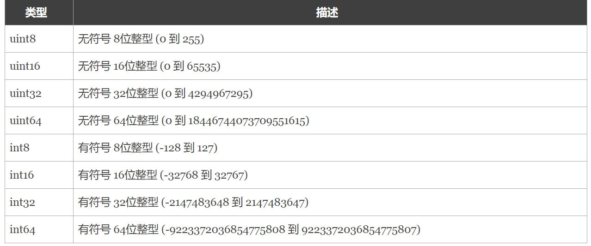
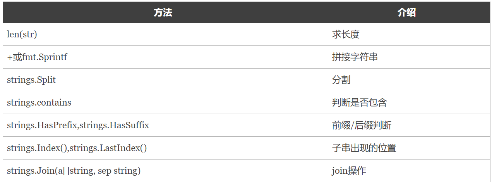

# 基本数据类型
`Go`语言中有丰富的数据类型，除了基本的**整型、浮点型、布尔型、字符串**外，
还有 **数组、切片、结构体、函数、map、通道（channel）** 等。
`Go`语言的基本类型和其他语言大同小异

# 一 整型
整型分为以下两个大类： 按长度分为：`int8`、`int16`、`int32`、`int64` 
对应的无符号整型：`uint8`、`uint16`、`uint32`、`uint64`

其中，`uint8`就是我们熟知的`byte`型，`int16`对应`C`语言中的`short`型，
`int64`对应`C`语言中的`long`型。



### 特殊整型


> **注意**: 在使用`int`和`uint`类型时，不能假定它是`32`位或`64`位的整型，
> 而是考虑`int`和`uint`可能在不同平台上的差异。

> **注意事项**: 获取对象的长度的内建`len()`函数返回的长度(**字节长度**)可以根据不同平台的**字节长度**进行变化。
> 实际使用中，`切片`或 `map` 的元素数量等都可以用`int`来表示。
> 在涉及到**二进制传输**、**读写文件**的结构描述时，
> 为了保持文件的结构不会受到不同编译目标平台字节长度的影响，不要使用`int`和`uint`

### 数字字面量语法（Number literals syntax）

`Go1.13`版本之后引入了数字字面量语法，这样便于开发者以**二进制、八进制或十六进制**的格式定义数字，
例如：
* `v := 0b00101101`， 代表二进制的 `101101`，相当于十进制的 `45`。 
* `v := 0o377`，代表八进制的 `377`，相当于十进制的 `255`。 
* `v := 0x1p-2`，代表十六进制的 `1 除以 2²`，也就是 `0.25`。

而且还允许我们用 `_` 来分隔数字，比如说： `v := 123_456` 表示 `v` 的值等于 `123456`。

我们可以借助fmt函数来将一个整数以不同进制形式展示。
```go
package main

import "fmt"

func main(){
	// 二进制
	var a int = 0b10110
	fmt.Printf("十进制:%d -- 二进制: %b\n", a, a)

	// 八进制  以0开头
	var b int = 077
	fmt.Printf("十进制:%d -- 八进制: %o\n", b, b)  // 77

	// 十六进制  以0x开头
	var recv int = 0xff
	fmt.Printf("十进制:%d -- 十六进制: %x \n", recv, recv)  // ff
	fmt.Printf("十进制:%d -- 十六进制: %X \n", recv, recv)  // FF
}
```

# 二 浮点型
Go语言支持两种浮点型数：`float32`和`float64`

这两种浮点型数据格式遵循`IEEE 754`标准: 
* `float32` 的浮点数的最大范围约为 `3.4e38`，可以使用常量定义：`math.MaxFloat32`。
* `float64` 的浮点数的最大范围约为 `1.8e308`，可以使用一个常量定义：`math.MaxFloat64`。

**go默认是使用float64作为浮点数类型**

```go
package main

import (
	"fmt"
	"math"
)

func main(){
	// 定义一个浮点型数据
	var money float32 = 29382.53
	fmt.Printf("浮点数: %f 数据类型: %T 最大数值为: %e\n", money, money, math.MaxFloat32)  // 浮点数: 29382.529297 数据类型: float32 最大数值为: 3.402823e+38
	var gdp float64 = 29382.53
	fmt.Printf("浮点数: %f 数据类型: %T 最大数值为: %e\n", gdp, gdp, math.MaxFloat64)  // 浮点数: 29382.530000 数据类型: float64 最大数值为: 1.797693e+308
}
```
**float32与float64类型的变量不能相互赋值。是两个不同的数据类型**

# 三 复数
`complex64`和`complex128`

复数有实部和虚部，`complex64`的实部和虚部为`32`位，
`complex128`的实部和虚部为`64`位

```go
package main

import (
	"fmt"
)

func main(){
	// 复数
	var c1 complex64  // 实部和虚部均为32为
	c1 = 1 + 2i
	fmt.Println(c1)  // (1+2i)
	var c2 complex128  // 实部和虚部均为64为
	c2 = 2 + 3i
	fmt.Println(c2)  // (2+3i)
}
```

# 四 布尔类型
Go语言中以`bool`类型进行声明布尔型数据，
布尔型数据只有`true`（真）和`false`（假）两个值

> **注意**
> 1. 布尔类型变量的默认值为`false`。
> 2. `Go` 语言中不允许将整型强制转换为布尔型.
> 3. 布尔型无法参与数值运算，也无法与其他类型进行转换。

```go
package main

import (
	"fmt"
)

func main(){
	// 布尔类型
	b1 := true  // bool
	var b2 bool   // 默认为false
	fmt.Printf("b1数据类型%T\n", b1)
	fmt.Printf("b2的默认值%v", b2)
}
```

# 五 字符串string
Go语言中的字符串以**原生数据类型**出现，使用字符串就像使用其他原生数据类型
（`int`、`bool`、`float32`、`float64` 等）一样
`Go`语言里的字符串的内部实现使用`UTF-8`编码。 字符串的值为双引号(`"`)中的内容，
可以在`Go`语言的源码中直接添加非`ASCII`码字符
```go
package main

import (
	"fmt"
)

func main(){
	// 字符串
	s1 := "hello"
	var s2 string = "你好"
	fmt.Printf("%s\n", s1)
	fmt.Printf("%s\n", s2)
}
```
**常使用的字符串转义符**


输出windows路径
```go
package main
import (
    "fmt"
)
func main() {
    fmt.Println("str := \"recv:\\Code\\lesson1\\go.exe\"")
}
```

**多行字符串**

`Go`语言中要定义一个多行字符串时，就必须使用`反引号`字符
```go
package main

import (
	"fmt"
)

func main(){
	// 多行字符串
	s3 := `静夜思
作者：李白
床前明月光，疑是地上霜。
举头望明月，低头思故乡
`
	fmt.Printf("%s\n", s3)
}
```
反引号间**换行将被作为字符串中的换行**，但是所有的转义字符均无效，文本将会原样输出

**字符串操作**


```go
package main

import (
	"fmt"
	"strings"
)

func main(){
	// 字符串的常用方法
	fmt.Printf("字符串s1的长度: %d\n", len(s1))
	fmt.Printf("字符串拼接: %s\n", s1 + s2)
	fmt.Printf("字符串拼接: %s\n", fmt.Sprintf("%s %s", s1, s2))
	s4 := fmt.Sprintf("%s %s", s1, s2)

	result := strings.Split(s4, " ")  // 返会分隔后的切片
	fmt.Printf("%v\n", result)  // [hello 你好]

	fmt.Printf("字符串是否包含\"hello\": %t\n", strings.Contains(s4, "hello"))  // 判断字符串是否包含"hello"
	fmt.Printf("是否以\"he\"开头: %t\n", strings.HasPrefix(s4, "he"))  // 是否以"he"开头
	fmt.Printf("是否以\"好\"结尾: %t\n", strings.HasSuffix(s4, "hao"))  // 是否以"好"结尾
	fmt.Printf("子串位置: %d\n", strings.Index(s4, "你好"))  // 返回子串第一次出现的索引
	fmt.Printf("子串最后一次出现的位置: %d\n", strings.LastIndex(s4, "l"))  // 返回子串最后一次出现的索引
	fmt.Printf("字符串拼接: %s\n", strings.Join(result, "=="))  // 使用==拼接字符串
}
```
# 六 字符类型byte和rune
Go 语言的字符有以下两种：

* `byte`类型实际就是`uint8`的别名, 用于保存`ASCII`码。
* `rune`类型实际就是`int32`的别名, 用于保存`Unicode`码, 代表一个`UTF-8`字符。
  go语言字符默认的类型为`rune`

`Go`使用了特殊的`rune`类型来处理`Unicode`，让基于`Unicode`的文本处理更为方便，
也可以使用 `byte` 型进行默认字符串处理，性能和扩展性都有照顾

```go
package main

import (
	"fmt"
)

func main(){
	s := "hello沙河"
	fmt.Printf("字符串s的长度%d\n", len(s)) // 11, 但是字符串长是7，返回的是一个字节长度
	for i := 0; i < len(s); i++ { //byte
		fmt.Printf("%v(%recv) ", s[i], s[i])
	}
	
	fmt.Println()
	for _, recv := range s { //rune
		fmt.Printf("%v(%recv) ", recv, recv)
	}
}
```
输出结果为
```
104(h) 101(e) 108(l) 108(l) 111(o) 230(æ) 178(²) 153() 230(æ) 178(²) 179(³)
104(h) 101(e) 108(l) 108(l) 111(o) 27801(沙) 27827(河)
```
因为`UTF8`编码下一个中文汉字由`3~4`个字节组成，
所以我们不能简单的按照字节去遍历一个包含中文的字符串，
否则就会出现上面输出中第一行的结果。

* **len函数返回的长度是字符串占用的总字节数**
    * 字节: `1B=8bit`(八位二进制表示一个字节)

字符串底层是一个`byte`数组，字符串是由`byte`字节组成，
所以字符串的长度是`byte`字节的长度。`rune`类型用来表示`utf8`字符，
一个`rune`字符由一个或多个`byte`组成

# 七 字符串修改
字符串类型是不可以修改的类型。但是，字符串底层是一个`byte`数组，
所以可以和`[]byte`类型相互转换,

要修改字符串，需要先将其转换成`[]rune`或`[]byte`，完成后再转换为`string`。
无论哪种转换，都会**重新分配内存，并复制字节数组**

```go
package main

import (
	"fmt"
)

func main(){
	// 字符串修改
	s5 := "hello沙河"
	s6 := []rune(s5)  // 将s5强制转为rune切片
	s6[5] = '清'
	fmt.Printf("%s\n", string(s6))

	s7 := "hello"
	s8 := []byte(s7)  // 将s7转为byte切片
	s8[0] = 'H'
	fmt.Printf("%s\n", string(s8))
}
```

## 单字符串与字符的区别
* 单字符串末尾以`\0`结尾的
* 字符就是一个字符

# 八 类型转换
Go语言中**只有强制类型转换**，没有隐式类型转换。该语法只能在**两个类型之间支持相互转换**的时候使用。

强制类型转换的基本语法如下
```
数据类型(表达式)
```
* 表达式包括`变量`、`复杂算子`和`函数返回值`等.


