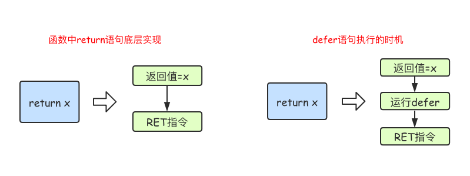

# 异常处理
所谓的异常：当`GO`检测到一个错误时，程序就无法继续执行了，出现了一些错误的提示，
这就是所谓的"异常"。所以为了保证程序的健壮性，要对异常的信息进行处理

## 一 error接口
该接口是go语言提供的错误处理的标准模式，该接口的定义如下
```go
package errors
type error interface {
	Error() string
}

type errorString struct {
	text string
}

func New(text string) error{
	return &errorString{text}
}
func (e *errorString)Error() string {
	return e.text
}
```

### 1.1 error接口使用

```go
package main

import (
	"errors" // 导入errors包
	"fmt"
)

func test(a, b int) (value int, err error) {
	if b == 0 {
		err = errors.New("0不能做除数") // 添加错误信息
		return
	} else {
		value = a / b
		return
	}
}

func main() {
	var err error
	var value int

	value, err = test(7, 0)

	if err != nil {  // err不为空则发生错误
		fmt.Println(err)
	} else {
		fmt.Printf("%v\n", value)
	}
}
```

## 二 panic函数
`error`返回的是一般性的错误，但是`panic`函数返回的是让程序崩溃的错误

* 也就是当遇到 **不可恢复的错误** 状态的时候，如 *数组访问越界、空指针引用* 等，
  这些运行时错误会引起`painc`异常
* 不应通过调用`panic`函数来报告普通的错误，而应该只把它作为报告致命错误的一种方式
* 某些不应该发生的场景发生时，我们就应该调用`panic`

一般而言，当`panic`异常发生时，程序会中断运行。随后，
程序崩溃并输出日志信息。日志信息包括`panic value`和 *函数调用的堆栈跟踪信息* 。

当然，如果直接调用内置的`panic`函数也会引发`panic`异常；
`panic`函数接受任何值作为参数。

**我们在实际的开发过程中并不会直接调用`panic`函数，但是当我们编程的程序遇到致命错误时，
系统会自动调用该函数来终止整个程序的运行，也就是系统内置了`panic`函数**

## 三 defer延迟调用
Go语言中的`defer`语句会将其后面跟随的语句进行延迟处理。
在`defer`**归属的函数即将返回**时，将延迟处理的语句按`defer`定义的**逆序**进行执行，
也就是说，**先被`defer`的语句最后被执行，最后被`defer`的语句最先被执行**
```go
package main

import "fmt"
func main() {
  fmt.Println("start")
  defer fmt.Println(1)
  defer fmt.Println(2)
  defer fmt.Println(3)
  fmt.Println("end")
}
```
输出结果为
```
start
end
3
2
1
```

由于`defer`语句延迟调用的特性，所以defer语句能非常方便的处理资源释放问题。
**比如：资源清理、文件关闭、解锁及记录时间等。**

#### defer执行时机
在`Go`语言的函数中`return`语句在底层并不是原子操作，
它分为给 *返回值赋值* 和 *RET指令* 两步。而`defer`语句执行的时机
就在返回值赋值操作后，`RET`指令执行前。具体如下图所示：


```go
package main

import "fmt"

func f1() int {
	x := 5
	defer func() {
		x++
	}()
	return x
}

func f2() (x int) {
	defer func() {
		x++  // x = 5 + 1
	}()
	return 5  // x = 5  --> x=6
}

func f3() (y int) {
	x := 5
	defer func() {
		x++
	}()
	return x
}
func f4() (x int) {
	defer func(x int) {
		x++  // x = 5+1=6
	}(x) // x = 5
	return 5  // x=5
}
func main() {
	fmt.Println(f1())
	fmt.Println(f2())
	fmt.Println(f3())
	fmt.Println(f4())

	a := 10
	func(a int){
		a++
	}(a)
	fmt.Println(a)
}
```

## 四 recover错误拦截

运行时`panic`异常一旦被引发就会导致程序崩溃。这当然不是我们愿意看到的，
因为谁也不能保证程序不会发生任何运行时错误。

Go语言为我们提供了专用于“拦截”运行时`panic`的内建函数——`recover`。
它可以是当前的程序从运行时`panic`的状态中恢复并重新获得流程控制权

**recover函数声明**
```
func recover() interfacea{}
```
> **注意**：
> * `recover`只有在`defer`调用的函数中有效
> * `defer`一定要在可能引发`panic`的语句之前定义

```go
package main

import "fmt"

func funcA() {
	fmt.Println("func A")
}

func funcB() {
	defer func() {
		err := recover()  // err保存的是错误信息
		//如果程序出出现了panic错误,可以通过recover恢复过来
		if err != nil {
			fmt.Println("recover in B")
		}
	}()
	panic("panic in B")
}

func funcC() {
	fmt.Println("func C")
}
func main() {
	funcA()
	funcB()
	funcC()
}
```


