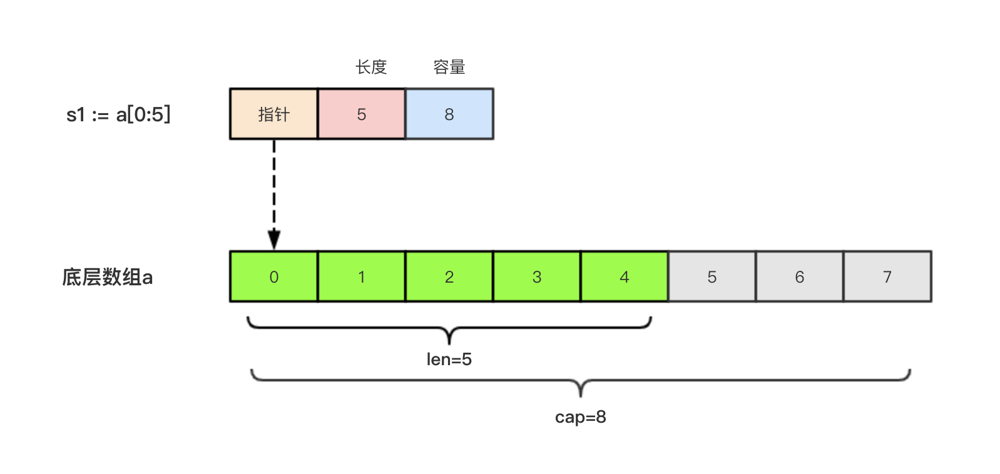

# 一 数组(array)

数组是同一种数据类型元素的集合。在`Go`语言中，数组从声明时就确定，
使用时可以修改数组成员，但是数组大小不可变化

## 1.1 数组的定义
```
var 数组名 [数组长度] 数据类型
```
* 数组长度: **必须是常量**，并且**是数组类型的一部分**。一旦定义，长度不能变
    * `[5]int`与`[10]int`是两个不同的类型

```go
package main

import "fmt"

func main()  {
  var a [3]int
  var b [4]int
  fmt.Printf("a: %T b: %T\n", a, b) // a: [3]int b: [4]int
}
```

## 1.2 数组的初始化
数组的初始化也有很多方式
### 方式一
初始化数组时可以**使用初始化列表来设置数组元素的值**
```
var 数组名 = [数组长度]类型{初始化列表}
```

**示例**
```go
package main

import "fmt"

func main()  {
	var a [3]int  // 默认使用类型的零值初始化
 	var b = [4]int{1,2,3,4}  // 使用1,2,3,4初始化数组
	var cityArray = [3]string{"北京", "上海", "深圳"}
	fmt.Println(a, b, cityArray)  // [0 0 0] [1 2 3 4] [北京 上海 深圳]
	a = [3]int{5, 6, 7}
	fmt.Println(a)  // [5 6 7]
}
```
### 方式二
**根据初始值的个数自行推断数组的长度**
```
var 数组名 = [...]类型{初始化列表}
```
**示例**
```go
package main

import "fmt"

func main()  {
	var a [3]int  // 默认使用类型的零值初始化
 	var b = [...]int{1,2,3,4}  // 使用1,2,3,4初始化数组
	var cityArray = [...]string{"北京", "上海", "深圳"}
	fmt.Println(a, b, cityArray)  // [0 0 0] [1 2 3 4] [北京 上海 深圳]
	a = [...]int{5, 6, 7}
	fmt.Println(a)  // [5 6 7]
}
```
### 方式三
指定索引值的方式来初始化数组
```
var 数组名 = [数组长度]类型{index: value}
```
**示例**
```go
package main

import "fmt"

func main()  {
	var a [3]int  // 默认使用类型的零值初始化
	a = [3]int{0: 5, 2:7} // 指定索引初始化
	fmt.Println(a)  // [5 0 7]
}
```

## 1.3 数组的遍历
### 索引遍历
```go
package main

import "fmt"

func main()  {
	cityArray := [...]string{"北京", "上海", "深圳"}
	for i := 0; i < len(cityArray); i++ {
		city := cityArray[i]
		fmt.Println(city)
	}
}
```

### range遍历
```go
package main

import (
	"fmt"
)

func main()  {
	cityArray := [...]string{"北京", "上海", "深圳"}
	for _, v := range cityArray {
		fmt.Println(v)
	}
	
}
```

## 1.4 多维数组

`Go`语言是支持多维数组的，我们这里以二维数组为例（数组中又嵌套数组）
### 1.4.1 二维数组声明
```
var 数组名 [外层长度][内层长度]数据类型
```
**示例**
```go
package main

import (
	"fmt"
)

func main()  {
	var a [3][2] int  // 定义一个三行两列的二维数组. 一维数组中保持了三个只有2个元素一维数组
	fmt.Println(a)  // [[0 0] [0 0] [0 0]]
}
```

### 1.4.2 二维数组的初始化
#### 方式一
使用初始化列表来设置数组元素的值
```
var 数组名 = [外层长度][内层长度]数据类型{数据列表}
```
示例
```go
package main

import (
	"fmt"
)

func main()  {
	var a [3][2] int  // 定义一个三行两列的二维数组. 一维数组中保持了三个只有2个元素一维数组
	fmt.Println(a)  // [[0 0] [0 0] [0 0]]
	a = [3][2]int{{1,2},{3,4},{5,6}}
	fmt.Println(a)  // [[1 2] [3 4] [5 6]]
}
```
#### 方式二
根据初始值的个数自行推断数组的长度
```
var 数组名 = [...][内层长度]数据类型{数据列表}
```
* 仅支持外层自动推算元素个数

**示例**
```go
package main

import (
	"fmt"
)

func main()  {
	var a [3][2] int  // 定义一个三行两列的二维数组. 一维数组中保持了三个只有2个元素一维数组
	fmt.Println(a)  // [[0 0] [0 0] [0 0]]
	a = [...][2]int{{2,3},{4,5},{6,7}}  // 仅支持外层自动推算元素个数，不支持内层自动推算元素个数
	fmt.Println(a)  // [[2 3] [4 5] [6 7]]
}
```
#### 方式三
指定索引值的方式来初始化数组
```
var 数组名 = [外层长度][内层长度]数据类型{index: {内存数据列表}}
```
**示例**
```go
package main

import (
	"fmt"
)

func main()  {
	var a [3][2] int  // 定义一个三行两列的二维数组. 一维数组中保持了三个只有2个元素一维数组
	fmt.Println(a)  // [[0 0] [0 0] [0 0]]
    a = [3][2]int{0: {1,2}, 2: {5,6}}
    fmt.Println(a)  // [[1 2] [0 0] [5 6]]
}
```

#### 1.4.3 二维数组遍历
```go
package main

import (
	"fmt"
)

func main()  {
	var a [3][2] int  // 定义一个三行两列的二维数组. 一维数组中保持了三个只有2个元素一维数组
	fmt.Println(a)  // [[0 0] [0 0] [0 0]]
	a = [3][2]int{{1,2},{3,4},{5,6}}
	for i:=0; i < 3;i++ {
		for j:=0; j < 2; j++ {
			fmt.Println(a[i][j])
		}
	}
	
	for _, v1 := range a {
		for _, v := range v1{
			fmt.Println(v)
		}
	}
}
```

## 1.5 数组是值类型
数组是值类型，赋值和传参会**复制整个数组**。因此**改变副本的值**，
**不会改变本身的值**

```go
package main

import (
	"fmt"
)

func main()  {
	b := [...]int{1, 2, 3}
	b1 := b
	b1[0]=3

	fmt.Println("b:", b)  // b: [1 2 3]
	fmt.Println("b1:", b1)  // b1: [3 2 3]
}
```

**注意**
1. 数组支持 `==`、`!=` 操作符，因为内存总是被初始化过的。
2. `[n]*T`表示指针数组，`*[n]T`表示数组指针 。

****
**数组练习**
```go
package main

import "fmt"

func main()  {
	a1 := [...]int {1, 3, 5, 7, 8}
	sum := 0
	for _, v := range a1 {
		sum += v
	}
	fmt.Printf("sum = %d\n", sum)

    for i, v1 := range a1 {
        for j:=i+1; j < len(a1); j++{
            if v1 + a1[j] == 8{
              fmt.Printf("(%d, %d)", i, j) // (0, 3)(1, 2)
            }
        }
    }
}
```

# 二 切片(slice)
因为数组的长度是固定的并且数组长度属于类型的一部分，所以数组有很多的局限性
```go
package main
func arraySum(x [3]int) int{
    sum := 0
    for _, v := range x{
        sum = sum + v
    }
    return sum
}
```
* 该函数的参数`x`是`[3]int`类型的变量，对于其他的类型不能传递到函数中

另外
```
a := [3]int{1, 2, 3}
```
* 数组变量`a`已经保存了3个元素，不能在增加元素了

为此，go语言引入了切片来解决这些问题。

切片（Slice）是一个拥有**相同类型元素的可变长度的序列**。
它是**基于数组类型做的一层封装**。它非常灵活，支持**自动扩容**

**切片是一个 *引用类型*，它的内部结构包含`地址`、`长度`和`容量`。
切片一般用于快速地操作一块数据集合**

## 2.1 声明切片
声明切片类型的基本语法如下: 
```
var 切片名 [] 数据类型
```
## 2.2 切片初始化
```
var 切片名 = []数据类型{初始化列表}
```
**示例**
```go
package main

import "fmt"

func main() {
	var slice = []int{1,2,3,4}
	fmt.Println(slice)  // [1 2 3 4]
	var slice2 = []string{"北京", "上海", "沙河"}
	fmt.Println(slice2)  // [北京 上海 沙河]
}
```

## 2.3 引用类型
切片是引用类型，不支持直接比较，只能和`nil`比较

在`golang`中`nil`代表了`pointer`, `channel`, `func`, `interface`, `map` 
或者 `slice` 的零值，类似与`c`语言中的空指针.

```go
package main

import "fmt"

func main() {
	var s1 [] int   // 声明一个切片
	fmt.Println(s1 == nil)  // true
	// 在golang中nil代表了pointer, channel, func, interface, map 或者 slice 的零值，类似与c语言中的空指针.
	var s2 = []int{1,2,3,4}
	fmt.Println(s2 == nil)  //false
}
```

## 2.4 切片长度和容量

切片拥有自己的长度和容量，
* 长度: **切片保存的数据的个数**
* 容量: **底层数组的长度 - 切片第一个元素在底层数组中的位置**

我们可以通过使用内置的`len()`函数求长度，使用内置的`cap()`函数求切片的容量

```go
package main

import "fmt"

func main() {
	var s1 [] int
	fmt.Println(len(s1), cap(s1))  // 0 0
	var s2 = []int{1,2,3,4}
	fmt.Println(len(s2), cap(s2))  // 4 4
}
```

## 2.5 切片表达式
切片表达式从`字符串`、`数组`、`指向数组或切片的指针`构造子字符串或切片。
它有两种变体：一种指定`low`和`high`两个索引界限值的简单的形式，
另一种是除了`low`和`high`索引界限值外还指定**容量**的完整的形式。

### 简单切片表达式
切片的**底层就是一个数组**，所以我们可以基于数组通过切片表达式得到切片

切片表达式中的`low`和`high`表示一个索引范围(左包含，右不包含)，
也就是下面代码中从数组`a`中选出`1<=索引值<4`的元素组成切片`s`，
得到的切片`长度=high-low`，**容量等于得到的切片的底层数组的容量**

**从数组得到切片**
```
数组名[low:high]
```
**示例**
```go
package main

import "fmt"

func main() {
	// 由数组得到切片
	var array = [...]int{1, 2, 3, 4, 5, 6, 7, 8, 9, 10}
	s1 := array[0:8]
	fmt.Printf("s1:%v,type(s1): %T, len(s1): %d, cap(s1): %d", s1, s1, len(s1), cap(s1))// s1:[1 2 3 4 5 6 7 8],type(s1): []int, len(s1): 8, cap(s1): 10
	
}
```

可以**省略**切片表达式中的任何**索引**。省略了`low`则默认为`0`；
省略了`high`则默认为**切片操作数数组的长**

```go
package main

import "fmt"

func main() {
	// 由数组得到切片
	var array = [...]int{1, 2, 3, 4, 5, 6, 7, 8, 9, 10}
	s1 := array[0:8]
	fmt.Printf("s1:%v,type(s1): %T, len(s1): %d, cap(s1): %d\n", s1, s1, len(s1), cap(s1))// s1:[1 2 3 4 5 6 7 8],type(s1): []int, len(s1): 8, cap(s1): 10

	s2 := array[:5]
	s3 := array[5:]
	s4 := array[:]
	fmt.Println(s2)  // [1 2 3 4 5]
	fmt.Println(s3)  // [1 2 3 4 5]
	fmt.Println(s4)  // [1 2 3 4 5 6 7 8 9 10]
}
```

> **注意**
> 1. 对于数组或字符串，如果`0 <= low <= high <= len(a)`，则索引合法，
> 否则就会索引越界

**从切片得到切片**
```
切片名[low:high]
```
对**切片再执行切片表达式**时（切片再切片），`high`的上限边界是切片的容量`cap(a)`，
而不是长度`len(a)`。**常量索引**必须是**非负**的，并且可以用`int`类型的值表示;
对于数组或常量字符串，常量索引也必须在有效范围内。如果`low`和`high`两个指标都是
常数，它们必须满足`low <= high`。如果索引在运行时超出范围，
就会发生运行时`panic`。

**示例**
```go
package main

import "fmt"

func main() {
	var array = [...]int{1, 2, 3, 4, 5, 6, 7, 8, 9, 10}
	slice := array[:5]

	s1 := slice[3: 5]  // s1的容量是底层数组array的长度减去s1的
	fmt.Printf("s1: %v, cap(s1): %d\n", s1, cap(s1))  // s1: [4 5], cap(s1): 7

	slice = array[5:]
	//s2 := slice[:6]  // out of range
	s2 := slice[:5]
	fmt.Printf("s2: %v, cap(s2): %d", s2, cap(s2))  // s2: [6 7 8 9 10], cap(s2): 5
}
```

### 完整切片表达式

对于`数组`，`指向数组的指针`，或`切片`(注意 *不能是字符串*)支持完整切片表达式
```
变量名[low:high:max]
```
上面的代码会构造与简单切片表达式`变量名[low: high]`相同类型、相同长度和元素的切片。 
另外，它会将得到的结果切片的**容量**设置为`max-low`。
在**完整切片表达式中只有第一个索引值（low）可以省略**；它默认为`0`

**示例**
```go
package main

import "fmt"

func main() {
	var array = [...]int{1, 2, 3, 4, 5, 6, 7, 8, 9, 10}
	s1 := array[:5:6]
	fmt.Printf("s1: %v, cap(s1): %d\n", s1, cap(s1)) // s1: [1 2 3 4 5], cap(s1): 6
	s2 := array[4:6:10]
	fmt.Printf("s2: %v, cap(s2): %d", s2, cap(s2))  // s2: [5 6], cap(s2): 6
}
```
**完整切片表达式需要满足的条件是`0 <= low <= high <= max <= cap(a)`，
其他条件和简单切片表达式相同。**

## 2.6 make函数构造切片
如果需要动态的创建一个切片，我们就需要使用内置的make()函数，格式如下
```
make([]T, size, cap)
```
* `T`:切片的元素类型
* `size`:切片中元素的数量
* `cap`:切片的容量, 默认值为`size`

**示例**
```go
package main

import "fmt"

func main() {
	slice := make([]int, 10, 20)
	fmt.Printf("slice: %v, len(slice): %d, cap(slice):%d\n", slice, len(slice), cap(slice))  // slice: [0 0 0 0 0 0 0 0 0 0], len(slice): 10, cap(slice):20
}
```
上面代码中`slice`的内部存储空间已经分配了`20`个，但实际上只用了`10`个。
容量并不会影响当前元素的个数，所以`len(slice)`返回10，
`cap(slice)`则返回该切片的容量20。

## 2.7 切片本质
切片的本质就是**对底层数组的封装**，它包含了三个信息：
`底层数组的指针`、`切片的长度（len）`和`切片的容量（cap）`

例如:`a := [8]int{0, 1, 2, 3, 4, 5, 6, 7}`，切片`s1 := a[:5]`，
相应示意图如下

切片`s2 := a[3:6]`，相应示意图如下


**切片不能直接比较**
> 切片之间是不能比较的，我们不能使用`==`操作符来判断两个切片是否含有全部相等元素。
> 切片唯一合法的比较操作是和`nil`比较。 
> 一个`nil`值的切片并没有底层数组，一个`nil`值的切片的长度和容量都是`0`。
> 但是我们不能说一个长度和容量都是`0`的切片一定是`nil`

* 切片唯一合法比较是与`nil`进行比较。
* `nil`切片的长度和容量都是`0`
* 长度和容量都是`0`的切片不一定是`nil`且片

```go
package main

import "fmt"

func main() {
	var s1 []int         //len(s1)=0;cap(s1)=0;s1==nil
	s2 := []int{}        //len(s2)=0;cap(s2)=0;s2!=nil
	s3 := make([]int, 0) //len(s3)=0;cap(s3)=0;s3!=nil

	fmt.Printf("len(s1): %d, cap(s1): %d, s1 is nil: %t\n", len(s1), cap(s1), s1 == nil)  // len(s1): 0, cap(s1): 0, s1 is nil: true
	fmt.Printf("len(s2): %d, cap(s2): %d, s2 is nil: %t\n", len(s2), cap(s2), s2 == nil)  // len(s2): 0, cap(s2): 0, s2 is nil: false
	fmt.Printf("len(s3): %d, cap(s3): %d, s3 is nil: %t\n", len(s3), cap(s3), s3 == nil)  // len(s3): 0, cap(s3): 0, s3 is nil: false
}
```

**所以要判断一个切片是否是空的，要是用`len(s) == 0`来判断，不应该使用`s == nil`来判断**

## 2.8 再谈引用类型
切片是一个引用类型数据，赋值和参数传递不会完整复制底层数据，会共用同一个底层数组
```go
package main

import "fmt"

func main() {
	s1 := make([]int, 3) //[0 0 0]
	s2 := s1             // 将s1直接赋值给s2，s1和s2共用一个底层数组
	s2[0] = 100
	fmt.Println(s1)  // [100 0 0]
	fmt.Println(s2)  // [100 0 0]
}
```

**切片遍历**
> 切片的遍历方式和数组是一致的，支持索引遍历和for range遍历
```go
package main

import "fmt"

func main() {
	s := []int{1, 3, 5}

	for i := 0; i < len(s); i++ {
		fmt.Println(i, s[i])
	}

	for index, value := range s {
		fmt.Println(index, value)
	}
}
```

## 2.9 append函数
为切片添加元素时，使用内置函数`append`就可完成.

`Go`语言的内建函数`append()`可以为切片动态添加元素。 
可以一次添加一个元素，可以添加多个元素，也可以添加另一个切片中的元素(后面加`...`)
```go
package main

import "fmt"

func main() {
	var s []int
	s = append(s, 1)        // 添加一个元素
	fmt.Printf("s: %v, len(s): %d, cap(s): %d\n", s, len(s), cap(s))
	s = append(s, 2, 3, 4)  // 添加三个元素
	fmt.Printf("s: %v, len(s): %d, cap(s): %d\n", s, len(s), cap(s))
	s2 := []int{5, 6, 7}
	s = append(s, s2...)  // 添加另一个切片的元素
	fmt.Printf("s: %v, len(s): %d, cap(s): %d\n", s, len(s), cap(s))
}
```
* 通过`var`声明的零值切片可以在`append()`函数直接使用，无需初始化
* 每个**切片会指向一个底层数组**，这个数组的容量够用就添加新增元素。
  当底层数组**不能容纳新增的元素**时，切片就会自动按照一定的策略进行“**扩容**”，
  此时该**切片指向的底层数组就会更换**。“扩容”操作往往发生在`append()`函数调用时，
  所以我们通常都需要用**原变量接收`append`函数的返回值**

**切片自动扩容扩容**
```go
package main

import "fmt"

func main() {
	var numSlice []int
	for i := 0; i < 10; i++ {
		numSlice = append(numSlice, i)
		fmt.Printf("%v  len:%d  cap:%d  ptr:%p\n", numSlice, len(numSlice), cap(numSlice), numSlice)
	}
}
```


* `append()`函数将元素追加到切片的最后并返回该切片。
* 切片`numSlice`的容量按照`1，2，4，8，16`这样的规则自动进行扩容，
  每次扩容后都是扩容前的`2`倍。

**扩容策略**


* 首先判断，如果新申请容量(`cap`)大于`2`倍的旧容量(`old.cap`，
  最终容量(`newcap`)就是新申请的容量(`cap`)。
* 否则判断，如果旧切片的长度小于`1024`，则最终容量(`newcap`)就是旧容量
  (`old.cap`)的两倍，即(`newcap=doublecap`)
* 否则判断，如果旧切片长度大于等于`1024`，则最终容量(`newcap`)从旧容量
  (`old.cap`)开始循环增加原来的`1/4`，即(`newcap=old.cap`,`for {newcap += newcap/4}`)
  直到最终容量(`newcap`)大于等于新申请的容量(`cap`)，即(`newcap >= cap`)
* 如果最终容量(`cap`)计算值溢出，则最终容量(`cap`)就是新申请容量(`cap`)

需要注意的是，切片扩容还会**根据切片中元素的类型不同而做不同的处理**，
比如`int`和`string`类型的处理方式就不一样。

## 2.10 copy复制
切片是引用类型，如果将切片赋值给另一个遍历，会共用一个底层数组。
修改一个另一个也会发生变化，业务中可能会涉及需要赋值一个切片出来的情况。
可以使用`copy`函数复制一个全新的不同底层数组的切片。
```go
package main

import "fmt"

func main() {
	a := []int{1, 2, 3, 4, 5}
	b := a
	fmt.Println(a) //[1 2 3 4 5]
	fmt.Println(b) //[1 2 3 4 5]
	b[0] = 1000
	fmt.Println(a) //[1000 2 3 4 5]
	fmt.Println(b) //[1000 2 3 4 5]
}
```
* 将切片`a`赋值给变量`b`，那么`a`和`b`共用一个底层数组。
* 任意修改`a`和`b`中的一个，都会造成另一个切片数据的变化。

`Go`语言内建的`copy()`函数可以迅速地将一个切片的数据
复制到另外一个切片空间中，`copy()`函数的使用格式如下：
```
copy(destSlice, srcSlice []T)
```
* `srcSlice`: 数据来源切片
* `destSlice`: 目标切片

```go
package main

import "fmt"

func main() {
	a := []int{1, 2, 3, 4, 5}
	c := make([]int, 5, 5)
	copy(c, a)     //使用copy()函数将切片a中的元素复制到切片c
	fmt.Println(a) //[1 2 3 4 5]
	fmt.Println(c) //[1 2 3 4 5]
	c[0] = 1000
	fmt.Println(a) //[1 2 3 4 5]
	fmt.Println(c) //[1000 2 3 4 5]

}
```
## 2.11 删除切片中的元素
Go语言中并没有删除切片元素的专用方法，我们可以使用切片本身的特性来删除元素
```
a = append(a[:index], a[index+1:]...)
```
* 删除切片`a`中索引为`index`的元素

```go
package main

import "fmt"

func main() {
	// 从切片中删除元素
	a := []int{30, 31, 32, 33, 34, 35, 36, 37}
	fmt.Println(a)  // [30 31 32 33 34 35 36 37]
	// 要删除索引为2的元素
	a = append(a[:2], a[3:]...)
	fmt.Println(a)  // [30 31 33 34 35 36 37]
}
```

**再谈切片本质**
```go
package main

import "fmt"

func main() {
    a := [...]int{30, 31, 32, 33, 34, 35, 36, 37}
    s := a[:]
    fmt.Printf("%p ", s)  // 0xc0000c4040
    fmt.Println(s, len(s), cap(s))  //  [30 31 32 33 34 35 36 37] 8 8
  
    s = append(s[:2], s[3:]...)
    fmt.Printf("%p ", s)  // 0xc0000c4040
    fmt.Println(s, len(s), cap(s))  // [30 31 33 34 35 36 37] 7 8
    fmt.Println(a)  // [30 31 33 34 35 36 37 37]
}
```
* 切片不保存值，只是在底层数组之上封装了一个`指针、长度、容量`来操作底层数组
* 删除切片中的元素，最终是在移动底层数组的元素。

**练习**
```go
package main

import "fmt"

func main() {
	var a = make([]int, 5, 10)
	for i := 0; i < 10; i++ {
		a = append(a, i)
	}
	fmt.Println(a) // [0 0 0 0 0 0 1 2 3 4 5 6 7 8 9]
}
```

**排序**
```
a := []int{3,1,7,5,0}
sort.Ints(a)
fmt.Println(a) // [0 1 3 5 7]
```


# 三 map


