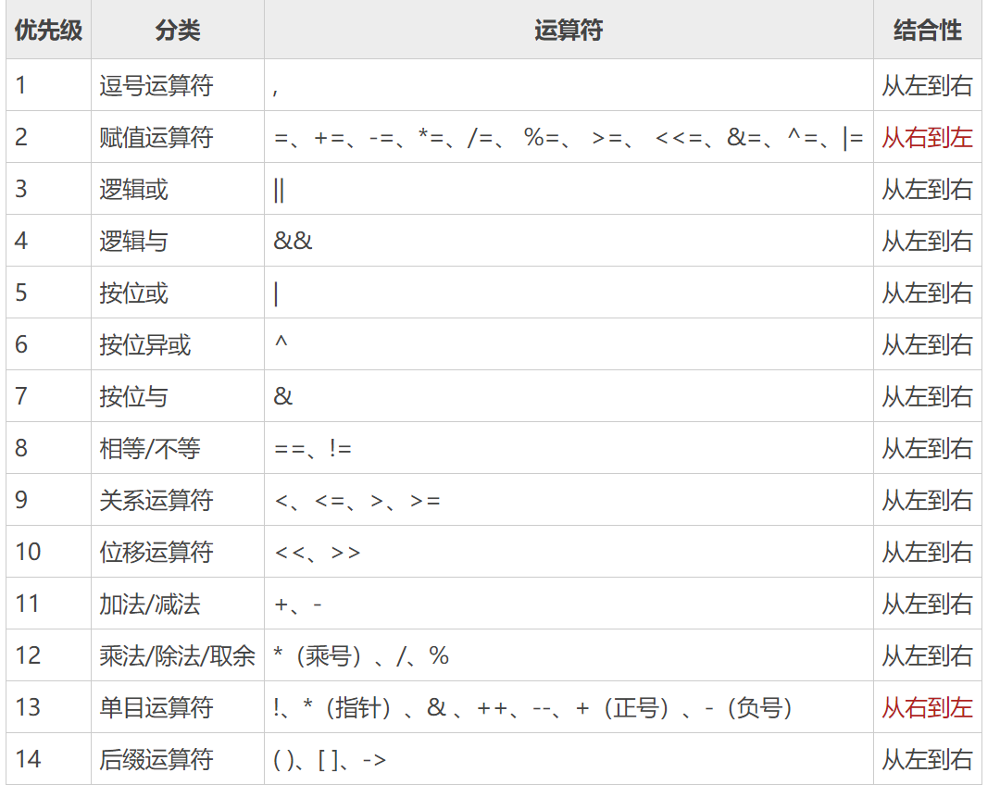

# 一 运算符
## 1.1 算术运算符

|运算符|术语|示例|结果|
|:---:|:---:|:---:|:---:|
|`+`|加|`10+5`|$15$|
|`-`|减|`10-5`|$5$|
|`*`|乘|`10*5`|$50$|
|`/`|除法|`10/5`|$2$|
||||
|`%`|模(取余)|`7%3`|$1$|
|`++`|自增|`a=10,a++`|$a=11$|
|`--`|自减|`a=10,a--`|$a=9$|

* go语言中自增，自减运算符**只能是后自增和后自减**。
* 表达式中不能使用自增，自减运算符。

对于除法运算, 如果相除的两个数的数据类型整型，的到的结果也是整型数据
```go
package main

import "fmt"

func main()  {
	a := 10
	b := 3
	c := a / b  // c = 3 不超过真实结果的最大整数
	d := a % b  // 返回的是 a/b 的余数
	fmt.Println(c, d)  // 3 1

	a++  // 只能是后自增
	b--  // 只能是后自减

	//e = a-- // error
	fmt.Println(a, b)  // 11 2
}
```
* 整型数据相除时，得到结果为整型，除数不能为0
* 浮点型数据相除，得到结果为真实值，除数为0时，得到`Inf`
* 自增，自减运算符**只能是后自增和后自减**, 解决表达式的二义性

**类型转换**
* go语言中，进行计算的数据类型必须相同。(不存在隐式数据类型转换)
* go中的数据类型换行必须是强制数据类型转换。

```go
package main

import "fmt"

func main()  {
	a := 10
	b := 3.14
	//c := a * b  // 数据类型不相同，不能进行计算
	c := float64(a) * b
	fmt.Println(c)
}
```
* **数据类型(变量名)**: 强制将变量的数据类型转换为指定数据类型

```go
package main

import "fmt"

func main()  {
	var a int32 = 10
	var b int64 =  3
	//c := a + b  // 数据类型不相同，不能进行计算
	c := int64(a) + b
	fmt.Println(c)
}
```
* **习惯将低类型转为高类型**保证数据完整性


**案例，计算46天是几周几天**
```go
package main

import "fmt"

func main()  {
	fmt.Println(64 / 7, 46 % 7)
}
```

**案例，107653秒是几天几小时几分几秒**
```go
package main

import "fmt"

func main()  {
	// 107653秒是几天几小时几分几秒
	t := 107653
	d := t / 60 / 60 / 24 % 365
	fmt.Printf("%d天", d)
	h := t / 60 / 60 % 24
	fmt.Printf("%d时", h)
	m := t / 60 % 60
	fmt.Printf("%d分", m)
	s := t % 60
	fmt.Printf("%d秒", s)
}
```

## 1.2 赋值运算符
|运算符|描述|示例|
|:---:|:---:|:---:|
|`=`|赋值|`a = b`, 将b的值赋值给a|
|`+=`|加等于|`a+=b` 等价于 `a = a + b`|
|`-=`|减等于|`a-=b` 等价于 `a = a - b`|
|`*=`|乘等于|`a*=b` 等价于 `a = a * b`|
|`/=`|除等于|`a/=b` 等价于 `a = a / b`|
|`%=`|取余等于|`a%=b` 等价于 `a = a % b`|

```go
package main

import "fmt"

func main()  {

	a := 10
	//a += 5  // a = a + 5
	//a -= 10  // a = a - 10
	//a *= 10  // a = a * 10
	//a /= 5  // a = a / 5
	//a %= 3 // a = a % 3

	//a *= 3 + 2  // a = a * (3 + 2)  a = 50
	//a += 3 * 2  // a = a + (3 * 2)  a = 16
	a += 5 * a  // a = a + (5 * a)  a = 60
	fmt.Println(a)
}
```
* 变量的值只有在赋值时才会被影响。数据是在cpu中进行运算的，不会影响到内存中的值

## 1.3 关系运算符
**关系运算符的返回值是bool类型的值true或false**

|运算符|描述|示例|
|:---:|:---:|:---:|
|`>`|大于|`a > b`|
|`<`|小于|`a < b`|
|`==`|等于|`a==b`|
|`>=`|大于或等于|`a >= b`|
|`<=`|小于或等于|`a <= b`|
|`!=`|不等于|`a != b`|

**比较运算符的规则同数学比较一致**

```go
package main

import "fmt"

func main()  {
	a := 10
	b := 10
	fmt.Println(a == b)  // 判断a是否等于b，等于返回true，不等于返回false
	a = 10
	b = 3
	fmt.Println(a > b)  // 判断a是否大于b，大于返回ture，否则返回false
	fmt.Println(a < b)  // 判断a是否小于b，小于返回ture，否则返回false

	fmt.Println(a <= b) // 判断a是否小于或等于b，小于或者等于返回ture，否则返回false
	fmt.Println(a >= b) // 判断a是否大于或等于b，大于或者等于返回ture，否则返回false
	
	fmt.Println(a != b)  // 判断a是否不等于b，不等于返回ture，否则返回false
}
```

## 1.4 逻辑运算符
|运算符|描述|示例|
|:---:|:---:|:---:|
|`!`|非，取反|`!true`|
|`\\`(双竖线) |逻辑或，有true则为true，否则为false||
|`&&`|逻辑与，有false则为false，否则为ture|`true && false`|

* `!`: **作用在bool类型返回值的表达式之上**, 取反
* `||`: 逻辑或，所有的表达式为`false`，整个表达式的值才为`false`，运算时遇到`true`时返回
* `&&`: 逻辑与，所有的表达式为`true`，整个表达式的值才为`true`，运算时遇到`false`时返回

```go
package main

import "fmt"

func main()  {
	a := false
	fmt.Println(!a)  // true          // !非，取反
	fmt.Println(a || true)  // true   // 逻辑或，遇到true则为true
	fmt.Println(a && true)  // false  // 逻辑与，遇到false则为false
}
```

## 1.5 其他运算符
|运算符|描述|示例|
|:---:|:---:|:---:|
|`&`|取地址，返回变量的内存地址|`&a`|
|`*`|对指针变量取值, 操作内存地址中对应的数据|`*a`, a是指针变量|

```go
package main

import "fmt"

func main()  {
	a := 10
	p := &a
	fmt.Println(p)  // 0xc00000a0b8
	fmt.Println(*p)  // 10
}
```

## 1.6 运算符优先级
**go语言中单目运算符只作用于一个表达式，优先级高于双目运算符**。




**案例，判断年份是否为闰年**
```go
package main

import "fmt"

func main()  {
	fmt.Println("输入要计算的年份:")
	var year int
	fmt.Scan(&year)
	fmt.Println((year % 400 == 0) || (year % 4 ==0 && year % 100 != 0))
}
```


# 二 流程控制

go语言支持三种结构: **顺序结构、选择结构、循环结构**
* **顺序结构**: 从头到尾依次执行
* **选择结构**: 满足某种条件，就执行对应的语句
* **循环结构**: 满足某种条件，多次执行同一段代码

## 2.1 选择结构(if switch)

### 2.1.1 if语句

if语句的基本结构如下
```
if 条件 {
	条件成立执行此语句组
}
```
条件判断如果为真**true**,那么就执行大括号中的语句，
如果为假**false**，就不执行大括号中的语句

### 2.1.2 if--else语句

```
if 条件 {
    条件成立执行此语句组
} else {
    条件不成立执行此语句组
}
```


### 2.1.3 if--else if--else语句

```
if 条件1 {
	条件1成立执行此语句组
} else if 条件2 {
    条件1不成立且条件2成立执行此语句组
} else if 条件3 {
    条件1不成立且条件2不成立且条件3成立执行此语句组
}else {
	以上条件均均不成立执行此语句组
}
```
* 只要条件有一个为真，结束判断。
* 条件都不成立，执行`else`子句

**以上三种结构是可以相互进行嵌套的**

**go语言目前没有加入三目运算**

* `if`结构适合：一种的判断
* `if-else`结构适合：两种情况的判断
* `if-else if-else`结构适合：多种情况判断，并且判断都是对区间中的数据进行判断

**示例代码**
```go
package main

import "fmt"

func main()  {
	var score int32
	fmt.Println("输入成绩")
	fmt.Scanf("%d", &score)
	if score > 90 {
		fmt.Println("优秀")
	} else if score > 80 {
		fmt.Println("良好")
	} else if score > 70 {
		fmt.Println("你有待努力")
	} else {
		fmt.Println("你必须努力了")
	}
}
```

## 2.2 switch语句
如果选择过多，那么就可以使用`switch`语句来简化代码
```
switch 变量或者表达式 {
    case 值1:
    	变量或表达式的值等于值1 执行此组代码
    case 值2:
	    变量或表达式的值等于值2 执行此组代码
    default:
        变量或表达式的值不等于 值1和值2 执行此组代码
}
```
* 首先计算变量或表达式的值
  
* 然后比较计算出来的值与`case`后面的值进行比较
    * 如果两个值相等，则执行下面的代码
    * 如果两个值没有相等的，执行`default`下面的代码
* **case后面的值不能是一个浮点型数据**, 浮点型数据在内存中表示不精确
  
* 每个`case`执行后都会默认执行`break`。相当于整个`switch`退出。

* 想要强制执行某个`case`后面的`case`, 使用`fallthrough`

```go
package main

import "fmt"

func main()  {
	var score int32
	fmt.Println("输入成绩")
	fmt.Scanf("%d", &score)
	switch score/10 {
	case 9:
		fmt.Println("优秀")
		//fallthrough  // 强制执行后面的case
	case 8:
		fmt.Println("良好")
		//fallthrough
	case 7:
		fmt.Println("你有待努力")
		fallthrough  // 强制执行后面的default
	default:
		fmt.Println("你必须努力了")
	}
}
```

**switch实现多分支选择**
```
switch {
    case 条件1:
    	条件1成立 执行此组代码
    case 条件2:
	    条件2成立 执行此组代码
    default:
        条件1和条件2均不成立 执行此组代码
}
```

## 2.3 if语句与switch比较

* if语句支持嵌套；switch也支持，但是一般不用。
* if语句可以执行全区间判断；switch只可以进行半区间判断
* if语句的执行效率要比switch执行效率低下。
    * if语句基于条件判断，需要依次进行
    * switch语句基于值判断，可以一次性对比完成

**示例，成绩评级**
```go
package main

import (
	"fmt"
)

func main()  {
	var score int32
	fmt.Println("输入成绩")
	fmt.Scanf("%d", &score)
	if score == 100 {
		// 90~100属于一个评级
		score = 90
	}
	switch score / 10 {
	case 9:
		fmt.Println("A")
	case 8:
		fmt.Println("B")
	case 7:
		fmt.Println("C")
	case 6:
		fmt.Println("D")
	default:
		fmt.Println("E")
	}
}
```

## 2.2 循环结构

当要重复执行相同的代码时，需要使用循环结构完成. GO语言中只有for循环

### 2.2.1 for循环基本结构1
**for循环的基础语法**
```
for 初始语句; 条件表达式; 结束语句{
    循环体语句
}
```
* **初始语句**: 初次进入循环时执行，只执行一次
* **条件表达式**: 进入循环的条件，进入循环体之前执行
* **结束语句**: 改变循环条件，当次循环结束后执行
* **for循环中初始语句中定义的变量，不能在外部使用**

**案例，输出0~100中的偶数**
```go
package main

import "fmt"

func main() {
	for i:=0; i <= 100; i++ {
		if i % 2 == 0{
			fmt.Printf("偶数: %d ", i)
		}

	}
	fmt.Printf("\n")
}
```

### 2.2.2 for循环基本结构2
**初始条件语句写在for循环外面**
```
初始条件语句
for ; 条件表达式; 结束语句{
    循环体语句
}
```

**结束语句写在循环体内部**
```
初始条件语句
for ; 条件表达式; {
    循环体语句
    结束语句
}
```

**条件表达式写在循环体内部**
```
初始条件语句
for ; ; {
    if 条件表达式 {
        循环体语句
    } else {
        break
    }
    结束语句
}
```
* `break`: 跳出循环
* **没有任何推出条件的循环称为死循环**

**案例，输出100以内的奇数**
```go
package main

import "fmt"

func main() {
	var i int32 =  0
	for ; i <= 100; {
		if i % 2 != 0{
			fmt.Printf("奇数: %d ", i)
		}
		i++
	}
	fmt.Printf("\n")
}
```

**练习，水仙花数**
* 一个三位数的各位上的数的立方和等于该数本身则为水仙花数
```go
package main

import "fmt"

func main() {
	 for i:=100; i < 1000; i++ {
	 	hundred := i / 100   // 百位
	 	ten := (i % 100) / 10  // 十位
	 	one := i % 10  // 各位

	 	if hundred * hundred * hundred + ten * ten * ten + one * one * one == i {
	 		fmt.Printf("%d是水仙花数\n", i)
		}
	 }
}
```

**练习，找出1~100中含7的数字或7的倍数**
```go
package main

import "fmt"

func main() {
	 for i:=7; i<=97; i++ {
	 	if i % 7 == 0 || i / 10 == 7 || i % 10 == 7 {
	 		// 7的倍数    十位是7          个位是7
	 		fmt.Printf("%d ", i)
		}
	 }
}
```

**练习，循环嵌套，输出九九乘法表**
```go
package main

import "fmt"

func main() {
	// 打印输出九九乘法表
	for i:=1; i < 10; i++ {
		for j:=1; j < i+1; j++ {
			fmt.Printf("%d * %d = %d\t", i, j, i * j)
		}
		fmt.Printf("\n")
	}
	fmt.Printf("\n")
	// 镜像打印九九乘法表
	for i:=9; i > 0; i-- {
		for j:=1; j < i+1; j++ {
			fmt.Printf("%d * %d = %d\t", i, j, i * j)
		}
		fmt.Printf("\n")
	}
}
```

## 2.3 循环控制语句

### 2.3.1 break语句

作用: 用于跳出`for`、`switch`和`select`的代码块

`break`语句的作用是跳出当前循环。
```go
package main

import "fmt"

func main() {
	for i:=0; i < 10; i++ {
		fmt.Printf("%d ", i)
		if i == 5 {
			break  // 跳出本层循环
		}
	}
	fmt.Printf("\n")
}
```

`break`语句还可以在语句后面添加标签，表示退出某个标签对应的代码块，
标签要求必须定义在对应的`for`、`switch`和 `select`的代码块上
```go
package main

import "fmt"

func main() {
BREAKDEMO1:
	for i := 0; i < 10; i++ {
		for j := 0; j < 10; j++ {
			if j == 2 {
				break BREAKDEMO1 // 跳出标签指定的语句
			}
			fmt.Printf("%v-%v\n", i, j)
		}
	}
	fmt.Println("...")
}
```

### 2.3.2 continue语句
作用: 结束当前循环，开始下一次的循环迭代过程，仅限在`for`循环内使用
```go
package main

import "fmt"

func main() {
	for i:=0; i < 10; i++ {
		if i % 2 != 0 {
			continue
		}
		fmt.Printf("%d ", i)
	}
}
```

`continue`语句后可以添加标签，**表示开始标签对应的循环**
```go
package main

import "fmt"

func main() {
forloop1:
	for i := 0; i < 5; i++ {
		//forloop2:
		for j := 0; j < 5; j++ {
			if i == 2 || j == 2 {
				continue forloop1
			}
			fmt.Printf("%v-%v\n", i, j)
		}
	}
}
```

### 2.3.3 goto无条件转移语句
`goto`语句通过标签进行代码间的**无条件跳转**

`goto`语句可以在**快速跳出循环、避免重复退出**上有一定的帮助。
Go语言中使用goto语句能简化一些代码的实现过程。 例如双层嵌套的for循环要退出时

**嵌套循环的退出(break)**
```go
package main

import "fmt"

func main() {
	var breakFlag bool
	for i := 0; i < 10; i++ {
		for j := 0; j < 10; j++ {
			if j == 2 {
				// 设置退出标签
				breakFlag = true
				break
			}
			fmt.Printf("%v-%v\n", i, j)
		}
		// 外层for循环判断
		if breakFlag {
			break
		}
	}

}
```
**使用goto修改改代码**
```go
package main

import "fmt"

func main() {
	for i := 0; i < 10; i++ {
		for j := 0; j < 10; j++ {
			if j == 2 {
				// 设置退出标签
				goto breakTag
			}
			fmt.Printf("%v-%v\n", i, j)
		}
	}
	return
	// 标签
breakTag:
	fmt.Println("结束for循环")

}
```