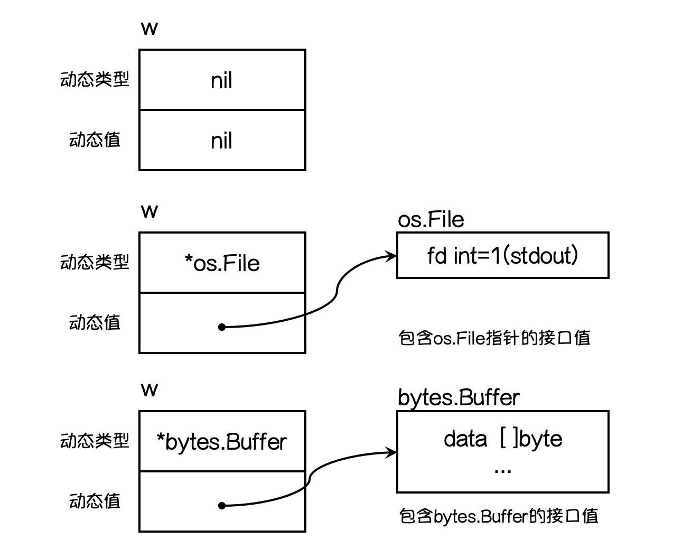

# 面向对象
在go语言中是没有类的概念的，面向对象的实现是通过结构体实现的。

之前涉及到结构体就是面向对象对数据的封装过程

# 一 继承

根据上面的图，我们发现学生类(结构体)，讲师类(结构体)等都有共同的成员（属性和方法），
这样就存在重复，所以我们把这些重复的成员封装到一个父类（结构体）中。
然后让学生类(结构体)和讲师类(结构体)继承父类(结构体)接下来，
我们可以先将公共的属性，封装到父类（结构体）中实现继承,
关于方法(函数)的继承后面再讲

## 1.1 匿名字段创建与初始化
go语言中实现继承是通过匿名字段来完成继承的。
```go
package main

import "fmt"

func main() {
	type Person struct { // 定义结构体类型
		name string
		age  int
		gender string
	}

	type Student struct {
		Person  // 匿名字段，继承Person结构体中属性和方法
		id int
		score int
	}

	var student Student = Student{
		Person: Person{"dyp", 19,"男"},
		id:     101,
		score:  89,
	}

	fmt.Println(student) // {dyp 19 男} 101 89}

	var student1 Student
	student1.name = "dyy"
	student1.age = 12
	student1.gender = "男"
	student1.id = 102
	student1.score = 99

	fmt.Println(student1)
}
```
**匿名字段默认会采用类型名作为字段名，结构体要求字段名称必须唯一，因此一个结构体中同种类型的匿名字段只能有一个。**

## 1.2 同名字段
父结构体中的字段与子结构体中的字段重名时处理
```go
package main

import "fmt"

func main() {
	type Person struct { // 定义结构体类型
		name string
		age  int
		gender string
	}

	type Student struct {
		Person  // 匿名字段，继承Person结构体中属性和方法
		id int
		score int
		name string  // 重名字段
	}


	var student1 Student
	student1.name = "dyy"  // 使用子结构体中的字段
	student1.Person.name = "dhs"  // 父结构体中字段
	student1.age = 12
	student1.gender = "男"
	student1.id = 102
	student1.score = 99

	fmt.Println(student1)
}
```
* 对于同名字段，结构体变量在使用时，
  需要**首先访问的是自己的字段，最后在访问父结构体字段**
* 在多继承中，出现了同名字段，需要指定父结构体进行访问

## 1.3 指针类型的匿名字段
匿名字段是指针变量代替。
```go
package main

import "fmt"

func main() {
	type Person struct { // 定义结构体类型
		name string
		age  int
		gender string
	}

	type Driver struct {
		*Person  // 指针匿名字段，继承Person结构体中属性和方法
		id int
		name string  // 重名字段
	}

	var driver Driver
	driver.Person = new(Person)  // 需要手动初始化指针匿名字段分配内存
	driver.name = "dyp"
	driver.id = 103
	driver.Person.name = "dyd"  // error
	driver.gender = "男"
	driver.age = 25
	fmt.Println(driver)  // {0xc000142390 103 dyp}

}
```
* 对于**指针匿名变量在使用之前需要首先进行初始化**

## 1.4 多继承
go语言中结构体多出继承关系如下
```go
package main

func main() {
	type Object struct {
		id int
		flag bool
	}

	type Person struct { // 定义结构体类型
		Object
		name string
		age  int
		gender string
	}

	type Student struct {
		Person  // 匿名字段，继承Person结构体中属性和方法
		id int
		score int
		name string  // 重名字段
	}
}
```
**Student继承了Object和Person**这是第一种多继承继承关系

还可支持继承多个结构体

```go
package main

func main() {
	type Object struct {
		id   int
		flag bool
	}

	type Person struct { // 定义结构体类型
		name   string
		age    int
		gender string
	}

	type Driver struct {
		Person
		Object
		*Driver
		//Driver  // error
		id int
	}
}
```
**不能继承自己，但是可以通过指针匿名字段进行继承自己**


# 二 方法
`Go`语言中的方法(`Method`)是一种作用于**特定类型变量的函数**, 例如
```go
package main

type MyInt int

func (a MyInt) add(b MyInt) MyInt {
	return a + b
}
```
**go语言是不能给基本类型绑定方法**

## 2.1 方法绑定和接收者
**特定类型变量**叫做接收者(`Receiver`)。
接收者的概念就类似于其他语言中的`this`或者`self`

**方法语法如下**
```
func (接收者变量 接收者类型) 方法名(参数列表) (返回参数) {
    函数体
}
```
* `接收者变量`：接收者中的参数变量名在命名时，官方建议使用**接收者类型名称首字母的小写**，而不是`self、this`之类的命名。
  例如，`Person`类型的接收者变量应该命名为`person`，`Connector`类型的接收者变量应该命名为`connector`等。
* `接收者类型`：接收者类型和参数类似，可以是指针类型和非指针类型。
    * 指针类型类型接收者使用条件
        1. 需要**修改接收者中的值**
        2. 接收者是**拷贝代价比较大**的大对象
        3. **保证一致性**，如果有某个方法使用了指针接收者，那么其他的方法也应该使用指针接收者。
* 方法名、参数列表、返回参数：具体格式与函数定义相同

**方法是不能调用的，需要通过该类型的变量调用**

**示例**
```go
package main

import "fmt"

type MyInt int

func (a MyInt) add(b MyInt) MyInt {
	return a + b
}

type Person struct { // 定义结构体类型
	name string
	age  int
	gender string
}

func (p Person)info() {
	fmt.Printf("name:%s-age:%d-gender:%s\n", p.name, p.age, p.gender)
}

func (p *Person)edit(name string, age int, gender string) {
	p.name = name
	p.age = age
	p.gender = gender
}

func main() {
	var person = Person{
		name:   "dyp",
		age:    25,
		gender: "男",
	}
	person.info()  //  修改前 name:dyp-age:25-gender:男
	person.edit("dyy", 17, "女")
	person.info()  // 修改后 name:dyy-age:17-gender:女
}
```

### 构造函数
`Go`语言的结构体没有构造函数，我们可以自己实现。
例如，下方的代码就实现了一个`person`的构造函数。
因为`struct`是值类型，如果结构体比较复杂的话，值拷贝性能开销会比较大，
所以该构造函数返回的是结构体指针类型。
```go
package main

type person struct {
	name string
	city string
	age  int8
}

func newPerson(name, city string, age int8) *person {
	return &person{
		name: name,
		city: city,
		age:  age,
	}
}
```

**练习**
```go
package main

import "fmt"

type Score struct {
	chinese int
	math int
	english int
}

type Student struct { // 定义结构体类型
	name string
	age  int
	gender string
	Score
}

// 构造函数
func InitStudent(name string, age int, gender string, chinese, math, english int) *Student {
	return &Student{
		name:   name,
		age:    age,
		gender: gender,
		Score:  Score{
			chinese: chinese,
			math:    math,
			english: english,
		},
	}
}

func (s Student)hello() {
	fmt.Printf("我叫%s，性别%s，今年%d岁\n", s.name, s.gender, s.age)
}

func (s Student)hi()  {
	totalScore := s.chinese+s.math+s.english
	avgScore := totalScore /3
	fmt.Printf("我叫%s，考试总分为%d，平均分为%d\n", s.name, totalScore, avgScore)
}

func main() {
	student := InitStudent("dyp", 19, "男", 98, 99, 87)
	student.hello()  // 打招呼
	student.hi()  // 
}
```

## 2.2 方法继承与重写
子结构体会继承父结构体的所有字段，包括绑定给父结构体的方法。
但是，父类不能使用子类的字段和方法

**练习1：根据以下信息，实现对应的继承关系**
* 记者：我是记者  我的爱好是偷拍 我的年龄是34 我是一个男狗仔
* 程序员：我叫孙权 我的年龄是23 我是男生 我的工作年限是 3年

```go
package main

import "fmt"

// 公共属性
type Person struct { // 定义结构体类型
	name string
	age  int
	gender string
}
func InitPerson(name, gender string, age int) *Person{
	return &Person{
		name:   name,
		age:    age,
		gender: gender,
	}
}
func (p *Person)SayHello() {
	fmt.Printf("我叫%s, 今年%d岁 我是%s生 ", p.name, p.age, p.gender)
}

// 记者
type Reporter struct {
	*Person  // 继承公共属性
	hobby string
}
// 构造实例
func initReporter(name, gender, hobby string, age int) *Reporter {
	return &Reporter{
		Person:  InitPerson(name, gender, age),
		hobby:  hobby,
	}
}

func (r *Reporter)SayHi(){
	r.Person.SayHello()
	fmt.Printf("我的爱好是%s\n", r.hobby)
}
// 程序员
type Programmer struct {
	*Person
	workYear int
}
// 构造实例
func initProgrammer(name, gender string, age, workYear int) * Programmer {
	return &Programmer{
		Person:   InitPerson(name, gender, age),
		workYear: workYear,
	}
}

func (p *Programmer)SayHi(){
	p.Person.SayHello()
	fmt.Printf("我工作%d年了\n", p.workYear)
}
func main() {

	reporter := initReporter("dyy", "男", "偷拍", 34)
	programmer := initProgrammer("孙权", "男", 23,3)
	reporter.SayHi()
	programmer.SayHi()
}
```

### 方法重写

当给子结构体绑定了与父结构体同名的方法时，称为方法重写
```go
package main

import "fmt"

// 公共属性
type Person struct { // 定义结构体类型
	name string
	age  int
	gender string
}
func InitPerson(name, gender string, age int) *Person{
	return &Person{
		name:   name,
		age:    age,
		gender: gender,
	}
}
func (p *Person)SayHello() {
	fmt.Printf("我叫%s, 今年%d岁 我是%s生 ", p.name, p.age, p.gender)
}

// 记者
type Reporter struct {
	*Person  // 继承公共属性
	hobby string
}
// 构建记者对象
func initReporter(name, gender, hobby string, age int) *Reporter {
	return &Reporter{
		Person:  InitPerson(name, gender, age),
		hobby:  hobby,
	}
}
// 从而写父结构体的SayHello的方法
func (r *Reporter)SayHello(){
	r.Person.SayHello()
	fmt.Printf("我的爱好是%s\n", r.hobby)
}


// 程序员
type Programmer struct {
	*Person
	workYear int
}
// 构建程序员对象
func initProgrammer(name, gender string, age, workYear int) * Programmer {
	return &Programmer{
		Person:   InitPerson(name, gender, age),
		workYear: workYear,
	}
}
// 从而写父结构体的SayHello的方法
func (p *Programmer)SayHello(){
	p.Person.SayHello()
	fmt.Printf("我工作%d年了\n", p.workYear)
}
func main() {
	reporter := initReporter("dyy", "男", "偷拍", 34)
	programmer := initProgrammer("孙权", "男", 23,3)
	reporter.SayHello()  // 优先调用子结构的方法
	programmer.SayHello()
}
```
**一个对象中，不能出现相同的方法名**

## 2.3 方法类型

方法实际上就是函数，只是对函数进行了修改。怎样定义函数类型就怎样定义方法类型
```go
package main

import "fmt"

// 公共属性
type Person struct { // 定义结构体类型
	name string
	age  int
	gender string
}
func InitPerson(name, gender string, age int) *Person{
	return &Person{
		name:   name,
		age:    age,
		gender: gender,
	}
}
func (p *Person)SayHello() {
	fmt.Printf("我叫%s, 今年%d岁 我是%s生 ", p.name, p.age, p.gender)
}

// 记者
type Reporter struct {
	*Person  // 继承公共属性
	hobby string
}

func initReporter(name, gender, hobby string, age int) *Reporter {
	return &Reporter{
		Person:  InitPerson(name, gender, age),
		hobby:  hobby,
	}
}

func (r *Reporter)SayHello(){
	r.Person.SayHello()
	fmt.Printf("我的爱好是%s\n", r.hobby)
}
// 程序员
type Programmer struct {
	*Person
	workYear int
}

func initProgrammer(name, gender string, age, workYear int) * Programmer {
	return &Programmer{
		Person:   InitPerson(name, gender, age),
		workYear: workYear,
	}
}

func (p *Programmer)SayHello(){
	p.Person.SayHello()
	fmt.Printf("我工作%d年了\n", p.workYear)
}
func main() {
	reporter := initReporter("dyy", "男", "偷拍", 34)
	programmer := initProgrammer("孙权", "男", 23,3)
	reporter.SayHello()
	programmer.SayHello()
	type methodType func()  // 定义方法类型
	var hello methodType  // 定义方法类型变量
	hello = reporter.SayHello  // 初始化
	hello()  // 通过方法变量调用方法
}
```

## 2.4 案例: 面向对象的学生管理系统
```go
package main

//大概的写了一下，并不完善。
import (
	"fmt"
	"sort"
)

type Student struct {
	ID    int
	Name  string
	Age   int8
	Score int8
}

//考虑到修改和删除，还是map比较合适
type Class struct {
	Map map[int]*Student
}

//添加学生
func (c *Class) AddStudent() {
	var id int
	var name string
	var age int8
	var score int8
	fmt.Print("输入id: ")
	_, err := fmt.Scan(&id)
	fmt.Print("输入姓名: ")
	_, err = fmt.Scan(&name)
	fmt.Print("输入年龄: ")
	_, err = fmt.Scan(&age)
	fmt.Print("输入分数: ")
	_, err = fmt.Scan(&score)
	if err != nil {
		fmt.Println("保存出错！")
	}
	_, isSave := c.Map[id]
	if isSave {
		fmt.Println("学生ID已存在！")
		return
	}
	student := &Student{
		ID:    id,
		Name:  name,
		Age:   age,
		Score: score,
	}
	c.Map[id] = student
	fmt.Println("保存成功！")
}

//查看学生列表
func (c *Class) ShowStudent() {
	fmt.Printf("\t%s\t%s\t%s\t%s\n", "ID", "姓名", "年龄", "分数")
	sortID := make([]int, 0)
	for k := range c.Map {
		sortID = append(sortID, k)
	}
	sort.Ints(sortID)
	for _, k := range sortID {
		s := c.Map[k]
		fmt.Printf("\t%d\t%s\t%d\t%d\n", s.ID, s.Name, s.Age, s.Score)
	}
}

//删除学生
func (c *Class) DeleteStudent() {
	fmt.Print("输入要删除的学生ID：")
	var id int
	_, err := fmt.Scan(&id)
	if err != nil {
		fmt.Println("err 好烦啊。")
	}
	_, isSave := c.Map[id]
	if !isSave {
		fmt.Println("要删除的ID不存在！")
		return
	}
	delete(c.Map, id)
	fmt.Println("删除成功！！")
}

//修改学生信息
func (c *Class) ChangeStudent() {
	fmt.Print("输入要修改的学生ID：")
	var id int
	_, err := fmt.Scan(&id)
	if err != nil {
		fmt.Println("err 好烦啊。")
	}
	_, isSave := c.Map[id]
	if !isSave {
		fmt.Println("要修改的ID不存在！")
		return
	}
	var name string
	var age int8
	var score int8
	fmt.Print("输入姓名: ")
	_, err = fmt.Scan(&name)
	fmt.Print("输入年龄: ")
	_, err = fmt.Scan(&age)
	fmt.Print("输入分数: ")
	_, err = fmt.Scan(&score)
	if err != nil {
		fmt.Println("保存出错！")
	}
	student := &Student{
		ID:    id,
		Name:  name,
		Age:   age,
		Score: score,
	}
	c.Map[id] = student
	fmt.Println("修改成功！")

}

func main() {
	c := &Class{}
	c.Map = make(map[int]*Student, 50)
	for {
		fmt.Println("要执行的操作：")
		fmt.Print("1. 添加  2.查看  3.删除  4.修改")
		var do int8
		_, err := fmt.Scan(&do)
		if err != nil {
			fmt.Println("输入有误！")
		}
		switch do {
		case 1:
			c.AddStudent()
		case 2:
			c.ShowStudent()
		case 3:
			c.DeleteStudent()
		case 4:
			c.ChangeStudent()
		default:
			fmt.Println("输入有误！")
		}
	}
}
```

# 三 多态
**多态引入，下面示例代码**
```go
package main

import "fmt"

type Cat struct{}

func (c Cat) Say() string { return "喵喵喵" }

type Dog struct{}

func (d Dog) Say() string { return "汪汪汪" }

func Hit(x Type) {
	ret := x.Say()
	fmt.Println(ret)
}

func main() {
	c := Cat{}
	d := Dog{}
	Hit(c)
	Hit(d)
}
```
上面代码的Hit函数需要接受任意类型的参数，该参数必须要能调用Say方法

**Hit函数的参数，不关心类型的值，只关心该类型可以调用相同的方法**。这样的
类型称为**接口类型**

**接口（interface）定义了一个对象的行为规范，
只定义规范不实现，由具体的对象来实现规范的细节**

## 3.1 接口

接口就是一种规范和标准，用于限制子类行为的。接口是实现代码的，需要在子类中
进行代码实现

在Go语言中接口（`interface`）是一种类型，一种抽象的类型。

`interface`是一组`method`的集合，是`duck-type programming`的一种体现。
接口做的事情就像是定义一个协议（规则），只要一台机器有洗衣服和甩干的功能，
我就称它为洗衣机。不关心属性（数据），只关心行为（方法）。

**接口定义**
```
type 接口名 interface{
    方法名1( 参数列表1 ) 返回值列表1
    方法名2( 参数列表2 ) 返回值列表2
    …
}
```
* `接口名`：使用`type`将接口定义为自定义的类型名。
  `Go`语言的接口在命名时，一般会在单词后面添加`er`，
  如有写操作的接口叫`Writer`，有字符串功能的接口叫`Stringer`等。
  接口名最好要能突出该接口的类型含义。
* `方法名`：当**方法名首字母是大写且这个接口类型名首字母也是大写**时，
  这个方法可以被接口所在的包（`package`）之外的代码访问。
* `参数列表、返回值列表`：参数列表和返回值列表中的参数变量名可以**省略**。


### 使用接口的好处
例如下面代码
```go
package main

import "fmt"

type Cat struct{}

func (c Cat) Say() string { return "喵喵喵" }

type Dog struct{}

func (d Dog) Say() string { return "汪汪汪" }

func main() {
	c := Cat{}
	fmt.Println("猫:", c.Say())
	d := Dog{}
	fmt.Println("狗:", d.Say())
}
```
上面的代码中定义了`猫和狗`，然后它们都会叫，你会发现`main`函数中明显有重复的代码，
如果我们后续再加上`猪、青蛙`等动物的话，我们的代码还会一直重复下去。
那我们能不能把它们当成“能叫的动物”来处理呢？

像类似的例子在我们编程过程中会经常遇到：
* 比如一个网上商城可能使用支付宝、微信、银联等方式去在线支付，
  我们能不能把它们当成“支付方式”来处理呢？

* 比如三角形，四边形，圆形都能计算周长和面积，
  我们能不能把它们当成“图形”来处理呢？

* 比如销售、行政、程序员都能计算月薪，
  我们能不能把他们当成“员工”来处理呢？

Go语言中为了解决类似上面的问题，就设计了接口这个概念。
接口区别于我们之前所有的具体类型，接口是一种抽象的类型。
当你看到一个接口类型的值时，你不知道它是什么，
唯一知道的是通过它的方法能做什么。

**一个对象只要全部实现了接口中的方法，那么就实现了这个接口。换句话说，接口就是一个 *需要实现的方法列表*。**

**实现一个能叫动物的接口**
```go
package main

import "fmt"

// Sayer 接口
type Sayer interface {
	say()
}
type dog struct {}

type cat struct {}

// dog实现了Sayer接口
func (d dog) say() {
	fmt.Println("汪汪汪")
}

// cat实现了Sayer接口
func (c cat) say() {
	fmt.Println("喵喵喵")
}
```
## 3.2 接口类型变量
**接口类型变量能够存储所有实现了该接口的实例**。 例如上面的示例中，
`Sayer`类型的变量能够存储`dog`和`cat`类型的变量

```go
package main

import "fmt"

// Sayer 接口
type Sayer interface {
	say()
}
type dog struct {}

type cat struct {}

// dog实现了Sayer接口
func (d dog) say() {
	fmt.Println("汪汪汪")
}

// cat实现了Sayer接口
func (c cat) say() {
	fmt.Println("喵喵喵")
}

func main() {

	var x Sayer // 声明一个Sayer类型的变量x
	a := cat{}  // 实例化一个cat
	b := dog{}  // 实例化一个dog
	x = a       // 可以把cat实例直接赋值给x
	x.say()     // 喵喵喵
	x = b       // 可以把dog实例直接赋值给x
	x.say()     // 汪汪汪
}
```


## 3.3 通过接口实现多态
多态是指不同的子类存在的不同状态，对同样的接口有着不同形式的表现

go语言区别与python。在python中只需要在不同子类中定义相同的方法名即可实现多态。
而在go语言中实现多态需要通过定义一个函数接收接口类型变量来实现多态。
```go
package main

import "fmt"

// Sayer 接口
type Sayer interface {
	say()
}
type dog struct{}

type cat struct{}

// dog实现了Sayer接口
func (d dog) say() {
	fmt.Println("汪汪汪")
}

// cat实现了Sayer接口
func (c cat) say() {
	fmt.Println("喵喵喵")
}

func say(s Sayer) {
	s.say()
}

func main() {

	a := cat{}  // 实例化一个cat
	b := dog{}  // 实例化一个dog

	say(a)  // 喵喵喵
	//say(&a)  // 喵喵喵
	say(b)  // 汪汪汪
	//say(&b)  // 汪汪汪
}
```
可以直接将实现了接口中所有方法的结构体传递到这个函数中，对于不同的结构体实例传递
该函数中，则表现出不同的状态

**练习，用多态来实现，将移动硬盘或者U盘或者MP3插到电脑上进行读写数据（分析类，接口，方法）**

```go
package main

import "fmt"

// StorageDevice 存储设备接口
type StorageDevice interface {
	Write() // 写入数据
	Read()  // 读取数据
}

// Disk 存储设备
type Disk struct {
	id     int     // 设备id
	memory int     // 存储容量
	speed  float64 // 存储速度
}

// MobileDisk 移动硬盘
type MobileDisk struct {
	Disk        // 继承
	name string // 硬盘名称
}

func (md MobileDisk) Write() {
	fmt.Printf("%s-%d,正在写入数据，写入速度为%.2fmb/s\n", md.name, md.id, md.speed)
}

func (md MobileDisk) Read() {
	fmt.Printf("%s-%d,正在读取数据，读取速度为%.2fmb/s\n", md.name, md.id, md.speed)
}

// USBDisk USB
type USBDisk struct {
	Disk
	name string
}

func (ud USBDisk) Write() {
	fmt.Printf("%s-%d,正在写入数据，写入速度为%.2fmb/s\n", ud.name, ud.id, ud.speed)
}

func (ud USBDisk) Read() {
	fmt.Printf("%s-%d,正在读取数据，读取速度为%.2fmb/s\n", ud.name, ud.id, ud.speed)
}

// Mp3Disk mp3
type Mp3Disk struct {
	Disk
	name string
}

func (pd Mp3Disk) Write() {
	fmt.Printf("%s-%d,正在写入数据，写入速度为%.2fmb/s\n", pd.name, pd.id, pd.speed)
}

func (pd Mp3Disk) Read() {
	fmt.Printf("%s-%d,正在读取数据，读取速度为%.2fmb/s\n", pd.name, pd.id, pd.speed)
}

// Write 多态
func Write(s StorageDevice) {
	s.Write()
}

func Read(s StorageDevice) {
	s.Read()
}

func main() {
	var mobileDisk MobileDisk = MobileDisk{
		Disk: Disk{
			id:     101,
			memory: 200,
			speed:  45.3,
		},
		name: "移动硬盘",
	} // 移动硬盘

	Write(mobileDisk)
	Read(&mobileDisk)
	var usbDisk USBDisk = USBDisk{
		Disk: Disk{
			id:     102,
			memory: 128,
			speed:  23.4,
		},
		name: "USB",
	}
	Write(usbDisk)
	Read(&usbDisk)

	var mp3Disk Mp3Disk = Mp3Disk{
		Disk: Disk{
			id:     103,
			memory: 64,
			speed:  12.5,
		},
		name: "MP3",
	}
	Write(mp3Disk)
	Read(&mp3Disk)
}
```

### 值接收者接口与指针接收者接口
**值接收者**
```go
package main

import "fmt"

type Mover interface {
	move()
}

type dog struct {}

// 值接收者实现的接口
func (d dog) move() {
	fmt.Println("狗会动")
}

func main() {
	var x Mover
	var wangcai = dog{} // dog类型
	x = wangcai         // x可以接收 dog类型
	x.move()
	
	var fugui = &dog{}  // *dog类型
	x = fugui           // x可以接收 *dog类型
	x.move()
}
```
**指针接收者**
```go
package main

import "fmt"

type Mover interface {
	move()
}

type dog struct {}

// 值接收者实现的接口
func (d *dog) move() {
	fmt.Println("狗会动")
}

func main() {
	var x Mover
	/*
	var wangcai = dog{} // dog类型
	x = wangcai         // x不可以接收 dog类型
	x.move()
	*/
	
	var fugui = &dog{}  // *dog类型
	x = fugui           // x可以接收 *dog类型
	x.move()
}
```
上述两个示例，展示了对于值接收者实现的方法与指针接收者实现方法，他们的区别如下
* 对于**值接收者**实现的接口，给接口类型变量赋值时可以*直接赋值*或者*取地址赋值*
* 对于**指针接收者**实现的接口，给接口变量赋值时*必须使用地址赋值*

## 3.4 接口的继承与转换(接口嵌套)

go中接口是可以继承。一个接口如果继承了某个即可称该接口为超集，而被继承的
接口称为子集。

```go
package main
type Test1 interface { // 子集
	hello()
}

type Test2 interface {  // 超集
	Test1  // 继承了一个接口
	read()
}
```
**转换:** **指超集转为子集，但是反之不行**，
指子集类型的变量可以使用接收超集类型的值(*将超集类型的值，赋值给子集类型变量*)

```go
package main

import "fmt"

type Test1 interface { // 子集
	hello()
}

type Test2 interface { // 超集
	Test1 // 继承了一个接口
	read()
}

func main() {
	var t1 Test1  // 子集类型变量
	var t2 Test2  // 超集类型变量
	t1 = t2  // 超集类型值赋值给子集类型变量
	fmt.Println(t1)
}
```

### 接口与类型的关系
**一个类型可以实现多个接口,而接口间彼此独立，不知道对方的实现**
例如，狗可以叫，也可以动。我们就分别定义Sayer接口和Mover接口，
如下： Mover接口。
```go
package main

import "fmt"

// Sayer 接口
type Sayer interface {
	say()
}

// Mover 接口
type Mover interface {
	move()
}

type dog struct {
	name string
}

// 实现Sayer接口
func (d dog) say() {
	fmt.Printf("%s会叫汪汪汪\n", d.name)
}

// 实现Mover接口
func (d dog) move() {
	fmt.Printf("%s会动\n", d.name)
}

func main() {
	var x Sayer
	var y Mover

	var a = dog{name: "旺财"}
	x = a
	y = a
	x.say()
	y.move()
}
```
**多个类型可以实现一个接口**，并且一个接口的方法，不一定需要由一个类型完全实现，
接口的方法可以通过在类型中**嵌入其他类型或者结构体**来实现（**接口可以被继承**）
```go
package main

import "fmt"

// WashingMachine 洗衣机
type WashingMachine interface {
	wash()  // 洗衣接口
	dry()  // 甩干接口
}

// 甩干器
type dryer struct{}

// 实现WashingMachine接口的dry()方法
func (d dryer) dry() {
	fmt.Println("甩一甩")
}

// 海尔洗衣机
type haier struct {
	dryer //嵌入甩干器（继承甩干器，同时继承了甩干器的所有的属性方法接口）
}

// 实现WashingMachine接口的wash()方法
func (h haier) wash() {
	fmt.Println("洗刷刷")
}
```

## 3.5 空接口
空接口(`interface{}`)不包含任何的方法，正因为如此，
所有的类型都实现了空接口，因此空接口可以存储任意类型的数值

```go
package main

import "fmt"

func main(){

	var i interface{}  // 定义一个空接口类型
	i = 10
	fmt.Printf("数据: %v, 类型: %T, 地址: %p\n", i, i, &i)  // 数据: 10, 类型: int, 地址: 0xc0000442a0
	i = "hello world"
	fmt.Printf("数据: %v, 类型: %T, 地址: %p\n", i, i, &i)  // 数据: 10, 类型: int, 地址: 0xc0000442a0
}
```
* 可以定义空接口类型的数组、切片等等

****
**接口值:一个接口的值（简称接口值）是由一个具体类型和具体类型的值两部分组成的。
这两部分分别称为接口的动态类型和动态值。**


### 3.5.1 类型断言

空接口可以保存任何类型的数据，对数据操作是需要知道类型是否支持该操作。
使用类型断言语句可以实现,语法为:`data, is_true := 数据.(type)`
* `type`: 判断数据是否为`type`类型
* `data`: 数据
* `is_ture`: 数据数据类型为`type`返回`true`, 否则返回`false`


## 3.6 面向对象示例
**使用面向对象的思想设计一个计算器**

```go
package main

import "fmt"

// ObjectOperate 面向对象计算器实现
// 计算器基类
type ObjectOperate struct {
	num1 int
	num2 int
}

// 加法类
type addClass struct {
	ObjectOperate
}

func (add *addClass) Operate() int {
	return add.num1 + add.num2
}

// 减法类
type subClass struct {
	ObjectOperate
}

func (sub *subClass) Operate() int {
	return sub.num2 - sub.num1
}

// Operation 接口
type Operation interface {
	Operate() int
}

// OptFactory 多态实现
func OptFactory(o Operation) (value int) {
	value = o.Operate()
	return
}

// Factory 工厂模式，空结构体
type Factory struct {
}

// Calc 工厂函数
func (f *Factory) Calc(number1, number2 int, op string) (value int) {
	// 接口类型变量
	var opt Operation
	switch op {
	case "+":
		var add addClass = addClass{ObjectOperate{number1, number2}} // 创建加法对象
		opt = &add                                                   // 绑定对象
	case "-":
		var sub subClass = subClass{ObjectOperate{number1, number2}} // 创建减法对象
		opt = &sub                                                   // 绑定的对象
	}
	//value = opt.Operate()  // 调用接口
	value = OptFactory(opt)
	return
}

func main() {
	var factory Factory
	value := factory.Calc(10, 20, "+")
	fmt.Println(value)
}
```
如上设计，当需要添加新功能时**只需要在工厂函数中修改，然后在区实现需要的对象即可**


## 四 反射

反射是指在程序运行期间对程序的本身的数据进行访问，修改。

**程序在编译时，变量被转换为内存地址，变量名不会被编译器写入到可执行部分。
在运行程序时，程序无法获取自身的信息。**

支持反射的语言可以在程序编译期将变量的反射信息，如字段名称、类型信息、
结构体信息等整合到可执行文件中，并给程序提供接口访问反射信息，
这样就可以在程序运行期获取类型的反射信息，并且有能力修改它们。

空接口可以存储任意类型的变量，那我们如何知道这个空接口保存的数据是什么呢？ 
反射就是在运行时动态的获取一个变量的类型信息和值信息。

### reflect包
在`Go`语言的反射机制中，任何接口值都由是一个具体类型和具体类型的值两部分组成的。 
在`Go`语言中反射的相关功能由内置的`reflect`包提供，任意接口值在反射中都可以理解为由
`reflect.Type`和`reflect.Value`两部分组成，并且`reflect`包提供了
`reflect.TypeOf`和`reflect.ValueOf`两个函数来获取任意对象的`Value`和`Type`。

### 4.1 reflect.TypeOf获取类型
在`Go`语言中，使用`reflect.TypeOf()`函数可以获得任意值的类型对象`reflect.Type`，
程序通过类型对象可以访问任意值的类型信息。
```go
package main

import (
	"fmt"
	"reflect"
)

func reflectType(x interface{}) {
	v := reflect.TypeOf(x)  // 获取x的数据类型
	fmt.Printf("type:%v\n", v)
}

func main() {
	var a float32 = 3.14
	reflectType(a) // type:float32
	var b int64 = 100
	reflectType(b) // type:int64
}
```
#### 反射中的类型
在反射中关于类型还划分为两种：`Type`和`Kind`
* `Type`: `type`关键字构造很多自定义类型
    * 调用`.Name()`获取自定义类型
    * `Go`语言的反射中像`数组`、`切片`、`Map`、`指针`等类型的变量，
      它们的`.Name()`都是返回空。
* `Kind`: 指`Go`提供的底层的类型
    * 调用`.Kind()`获取底层数据类型<br>
    * **Kind定义的类型**    
        ```
        type Kind uint
        const (
            Invalid Kind = iota  // 非法类型
            Bool                 // 布尔型
            Int                  // 有符号整型
            Int8                 // 有符号8位整型
            Int16                // 有符号16位整型
            Int32                // 有符号32位整型
            Int64                // 有符号64位整型
            Uint                 // 无符号整型
            Uint8                // 无符号8位整型
            Uint16               // 无符号16位整型
            Uint32               // 无符号32位整型
            Uint64               // 无符号64位整型
            Uintptr              // 指针
            Float32              // 单精度浮点数
            Float64              // 双精度浮点数
            Complex64            // 64位复数类型
            Complex128           // 128位复数类型
            Array                // 数组
            Chan                 // 通道
            Func                 // 函数
            Interface            // 接口
            Map                  // 映射
            Ptr                  // 指针
            Slice                // 切片
            String               // 字符串
            Struct               // 结构体
            UnsafePointer        // 底层指针
        )
        ```

**Name和Kind使用示例**
```go
package main

import (
	"fmt"
	"reflect"
)

func reflectType(x interface{}) {
	v := reflect.TypeOf(x)  // 获取x的数据类型
	fmt.Printf("type:%v  kind:%v\n", v.Name(), v.Kind())
}

func main() {
	var a float32 = 3.14
	reflectType(a) // type:float32  kind:float32
	var b int64 = 100
	reflectType(b) // type:int64  kind:int64
	type student struct {

	}
	var stu student
	reflectType(stu)  // type:student  kind:struct

}
```
### 4.2 reflect.ValueOf获取值

`reflect.Value`类型提供的获取原始值的方法如下
<table>
    <thead>
        <tr>
            <th>方法</th>
            <th>说明</th>
        </tr>
    </thead>
    <tbody>
        <tr>
            <td>Interface() interface {}</td>
            <td>将值以 interface{} 类型返回，可以通过类型断言转换为指定类型</td>
        </tr>
        <tr>
            <td>Int() int64</td>
            <td>将值以 int 类型返回，所有有符号整型均可以此方式返回</td>
        </tr>
        <tr>
            <td>Uint() uint64</td>
            <td>将值以 uint 类型返回，所有无符号整型均可以此方式返回</td>
        </tr>
        <tr>
            <td>Float() float64</td>
            <td>将值以双精度（float64）类型返回，所有浮点数（float32、float64）均可以此方式返回</td>
        </tr>
        <tr>
            <td>Bool() bool</td>
            <td>将值以 bool 类型返回</td>
        </tr>
        <tr>
            <td>Bytes() []bytes</td>
            <td>将值以字节数组 []bytes 类型返回</td>
        </tr>
        <tr>
            <td>String() string</td>
            <td>将值以字符串类型返回</td>
        </tr>
    </tbody>
</table>

`reflect.ValueOf()`返回的是`reflect.Value`类型，其中包含了原始值的值信息。
`reflect.Value`与原始值之间可以互相转换。

**使用示例**
```go
package main

import (
	"fmt"
	"reflect"
)

func reflectValue(x interface{}) {
	v := reflect.ValueOf(x)
	k := v.Kind()
	switch k {
	case reflect.Int64:
		// v.Int()从反射中获取整型的原始值，然后通过int64()强制类型转换
		fmt.Printf("type is int64, value is %d\n", int64(v.Int()))
	case reflect.Float32:
		// v.Float()从反射中获取浮点型的原始值，然后通过float32()强制类型转换
		fmt.Printf("type is float32, value is %f\n", float32(v.Float()))
	case reflect.Float64:
		// v.Float()从反射中获取浮点型的原始值，然后通过float64()强制类型转换
		fmt.Printf("type is float64, value is %f\n", float64(v.Float()))
	}
}

func main() {
	var a float32 = 3.14
	var b int64 = 100
	// 获取值
	reflectValue(a) // type is float32, value is 3.140000
	reflectValue(b) // type is int64, value is 100
	// 将int类型的原始值转换为reflect.Value类型
	c := reflect.ValueOf(10)
	fmt.Printf("type c :%T\n", c) // type c :reflect.Value
}
```

#### 通过反射设置值
想要在函数中通过反射修改变量的值，需要注意函数参数传递的是值拷贝，
必须 *传递变量地址* 才能修改变量值。而反射中使用专有的`Elem()`
方法来获取指针对应的值

**示例**
```go
package main

import (
	"fmt"
	"reflect"
)

func reflectSetValue(x interface{}) {
	v := reflect.ValueOf(x)
	// 反射中使用 Elem()方法获取指针对应的值
	if v.Elem().Kind() == reflect.Int64 {
		v.Elem().SetInt(200)
	}
}

func main() {
	var b int64 = 100
	
	fmt.Printf("反射设置值前: %d\n", b)
	reflectSetValue(&b)
	fmt.Printf("反射设置值后: %d\n", b)
}
```

### 4.3 isNil()和isValid()
`IsNil()`常被用于判断指针是否为空；`IsValid()`常被用于判定返回值是否有效。

```
func (v Value) IsNil() bool
```
`IsNil()`报告`v`持有的值是否为`nil`。`v`持有的值的分类必须是 *通道、函数、接口、
映射、指针、切片* 之一；否则`IsNil`函数会导致`panic`。

```
func (v Value) IsValid() bool
```
`IsValid()`返回`v`是否持有一个值。如果`v`是`Value`零值会返回假，
此时`v`除了`IsValid`、`String`、`Kind`之外的方法都会导致`panic`。


**使用示例**
```go
package main

import (
	"fmt"
	"reflect"
)

func main() {
	// IsNil和IsValue

	// *int类型空指针
	var a *int
	fmt.Println("var a *int IsNil:", reflect.ValueOf(a).IsNil())
	// nil值
	fmt.Println("nil IsValid:", reflect.ValueOf(nil).IsValid())
	// 实例化一个匿名结构体
	b := struct{}{}
	// 尝试从结构体中查找"abc"字段
	fmt.Println("不存在的结构体成员:", reflect.ValueOf(b).FieldByName("abc").IsValid())
	// 尝试从结构体中查找"abc"方法
	fmt.Println("不存在的结构体方法:", reflect.ValueOf(b).MethodByName("abc").IsValid())
	// map
	c := map[string]int{}
	// 尝试从map中查找一个不存在的键
	fmt.Println("map中不存在的键：", reflect.ValueOf(c).MapIndex(reflect.ValueOf("娜扎")).IsValid())

}
```

### 4.4 结构体反射

任意值通过`reflect.TypeOf()`获得反射对象信息后，如果它的类型是结构体，
可以通过反射值对象`reflect.Type`的`NumField()`和`Field()`方法获得
结构体成员的详细信息。

`reflect.Type`中与获取结构体成员相关的的方法如下表所示。

<table>
    <thead>
        <tr>
        <th>方法</th>
        <th>说明</th>
        </tr>
    </thead>
    <tbody>
        <tr>
            <td>Field(i int) StructField</td>
            <td>根据索引，返回索引对应的结构体字段的信息。</td>
        </tr>
        <tr>
            <td>NumField() int</td>
            <td>返回结构体成员字段数量。</td>
        </tr>
        <tr>
            <td>FieldByName(name string) (StructField, bool)</td>
            <td>根据给定字符串返回字符串对应的结构体字段的信息。</td>
        </tr>
        <tr>
            <td>FieldByIndex(index []int) StructField</td>
            <td>多层成员访问时，根据 []int 提供的每个结构体的字段索引，返回字段的信息。</td>
        </tr>
        <tr>
            <td>FieldByNameFunc(match func(string) bool) (StructField,bool)</td>
            <td>根据传入的匹配函数匹配需要的字段。</td>
        </tr>
        <tr>
            <td>NumMethod() int</td>
            <td>返回该类型的方法集中方法的数目</td>
        </tr>
        <tr>
            <td>Method(int) Method</td>
            <td>返回该类型方法集中的第i个方法</td>
        </tr>
        <tr>
            <td>MethodByName(string)(Method, bool)</td>
            <td>根据方法名返回该类型方法集中的方法</td>
        </tr>
    </tbody>
</table>

**StructField类型用来描述结构体中的一个字段的信息**定义如下
```
type StructField struct {
    // Name是字段的名字。PkgPath是非导出字段的包路径，对导出字段该字段为""。
    // 参见http://golang.org/ref/spec#Uniqueness_of_identifiers
    Name    string
    PkgPath string
    Type      Type      // 字段的类型
    Tag       StructTag // 字段的标签
    Offset    uintptr   // 字段在结构体中的字节偏移量
    Index     []int     // 用于Type.FieldByIndex时的索引切片
    Anonymous bool      // 是否匿名字段
}
```

**结构体反射示例：获取字段信息**
```go
package main

import (
	"fmt"
	"reflect"
)

type student struct {
	Name  string `json:"name"`
	Score int    `json:"score"`
}

func main() {
	stu1 := student{
		Name:  "小王子",
		Score: 90,
	}

	t := reflect.TypeOf(stu1)
	fmt.Println(t.Name(), t.Kind()) // student struct
	// 通过for循环遍历结构体的所有字段信息
	for i := 0; i < t.NumField(); i++ {
		field := t.Field(i)
		fmt.Printf("name:%s index:%d type:%v json tag:%v\n", field.Name, field.Index, field.Type, field.Tag.Get("json"))
	}

	// 通过字段名获取指定结构体字段信息
	if scoreField, ok := t.FieldByName("Score"); ok {
		fmt.Printf("name:%s index:%d type:%v json tag:%v\n", scoreField.Name, scoreField.Index, scoreField.Type, scoreField.Tag.Get("json"))
	}
}
```
**结构体反射示例：获取方法信息**
```go
package main

import (
	"fmt"
	"reflect"
)

type student struct {
	Name  string `json:"name"`
	Score int    `json:"score"`
}

// 给student添加两个方法 Study和Sleep(注意首字母大写)

func (s student) Study() string {
	msg := "好好学习，天天向上。"
	fmt.Println(msg)
	return msg
}

func (s student) Sleep() string {
	msg := "好好睡觉，快快长大。"
	fmt.Println(msg)
	return msg
}

func printMethod(x interface{}) {
	t := reflect.TypeOf(x)
	v := reflect.ValueOf(x)

	fmt.Println(t.NumMethod())
	for i := 0; i < v.NumMethod(); i++ {
		methodType := v.Method(i).Type()
		fmt.Printf("method name:%s\n", t.Method(i).Name)
		fmt.Printf("method:%s\n", methodType)
		// 通过反射调用方法传递的参数必须是 []reflect.Value 类型
		var args = []reflect.Value{}
		v.Method(i).Call(args)
	}
}

func main() {
	stu1 := student{
		Name:  "小王子",
		Score: 90,
	}
	printMethod(stu1)
}
```

### 反射局限性
反射是一个强大并富有表现力的工具，能让我们写出更灵活的代码。
但是反射不应该被滥用，原因有以下三个。
* 基于反射的代码是极其脆弱的，反射中的类型错误会在真正运行的时候才会引发panic，那很可能是在代码写完的很长时间之后。
* 大量使用反射的代码通常难以理解。
* 反射的性能低下，基于反射实现的代码通常比正常代码运行速度慢一到两个数量级。


