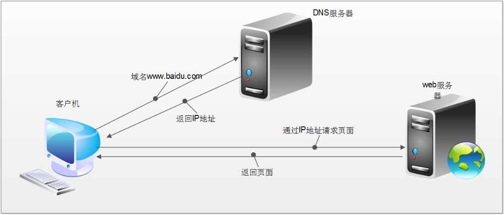
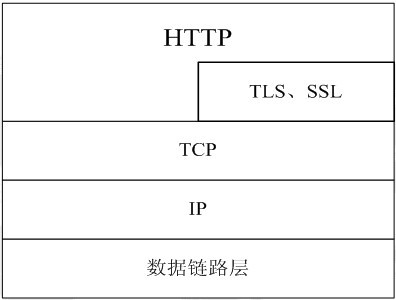
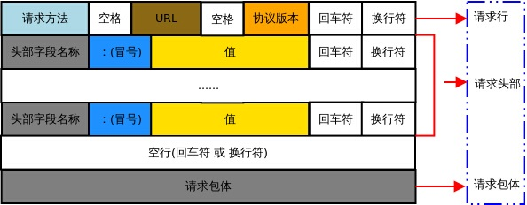
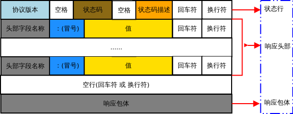

# HTTP

## 一 WEB工作方式
对于普通的上网过程，系统其实是这样做的：浏览器本身是一个客户端，当你输入`URL`的时候，
首先浏览器会去请求`DNS`服务器，通过`DNS`获取相应的域名对应的`IP`，
然后通过`IP`地址找到`IP`对应的服务器后，要求建立`TCP`连接，
等浏览器发送完`HTTP Request`（请求）包后，服务器接收到请求包之后才开始处理请求包，
服务器调用自身服务，返回`HTTP Response`（响应）包；客户端收到来自服务器的响应后
开始渲染这个`Response`包里的主体（`body`），等收到全部的内容随后断开与该服务器
之间的`TCP`连接。



`DNS`域名服务器（`Domain Name Server`）是进行域名(`domain name`)和
与之相对应的`IP`地址转换的服务器。`DNS`中保存了一张域名解析表，解析消息的域名。

一个**`Web`服务器也被称为`HTTP`服务器**，它通过`HTTP` (HyperText Transfer 
Protocol 超文本传输协议)协议与客户端通信。这个客户端通常指的是`Web`浏览器
(其实手机端客户端内部也是浏览器实现的)。

`Web`服务器的工作原理可以简单地归纳为：
* 客户机通过TCP/IP协议建立到服务器的TCP连接
* 客户端向服务器发送HTTP协议请求包，请求服务器里的资源文档
* 服务器向客户机发送HTTP协议应答包，如果请求的资源包含有动态语言的内容，那么服务器会调用动态语言的解释引擎负责处理“动态内容”，并将处理得到的数据返回给客户端
* 客户机与服务器断开。由客户端解释HTML文档，在客户端屏幕上渲染图形结果

## 二 HTTP协议
超文本传输协议(`HTTP，HyperText Transfer Protocol`)是互联网上应用最为广泛的一种
网络协议，它**详细规定了浏览器和万维网服务器之间互相通信的规则**，
通过因特网传送万维网文档的数据传送协议。


`HTTP`协议通常承载于`TCP`协议之上，有时也承载于`TLS`或`SSL`协议层之上，
这个时候，就成了我们常说的`HTTPS`

> 补充：URL
> 
> `URL`全称为`Unique Resource Location`，用来表示网络资源，
> 可以理解为网络文件路径。
> 
> 基本`URL`的结构包含 *模式（协议）*、*服务器名称（IP地址）*、*路径和文件名*。
> 常见的协议/模式如`http、https、ftp`等。服务器的名称或`IP`地址后面有时还跟
> 一个冒号和一个端口号。再后面是到达这个文件的路径和文件本身的名称
> 
> `URL`的长度有限制，不同的服务器的限制值不太相同，但是不能无限长
> 

### 2.1 http协议请求包数据格式
`HTTP`请求报文由 **请求行、请求头部、空行、请求包体** `4` 个部分组成，如下图所示：


1. 请求行: 由**方法字段**、**URL字段** 和 **HTTP协议版本字段** `3`个部分组成，
   他们之间使用 *空格* 隔开。常用的 `HTTP` 请求方法有 `GET、POST`。

* **GET**
    * 当客户端要从服务器中读取某个资源时，使用`GET` 方法。`GET` 方法要求服务器
      将`URL` 定位的资源放在响应报文的数据部分，回送给客户端，即向服务器请求某个资源。
    * 使用`GET`方法时，请求参数和对应的值附加在 `URL` 后面，利用一个问号(“`?`”)
      代表`URL` 的结尾与请求参数的开始，传递参数长度受限制，因此`GET`方法不适合用于
      上传数据。
    * 通过`GET`方法来获取网页时，参数会显示在浏览器地址栏上，因此保密性很差。
* **POST**
    * 当客户端给服务器提供信息较多时可以使用`POST` 方法，`POST` 方法向服务器提交
      数据，比如完成表单数据的提交，将数据提交给服务器处理。
    * `GET` 一般用于获取/查询资源信息，`POST` 会附带用户数据，一般用于更新资源信息。
      `POST` 方法将请求参数封装在`HTTP` 请求数据中，而且长度没有限制，
      因为`POST`携带的数据，在`HTTP`的请求正文中，以名称/值的形式出现，
      可以传输大量数据。

2. 请求头: 请求报文添加了一些附加信息，由“`名/值`”对组成，每行一对，
   名和值之间使用冒号分隔。请求头部通知服务器有关于客户端请求的信息

|请求头|含义|
|:---:|:---:|
`User-Agent`|请求的浏览器类型
`Accept`|客户端可识别的响应内容类型列表，星号“ * ”用于按范围将类型分组，用“ */* ”指示可接受全部类型，用“ type/* ”指示可接受 type 类型的所有子类型
`Accept-Language`|客户端可接受的自然语言
`Accept-Encoding`|客户端可接受的编码压缩格式
`Accept-Charset`|可接受的应答的字符集
`Host`|请求的主机名，允许多个域名同处一个IP 地址，即虚拟主机  connection	连接方式(close或keepalive)
`Cookie`|存储于客户端扩展字段，向同一域名的服务端发送属于该域的cookie

3. 空行: 最后一个请求头之后是一个空行，发送**回车符和换行符**，
   通知服务器以下不再有请求头。

4. 请求包体: 请求包体不在`GET`方法中使用，而在`POST`方法中使用。
   `POST`方法适用于需要客户填写表单的场合。与请求包体相关的最常使用的
   是包体类型`Content-Type`和包体长度`Content-Len`


### 2.2 http协议响应包数据格式



1. **状态行**: 状态行由 *`HTTP` 协议版本字段*、 *状态码* 和 *状态码的描述文本* 
   `3`个部分组成，他们之间使用空格隔开。
   
    * 状态码：状态码由三位数字组成，第一位数字表示响应的类型，
      常用的状态码有五大类如下所示：

|状态码|含义|
|:---:|:---:|
`1xx`|表示服务器已接收了客户端请求，客户端可继续发送请求
`2xx`|表示服务器已成功接收到请求并进行处理
`3xx`|表示服务器要求客户端重定向
`4xx`|表示客户端的请求有非法内容
`5xx`|表示服务器未能正常处理客户端的请求而出现意外错误


2. 响应头部

响应头可能包括：

|响应头|含义|
|:---:|:---:|
`Location`|`Location`响应报头域用于重定向接受者到一个新的位置
`Server`|`Server` 响应报头域包含了服务器用来处理请求的软件信息及其版本
`Vary`|指示不可缓存的请求头列表
`Connection`|连接方式

3. 空行

    最后一个响应头部之后是一个空行，发送回车符和换行符，通知服务器以下不再有响应头部。

4. 响应包体

    服务器返回给客户端的文本信息。

## 三 GoHTTP

### 3.1 HTTP服务端

首先注册处理函数`http.HandleFunc()`，设置回调函数`handler`。
而后绑定服务器的监听地址`http.ListenAndserve()`。

```go
package main

import (
	"fmt"
	"net/http"
)

//服务端编写的业务逻辑处理程序 —— 回调函数  
func myHandler(w http.ResponseWriter, r *http.Request) {
	fmt.Println("method = ", r.Method) //请求方法
	fmt.Println("URL = ", r.URL)       // 浏览器发送请求文件路径
	fmt.Println("header = ", r.Header) // 请求头
	fmt.Println("body = ", r.Body)     // 请求包体
	fmt.Println(r.RemoteAddr, "连接成功")  //客户端网络地址

	w.Write([]byte("hello http")) //给客户端回复数据
}

func main() {
	http.HandleFunc("/hello", myHandler) // 注册处理函数

	//该方法用于在指定的 TCP 网络地址 addr 进行监听，然后调用服务端处理程序来处理传入的连接请求。
	//该方法有两个参数：第一个参数 addr 即监听地址；第二个参数表示服务端处理程序，通常为nil //当参2为nil时，服务端调用 http.DefaultServeMux 进行处理
	http.ListenAndServe("127.0.0.1:8000", nil)
}
```

ResponseWriter接口，用于写回数据到客户端
```
type ResponseWriter interface {
   Header() Header			
   Write([]byte) (int, error)	
   WriteHeader(int)			
}
```

Request结构体，用于描述请求的结构体
```
type Request struct {
	Method string		// 浏览器请求方法 GET、POST…
	URL *url.URL		// 浏览器请求的访问路径
	……
	Header Header		// 请求头部
	Body io.ReadCloser	// 请求包体
	RemoteAddr string	// 浏览器地址
	……
	ctx context.Context
}
```

**练习: 访问文件**

```go
package main

import (
	"fmt"
	"net/http"
	"os"
)

func OpenSendFile(fNmae string, w http.ResponseWriter) {
	pathFileName := "C:/Users/dyp/Desktop/golang/go进阶" + fNmae
	f, err := os.Open(pathFileName)
	if err != nil {
		fmt.Println("Open err:", err)
		w.Write([]byte(" No such file or directory !"))
		return
	}
	defer f.Close()

	buf := make([]byte, 4096)
	for {
		n, _ := f.Read(buf) // 从本地将文件内容读取。
		if n == 0 {
			return
		}
		w.Write(buf[:n]) // 写到 客户端（浏览器）上
	}
}

func myHandler(w http.ResponseWriter, r *http.Request) {
	fmt.Println("客户端请求：", r.URL)
	OpenSendFile(r.URL.String(), w)
}

func main() {
	// 注册回调函数
	http.HandleFunc("/", myHandler)
	// 绑定监听地址
	http.ListenAndServe("127.0.0.1:8000", nil)
}
```

## 3.2 HTTP客户端

Response结构体: 描述HTTP响应的结构体
```
type Response struct {
   Status     string // e.g. "200 OK"
   StatusCode int    // e.g.  200
   Proto      string // e.g. "HTTP/1.0"
   ……
   Header Header
   Body io.ReadCloser
   ……
}
```

http客户端在之后的爬虫文章详细解析。

```go
package main

import (
	"fmt"
	"net/http"
)

func main() {
	// 使用Get方法获取服务器响应包数据
	//resp, err := http.Get("http://www.baidu.com")
	resp, err := http.Get("https://docs.python.org/zh-cn/3.7/library/http.html")
	if err != nil {
		fmt.Println("Get err:", err)
		return
	}
	defer resp.Body.Close()

	// 获取服务器端读到的数据
	fmt.Println("Status = ", resp.Status)         // 状态
	fmt.Println("StatusCode = ", resp.StatusCode) // 状态码
	fmt.Println("Header = ", resp.Header)         // 响应头部
	fmt.Println("Body = ", resp.Body)             // 响应包体

	buf := make([]byte, 4096) // 定义切片缓冲区，存读到的内容
	var result string
	// 获取服务器发送的数据包内容
	for {
		n, err := resp.Body.Read(buf) // 读body中的内容。
		if n == 0 {
			fmt.Println("Body.Read err:", err)
			break
		}
		result += string(buf[:n]) // 累加读到的数据内容
	}
	// 打印从body中读到的所有内容
	fmt.Println("result = ", result)
}
```