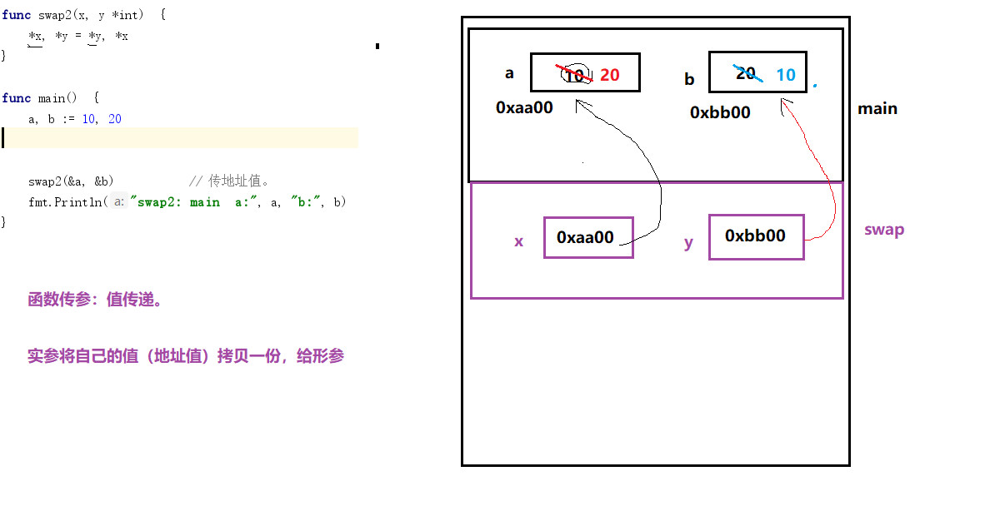

## 指针
指针就是地址。 指针变量就是存储地址的变量。
* `*p`： 解引用、间接引用。
* 栈帧：用来给函数运行提供内存空间。 取内存于 stack 上。
  .png)
  * 当函数调用时，产生栈帧。函数调用结束，释放栈帧。
  * 栈帧存储： 1. 局部变量。 2. 形参。 （形参与局部变量存储地位等同） 3. 内存字段描述值 
    
* 指针使用注意：
  * 空指针：未被初始化的指针。`var p *int	*p --> err`
  * 野指针：被一片无效的地址空间初始化。
    
变量存储：
    * 等号 左边的变量，代表 变量所指向的内存空间。	（写）
    * 等号 右边的变量，代表 变量内存空间存储的数据值。	（读）

* 指针的函数传参（传引用）。
    * 传地址（引用）：将形参的地址值作为函数参数传递。
    * 传值（数据据）：将实参的 值 拷贝一份给形参。
      .jpg)
    * 传引用：	在A栈帧内部，修改B栈帧中的变量值。
      


* 切片：
	* 为什么用切片：
        1. 数组的容量固定，不能自动拓展。
		2. 值传递。 数组作为函数参数时，将整个数组值拷贝一份给形参。
		* 在Go语言当，我们几乎可以在所有的场景中，使用 切片替换数组使用。
	* 切片的本质：
      * 不是一个数组的指针，是一种数据结构体，用来操作数组内部元素。 
    * 数组和切片定义区别：
      * 创建数组时 [ ] 指定数组长度。
      * 创建切片时， [] 为空，或者 ...
      * `切片名称 [ low : high : max ]`
		* low: 起始下标位置
		* high：结束下标位置	len = high - low
		* 容量：cap = max - low
    * 截取数组，初始化 切片时，没有指定切片容量时， 切片容量跟随原数组（切片）。
      * `s[:high:max]`: 从 0 开始，到 high结束。（不包含）
      * `s[low:]`:从low 开始，到 末尾
      * `s[: high]`:	从 0 开始，到 high结束。容量跟随原先容量。【常用】
	* 切片创建：
		1. 自动推导类型创建 切片。slice := []int {1, 2, 4, 6}
		2. slice := make([]int, 长度，容量)
		3. slice := make([]int, 长度）		创建切片时，没有指定容量， 容量== 长度。【常用】	

	* 切片做函数参数 —— 传引用。（传地址）
	* append：在切片末尾追加元素
		* `append(切片对象， 待追加元素)`
		* 向切片增加元素时，切片的容量会自动增长。1024 以下时，一两倍方式增长。
	* copy：
      * `copy(目标位置切片， 源切片)`: 拷贝过程中，直接对应位置拷贝。

	* 去除字符串切片中的重复单词
	```go
	package main
	
	import "fmt"
	
	func noSame(data []string) []string{
		out := data[:1]
		A:
		for _, word := range data {
			for _, w :=range out {
				if w == word {
					continue A
				}
			}
			out = append(out, word)
		}
		return out
	}
	
	func main() {
		data := []string{"red", "black", "red", "pink", "blue", "pink", "blue"}
		afterData := noSame(data)
		fmt.Println(afterData)
	}
	```


* map：
	* `字典、映射`  `key-value`	
      * key： 唯一、无序。 不能是引用类型数据。
      * map 不能使用 cap（）

	* 创建方式：
		1. `var m1 map[int]string`: 不能存储数据

		2. `m2 := map[int]string{}`: 能存储数据

		3. `m3 := make(map[int]string)`: 默认`len = 0`

		4. `m4 := make(map[int]string, 10)`: 指定长度创建
	* 初始化：
		1. `var m map[int]string = map[int]string{ 1: "aaa", 2:"bbb"}`: 保证key彼此不重复。
		2. `m := map[int]string{ 1: "aaa", 2:"bbb"}`

	* 赋值:
		* 赋值过程中，如果新`map`元素的`key`与原`map`元素`key`相同 	——> 覆盖（替换）
        * 赋值过程中，如果新`map`元素的`key`与原`map`元素`key`不同	——> 添加
	* map的使用：
		* 遍历map：
			* `for  key, value := range map`
			* `for  key值 := range map`
		* 判断map中key是否存在。
          * `map[下标]`运算：返回两个值，第一个表 `value` 的值，如果`value`不存在。`nil`
            第二个表`key`是否存在的`bool`类型。存在`true`， 不存在`false`
	* 删除map：
      * `delete（map， key）`: 删除一个不存在的`key`，不会报错。
   * `map` 做函数参数和返回值，传引用。
	

* 结构体：是一种**数据类型**。
	```
	type Person struct {
		name string 
		sex  byte
		age int
	}
	类型定义 （地位等价于 int byte bool string ....） 通常放在全局位置。
	```

	* 普通变量定义和初始化：
		1. 顺序初始化: 依次将结构体内部所欲成员初始化。 
		   * `var man Person = Person{"andy"， 'm',  20}`
		2. 指定成员初始化：	   
		   * `man := Person{name:"rose", age:18}`: 未初始化的成员变量，取该数据类型对应的默认值

	* 普通变量的赋值和使用：使用“.”索引成员变量。
		```
		var man3 Person
		man3.name = "mike"
		man3.sex = 'm'
		man3.age = 99
		```

	* 结构体变量的比较：
		1. 比较： 只能使用 `==` 和 `!=` 不能 `> < >= <=...`
		2. 相同结构体类型（成员变量的类型、个数、顺序一致）变量之间可以直接赋值。

	* 结构体地址：**结构体变量的地址 == 结构体首个元素的地址**。

	* 结构体传参：`unSafe.Sizeof(变量名)`: 此种类型的变量所占用的内存空间大小
		* 将结构体变量的值拷贝一份，传递。	—— 几乎不用。 内存消耗大，效率低。

	* 指针变量定义和初始化：
		1. 顺序初始化: 依次将结构体内部所欲成员初始化。
		   ```
           var man *Person = &Person{"andy"， 'm',  20}
		   ```
		2. 单一初始化
			```
			new(Person)
			p := new(Person)
			p.name = "name"
			p.age = 10
			```
	* 指针索引成员变变量：使用“.”索引成员变量
		```
		var man3 Person
		man3.name = "mike"
		man3.sex = 'm'
		man3.age = 99
		```
		
	* 结构体地址：**结构体指针变量的值 == 结构体首个元素的地址**。

	* 结构体指针传参：`unSafe.Sizeof(指针)`： 不管何种类型的指针，在 64位操作系统下，大小一致。均为 8 字节！！！
  		* 将结构体变量地址值，传递（传引用）。	—— 使用频率非常高！！！


练习：
定义一个结构体，包含成员`string、int、bool、[]string`.
* 在main函数中定义结构体 “普通变量”， 不初始化。 封装函数 initFunc， 在该函数内初始化 ， main 函数中打印查看。


结构体指针做函数返回值：
* 不能返回局部变量的地址。—— 局部变量保存栈帧上，函数调用结束后，栈帧释放。局部变量的地址，不再受系统保护，随时可能分配给其他程序。
* 可以返回局部变量的值。

**字符串处理函数**：

	1. 字符串按 指定分割符拆分：	Split

			ret := strings.Split(str, " I")

	2. 字符串按 空格拆分： Fields

			ret = strings.Fields(str)

	3. 判断字符串结束标记 HasSuffix

			flg := strings.HasSuffix("test.abc", ".mp3")

	4. 判断字符串起始标记 HasPrefix

			flg := strings.HasPrefix("test.abc", "tes.")

**文件操作**：

	1. 创建文件  Create： 	文件不存在创建， 文件存在，将文件内容清空。

		参数：name， 打开文件的路径： 绝对路径、相对路径		目录分割符：/ 

	2. 打开文件 Open：		以只读方式打开文件。文件不存在，打开失败。

		参数：name， 打开文件的路径： 绝对路径、相对路径

	3. 打开文件 OpenFile：	以只读、只写、读写 方式打开文件。文件不存在，打开失败。

		参1：name， 打开文件的路径： 绝对路径、相对路径

		参2：打开文件权限： O_RDONLY、O_WRONLY、O_RDWR

		参3：一般传 6

**写文件**：

	按字符串写：WriteString（）	--> n个写入的字符个数

		n, err := f.WriteString("123")

		回车换行：	windows： \r\n	Linux: \n
	
	按位置写:
		Seek(): 	修改文件的读写指针位置。

		参1： 偏移量。 正：向文件尾偏， 负：向文件头偏

		参2： 偏移起始位置：	
	
			io.SeekStart: 文件起始位置

			io.SeekCurrent： 文件当前位置

			io.SeekEnd: 文件结尾位置

		返回值：表示从文件起始位置，到当前文件读写指针位置的偏移量。

		off, _ := f.Seek(-5, io.SeekEnd)
	按字节写：
		writeAt():  在文件制定偏移位置，写入 []byte ,  通常搭配 Seek()

		参1： 待写入的数据
		
		参2：偏移量

		返回：实际写出的字节数。

		n, _ = f.WriteAt([]byte("1111"), off)	

**读文件**：
* 按行读
	1. 创建一个带有缓冲区的 Reader（读写器）
		```
  		reader : = bufio.NewReader(打开的文件指针)
  		```

	2. 从reader的缓冲区中 ，读取指定长度的数据。数据长度取决于 参数 dlime
		```
		buf, err := reader.ReadBytes( ' \n' )
		```
		* 判断到达文件结尾：`if err != nil && err == io.EOF`
		  文件结束标记，是要单独读一次获取到的。
	
	3. 缓冲区：内存中的一块区域，用来减少物理磁盘访问操作。
	   《计算硬件及组成原理》 —— 机械工业出版社。

* 按字节读、写文件。
  * read([]byte):  按字节读文件 
  * write([]byte)： 按字节字节

* 目录操作：
	* 打开目录： ·OpenFile·

	  * 打开目录 ·OpenFile·：	以只读方式打开目录。

		* 参1：name， 打开目录的路径： 绝对路径、相对路径
		* 参2：打开目录权限： O_RDONLY
		* 参3：os.ModeDir
		* 返回值： 返回一个可以读目录的 文件指针。

	* 读目录：Readdir
		* 原型：`func (f *File) Readdir(n int) ([]FileInfo, error)` 			
			* 参数: 欲打开的目录项个数。 -1 ， 表所有

			* 返回值：`FileInfo` 
				```
				type FileInfo interface {
				Name() string       		// base name of the file
				Size() int64        		// length in bytes for regular files; system-dependent for others
				Mode() FileMode     		// file mode bits
				ModTime() time.Time 	// modification time
				IsDir() bool        		// abbreviation for Mode().IsDir()
				Sys() interface{}   		// underlying data source (can return nil)
				}
				```

**统计字符串中出现的汉字字数**
```go
package main

import "unicode"
import "fmt"

func main() {
	s1 := "hello沙河"
	// 1. 依次获取每个字符
	// 2. 判断是否为汉字
	// 3. 统计汉字出现的次数
	count := 0
	
	for _, v := range s1 {
	if unicode.Is(unicode.Han, v) {
	count++
	}
	}
	fmt.Println(count)
}
```
**统计单词出现的次数**
```go
package main

import (
	"strings"
	"fmt"
)

func main() {
	s2 := "how do you do ?"
	m1 := make(map[string]int, 10)
	for _, word := range strings.Fields(s2) {
		_, exist := m1[word]
		if exist {
			m1[word] += 1
		} else {
			m1[word] = 1
		}
	}
	fmt.Println(m1)
}
```

**回文字符串**
```go
package main

import "fmt"

func main() {
	s3 := "上海自来水来自海上"
	r := []rune(s3)
	var i = 0
	var j = len(r) - 1
	var isOk = false
	for ; i != j ;i ++ {
		if r[i] == r[j] {
			isOk = true
		}else {
			isOk = false
			break
		}
		j--
	}

	if isOk {
		fmt.Println("是回文")
	} else {
		fmt.Println("不是回文")
	}
}
```

