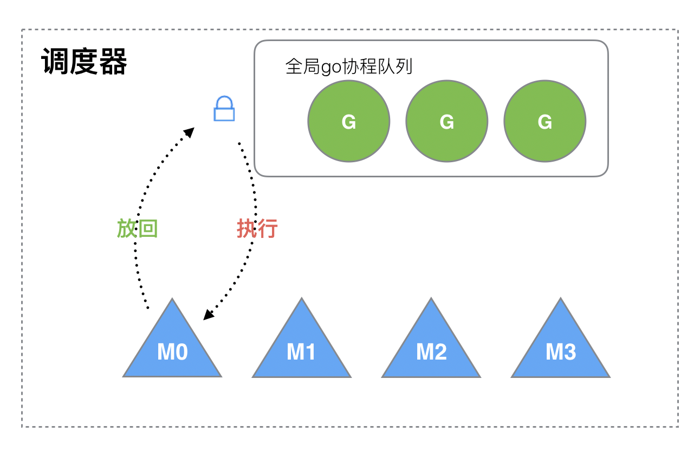

# 一 并行与并发

* 并行(`parallel`): 指在同一时刻，有 **多条指令在多个处理器** 上同时执行

* 并发(`concurrency`):指在 *同一时刻只能有一条指令* 执行，但多个进程指令被快速
  的轮换执行，使得在宏观上具有多个进程同时执行的效果，但在微观上并不是同时执行的，
  只是把时间分成若干段，通过`cpu`时间片轮转使多个进程快速交替的执行
    * 宏观上同一时间段执行多条指令
    * 微观上同一时刻只执行一条指令

**举个例子**
* 并行: 是两个队列同时使用两台咖啡机 （真 的多任务）
* 并发: 是两个队列交替使用一台咖啡机 （假 的多任务）


# 二 常见的并发技术

## 2.1 进程并发
### 2.1.1 程序与进程
* 程序: 是指编译好的二进制文件，存储在磁盘上，
  不占用系统资源(`cpu`、内存、打开的文件、设备、锁....)
* 进程: 是一个抽象的概念，与操作系统原理联系紧密。进程是活跃的程序，占用系统资源。
  在内存中执行。(程序运行起来，产生一个进程)


### 2.1.2 进程状态模型

* 三态模型

  
    * 运行态 ： 进程在处理机上执行时 ，称该进程处于运行状态。
      显然，单处理机系统，处于运行状态的进程只有一个。
    * 就绪态 ： 进程获得了处理机外的一切所需资源，一旦获得处理机即可运行，
      则称为进程的就绪态。
    * 阻塞态 ：进程正在等待某一事件发生(例如，I/O事件)而暂时停止运行，
      这时即使把处理机分配给该进程也无法运行，故称该状态为阻塞态
* 五态模型

  进程状态还可以分为五种: **新建、就绪、运行、阻塞、终止**
  
    * 新建态: *进程刚被创建还没有被提交* 的状态，并等待系统完成创建的所有必要信息。
      新建进程需要经过两个阶段:
        * 第一阶段，**为一个新进程创建必要的管理信息**；
        * 第二阶段，**让进程进入就绪态**。

      新建态可以使操作系统根据系统的性能和内存容量限制推迟新建态进程的提交。

    * 终止态: 进程停止运行的状态 ，分为两个阶段：
        * 第一阶段，**等待操作系统进行善后处理**；
        * 第二阶段，**释放内存**。

      终止态的目的是防止系统进行善后处理时引起资源分配不当等问题。

### 2.1.3 进程同步与互斥
* 同步: 指进程间完成一项任务时直接发生相互作用的关系

* 互斥: 指系统中进程互斥使用临界资源

**同步与互斥的实现PV操作**

* P操作：表示申请资源
* V操作：表示释放资源

**PV操作实现同步与互斥**
* **PV操作实现进程的互斥**: 令信号量mutex的初始值为1，进入临界区时执行P操作，退出临界区执行V操作
* **PV操作实现进程的同步**: 并发执行的进程间的相互合作而引起相互制约的问题。
  实现进程同步的一种方法是将一个信号量与消息相联系，当信号量为0时表示消息未产生，
  否则表示消息已经来到。

### 2.1.4 进程调度算法
常用的进程调度算法有**先来先服务、时间片轮转、优先级调度、多级反馈调度**算法
1. **先来先服务(First Come First Served, FCFS)**。 **按照作业提交或进程变为就绪状态的先后次序分配CPU** ，即每当进入进程调度时，总是将就绪队列队首的进程投入运行。FCFS调度算法有利于长作业，有利于计算密集型作业；不利于I/O繁忙的作业。 **主要用于宏观调度**。

2. **时间片轮转**。主要用于微观调度，目的时提高资源利用率。可以提高进程并发性和响应时间特性，从而提高资源利用率。时间片的长度选择方法一般有两种
    * **固定时间片**。分配给每个进程相等的时间片，所有进程都公平执行，是一种简单有效的方法。
    * **可变时间片**。根据进程不同的要求对时间片的大小实时修改，可以更好地提高效率。

3. **优先级调度**。让每一个进程都拥有一个优先数，通常数值大地表示优先级高，系统在调度时总选择优先级高地占用CPU。优先级调度分为**静态优先级和动态优先级**
    *  **静态优先级** 。 **进程的优先级在创建时确定，直到终止也不会改变** 。确定优先级的因素有进程类型(系统进程优先级高)、对资源的需求(对CPU和内存需求较少的进程优先级高)、用户要求(紧迫程度和付费多少)
    *  **动态优先级** 。 **创建进程时赋予一个优先级，在进程运行过程中还可以改变，以便于获取更好的调度性能** 。例如，就绪队列中，随着等待时间增长，优先级将提高。这样对于优先级低的进程在等待足够时间后，其优先级提高到可被调度执行。进程每执行一个时间片后，优先级降低，从而当一个进程持续执行时，其优先级会降低到让出CPU。

4. **多级反馈调度**。 **时间片轮转算法和优先级算法的综合与发展** 。优点是照顾短进程以提高系统吞吐量、缩短了平均周转时间；照顾I/O型进程以获得较好的I/O设备利用率和缩短响应时间不必估计进程的执行时间，动态调节优先级。

### 2.1.5 使用进程都常见问题
* 系统开销比较大，占用资源比较多，开启进程数量比较少。
* 在unix/linux系统下，还会产生“孤儿进程”和“僵尸进程”。
    * 父进程永远无法预测子进程 到底什么时候结束。
      当一个进程完成它的工作终止之后，它的父进程需要调用系统调用取得子进程的终止状态

**孤儿进程**
* **父进程先于子进程结束**，则子进程成为孤儿进程，子进程的父进程成为`init`进程，
  称为`init`进程领养孤儿进程。

**僵尸进程**
* **子进程终止，父进程尚未回收子进程残留资源（PCB），该资源存放于内核中**，
  变成僵尸（Zombie）进程。


## 2.2 线程并发
### 2.2.1 线程
传统的进程有两个基本属性： **可拥有资源的独立单位，可独立调度和分配的基本单位**。
进程的 **创建、撤销、切换** 系统必须为之付出较大的时空开销 ，
因此在系统中设置的进程数目不宜过多，进程切换的频率不宜过高；这样就限制了并发程度。

为了提高并发量**引入线程，将传统的进程的两个基本属性分开**，
**线程作为调度和分配**的基本单位， **进程作为独立分配资源**的单位。
用户通过创建线程来完成任务，以减少程序并发时付出的时空开销。

线程是进程中的一个实体，是被 **系统独立分配和调度** 的基本单位，
线程基本上不拥有资源，只拥有一点运行必不可少的资源，
可以与同一个进程的其他线程共享进程所拥有的全部资源。

线程可以创建另一个线程，同一个进程中的多个线程可以并发执行。
线程也具有 **就绪、运行、阻塞** 三种基本状态。

* **线程: 最小的执行单位**
* **进程: 最小分配资源单位**

### 2.2.2 线程同步
**线程同步，指一个线程发出某一功能调用时，在没有得到结果之前，该调用不返回。
同时其它线程为保证数据一致性，不能调用该功能。**
****
**示例**
内存中有共享的`100`字节，线程`T1`欲填入全`1`， 线程`T2`欲填入全`0`。
但如果`T1`执行了`50`个字节失去`cpu`，`T2`执行，会将`T1`写过的内容覆盖。
当`T1`再次获得`cpu`继续从失去`cpu`的位置向后写入`1`，当执行结束，
内存中的`100`字节，既不是全`1`，也不是全`0`。
****
**所有"多个控制流，共同操作一个共享资源"的情况，都需要同步。**

#### (1) 互斥锁
`Linux`中提供一把互斥锁`mutex`（也称之为互斥量）。

每个线程在对资源操作前都尝试**先加锁**，成功加锁才能操作(访问)，操作结束解锁。

资源还是共享的，线程间也还是竞争的

但通过“锁”就将资源的访问变成互斥操作，而后与时间有关的错误也不会再产生了

**同一时刻，只能有一个线程持有该锁**

当`A`线程对某个全局变量加锁访问，线程`B`在访问前尝试加锁就拿不到锁，线程`B`阻塞。
`C`线程不去加锁，而直接访问该全局变量，依然能够访问，但会出现数据混乱。

#### (2) 读写锁
与互斥量类似，但读写锁允许更高的并行性。其特性为：**写独占，读共享**。

特别强调：*读写锁只有一把*，但其具备*两种状态*：
1. 读模式下加锁状态 (读锁)
2. 写模式下加锁状态 (写锁)

* 读写锁特性
1. *写模式加锁*时，解锁前，所有对该锁请求加锁的线程都会被阻塞。
2. *读模式加锁*时，如果线程以读模式对其加锁会成功；如果线程以写模式加锁会阻塞。
3. *读模式加锁*时，既有试图以写模式加锁的线程，也有试图以读模式加锁的线程。
   那么读写锁会 *阻塞* 随后的 *读模式锁请求*。优先满足写模式锁。**读锁、写锁并行阻塞**，
   *写锁优先级高*

读写锁也叫*共享-独占锁*。当读写锁以读模式锁住时，它是以共享模式锁住的；
当它以写模式锁住时，它是以独占模式锁住的。**写独占、读共享**。

读写锁非常适合于对数据结构读的次数远大于写的情况。

## 2.3 协程并发
协程(`coroutine`)，也叫轻量级线程。单线程下实现并发, 监听程序中的io操作，
一旦出现`io`就在代码上完成切换。提高程序的运行效率，协程不是被操作系统内核所管理，
而完全是由程序所控制

与传统的系统级线程和进程相比，协程最大的优势在于"轻量级"。
可以轻松创建上万个而不会导致系统资源衰竭

一个线程中可以有任意多个协程，但某一时刻只能有一个协程在运行，
多个协程分享该线程分配到的计算机资源。

## 2.4 go并发
`Go`在语言级别支持协程，叫`goroutine`。`Go`语言标准库提供的所有系统调用操作
（包括所有同步`IO`操作），都会出让`CPU`给其他`goroutine`。
这让轻量级线程的切换管理不依赖于系统的线程和进程，也不需要依赖于`CPU`的核心数量。

**`Go`从语言层面就支持并行**；同时，并发程序的内存管理有时候是非常复杂的，
而**`Go`语言提供了自动垃圾回收机制**。

`Go`语言为并发编程而内置的上层`API`基于顺序通信进程模型`CSP`
(`communicating sequential processes`)。这就意味着显式锁都是可以避免的，
因为`Go`通过相对安全的通道发送和接受数据以实现同步，这大大地简化了并发程序的编写。

`Go`语言中的并发程序主要使用两种手段来实现。`goroutine`和`channel`。

# 三 go并发

## 3.1 goroutine
Go语言中的`goroutine`就是一种让系统去帮助我们把任务分配到`CPU`上实现并发执行机制，
`goroutine`说到底其实就是协程，但`goroutine`是由`Go`的运行时(`runtime`)调度和管理的。
`Go`程序会智能地将 `goroutine` 中的任务合理地分配给每个`CPU`。
`Go`语言之所以被称为现代化的编程语言，就是因为它在语言层面已经
**内置了调度和上下文切换**的机制。

在`Go`语言编程中你不需要去自己写进程、线程、协程，你的技能包里只有一个技能`goroutine`，
当你需要让某个任务并发执行的时候，你只需要**把这个任务包装成一个函数**，
开启一个`goroutine`去执行这个函数就可以了，就是这么简单粗暴。


## 3.2 创建goroutine
`Go`语言中使用`goroutine`非常简单，只需要在调用函数的时候在前面加上`go`关键字，
就可以为一个函数创建一个`goroutine`。

一个`goroutine`必定对应一个函数，可以创建多个`goroutine`去执行相同的函数。

**示例：goroutine引入**
```go
package main

import (
	"fmt"
	"time"
)


func sing(){
	for i := 0; i < 10; i++ {
		fmt.Printf("---唱歌---%ds\n", i+1)
		time.Sleep(time.Second)
	}
}

func dance(){
	for i := 0; i < 10; i++ {
		fmt.Printf("---跳舞---%ds\n", i+1)
		time.Sleep(time.Second)
	}
}

func main()  {
	sing()
	dance()
}
```
这个示例中hello函数和下面的语句是串行的，总共耗时10秒。

下面使用goroutine实现并发执行
```go
package main

import (
	"fmt"
	"time"
)


func sing(){
	for i := 0; i < 10; i++ {
		fmt.Printf("---唱歌---%ds\n", i+1)
		time.Sleep(time.Second)
	}
}

func dance(){
	for i := 0; i < 10; i++ {
		fmt.Printf("---跳舞---%ds\n", i+1)
		time.Sleep(time.Second)
	}
}

func main()  {
	go sing()
	go dance()
}
```
运行该代码时，什么也没有输出，这是由于在程序启动时，
`Go`程序就会为`main()`函数创建一个默认的`goroutine`。

当`main()`函数返回的时候该`goroutine`就结束了，
所有在`main()`函数中启动的`goroutine`会一同结束

**使main函数不退出**
```go
package main

import (
	"fmt"
	"time"
)


func sing(){
	for i := 0; i < 10; i++ {
		fmt.Printf("---唱歌---%ds\n", i+1)
		time.Sleep(time.Second)
	}
}

func dance(){
	for i := 0; i < 10; i++ {
		fmt.Printf("---跳舞---%ds\n", i+1)
		time.Sleep(time.Second)
	}
}

func main()  {
	go sing()
	go dance()
	for{
		;
	}
}
```

* `go`语言中，当`main()`函数退出后，在`main()`中创建的所有`goroutine`都会被结束
    * **类似于守护进程**

**等待子goroutine运行结束**，使用`sync.WaitGroup`
```go
package main

import (
	"fmt"
	"sync"
	"time"
)

var wg sync.WaitGroup

func sing(){
	defer wg.Done()
	for i := 0; i < 10; i++ {
		fmt.Printf("---唱歌---%ds\n", i+1)
		time.Sleep(time.Second)
	}
}

func dance(){
	defer wg.Done()
	for i := 0; i < 10; i++ {
		fmt.Printf("---跳舞---%ds\n", i+1)
		time.Sleep(time.Second)
	}
}

func main()  {
	wg.Add(1)
	go sing()
	wg.Add(1)
	go dance()
	wg.Wait()
}
```
* `wg`: 是 `sync.WaitGroup` 结构体对象，

* `wg.Add(delta int)`: 登记`goroutine`，计数器加1
* `wg.Wait()`:等待子`goroutine`结束
* `wg.Done()`: 子`goroutine`结束 ，计数器减1

# 四 runtime包

runtime包是go程序提供调度`goroutine`

## 4.1 runtime.Gosched()

runtime.Gosched()该函数用于让出当前`goroutine`占用的`CPU`时间片，
调度器安排其他等待的任务运行，并在下次再获得`CPU`时间轮片的时候，
从该出让`CPU`的位置恢复执行。

```go
package main

import (
	"fmt"
	"runtime"
	"sync"
)

var wg sync.WaitGroup

func sing(){
	defer wg.Done()
	for i := 0; ; i++ {
		runtime.Gosched()  // 让出CPU时间片
		fmt.Printf("---唱歌---%ds\n", i+1)
	}
}

func dance(){
	defer wg.Done()
	for i := 0; ; i++ {
		fmt.Printf("---跳舞---%ds\n", i+1)
	}
}

func main()  {
	wg.Add(1)
	go sing()
	wg.Add(1)
	go dance()
	wg.Wait()
}
```
* 该程序会大量执行dance中的代码

## 4.2 runtime.Goexit()

调用 `runtime.Goexit()` 将立即终止当前 `goroutine` 执⾏，
调度器确保所有已注册 `defer` 延迟调用被执行。

```go
package main

import (
	"fmt"
	"runtime"
)

func main() {
	go func() {
		defer fmt.Println("A.defer")

		func() {
			defer fmt.Println("B.defer")
			runtime.Goexit() // 终止当前 goroutine, import "runtime"
			fmt.Println("B") // 不会执行
		}()

		fmt.Println("A") // 不会执行
	}() //不要忘记()

	//死循环，目的不让主goroutine结束
	for {
		;
	}
}
```

## 4.3 runtime.GOMAXPROCS()
调用 `runtime.GOMAXPROCS()` 用来设置可以并行计算的`CPU`核数的最大值，并返回之前的值。

**示例**
```go
package main

import "runtime"
import "fmt"

func main() {
	fmt.Println(runtime.GOMAXPROCS(2))  // 8 返回的是前一次的最大cpu数

	for {
		go fmt.Print(1)
		fmt.Print(0)
	}
}
```

# 四 goroutine调度模型GMP

## 4.1 进程线程的调度
### 单进程

1. 单一的执行流程，计算机只能一个任务一个任务处理。

2. 进程阻塞所带来的CPU时间浪费。

### 多进程/线程


* 当一个进程阻塞的时候，切换到另外等待执行的进程，
  这样就能尽量把CPU利用起来，CPU就不浪费了。


* 进程拥有太多的资源，进程的创建、切换、销毁，都会占用很长的时间，
  CPU虽然利用起来了，但如果进程过多，CPU有很大的一部分都被用来进行进程调度了

### 协程来提高CPU利用率
其实一个线程分为 *内核态* 线程和 *用户态* 线程

* 一个 *用户态线程* 必须要绑定一个 *内核态线程*，
  但是`CPU`并不知道有 *用户态线程* 的存在，它只知道它运行的是一个*内核态线程*
  (`Linux`的`PCB`进程控制块)。


* 内核线程依然叫 *线程(thread)*，用户线程叫 *协程(co-routine)*.

一个协程(co-routine)可以绑定一个线程(thread)，


多个协程(co-routine)绑定一个线程(thread)


多个协程(co-routine)绑定多个线程(thread)


**协程跟线程是有区别的，线程由`CPU`调度是抢占式的，协程由用户态调度是协作式的，
一个协程让出`CPU`后，才执行下一个协程。**

## 4.2 GMP调度模型

`Go`为了提供更容易使用的并发方法，使用了`goroutine`和`channel`。
`goroutine`来自协程的概念，让一组可复用的函数运行在一组线程之上，即使有协程阻塞，
该线程的其他协程也可以被`runtime`调度，转移到其他可运行的线程上。
最关键的是，程序员看不到这些底层的细节，这就降低了编程的难度，提供了更容易的并发。

`Go`中，协程被称为`goroutine`，它非常轻量，一个`goroutine`只占几`KB`，
并且这几`KB`就足够`goroutine`运行完，这就能在有限的内存空间内支持大量`goroutine`，
支持了更多的并发。虽然一个`goroutine`的栈只占几`KB`，但实际是可伸缩的，如果需要更多内容，
`runtime`会自动为`goroutine`分配。

### 4.2.1 GM调度(废弃)

* `G`是`Goroutine`的缩写，相当于操作系统的进程控制块`PCB`(`process control block`)。
  它包含：
    * 函数执行的指令和参数
    * 任务对象
    * 线程上下文切换
    * 字段保护
    * 字段的寄存器

  每个`Goroutine`都有一个不导出的`goid`

* `M`是一个线程，每个`M`都有一个线程的栈。如果没有给线程的栈分配内存，
  操作系统会给线程的栈分配默认的内存。当线程的栈制定，`M.stack->G.stack`,
  `M`的`PC`寄存器会执行`G`提供的函数。
  
**GM调度流程**

* `M`想要执行、放回`G`都必须访问全局`G`队列，并且`M`有多个，
  即多线程访问同一资源需要加锁进行保证互斥/同步，所以全局`G`队列是有互斥锁进行保护的

* 缺点
  * 创建、销毁、调度`G`都需要每个`M`获取锁，这就形成了 *激烈的锁竞争*。
  * `M`转移`G`会造成 **延迟和额外的系统负载**。比如当`G`中包含创建新协程的时候，
    `M`创建了`G’`，为了继续执行`G`，需要把`G’`交给`M’`执行，也造成了很差的局部性，
    因为`G’`和`G`是相关的，最好放在`M`上执行，而不是其他`M'`。
  * 系统调用(`CPU`在`M`之间的切换)导致频繁的线程阻塞和取消阻塞操作增加了系统开销。

### 4.2.2 GMP调度
在GM调度的基础上引进了`P(Processor)`，组成了`GMP`调度


* `P`(处理器，`Processor`)是一个抽象的概念，不是物理上的`CPU`。当一个`P`有任务，
  需要创建或者唤醒一个系统线程去处理它队列中的任务。

  `P`**决定同时执行的任务的数量**，`GOMAXPROCS`限制系统线程执行用户层面的任务的数量。

**GMP调度模型**


* **全局队列**（`Global Queue`：存放等待运行的`G`。

* **P的本地队列**: 同全局队列类似，存放的也是等待运行的`G`，存的数量有限，不超过`256`个。
  新建`G'`时，`G'`优先加入到`P`的本地队列，如果队列满了，则会把 *本地队列中一半的`G`* 移动到全局队列。

* **P列表**: 所有的`P`都在程序启动时创建，并保存在数组中，最多有GOMAXPROCS(可配置)个。

* **M**: 线程想运行任务就得获取`P`，从`P`的本地队列获取`G`，
  `P`队列为空时，`M`也会尝试从全局队列拿一批`G`放到`P`的本地队列，
  或从其他`P`的本地队列偷一半放到自己`P`的本地队列。`M`运行`G`，`G`执行之后，
  `M`会从`P`获取下一个`G`，不断重复下去。

`Goroutine`调度器和`OS`调度器是通过`M`结合起来的，每个`M`都代表了`1`个内核线程，
`OS`调度器负责把内核线程分配到`CPU`的核上执行。


### 4.2.3 关系P和M的数量及何时创建

1. **P的数量**

    由启动时环境变量`$GOMAXPROCS`或者是由`runtime`的方法`GOMAXPROCS()`决定。
   这意味着在程序执行的任意时刻都只有`$GOMAXPROCS`个`goroutine`在同时运行。

2. **M的数量**
   `go`语言本身的限制：`go`程序启动时，会设置`M`的最大数量，默认`10000`.
   但是内核很难支持这么多的线程数，所以这个限制可以忽略。
   `runtime/debug`中的`SetMaxThreads`函数，设置`M`的最大数量
    一个`M`阻塞了，会创建新的`M`。

`M`与`P`的**数量没有绝对关系**，一个`M`阻塞，`P`就会去创建或者切换另一个`M`，
所以，即使`P`的默认数量是`1`，也有可能会创建很多个`M`出来。

* `P`和`M`何时会被创建
    1. `P`何时创建: 在确定了`P`的最大数量`n`后，
       运行时系统(`runtime`)会根据这个数量创建`n`个`P`。
    2. `M`何时创建: 没有足够的`M`来关联`P`并运行其中的可运行的`G`。
       比如所有的`M`此时都阻塞住了，而`P`中还有很多就绪任务，就会去寻找空闲的`M`，
       而没有空闲的，就会去创建新的`M`。

### 4.2.4 调度器的设计策略
* **复用线程**: 避免频繁的创建、销毁线程，而是对线程的复用。
    1. `work stealing`机制: 当本线程无可运行的`G`时，尝试从其他线程绑定的`P`偷取`G`，而不是销毁线程。
    2. `hand off`机制: 当本线程因为`G`进行系统调用阻塞时，线程释放绑定的`P`，把`P`转移给其他空闲的线程执行

* **利用并行**: `GOMAXPROCS`设置`P`的数量，最多有`GOMAXPROCS`个线程分布在多个`CPU`
  上同时运行。`GOMAXPROCS`也限制了并发的程度，比如`GOMAXPROCS = 核数/2`，
  则最多利用了一半的`CPU`核进行并行。

* **抢占**: 在`coroutine`中要等待一个协程主动让出`CPU`才执行下一个协程，
  在`Go`中，一个`goroutine`最多占用`CPU` **10ms**，防止其他`goroutine`被饿死，
  这就是`goroutine`不同于`coroutine`的一个地方。  

* **全局`G`队列**: 在新的调度器中依然有全局`G`队列，但功能已经被弱化了，
  当`M`执行`work stealing`从其他`P`偷不到`G`时，它可以从全局`G`队列获取`G`。


**GMP调度流程**


1. 我们通过 `go func()`来创建一个`goroutine`
2. 有两个存储`G`的队列，一个是局部调度器`P`的本地队列, 一个是全局`G`队列。
   新创建的`G`会先保存在`P`的本地队列中，如果`P`的本地队列已经满了就会保存在全局的队列中
3. `G`只能运行在`M`中，一个`M`必须持有一个`P`，`M`与`P`是`1：1`的关系。
   `M`会从`P`的本地队列弹出一个可执行状态的`G`来执行，如果`P`的本地队列为空，
   就会想其他的`MP`组合偷取一个可执行的`G`来执行；
4. 一个`M`调度`G`执行的过程是一个循环机制；
5. 当`M`执行某一个`G`时候如果发生了`syscall`或则其余阻塞操作，`M`会阻塞，
   如果当前有一些`G`在执行，`runtime`会把这个线程`M`从`P`中摘除(`detach`)，
   然后再创建一个新的操作系统的线程(如果有空闲的线程可用就复用空闲线程)来服务于这个`P`；
6. 当`M`系统调用结束时候，这个`G`会尝试获取一个空闲的`P`执行，并放入到这个`P`的本地队列。
   如果获取不到`P`，那么这个线程`M`变成休眠状态， 加入到空闲线程中，
   然后这个`G`会被放入全局队列中。
   
### 4.2.5 调度器的生命周期

* `M0`: `M0`是启动程序后的编号为`0`的主线程，这个`M`对应的实例会在全局变量`runtime.m0`中，
  不需要在`heap`上分配，`M0`负责执行初始化操作和启动第一个`G`， 在之后`M0`就和其他的`M`一样了

* `G0`: `G0`是每次启动一个`M`都会第一个创建的`gourtine`，`G0`仅用于负责调度的`G`，
  `G0`不指向任何可执行的函数, 每个`M`都会有一个自己的`G0`。
  在调度或系统调用时会使用`G0`的栈空间, 全局变量的`G0`是`M0`的`G0`。
