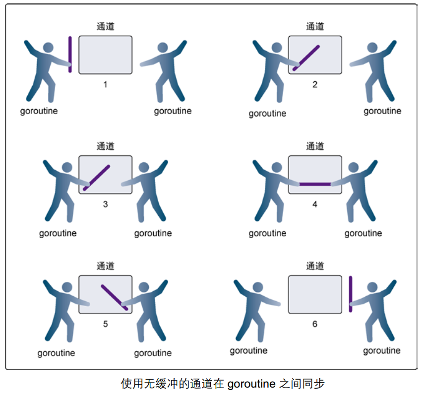
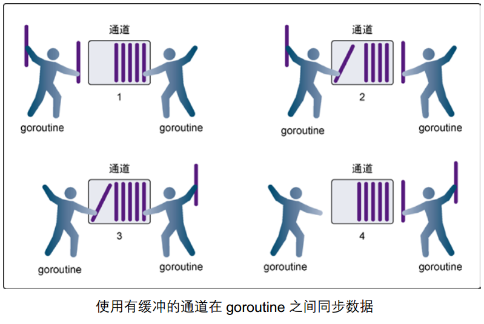
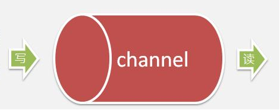
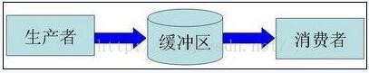

# 一 channel
单纯地将函数并发执行是没有意义的。函数与函数间需要交换数据才能体现并发执行函数的意义。

虽然可以使用共享内存进行数据交换，但是共享内存在不同的`goroutine`中容易发生竞态问题。
为了保证数据交换的正确性，必须使用互斥量对内存进行加锁，这种做法势必造成性能问题。

`Go`语言的并发模型是`CSP`（`Communicating Sequential Processes`），
提倡 **通过通信共享内存** 而不是 *通过共享内存而实现通信* 。

如果说`goroutine`是`Go`程序并发的执行体，`channel`就是它们之间的连接。
`channel`是可以让一个`goroutine`发送特定值到另一个`goroutine`的通信机制。

`Go` 语言中的通道（`channel`）是一种特殊的类型。通道像一个传送带或者队列，
总是遵循先入先出（`First In First Out`）的规则，保证收发数据的顺序。
**每一个通道都是一个具体类型的导管**，也就是声明`channel`的时候需要为其指定元素类型。

## 1.1 channel的创建
`channel`和`map` `slice`类似，`channel`也一个对应`make`创建的底层数据结构的引用。

当我们复制一个`channel`或用于函数参数传递时，我们只是拷贝了一个`channel`引用，
因此调用者和被调用者将引用同一个`channel`对象。和其它的引用类型一样，
`channel`的零值也是`nil`。

`channel`是一种引用类型。声明通道类型的格式如下：
```
var 变量 chan 元素类型
```
* 使用该方式定义的`channel`类型变量是零值，不能使用，需要初始化
* `channel`传递的元素是有确定的类型的。

**使用make初始化通道**
```
make(chan Type)  // 无缓冲区通道
make(chan Type, capacity) // 缓冲区大小为capacity的通道
```
* 当参数`capacity=0`时，`channel`是无缓冲阻塞读写的
* 当`capacity>0`时，`channel`有缓冲、是非阻塞的，直到写满`capacity`个元素才阻塞写入。


## 1.2 通道的操作
`channel`非常像生活中的管道，一边可以存放东西，另一边可以取出东西

通道有发送（`send`）、接收(`receive`）和关闭（`close`）三种操作。

* 发送和接收都使用`<-`符号
    * 默认情况下，`channel`接收和发送数据都是阻塞的，除非另一端已经准备好，
      这样就使得`goroutine`同步变的更加的简单，而不需要显式的`lock`。
    ```
    channel <- value //发送value到channel
    <-channel //接收并将其丢弃
    x := <-channel //从channel中接收数据，并赋值给x
    x, ok := <-channel //功能同上，同时检查通道是否已关闭或者是否为空
    ```
* 使用`close(ch)`函数关闭通道`ch`

关于关闭通道需要注意的事情是，只有在通知接收方`goroutine`所有的数据都发送完毕的时候才
需要关闭通道。通道是可以被垃圾回收机制回收的，它和关闭文件是不一样的，
在结束操作之后关闭文件是必须要做的，但关闭通道不是必须的。

**关闭后的通道有以下特点**：
* 对一个关闭的通道再发送值就会导致`panic`。
* 对一个关闭的通道进行接收会一直获取值直到通道为空。
* 对一个关闭的并且没有值的通道执行接收操作会得到对应类型的零值。
* 关闭一个已经关闭的通道会导致`panic`。


## 1.3 无缓冲与有缓冲channel

### 无缓冲channel
无缓冲的通道又称为阻塞的通道，只有在有人接收值的时候才能发送值。
**无缓冲的通道必须有接收才能发送**

无缓冲通道上的发送操作会阻塞，直到另一个`goroutine`在该通道上
执行接收操作，这时值才能发送成功，两个`goroutine`将继续执行。
相反，如果接收操作先执行，接收方的`goroutine`将阻塞，
直到另一个`goroutine`在该通道上发送一个值。

**无缓冲通道如下图**

* 发送方发送的值时，接收方未接收值，发送方将阻塞
* 接收方接收值时，发送方未发送值，接收方将阻塞

**用无缓冲通道进行通信将导致发送和接收的`goroutine`同步化。
因此，无缓冲通道也被称为`同步通道`。**

### 有缓冲channel

有缓冲的通道（`buffered channel`）是一种在被接收前能存储一个或者多个数据值的通道

* 只有通道中 *没有要接收的值* 时，*接收* 动作才会阻塞。
* 只有通道中 *没有可用缓冲区* 容纳被发送的值时，*发送* 动作才会阻塞。
* 可以使用内置的`len`函数获取通道内元素的数量
* 使用`cap`函数获取通道的容量，虽然我们很少会这么做。
* 缓冲区数据写满后，在写入数据就会阻塞
* 缓冲区数据读取完后，在读取数据就会阻塞


# 二 channel使用

## 2.1 利用channel实现goroutine同步
**案例：模拟2人使用打印机场景**
```go
package main

import (
	"fmt"
	"sync"
	"time"
)

var ch = make(chan int)  // 无缓冲通道
var wg sync.WaitGroup

func printer(s string) {
	for _, recv := range s {
		fmt.Printf("%recv", recv)
		time.Sleep(300 * time.Millisecond)
	}

}

func person1() {
	defer wg.Done()

	printer("hello")
	ch <- 888  // 写入数据
}

func person2()  {
	defer wg.Done()

	<- ch  // 读取数据
	printer(" world!\n")
}


func main() {
	wg.addNode(2)
	go person1()
	go person2()
	wg.Wait()
}
```
* person1先获取到打印机，那么person1就要执行完了，其他人才能获取
  打印机
* 使用无缓冲通道来实现该同步操作，在`person1`中通知`person2`
  完成打印，此时`person2`才能运行
* `ch <- 888  // 写入数据`: `person1`中向通道写入数据，没有人接收
  则会阻塞`person1`
    * 只有当`person2`读取了`person1`写入通道的数据，`person1`才能执行
* `<- ch  // 读取数据`: `person2`读取数据，当`person1`没有执行到
  写入数据时，`person2`阻塞。

## 2.2 关闭channel
```go
package main

import (
	"fmt"
)

var ch = make(chan int, 10)  // 有缓冲冲通道


func main() {
	go func() {
		for i := 0; i < 10; i++ {
			ch <- i  // 写入数据
			fmt.Printf("子goroutine写入数据: %d\n", i)
		}
		close(ch)  // 关比通道
	}()

	for {
		// 读取数据
		if num, ok := <-ch; ok == true{
			fmt.Printf("主goroutine读取数据: %d\n", num)
		}else {
			num := <- ch
			fmt.Printf("关闭后读取到的数据: %d\n", num)
			break
		}
	}
}
```
* 数据写入完成后，才能关闭通道
* 关闭后，不能在写入数据，但是可以读取数据
    * 读取的数据为通道传输值的零值
* 对于`nil channel`，无论收发都会被阻塞

## 2.3 for循环遍历通道
使用的是`for range`的方式来确定通道是否关闭，关闭后循环结束
```go
package main

import (
	"fmt"
)
func main() {
	ch1 := make(chan int)
	ch2 := make(chan int)
	// 开启goroutine将0~100的数发送到ch1中
	go func() {
		for i := 0; i < 100; i++ {
			ch1 <- i
		}
		close(ch1)
	}()
	// 开启goroutine从ch1中接收值，并将该值的平方发送到ch2中
	go func() {
		for {
			i, ok := <-ch1 // 通道关闭后再取值ok=false
			if !ok {
				break
			}
			ch2 <- i * i
		}
		close(ch2)
	}()
	// 在主goroutine中从ch2中接收值打印
	for i := range ch2 { // 通道关闭后会退出for range循环
		fmt.Println(i)
	}
}
```
* 使用`for range`遍历通道，当通道被关闭的时候就会退出`for range`。

# 三 单向通道

默认情况下，通道`channel`是双向的，
**既可以往里面发送数据也可以同里面接收数据**。

有的时候我们会将通道作为参数在多个任务函数间传递，
很多时候我们在不同的任务函数中使用通道都会对其进行限制，
比如限制通道在函数中只能发送或只能接收。



单向`channel`变量的声明如下：
```
var ch1 chan int       // ch1是一个正常的channel，是双向的  
var ch2 chan<- float64 // ch2是单向channel，只用于写float64数据  
var ch3 <-chan int     // ch3是单向channel，只用于读int数据
```
* `chan <-`: 表示数据进入管道
    * 要把数据写进管道，对于调用者就是输出。
* `<- chan`: 表示数据从管道出来，
    * 对于调用者就是得到管道的数据，当然就是输入。

* 可以将`channel`隐式转换为 *单向`channel`*,只收或只发
* 不能将单向`channel`转换为普通`channel`

**在函数传参及任何赋值操作中可以将双向通道转换为单向通道，但反过来是不可以的**

**示例：单向通道**
```go
package main

import (
	"fmt"
	"time"
)

func counter(out chan<- int) {
	for i := 0; i < 100; i++ {
		out <- i
	}
	close(out)
}

func squarer(out chan<- int, in <-chan int) {
	for i := range in {
		out <- i * i
	}
	close(out)
}
func printer(in <-chan int) {
	for i := range in {
		fmt.Println(i)
		time.Sleep(time.Millisecond * 300)
	}
}

func main() {
	ch1 := make(chan int)
	ch2 := make(chan int)
	go counter(ch1)
	go squarer(ch2, ch1)
	printer(ch2)
}
```

## 3.1 生产者消费者模型
某个模块（函数等）负责产生数据，这些数据由另一个模块来负责处理
（此处的模块是广义的，可以是类、函数、协程、线程、进程等）。
**产生数据的模块，就形象地称为生产者**；而**处理数据的模块，就称为消费者**。



生产者产生的数据需要一个数据缓冲区来保存，消费者就在这个缓冲区中获取数据。

引入缓冲区的好处如下
1. **解耦合**:

   假设生产者和消费者分别是两个类。如果让生产者直接调用消费者的某个方法，
   那么生产者对于消费者就会产生依赖（也就是耦合）。
   将来如果消费者的代码发生变化，可能会直接影响到生产者。
   而如果两者都依赖于某个缓冲区，两者之间不直接依赖，
   耦合度也就相应降低了

2. **并发**

   生产者直接调用消费者的某个方法，还有另一个弊端。
   由于函数调用是同步的（或者叫阻塞的），
   在消费者的方法没有返回之前，生产者只好一直等在那边。
   万一消费者处理数据很慢，生产者只能无端浪费时间。

   使用了生产者／消费者模式之后，生产者和消费者可以是两个独立的并发主体。
   生产者把制造出来的数据往缓冲区一丢，就可以再去生产下一个数据。
   基本上不用依赖消费者的处理速度。

3. **缓存**

   如果生产者制造数据的速度时快时慢，缓冲区的好处就体现出来了。
   当数据制造快的时候，消费者来不及处理，未处理的数据可以暂时存在缓冲区中。
   等生产者的制造速度慢下来，消费者再慢慢处理掉。

**示例代码**
```go
package main

import (
	"fmt"
	"math/rand"
	"time"
)

// producer 生产者
func producer(send chan <- int)  {

	for {
		send <- rand.Intn(100)
	}
}
// consumer 消费者
func consumer(receive<-chan int) {
	for  {
		i := <-receive
		fmt.Printf("消费者获取数据: %d\n", i)
		time.Sleep(300 * time.Millisecond)
	}
}
func main() {

	ch := make(chan int, 100)  // 创建缓冲通道
	go producer(ch)  // 另起一个goroutine模拟生产者
	consumer(ch) // 主goroutine模拟消费者
}
```

**生产者消费者应用示例: 订单处理系统**

在实际的开发中，生产者消费者模式应用也非常的广泛，例如：在电商网站中，
订单处理，就是非常典型的生产者消费者模式。

当很多用户单击下订单按钮后，订单生产的数据全部放到缓冲区（队列）中，
然后消费者将队列中的数据取出来发送者仓库管理等系统。

通过生产者消费者模式，将订单系统与仓库管理系统隔离开，
且用户可以随时下单（生产数据）。如果订单系统直接调用仓库系统，
那么用户单击下订单按钮后，要等到仓库系统的结果返回。这样速度会很慢。


# 四 定时器

## 4.1 time.Timer
`Timer`是一个定时器。代表未来的一个单一事件，
你可以告诉`timer`你要等待多长时间。
```
type Timer struct {
   C <-chan Time
   recv runtimeTimer
}
```
它提供一个`channel`，在定时时间到达之前，没有数据写入`timer.C`
会一直阻塞。直到定时时间到，向`channel`写入值，阻塞解除，
可以从中读取数据。

**使用**

```go
package main

import (
	"fmt"
	"time"
)

func main() {
	timer := time.NewTimer(time.Second * 2) // 创建体格timer对象
	nowTime := <-timer.C                    // 从通道中读取一个时间
	fmt.Println(nowTime)
	timer.Stop()  // 停止定时器
	ok := timer.Reset(1 * time.Second) //重新设置为1s
	fmt.Println(ok)
}
```

## 4.2 常用定时操作

1. `time.Sleep()`
2. `<-time.After()`

```go
package main

import (
	"fmt"
	"time"
)

func main() {
	// 第一种
	fmt.Printf("当前时间: %v\n", time.Now())
	timer := time.NewTimer(time.Second * 2)
	<-timer.C
	fmt.Printf("现下时间: %v\n", time.Now())
	//
	time.Sleep(time.Second)
	// 第三种
	nowTime := <-time.After(time.Second)
	fmt.Printf("现下时间: %v\n", nowTime)
}
```

## 4.3 time.Tick
使用`time.Tick(d Duration)`来设置周期定时器，
定时器的本质上是一个通道（`channel`）。
```go
package main

import (
	"fmt"
	"time"
)

// time包
func main() {
	timer := time.Tick(time.Second)  // 定时器
	for i := range timer {
		fmt.Println(i)
	}
}
```