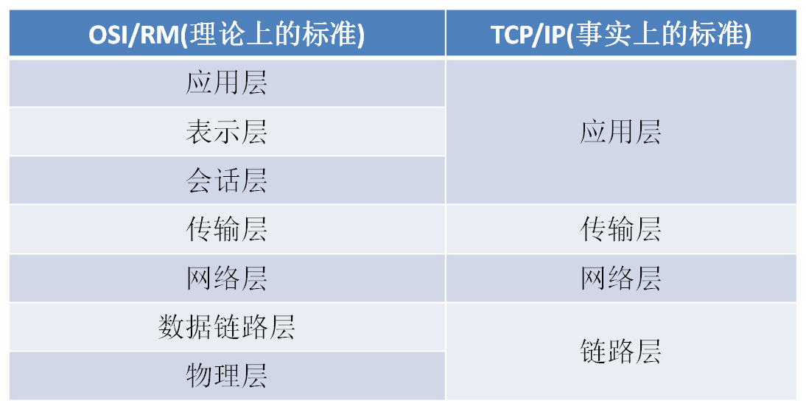
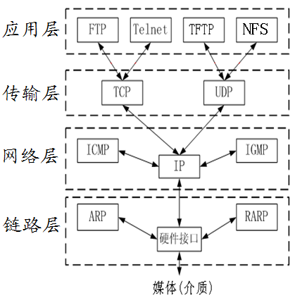
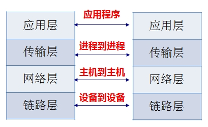
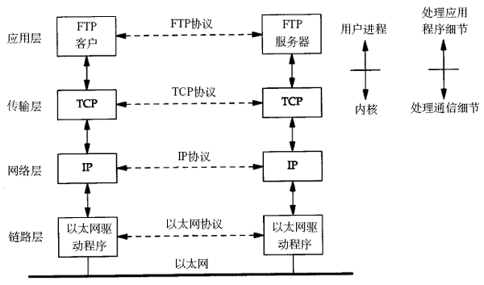

# 一 网络协议简介
从应用的角度出发，协议可理解为“规则”，是数据传输和数据的解释的规则。
例如，A、B双方欲传输文件。规定：
* 第一次，传输文件名，接收方接收到文件名，应答`OK`给传输方；
* 第二次，发送文件的尺寸，接收方接收到该数据再次应答一个`OK`；
* 第三次，传输文件内容。同样，接收方接收数据完成后应答`OK`表示文件内容接收成功。
  
由此，无论`A、B`之间传递何种文件，都是通过三次数据传输来完成。
`A、B`之间形成了一个最简单的数据传输规则。双方都按此规则发送、接收数据。
`A、B`之间达成的这个相互遵守的规则即为协议。

这种仅在`A、B`之间被遵守的协议称之为原始协议。

当此协议被更多的人采用，不断的增加、改进、维护、完善。最终形成一个稳定的、
完整的文件传输协议，被广泛应用于各种文件传输过程中。该协议就成为一个标准协议。
最早的`ftp`协议就是由此衍生而来。

## 1.1 常见的网络协议及其作用
传输层 常见协议有`TCP/UDP`协议。

应用层 常见的协议有`HTTP`协议，`FTP`协议。

网络层 常见协议有`IP`协议、`ICMP`协议、`IGMP`协议。

网络接口层 常见协议有`ARP`协议、`RARP`协议。

`TCP`传输控制协议`(Transmission Control Protocol)`是一种面向连接的、可靠的、
基于字节流的传输层通信协议。

`UDP`用户数据报协议`(User Datagram Protocol)`是`OSI`参考模型中一种无连接的
传输层协议，提供面向事务的简单不可靠信息传送服务。

`HTTP`超文本传输协议`(Hyper Text Transfer Protocol)`是互联网上应用最为广泛
的一种网络协议。

`FTP`文件传输协议`(File Transfer Protocol)`

`IP`协议是因特网互联协议`(Internet Protocol)`

`ICMP`协议是`Internet`控制报文协议`(Internet Control Message Protocol)`
它是`TCP/IP`协议族的一个子协议，用于在`IP`主机、路由器之间传递控制消息。

`IGMP`协议是 `Internet` 组管理协议`(Internet Group Management Protocol)`，
是因特网协议家族中的一个组播协议。该协议运行在主机和组播路由器之间。

`ARP`协议是正向地址解析协议`(Address Resolution Protocol)`，通过已知的`IP`，
寻找对应主机的`MAC`地址。

`RARP`是反向地址转换协议，通过`MAC`地址确定`IP`地址。

# 二 分层模型

## 2.1 网络分层架构
为了减少协议设计的复杂性，大多数网络模型均采用分层的方式来组织。
每一层都有自己的功能，就像建筑物一样，每一层都靠下一层支持。
**每一层利用下一层提供的服务来为上一层提供服务，本层服务的实现细节对上层屏蔽**。

越下面的层，越靠近硬件；越上面的层，越靠近用户。至于每一层叫什么名字，
对应编程而言不重要，但面试的时候，面试官可能会问每一层的名字。

业内普遍的分层方式有两种。**`OSI`七层模型** 和 **`TCP/IP`四层模型**。
可以通过背诵两个口诀来快速记忆：

* `OSI`七层模型：物、数、网、传、会、表、应

* `TCP/IP`四层模型：链、网、传、应

1. **物理层**
   * 主要**定义物理设备标准**，如网线的接口类型、光纤的接口类型、各种传输介质的传输速率等。
   * 它的主要作用是**传输比特流**（就是由1、0转化为电流强弱来进行传输，
     到达目的地后再转化为1、0，也就是我们常说的数模转换与模数转换）。
     这一层的数据叫做比特。

2. **数据链路层**：
   * 定义了如何让格式化数据以**帧**为单位进行传输，以及如何让控制对物理介质的访问。
   * 这一层通常还提供错误检测和纠正，以确保数据的可靠传输。
     如：串口通信中使用到的`115200、8、N、1`

3. **网络层**：
   * 在位于不同地理位置的网络中的两个**主机系统之间提供连接和路径选择**。
     `Internet`的发展使得从世界各站点访问信息的用户数大大增加，
     而网络层正是管理这种连接的层。

4. **传输层**：
   * 定义了一些**传输数据的协议和端口号**
     * `TCP`传输控制协议: 传输效率低，可靠性强，用于传输可靠性要求高，数据量大的数据）
     * `UDP`用户数据报协议: 与`TCP`特性恰恰相反，用于传输可靠性要求不高，数据量小的数据，
       如`QQ`聊天数据就是通过这种方式传输的。 
   * 主要是将从下层接收的数据进行分段和传输，到达目的地址后再进行重组。
     常常把这一层数据叫做**段**。

5. **会话层**：
   * 通过传输层(端口号：传输端口与接收端口)建立数据传输的通路。
     主要在你的系统之间发起会话或者接受会话请求（设备之间需要互相认识可以是IP也可以是MAC或者是主机名）

6. **表示层**：
   * 可确保一个系统的应用层所发送的信息可以被另一个系统的应用层读取。
     * 例如，PC程序与另一台计算机进行通信，其中一台计算机使用扩展二一十进制交换码
       (`EBCDIC`)，而另一台则使用美国信息交换标准码(`ASCII`)来表示相同的字符。
       如有必要，表示层会通过使用一种通格式来实现多种数据格式之间的转换。

7. **应用层**：
   * 是最靠近用户的`OSI`层。这一层为用户的应用程序
     * 例如为 *电子邮件、文件传输和终端仿真* 提供网络服务。

## 2.2 层与协议

网络分层出的每一层都是为了完成一种功能，为了实现这些功能，
就需要大家都遵守共同的规则。大家都遵守这规则，就叫做“协议”（protocol）。

网络的每一层，都定义了很多协议。这些协议的总称，叫“`TCP/IP`协议”。
`TCP/IP`协议是一个大家族，不仅仅只有`TCP`和`IP`协议，它还包括其它的协议

### 2.2.1 各层的功能(TCP/IP模型)

* 链路层
    * 物理层: 我们的电脑要与外界互联网通信，需要先把电脑连接网络，
      我们可以用双绞线、光纤、无线电波等方式。这就叫做”实物理层”，
      它就是把电脑连接起来的物理手段。它主要规定了网络的一些电气特性，
      作用是负责传送`0`和`1`的电信号
    * 数据链路层: 单纯的`0`和`1`没有任何意义，所以我们使用者会为其赋予一些特定的
      含义，**规定解读电信号的方式**。确定了物理层传输的`0`和`1`的分组方式及代表的意义
        * 早期的时候，每家公司都有自己的电信号分组方式。但是”以太网”（`Ethernet`）的协议，占据了主导地位。
          
        * 以太网规定，一组电信号构成一个数据包，叫做”帧”（`Frame`）
          
        * 每一帧分成两个部分：标头（`Head`）和数据（`Data`）。
          
        * 标头(`Head`): 包含**数据包的一些说明项**，比如 *发送者*、*接受者*、*数据类型* 等等
          * **固定为`18`字节**
        
        * 数据(`Data`): 数据包的具体内容
          * **最短为`46`字节，最长为`1500`字节**
          
        * 整个”帧”**最短为`64`字节，最长为`1518`字节**。
          如果数据很长，就必须分割成多个帧进行发送。
          
    以太网规定，连入网络的所有设备，都必须具有**网卡**接口。
    数据包必须是从一块网卡，传送到另一块网卡。通过网卡能够使不同的计算机之间连接，
    从而完成数据通信等功能。网卡的地址——`MAC`地址，
    就是数据包的**物理发送地址和物理接收地址**。
    
    每块网卡出厂的时候，都有一个全世界独一无二的`MAC`地址
    * 长度是`48`个二进制位，通常用`12`个十六进制数表示
    * 前`6`个十六进制数是厂商编号
    * 后`6`个是该厂商的网卡流水号
    
    有了`MAC`地址，就可以定位网卡和数据包的路径了。
  
    > 我们会通过`ARP`协议来获取接受方的`MAC`地址，有了`MAC`地址之后，
    如何把数据准确的发送给接收方呢？其实这里以太网采用了一种很”原始”的方式，
    它不是把数据包准确送到接收方，而是向本网络内所有计算机都发送，
    让每台计算机读取这个包的”标头”，找到接收方的MAC地址，
    然后与自身的MAC地址相比较，如果两者相同，就接受这个包，做进一步处理，
    否则就丢弃这个包。这种发送方式就叫做”**广播**”（broadcasting）
  
* 网络层
    * 基于`MAC`地址的广播通信是可以找到身在世界另一个角落的某台电脑的网卡，但是
      广播是将数据包发送给每一台主机，所有成员人手一”包”，不仅效率低，
      而且发送的**数据只能局限在发送者所在的子网络**
    
    * 为了找到一种方法区分哪些`MAC`地址属于同一个子网络，哪些不是。
      如果是同一个子网络，就采用 *广播* 方式发送，否则就采用 *路由* 方式发送。
      这就导致了”网络层”的诞生
      
    * 网络层作用是引进一套新的地址，使得我们能够区分不同的计算机是否属于同一个子网络。
      这套地址就叫做”网络地址”，简称”网址”
      
    * > “网络层”出现以后，每台计算机有了两种地址，一种是`MAC`地址，另一种是网络地址。
      > 两种地址之间没有任何联系，`MAC`地址是绑定在网卡上的，网络地址则是网络管理员分配的。
      > 网络地址帮助我们确定计算机所在的子网络，`MAC`地址则将数据包送到该子网络中的目标网卡。
      > 因此，从逻辑上可以推断，**必定是先处理网络地址，然后再处理`MAC`地址**。
  
    * **规定网络地址的协议，叫做IP协议**。它所定义的地址，就被称为`IP`地址。
      目前，广泛采用的是`IP`协议第四版，简称`IPv4`。`IPv4`这个版本规定，
      网络地址由`32`个二进制位组成，我们通常习惯用分成四段的十进制数表示`IP`地址，
      从`0.0.0.0`一直到`255.255.255.255`。

    * 根据`IP`协议发送的数据，就叫做`IP`数据包。`IP`数据包也分为 *标头* 和 *数据* 
      两个部分：
      * **标头**部分: 主要包括版本、长度、IP地址等信息
        * `IP`数据包的”标头”部分的长度为`20`到`60`字节
          
      * **数据**部分: 则是`IP`数据包的具体内容。
        
      * **整个数据包的总长度最大为`65535`字节**
    
* 传输层

    当我们一边聊QQ，一边聊微信，当一个数据包从互联网上发来的时候，我们怎么知道，
    它是来自QQ的内容，还是来自微信的内容？
    
    也就是说，我们还需要一个参数，表示这个数据包到底供哪个程序（进程）使用。
    这个参数就叫做“端口”（port），它其实是每一个使用网卡的程序的编号。
    每个数据包都发到主机的特定端口，所以不同的程序就能取到自己所需要的数据。
  
    端口特点：
    
    * 对于同一个端口，在不同系统中对应着不同的进程
    
    * 对于同一个系统，一个端口只能被一个进程拥有
    
    * “端口”是`0`到`65535`之间的一个整数，正好`16`个二进制位。
      * `0`到`1023`的端口被系统占用，用户只能选用大于`1023`的端口。 
      * 有了`IP`和端口我们就能实现唯一确定互联网上一个程序，进而实现网络间的程序通信。
    
    **我们必须在数据包中加入端口信息**，需要新的协议来规定
    * `UDP`: 格式几乎就是在数据前面，加上端口号
      * `UDP`数据包，也是由”标头”和”数据”两部分组成：
        * ”标头”部分主要定义了*发出端口*和*接收端口*，
        * ”数据”部分就是具体的内容。
      
      * `UDP`数据包非常简单，
        * ”标头”部分一共只有`8`个字节，总长度不超过`65,535`字节，正好放进一个`IP`数据包
        
      * 特点: 简单，容易实现，但是缺点是可靠性较差，一旦数据包发出，无法知道对方是否收到
        
    * `TCP`: `TCP`协议能够确保数据不会遗失。它的缺点是过程复杂、实现困难、消耗较多的资源。
      `TCP`数据包没有长度限制，理论上可以无限长，但是为了保证网络的效率，通常`TCP`数据包的
      长度不会超过`IP`数据包的长度，以确保单个`TCP`数据包不必再分割

* 应用层

  应用程序收到”传输层”的数据，接下来就要对数据进行解包。由于互联网是开放架构，
  数据来源五花八门，必须事先规定好通信的数据格式，否则接收方根本无法获得真正发送的数据内容。
  ”应用层”的作用就是规定应用程序使用的数据格式，例如我们`TCP`协议之上常见的
  `Email、HTTP、FTP`等协议，这些协议就组成了互联网协议的应用层。

## 2.3 数据传输过程

