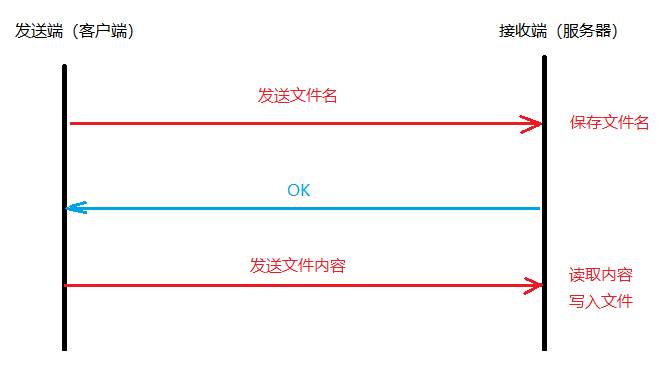

# 文件服务器

1. 发送端先将文件名发送给接收端
2. 接收端返回ok

## 预备知识
1. 获取命令行参数: go语言程序的命令行参数时存放在`os.Args`中。
    * 是一个字符串切片
    * 小标为`0`的是可执行文件本身

2. 获取文件信息

   首先获取文件名。借助`os`包中的`stat()`函数来获取文件属性信息。
   在函数返回的文件属性中包含文件名和文件大小。`Stat`参数`name`
   传入的是文件访问的绝对路径。`FileInfo`中的`Name()`函数可以将文件名单独提取出来。

    ```
    type FileInfo interface {
       Name() string  // 获取文件名
       Size() int64   // 获取文件大小
       Mode() FileMode     
       ModTime() time.Time 
       IsDir() bool        
       Sys() interface{}   
    }
    ```   

## 发送端

1. 提示用户使用命令行参数输入文件名。接收文件名 filepath（含访问路径）

2. 使用 os.Stat(）获取文件属性，得到纯文件名 fileName（去除访问路径）

3. 主动发起连接服务器请求，结束时关闭连接。

4. 发送文件名到接收端 conn.Write()

5. 读取接收端回发的确认数据 conn.Read()

6. 判断是否为“ok”。如果是，封装函数 SendFile() 发送文件内容。传参 filePath 和 conn

7. 只读 Open 文件, 结束时Close文件

8. 循环读本地文件，读到 EOF，读取完毕。

9. 将读到的内容原封不动 conn.Write 给接收端（服务器）

```go
package main

import (
	"fmt"
	"io"
	"net"
	"os"
)

func sendFile(conn net.Conn, filePath string) {
	file, err := os.Open(filePath)
	if err != nil {
		fmt.Println("打开文件失败")
		return
	}
	defer func(f *os.File) {
		err := f.Close()
		if err != nil {
			fmt.Println("文件关闭失败")
		}
	}(file)

	buf := make([]byte, 1024)
	for {
		n, err := file.Read(buf)
		if err != nil {
			if err == io.EOF {
				fmt.Println("文件发送完毕")
			} else {
				fmt.Println("文件读取失败")
			}
			return
		}
		_, err = conn.Write(buf[:n])
		if err != nil {
			fmt.Println("提交数据失败")
			return
		}
	}
}

func main() {
	list := os.Args  // 命令行参数
	if len(list) != 2 {
		fmt.Println("没有传递要发送的文件路径，请输入文件路径")
	}
	filePath := list[1]  // 获取文件路径

	fileInfo, err := os.Stat(filePath)  // 获取文件信息
	if err != nil {
		fmt.Println("文件信获取失败")
		return
	}
	fileName := fileInfo.Name()  // 文件名
	fileSize := fileInfo.Size()   // 文件大小 字节

	fmt.Printf("%s:%d\n", fileName, fileSize)

	// 发起连接请求
	var conn net.Conn
	conn, err = net.Dial("tcp", "127.0.0.1:8080")
	if err != nil {
		fmt.Println("连接建立失败")
		return
	}
	defer func(c net.Conn) {
		err := c.Close()
		if err != nil {
			fmt.Println("连接关闭失败")
		}
	}(conn)

	_, err = conn.Write([]byte(fileName))
	if err != nil {
		fmt.Println("文件名发送失败")
		return
	}

	buf := make([]byte, 10)
	var n int
	n, err = conn.Read(buf)
	if err != nil {
		fmt.Println("读取服务器返回数据失败")
		return
	}
	if "ok" == string(buf[:n]) {
		// 发送文件
		sendFile(conn, filePath)
	}
}
```

## 文件接收端

1. 创建监听 listener，程序结束时关闭。

2. 阻塞等待客户端连接 conn，程序结束时关闭conn。

3. 读取客户端发送文件名。保存 fileName。

4. 回发“ok”。

5. 封装函数 RecvFile 接收客户端发送的文件内容。传参 fileName 和 conn

6. 按文件名 Create 文件，结束时 Close

7. 循环 Read 发送端网络文件内容，当读到 0 说明文件读取完毕。

8. 将读到的内容原封不动Write到创建的文件中

```go
package main

import (
	"fmt"
	"net"
	"os"
)

func recvData(conn net.Conn, fileName string)  {
	// 按照文件名创建新文件
	f, err := os.Create(fileName)
	if err != nil {
		fmt.Println("文件创建出错")
		return
	}
	defer func(file *os.File) {
		err := file.Close()
		if err != nil {
			fmt.Println("文件关闭错误")
		}
	}(f)

	// 从 网络中读数据，写入本地文件
	buf := make([]byte, 1024)
	for {
		n,_ := conn.Read(buf)
		if n == 0 {
			fmt.Println("接收文件完成。")
			return
		}
		// 写入本地文件，读多少，写多少。
		_, err = f.Write(buf[:n])
		if err != nil {
			fmt.Println("写入输出错误")
		}
	}
}

func main() {
	// 创建监听套接字
	listener, err := net.Listen("tcp", "127.0.0.1:8080")
	if err != nil {
		fmt.Println("监听套接字创建失败")
		return
	}
	defer func(l net.Listener) {
		err := l.Close()
		if err != nil {
			fmt.Println("监听套接字关闭失败")
			return
		}
	}(listener)

	var conn net.Conn
	conn, err = listener.Accept()  // 接收客户端连接
	if err!= nil {
		fmt.Println("通信套接字建立失败")
		return
	}
	defer func(c net.Conn) {
		err := c.Close()
		if err!= nil {
			fmt.Println("通信套接字关闭失败")
			return
		}
	}(conn)

	buf := make([]byte, 1024)
	var n int
	n, err = conn.Read(buf)
	if err!= nil {
		fmt.Println("读取文件名出错")
		return
	}

	fileName := string(buf[:n])

	_, err = conn.Write([]byte("ok"))
	if err != nil {
		fmt.Println("响应数据错误")
		return
	}
	recvData(conn, fileName)
}
```

# 粘包问题

## 原因
主要原因就是`tcp`数据传递模式是流模式，在保持长连接的时候可以进行多次的收和发。

“粘包”可发生在发送端也可发生在接收端：
1. 由`Nagle`算法造成的发送端的粘包：`Nagle`算法是一种改善网络传输效率的算法。
   简单来说就是当我们提交一段数据给`TCP`发送时，`TCP`并不立刻发送此段数据，
   而是等待一小段时间看看在等待期间是否还有要发送的数据，
   若有则会一次把这两段数据发送出去。

2. 接收端接收不及时造成的接收端粘包：`TCP`会把接收到的数据存在自己的缓冲区中，
   然后通知应用层取数据。当应用层由于某些原因不能及时的把`TCP`的数据取出来，
   就会造成`TCP`缓冲区中存放了几段数据。

## 解决方式

1. 发送完数据后断开，当要再次发送数据时建立连接。例如`HTTP`

2. 先发送数据的描述信息给接收端，接收到回复后在发送数据


