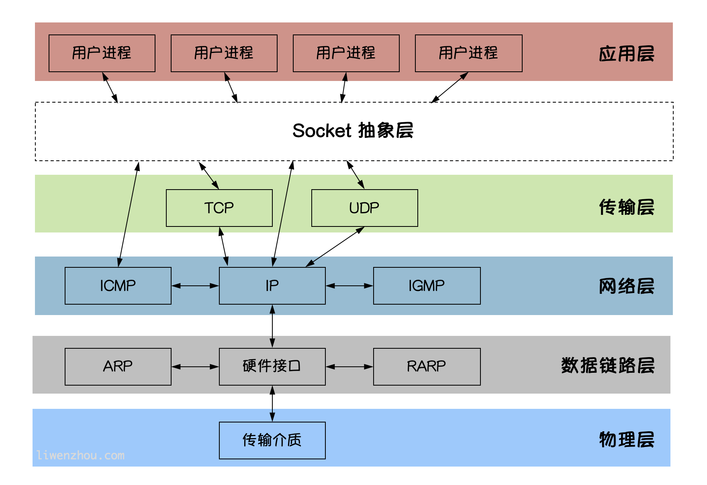
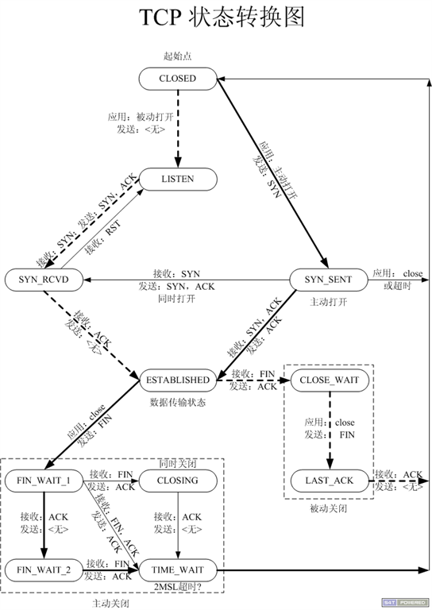

# 一 Socket编程

`Socket`是`BSD UNIX`的进程通信机制，通常也称作”套接字”，用于描述`IP`地址和端口，
是一个通信链的句柄。`Socket`可以理解为`TCP/IP`网络的`API`，它定义了许多函数或例程，
程序员可以用它们来开发`TCP/IP`网络上的应用程序。电脑上运行的应用程序通常通过”套接字”
向网络发出请求或者应答网络请求。


常用的`Socket`类型有两种：流式`Socket(SOCK_STREAM)`和数据报式`Socket(SOCK_DGRAM)`。
流式是一种面向连接的`Socket`，针对于面向连接的`TCP`服务应用；
数据报式`Socket`是一种无连接的`Socket`，对应于无连接的`UDP`服务应用。


## 1.1 Socket图解
`Socket`是应用层与`TCP/IP`协议族通信的中间软件抽象层。
在设计模式中，`Socket`其实就是一个门面模式，它把复杂的`TCP/IP`协议族隐藏在`Socket`后面，
对用户来说只需要调用`Socket`规定的相关函数，让`Socket`去组织符合指定的协议数据然后进行通信。



## 1.2 net包
Go语言`net`包提供了可移植的网络`I/O`接口，包括`TCP/IP`、`UDP`、域名解析和`Unix`域`socket`。

虽然本包提供了对网络原语的访问，大部分使用者只需要`Dial`、`Listen`和`Accept`
函数提供的基本接口；以及相关的`Conn`和`Listener`接口。`crypto/tls`包提供了相同的接口和类似的Dial和Listen函数。

**Listener接口**
```
type Listener interface {
    Accept() (Conn, error)
    Close() error
    Addr() Addr
}
```
**Conn接口**
```
type Conn interface {
	Read(b []byte) (n int, err error)
	Write(b []byte) (n int, err error)
	Close() error
	LocalAddr() Addr
	RemoteAddr() Addr
	SetDeadline(t time.Time) error
	SetReadDeadline(t time.Time) error
	SetWriteDeadline(t time.Time) error
}
```

## 1.3 网络应用程序设计模型
### `C/S`模式
传统的网络应用设计模式，客户机(`client`)/服务器(`server`)模式。
需要在通讯两端各自部署客户机和服务器来完成数据通信。

### `B/S`模式
浏览器(`Browser`)/服务器(`Server`)模式。只需在一端部署服务器，
而另外一端使用每台PC都默认配置的浏览器即可完成数据的传输。

### 优缺点
对于`C/S`模式来说，其优点明显。客户端位于目标主机上可以保证性能，将**数据缓存至客户端本地**，
从而提高数据传输效率。且，一般来说客户端和服务器程序由一个开发团队创作，
所以他们之间所**采用的协议相对灵活**。可以在标准协议的基础上根据需求裁剪及定制。
例如，腾讯所采用的通信协议，即为ftp协议的修改剪裁版。

因此，传统的网络应用程序及较大型的网络应用程序都首选`C/S`模式进行开发。
如，知名的网络游戏魔兽世界。`3D`画面，数据量庞大，使用`C/S`模式可以提前
在本地进行大量数据的缓存处理，从而提高观感。

`C/S`模式的缺点也较突出。由于客户端和服务器都需要有一个开发团队来完成开发。
工作量将成倍提升，开发周期较长。另外，从用户角度出发，需要将客户端安插至用户主机上，
对用户主机的**安全性构成威胁**。这也是很多用户不愿使用`C/S`模式应用程序的重要原因。

`B/S`模式相比`C/S`模式而言，由于它没有独立的客户端，使用标准浏览器作为客户端，
其工作开发量较小。只需开发服务器端即可。另外由于其采用浏览器显示数据，因此移植性非常好，
不受平台限制。如早期的偷菜游戏，在各个平台上都可以完美运行。

`B/S`模式的缺点也较明显。由于使用第三方浏览器，因此网络应用支持受限。
另外，没有客户端放到对方主机上，缓存数据不尽如人意，从而传输数据量受到限制。
应用的观感大打折扣。第三，必须与浏览器一样，采用标准http协议进行通信，协议选择不灵活。

因此在开发过程中，模式的选择由上述各自的特点决定。根据实际需求选择应用程序设计模式。

# 二 TCP-CS架构


## 2.1 TCP服务端
```go
package main

import (
	"fmt"
	"net"
	"strings"
)

func main()  {

	// 创建用于监听的socket
	listener, err := net.Listen("tcp", "0.0.0.0:8080")  // 创建tcp服务端，监听ip:port 只接收该`ip`发送的连接，服务端运行在8080端口
	if err != nil {
		fmt.Printf("net.Listen faild, err=%#v\n", err)
		return
	}
	// 关闭用于监听的socket
	defer func(l net.Listener) {
		err := l.Close()
		if err != nil {
			fmt.Printf("close listener faild, err=%#v\n", err)
		}
	}(listener)

	fmt.Printf("服务端等待客户端建立连接...\n")
	// 监听客户端链接，并接收链接，生成用于通信的socket
	var conn net.Conn
	conn, err = listener.Accept()
	defer func(recv net.Conn) {
		err := recv.Close()
		if err != nil {
			fmt.Printf("连接关闭失败\n")
		}

	}(conn)

	if err != nil {
		fmt.Printf("listener.Accept() faild, err=%#v\n", err)
		return
	}
	fmt.Printf("服务端与客户端建立连接成功...\n")
	// 读取客户端发送来的数据
	var recv [1024]byte
	var n int
	n, err = conn.Read(recv[:])
	if err != nil {
		fmt.Printf("conn.Read(recv[:]) faild, err=%#v\n", err)
		return
	} else {
		fmt.Printf("总共读取数据%d\n", n)
	}
	fmt.Printf("读取到的数据为: %s\n", string(recv[:n]))

	ret := strings.ToUpper(string(recv[:n]))

	n, err = conn.Write([]byte(ret))  // 返回数据
	if err != nil {
		fmt.Printf("返回数据失败 err=%#v\n", err)
	} else {
		fmt.Printf("总共返回数据%d\n", n)
	}
}
```

1.  创建监听`socket`: `listener := net.Listen("TCP", "IP+port")`
    `IP+port`——服务器自己的IP 和 port

2.  启动监听  `conn, err := listener.Accept()`  `conn` 用于 通信的 `socket`

3.  `conn.Read()`: 用于读取客户端发送的数据

4.  处理使用 数据

5.  `conn.Write()`: 返回数据给客户端

6.  关闭 `listener、conn`


## 2.2 TCP客户端
```go
package main

import (
	"fmt"
	"net"
)

func main() {
	conn, err := net.Dial("tcp", "127.0.0.1:8080")  // 建立tcp连接, ip:port是服务端的地址
	if err != nil {
		fmt.Printf("连接建立错误, err=%#v\n", err)
		return
	}
	defer func(recv net.Conn) {
		err := recv.Close()
		if err != nil {
			fmt.Printf("连接关闭错误, err=%#v\n", err)
		}
	}(conn)

	// 发送数据给服务器
	var n int
	n, err = conn.Write([]byte("hello world"))
	if err != nil {
		fmt.Printf("数据发送错误, err=%#v\n", err)
		return
	} else {
		fmt.Printf("提交数据的长度:%d\n", n)
	}

	// 接收服务端返回的数据
	var recv []byte
	recv = make([]byte, 1024)
	n, err = conn.Read(recv)
	if err != nil {
		fmt.Printf("读取服务端返回数据数据失败, err=%#v\n", err)
		return
	}

	fmt.Printf("客户端返回数据: %#v\n", string(recv[:n]))
}
```

1.  `conn, err := net.Dial("TCP", 服务器的IP+port)`: 连接客户端

2.  写数据给服务器 `conn.Write()`

3.  读取服务器回发的数据 `conn.Read()`

4.  `conn.Close()`: 关闭通信`socket`

## 2.3 TCP-CS服务端的并发
上面的服务器只能完成一个客户端的请求，完成后服务端即结束运行。我们要尝试修改，让服务器可以
接收多个客户端的连接请求
```go
package main

import (
	"fmt"
	"net"
	"strings"
)

func main()  {

	// 创建用于监听的socket
	listener, err := net.Listen("tcp", "0.0.0.0:8080")  // 创建tcp服务端，监听ip:port 只接收该`ip`发送的连接，服务端运行在8080端口
	if err != nil {
		fmt.Printf("net.Listen faild, err=%#v\n", err)
		return
	}
	// 关闭用于监听的socket
	defer func(l net.Listener) {
		err := l.Close()
		if err != nil {
			fmt.Printf("close listener faild, err=%#v\n", err)
		}
	}(listener)


	// 监听客户端链接，并接收链接，生成用于通信的socket
	var conn net.Conn
	for {
		fmt.Printf("服务端%v等待客户端建立连接...\n", listener.Addr().String())
		conn, err = listener.Accept()
		if err != nil {
			fmt.Printf("listener.Accept() faild, err=%#v\n", err)
			return
		}
		fmt.Printf("服务端与客户端%v建立连接成功...\n", conn.RemoteAddr().String())


		// 读取客户端发送来的数据
		var recv [1024]byte
		var n int
		n, err = conn.Read(recv[:])
		if err != nil {
			fmt.Printf("conn.Read(recv[:]) faild, err=%#v\n", err)
			return
		} else {
			fmt.Printf("总共读取数据%d\n", n)
		}
		fmt.Printf("读取到的数据为: %s\n", string(recv[:n]))

		ret := strings.ToUpper(string(recv[:n]))

		n, err = conn.Write([]byte(ret))  // 返回数据
		if err != nil {
			fmt.Printf("返回数据失败 err=%#v\n", err)
		} else {
			fmt.Printf("总共返回数据%d\n", n)
		}

		err = conn.Close()
		if err != nil {
			fmt.Printf("conn.Close() faild, err=%#v\n", err)
		}
	}
}
```
* 可以循环的处理每一个前来连接的客户端，当处理了一个客户端之后，
  就不能在处理下一个客户端了。只有处理完成后才能继续处理下一个客户端。
  
* 下一步修改让服务端可以同时处理前来连接的请求。当有连接到来，就建立一个
  `goroutine`用于与客户端进行通信，而主`goroutine`则用于监听连接请求

```go
package main

import (
	"fmt"
	"io"
	"net"
	"strings"
)


func communication(conn net.Conn) {
	// 函数退出时关闭socket连接
	defer func(c net.Conn) {
		err := c.Close()
		if err != nil {
			fmt.Printf("服务器与客户端%v连接关闭失败\n", c.RemoteAddr().String())
		}
	}(conn)

	var n int
	var err error
	for {
		var recv []byte
		recv = make([]byte, 1024)
		n, err = conn.Read(recv)
		if err != nil {
			if err == io.EOF {
				fmt.Printf("客户端%v关闭\n", conn.RemoteAddr().String())
				return  // 出错提出函数
			}
			fmt.Printf("读取客户端%v发送的消息错误\n", conn.RemoteAddr().String())
			return  // 出错提出函数
		}

		recvData := string(recv[:n]) // 将接收到的数据转为字符串
		fmt.Printf("服务器接收客户端%v接收到的数据为:%v", conn.RemoteAddr().String(), recvData)
		recvData = strings.ToUpper(recvData)  // 处理接收的数据

		_, err = conn.Write([]byte(recvData))  // 将处理好的数据返回给客户端
		if err != nil {
			fmt.Printf("向客户端%v返回数据错误\n", conn.RemoteAddr().String())
			return  // 出错提出函数
		}
	}
}

func main()  {

	// 创建用于监听的socket
	listener, err := net.Listen("tcp", "0.0.0.0:8080")  // 创建tcp服务端，监听ip:port 只接收该`ip`发送的连接，服务端运行在8080端口
	// network是小写的tcp或udp
	if err != nil {
		fmt.Printf("net.Listen faild, err=%#v\n", err)
		return
	}
	// 关闭用于监听的socket
	defer func(l net.Listener) {
		err := l.Close()
		if err != nil {
			fmt.Printf("close listener faild, err=%#v\n", err)
		}
	}(listener)

	// 监听客户端链接，并接收链接，生成用于通信的socket
	var conn net.Conn
	for {
		fmt.Printf("服务器等待连接\n")
		conn, err = listener.Accept()
		fmt.Printf("服务器与客户端%v连接成功\n", conn.RemoteAddr().String())
		go communication(conn)
	}
}
```
* 由于`Read`函数在没有接收到数据时也是阻塞的，可以尝试将`Read`函数封装到另一个`goroutine`
  中借助通道进行数据交互。
* `Write`函数也可以类似的进行操作


**将客户端修改为如下**
```go
package main

import (
	"bufio"
	"fmt"
	"net"
	"os"
	"strings"
)

func main() {
	// 连接服务端
	conn, err := net.Dial("tcp", "127.0.0.1:8080")  // 建立tcp连接, ip:port是服务端的地址
	// network必须是小写的tcp或udp
	if err != nil {
		fmt.Printf("连接建立错误, err=%#v\n", err)
		return
	}
	defer func(c net.Conn) {
		err := c.Close()
		if err != nil {
			fmt.Printf("连接关闭错误, err=%#v\n", err)
		}
	}(conn)
	reader := bufio.NewReader(os.Stdin)   // 创建读取数据对象
	for  {
		var s string
		fmt.Printf("输入数据（quit退出）:")

		s, err = reader.ReadString('\n')  // 读取数据

		if strings.TrimSpace(string(s[:])) == "quit" {
			// 退出客户端
			break
		}
		// 发送数据给服务器
		var n int
		n, err = conn.Write([]byte(s))  // 发送数据给服务器
		if err != nil {
			fmt.Printf("数据发送错误, err=%#v\n", err)
			return
		} else {
			fmt.Printf("提交数据的长度:%d\n", n)
		}
		// 接收服务端返回的数据
		var recv []byte
		recv = make([]byte, 1024)
		n, err = conn.Read(recv)
		if err != nil {
			fmt.Printf("读取服务端%v返回数据数据失败, err=%#v\n", conn.RemoteAddr().String(), err)
			return
		}
		fmt.Printf("服务端%v返回数据: %#v\n", conn.RemoteAddr().String(), string(recv[:n]))
	}
}
```
* 该客户端，是一个串行客户端，用户输入和接收服务端返回不是异步的。下面可以对客户端进行修改

## 2.4 TCP-CS客户端的并发
上面已经实现了用户输入与服务端数据接收的串行io,下面对客户端进行修改，将串行的io修改
为并发执行，也就是，用户输入与服务端数据接收使用两个goroutine进行处理

```go
package main

import (
	"bufio"
	"fmt"
	"net"
	"os"
	"strings"
)

func main() {
	conn, err := net.Dial("tcp", "127.0.0.1:8080")  // 建立tcp连接, ip:port是服务端的地址
	if err != nil {
		fmt.Printf("连接建立错误, err=%#v\n", err)
		return
	}
	defer func(c net.Conn) {
		err := c.Close()
		if err != nil {
			fmt.Printf("连接关闭错误, err=%#v\n", err)
		}
	}(conn)
	reader := bufio.NewReader(os.Stdin)   // 创建读取数据对象

	// 子goroutine用于接收用户输入并发送给服务端
	go func(c net.Conn) {
		for  {
			var s string
			fmt.Printf("输入数据（quit退出）:")
			s, err = reader.ReadString('\n')  // 读取数据
			if err != nil {
				continue  // 读取出错，跳过当前循环
			}
			s = strings.TrimSpace(string(s[:]))  // 去除\r
			// 发送数据给服务器
			var n int
			n, err = conn.Write([]byte(s))  // 发送数据给服务器
			if err != nil {
				fmt.Printf("数据发送错误, err=%#v\n", err)
				return
			} else {
				fmt.Printf("提交数据的长度:%d\n", n)
			}
			if s == "quit" {
				// 退出客户端
				break
			}
		}
	}(conn)
	
    // 主goroutine用于接收服务端返回的数据
	for  {
		var n int
		// 接收服务端返回的数据
		var recv []byte
		recv = make([]byte, 1024)
		n, err = conn.Read(recv)
		if err != nil {
			fmt.Printf("读取服务端%v返回数据数据失败, err=%#v\n", conn.RemoteAddr().String(), err)
			return
		}
		fmt.Printf("服务端%v返回数据: %#v\n", conn.RemoteAddr().String(), string(recv[:n]))

		// 服务端返回数据为QUIT，则客户端请求了关闭
		if string(recv[:n]) == "QUIT" {
			break
		}

	}
}
```

## 2.5 TCP通信过程


**三次握手过程**
* 客户端主动发送连接请求`SYN`标志位及`x`标号
* 服务端响应请求，并返回应答`ACK`标志位及`x+1`标号，确定包以接收完全。
  并且还还向客户端发送一个请求`SYN`标志及`y`标号
  * `x+1`表示该标号之前的数据包服务端已经收到
* 客户端响应服务端的`SYN`请求，并返回`ACK`响应标志和`y+1`标号。
  * `y+1`表示该标号之前的数据包客户端已经收到
****
**数据通信过程**
* 客户端在发送数据的时候绑定标号`x+1`，并且再一次向服务器发送`ACK y+1`
  确保前一次发送的包服务端已经收到
* 服务器收到数据后，可以响应请求，并返回`ACK x+2`数据包。同时也可以携带响应数据一起返回
* 客户端收到数据后，在向服务端回复`ACK 标号`，告诉服务端数据已经接收完成

**四次挥手过程**
* 客户端向服务端发送`FIN`并且携带包号
* 服务端向客户端发送`ACK`标志，此时，连接处于半关闭状态
* 一段时间后，服务端向客户端再次发送`FIN`请求
* 客户端接收信息应答服务器请求。此时四次挥手断开连接完成。

## 2.6 TCP状态转换


主动发起连接请求端： `CLOSED` —— 完成三次握手 —— `ESTABLISEHED`（数据通信状态）—— `Dial()`函数返回

被动发起连接请求端： `CLOSED` —— 调用`Accept()`函数 ——`LISTEN` —— 完成三次握手 —— `ESTABLISEHED` （数据通信状态）—— `Accept()`函数返回

* 数据传递期间 —— `ESTABLISEHED` （数据通信状态）

主动关闭连接请求端：
* `ESTABLISEHED` —— `FIN_WAIT_2` (半关闭）——  `TIME_WAIT` —— `2MSL` —— 确认最后一个ACK被对端成功接收。—— `CLOSE`
* 半关闭、`TIME_WAIT`、`2MSL` ——只会出现在 “主动关闭连接请求端”

被动关闭连接请求端：`ESTABLISEHED —— CLOSE`


# 三 UDP通信


