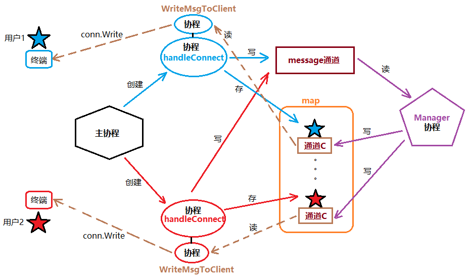

# 并发聊天室

整个聊天室程序可简单划分为如下模块，都分别使用协程来实现：
* 主协程（服务器）：

  负责监听、接收用户（客户端）连接请求，建立通信关系。同时启动相应的协程处理任务。

* 处理用户连接协程：HandleConnect
  负责新上线用户的存储，用户消息读取、发送，用户改名、下线处理及超时处理。
  为了提高并发效率，同时给一个用户维护多个协程来并行处理上述任务。

* 用户消息广播协程：Manager

  负责在线用户遍历，用户消息广播发送。需要与HandleConnect协程及用户子协程协作完成。

* 协程间应用数据及通信：
    * map：存储所有登录聊天室的用户信息， key：用户的ip+port。Value：Client结构体。

    * Client结构体：包含成员：用户名Name，网络地址Addr（ip+port），发送消息的通道C（channel）

    * 通道message：协调并发协程间消息的传递。

## 主协程搭建及用户上线通知

1. 主go程中，创建监听套接字。 记得defer

2. for 循环监听客户端连接请求。Accept()

3. 有一个客户端连接，创建新 go 程 处理客户端数据 HandlerConnet(conn)	defer

4. 定义全局结构体类型  C 、Name、Addr

5. 创建全局map、channel

6. 实现HandlerConnet， 获取客户端IP+port —— RemoteAddr()。 初始化新用户结构体信息。   name == Addr

7. 创建 Manager 实现管理go程。 —— Accept() 之前。

8. 实现 Manager 。 初始化 在线用户 map。 循环 读取全局 channel，如果无数据，阻塞。 如果有数据， 遍历在线用户 map ，将数据写到 用户的 C 里

9. 将新用户添加到 在线用户 map 中 。 Key == IP+port  value= 新用户结构体

10. 创建 WriteMsgToClient go程，专门给当前用户写数据。 —— 来源于 用户自带的 C 中 

11. 实现 WriteMsgToClient（clnt，conn） 。遍历自带的 C ，读数据，conn.Write 到 客户端。

12. HandlerConnet中，结束位置，组织用户上线信息， 将 用户上线信息 写 到全局 channel  —— Manager 的读就被激活（原来一直阻塞）

13. HandlerConnet中，结尾 加 for {  ；}

```go
package main

import (
	"fmt"
	"net"
	"sync"
)

var err error
var wg sync.WaitGroup

// Client 用于描述客户端的结构体
type Client struct {
	C chan string  // 通道用于给客户端发送消息
	Name string  // 客户端的名称
	Addr string  // 客户端的地址
}

// OnLineMap 保存在线用户
var OnLineMap map[string] *Client = make(map[string] *Client, 10000)

// Message 保存用户发送来的消息
var Message chan string = make(chan string, 10000)


// NewClient 创建客户端对象
func NewClient(name string, addr string) *Client{
	return &Client{
		C:    make(chan string),
		Name: name,
		Addr: addr,
	}
}

// Manager 负责在线用户遍历，用户消息广播发送。需要与HandleConnect协程及用户子协程协作完成。
// 管理OnLineMap和Message通道
func Manager()  {
	// 循环读取Message通道中的消息
	for  {
		msg := <-Message
		for _, client := range OnLineMap {
			client.C <- msg
		}
	}
}

func writeMsgToClient(conn net.Conn, client *Client)  {
	defer wg.Done()
	// 读取用户通道中的消息，如果有消息向当前用户写入消息
	for msg := range client.C{
		_,err = conn.Write([]byte(msg))
		if err != nil {
			fmt.Printf("向客户端%v发送消息失败, 错误信息为: %v\n", client.Addr, err)
		}
	}

}

// HandleConnect 处理客户端连接
func HandleConnect(conn net.Conn)  {
	defer func(c net.Conn) {
		err = c.Close()
		if err != nil {
			fmt.Println("关闭通信套接字错误，原因为: ", err)
		}
	}(conn)

	// 创建登录客户端对象
	name := conn.RemoteAddr().String()
	addr := conn.RemoteAddr().String()
	client := NewClient(name, addr)
	// 将客户端对象保存在OnLineMap中
	OnLineMap[addr] = client

	// 创建一个用于发送消息的goroutine
	wg.addNode(1)
	go writeMsgToClient(conn,client)

	// 向全局通道中写入客户端上线信息
	Message <- fmt.Sprintf("[%s:%s]上线\n", client.Addr, client.Name)
	wg.Wait()
}

// 负责监听、接收用户（客户端）连接请求，建立通信关系。同时启动相应的协程处理任务。
func main() {
	var listener net.Listener
	listener, err = net.Listen("tcp", "0.0.0.0:8080")
	if err != nil {
		fmt.Println("监听套接字创建失败，失败原因为: ", err)
		return
	}
	defer func(l net.Listener) {
		err = l.Close()
		if err != nil {
			fmt.Println("")
		}
	}(listener)
	// 创建用于管理发送消息的goroutine
	go Manager()
	for {
		fmt.Println("等待客户端连接")
		var conn net.Conn
		conn, err = listener.Accept()
		if err != nil {
			fmt.Println("创建通信套接字失败，失败原因为: ", err)
		}
		go HandleConnect(conn)
	}
}
```

## 客户端发送消息
1.  封装 函数 `MakeMsg()` 来处理广播、用户消息 

2. `HandlerConnet`中, 创建匿名`go`程， 读取用户`socket`上发送来的 
   聊天内容。写到 全局 `channel`

3. `for` 循环 `conn.Read``n == 0    err != nil` 

4. 写给全局 `message` —— 后续的事，原来广播用户上线模块 完成。
   （`Manager、WriteMsgToClient`）


```go
package main

import (
	"fmt"
	"net"
	"sync"
)

var err error
var wg sync.WaitGroup

// Client 用于描述客户端的结构体
type Client struct {
	C chan string  // 通道用于给客户端发送消息
	Name string  // 客户端的名称
	Addr string  // 客户端的地址
}

// OnLineMap 保存在线用户
var OnLineMap map[string] *Client = make(map[string] *Client, 10000)

// Message 保存用户发送来的消息
var Message chan string = make(chan string, 10000)


// NewClient 创建客户端对象
func NewClient(name string, addr string) *Client{
	return &Client{
		C:    make(chan string),
		Name: name,
		Addr: addr,
	}
}

// Manager 负责在线用户遍历，用户消息广播发送。需要与HandleConnect协程及用户子协程协作完成。
// 管理OnLineMap和Message通道
func Manager()  {
	// 循环读取Message通道中的消息
	for  {
		msg := <-Message
		for _, client := range OnLineMap {
			client.C <- msg
		}
	}
}

func writeMsgToClient(conn net.Conn, client *Client)  {
	defer wg.Done()
	// 读取用户通道中的消息，如果有消息向当前用户写入消息
	for msg := range client.C{
		_,err = conn.Write([]byte(msg))
		if err != nil {
			fmt.Printf("向客户端%v发送消息失败, 错误信息为: %v\n", client.Addr, err)
		}
	}

}

// MakeMassage 创建消息
func MakeMassage(client *Client, message string) (msg string) {
	msg = fmt.Sprintf("[%s:%s]: %s\n", client.Addr, client.Name, message)
	return
}

// HandleConnect 处理客户端连接
func HandleConnect(conn net.Conn)  {
	defer func(c net.Conn) {
		err = c.Close()
		if err != nil {
			fmt.Println("关闭通信套接字错误，原因为: ", err)
		}
	}(conn)

	// 创建登录客户端对象
	name := conn.RemoteAddr().String()
	addr := conn.RemoteAddr().String()
	client := NewClient(name, addr)
	// 将客户端对象保存在OnLineMap中
	OnLineMap[addr] = client

	// 创建一个用于发送消息的goroutine
	wg.addNode(1)
	go writeMsgToClient(conn,client)
	// 向全局通道中写入客户端上线信息
	Message <- MakeMassage(client, "login")

	// 创建一个用于接收客户端输入的goroutine
	wg.addNode(1)
	go func() {
		defer wg.Done()
		for  {
			buf := make([]byte, 1024)
			var n int
			n, err = conn.Read(buf)
			if n == 0 {
				fmt.Printf("检查到客户端[%s]退出\n", client.Name)
				return
			}
			if err != nil {
				fmt.Println("读取信息错误")
				return
			}
			Message <- MakeMassage(client, string(buf[:n]))
		}
	}()
	wg.Wait()
}

// 负责监听、接收用户（客户端）连接请求，建立通信关系。同时启动相应的协程处理任务。
func main() {
	var listener net.Listener
	listener, err = net.Listen("tcp", "0.0.0.0:8080")
	if err != nil {
		fmt.Println("监听套接字创建失败，失败原因为: ", err)
		return
	}
	defer func(l net.Listener) {
		err = l.Close()
		if err != nil {
			fmt.Println("")
		}
	}(listener)
	// 创建用于管理发送消息的goroutine
	go Manager()
	for {
		fmt.Println("等待客户端连接")
		var conn net.Conn
		conn, err = listener.Accept()
		if err != nil {
			fmt.Println("创建通信套接字失败，失败原因为: ", err)
		}
		go HandleConnect(conn)
	}
}
```


## 完整服务端代码

```go
package main

import (
	"fmt"
	"net"
	"runtime"
	"strings"
	"time"
)

var err error

// Client 用于描述客户端的结构体
type Client struct {
	C chan string  // 通道用于给客户端发送消息
	Name string  // 客户端的名称
	Addr string  // 客户端的地址
}

// OnLineMap 保存在线用户
var OnLineMap map[string] *Client = make(map[string] *Client, 10000)

// Message 保存用户发送来的消息
var Message chan string = make(chan string, 10000)


// NewClient 创建客户端对象
func NewClient(name string, addr string) *Client{
	return &Client{
		C:    make(chan string),
		Name: name,
		Addr: addr,
	}
}

// Manager 负责在线用户遍历，用户消息广播发送。需要与HandleConnect协程及用户子协程协作完成。
// 管理OnLineMap和Message通道
func Manager()  {
	// 循环读取Message通道中的消息
	for  {
		msg := <-Message
		for _, client := range OnLineMap {
			client.C <- msg
		}
	}
}

func writeMsgToClient(conn net.Conn, client *Client)  {
	// 读取用户通道中的消息，如果有消息向当前用户写入消息
	for msg := range client.C{
		_,err = conn.Write([]byte(msg))
		if err != nil {
			fmt.Printf("向客户端%v发送消息失败, 错误信息为: %v\n", client.Addr, err)
		}
	}

}

// MakeMassage 创建消息
func MakeMassage(client *Client, message string) (msg string) {
	msg = fmt.Sprintf("[%s:%s]: %s\n", client.Addr, client.Name, message)
	return
}

// HandleConnect 处理客户端连接
func HandleConnect(conn net.Conn)  {
	defer func(c net.Conn) {
		err = c.Close()
		if err != nil {
			fmt.Println("关闭通信套接字错误，原因为: ", err)
		}
	}(conn)

	// 创建登录客户端对象
	name := conn.RemoteAddr().String()
	addr := conn.RemoteAddr().String()
	client := NewClient(name, addr)
	// 将客户端对象保存在OnLineMap中
	OnLineMap[addr] = client

	// 创建一个用于发送消息的goroutine
	go writeMsgToClient(conn,client)  // 本函数结束后，该goroutine不会被结束
	// 向全局通道中写入客户端上线信息
	Message <- MakeMassage(client, "login")

	isQuit := make(chan bool)  // 用户是否退出的通道

	isActivate := make(chan bool)  // 用户是否活跃的通道
	// 创建一个用于接收客户端输入的goroutine
	go func() {

		for  {
			buf := make([]byte, 1024)
			n,err := conn.Read(buf)
			if n == 0 {
				fmt.Printf("检查到客户端[%s]退出\n", client.Name)
				isQuit<-true
				return
			}
			if err != nil {
				fmt.Println("读取信息错误")
				return
			}

			msg := string(buf[:n])
			msg = strings.TrimSpace(msg)
			switch {
			// 查询在线用户能
			case strings.HasPrefix(msg, "who"):
				_, err = conn.Write([]byte("On Line User List:\n"))
				for _, value := range OnLineMap {
					info := fmt.Sprintf("addr=%s : username=%s\n", value.Addr, value.Name)
					_, err = conn.Write([]byte(info))
					if err != nil {
						fmt.Println("消息通知失败, 失败原因: ", err)
					}
				}
			// 修改用户名
			case strings.HasPrefix(msg, "rename"):

				name := strings.Split(msg, "|")[1]
				client.Name = name
				_, err = conn.Write([]byte("用户名修改成功\n"))
				if err != nil {
					fmt.Println("消息通知失败, 失败原因: ", err)
				}
			// 退出聊天室
			case strings.HasPrefix(msg, "exit"):
				fmt.Printf("检查到客户端[%s]退出\n", client.Name)
				isQuit<-true
				return
			default:

				Message <- MakeMassage(client, msg)
			}

			isActivate <- true  // 执行完成整个for都活跃
		}
	}()

	for  {
		// 监听isQuite的数据流动
		select {

		// 用户退出
		case <-isQuit:
			close(client.C)  // 关闭客户端通信的通道，结束writeMsgToClient goroutine
			delete(OnLineMap, client.Addr)  // 删除用户
			Message<-MakeMassage(client, "已退出")
			runtime.Goexit()  // 关闭与当前客户端相关的goroutine
		// 超时强制退出
		case <-time.After(time.Minute):
			delete(OnLineMap, client.Addr)  // 删除用户
			Message<-MakeMassage(client, "已被强制退出")
			runtime.Goexit()  // 关闭与当前客户端相关的goroutine
		case <-isActivate:
			fmt.Println("用户活越，计时重置")
		}
	}

}

// 负责监听、接收用户（客户端）连接请求，建立通信关系。同时启动相应的协程处理任务。
func main() {
	var listener net.Listener
	listener, err = net.Listen("tcp", "0.0.0.0:8080")
	if err != nil {
		fmt.Println("监听套接字创建失败，失败原因为: ", err)
		return
	}
	defer func(l net.Listener) {
		err = l.Close()
		if err != nil {
			fmt.Println("")
		}
	}(listener)
	// 创建用于管理发送消息的goroutine
	go Manager()
	for {
		fmt.Println("等待客户端连接")
		var conn net.Conn
		conn, err = listener.Accept()
		if err != nil {
			fmt.Println("创建通信套接字失败，失败原因为: ", err)
		}
		go HandleConnect(conn)
	}
}
```
