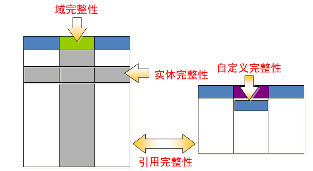

# 一 数据完整性介绍


## 1.1 实体完整性
保证关系中的每个记录(实体)都是可识别和唯一的(**实体必须可区分**)。值关系数据库中所有的表都必须有主键
而且标志不允许存在
* 无主键记录
* 主键值相同的记录

**实体完整性约束**
1. 主键约束
2. 唯一约束
3. 自动增长列

## 1.2 域完整性
也称用户定义完整性或语义完整性
* 是针对某一具体应用领域定义的数据约束条件
* 反应某一具体应用所涉及的数据必须满足应用语义的要求
* **指明关系中属性的取值范围，** 防止属性的值与应用语义矛盾
* 关系模型应该提供定义和检验这些完整性的机制

**用户定义完整性约束**
1. 数据类型约束
2. 非空约束
3. 默认值约束

## 1.3 引用完整性
也称参照完整性：在关系模型中，由于实体与实体之间的联系是使用关系来表示，自然存在了关系
之间的引用

* 参照完整性描述了实体之间的联系
* 一般指多个实体或关系之间的关联关系

**参照完整性约束**
1. 外键约束: 从表中的公共字段是主表的外键

# 二 引用完整性设置

## 2.1 主表和从表

两个表建立关系（两个表只要有公共字段就有关系），一个表称为主表，一个表称为从表。

外键约束可以实现：

1. **主表中没有的从表中不允许插入**

2. **从表中有的主表中不允许删除**

3. **不能更改主表中的值而导致从表中的记录孤立存在**

4. **先删除从表，再删除主表**

## 2.1 外键（foreign key）
1. 外键: **从表中的公共字段，公共字段的名字可以不一样，但是数据类型必须一样**。

2. **外键约束用来保证引用完整性**

### 2.1.1 添加外键
**创建表时添加外键**
```sql
create table stuinfo(
	stuno char(4) primary key,
	name varchar(10) not null
);

create table stumarks(
	stuid char(4) primary key,
	score tinyint unsigned,
	foreign key (stuid) references stuinfo(stuno)  -- 设置外键
);
```
**修改表时添加外键**: `alter table 从表 add foreign key (从表的公共字段) references 主表(公共字段);`

```sql
create table stuinfo(
stuno char(4) primary key,
name varchar(10) not null
);

create table stumarks(
stuid char(4) primary key,
score tinyint unsigned
);

alter table stumarks add foreign key (stuid) references stuinfo(stuno);
```

**要创建外键必须是`innodb`引擎，`myisam`不支持外键约束**

### 2.1.2 删除外键
```sql
alter table 表名 drop foreign key 外键名;
```
**示例**
```sql
alter table stumarks drop foreign key stumarks_ibfk_1;
```

## 2.2 外键操作

1. 严格操作（前面讲的是严格操作） 

    * **主表中没有的从表中不允许插入**
    
    * **从表中有的主表中不允许删除**
    
    * **不能更改主表中的值而导致从表中的记录孤立存在**
    
    * **先删除从表，再删除主表**

2. 置空操作（`set null`）：如果主表记录删除或更新，从表置空

3. 级联操作（`cascade`）：如果主表记录删除或更新，从表级联

一般来说：**主表删除的时候，从表置空操作，主表更新的时候，从表级联操作**。
```sql
foreign key (从表公共字段) references 主表(公共字段) 
on delete set null  -- 删除置空
on update cascade  -- 更新级联
```

```sql
create table stuinfo(
stuno char(4) primary key,
name varchar(10) not null
);


create table stumarks(
stuid int auto_increment primary key,
stuno char(4) ,
score tinyint unsigned,
foreign key (stuno) references stuinfo(stuno) on delete set null on update cascade
);


insert into stuinfo values ('s101','tom');


insert into stumarks values (null,'s101',88);

select * from stuinfo;
+-------+------+
| stuno | name |
+-------+------+
| s101  | tom  |
+-------+------+


update stuinfo set stuno='s102' where stuno='s101';   # 更新时级联
select * from stumarks;
+-------+-------+-------+
| stuid | stuno | score |
+-------+-------+-------+
|     1 | s102  |    88 |
+-------+-------+-------+


delete from stuinfo where stuno='s102';    # 删除时置空
select * from stumarks;
+-------+-------+-------+
| stuid | stuno | score |
+-------+-------+-------+
|     1 | NULL  |    88 |
+-------+-------+-------+
```