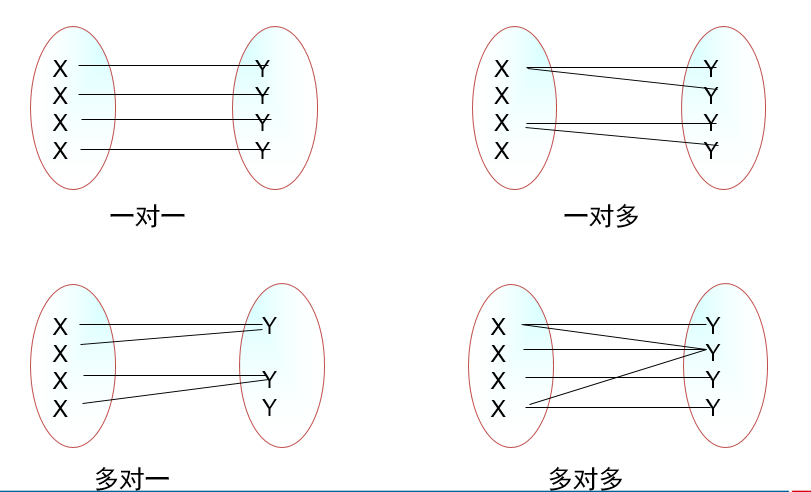
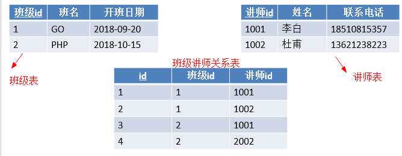
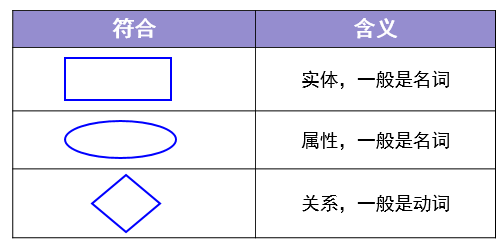
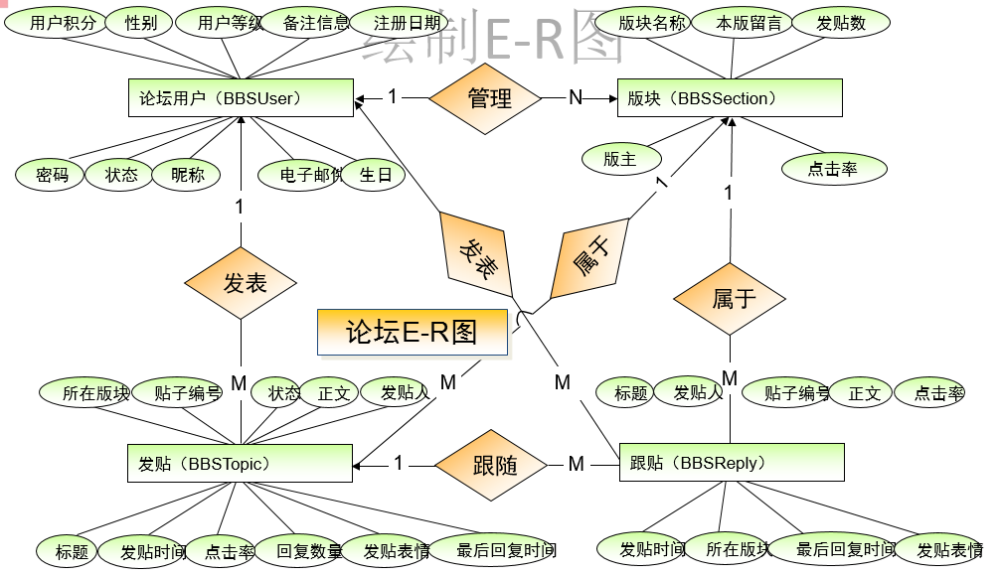
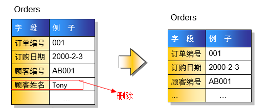

# 零 数据库基本概念
1. 关系: 两个表的公共字段

2. 行: 也称记录，也称实体

3. 列: 也称字段，也称属性

> 1. 就表**结构**而言，表分为行和列；
> 2. 就表**数据**而言，分为记录和字段；
> 3. 就**面向对象**而言，一个记录就是一个实体，一个字段就是一个属性。

## 0.1 数据冗余
相同的数据存储在不同的地方

> 1. 冗余只能减少，不能杜绝。
> 2. 减少冗余的方法是分表
> 3. 为减少数据查找的麻烦，允许数据有一定的冗余

## 0.2 数据完整性
正确性+准确性=数据完整性
* 正确性: 数据**类型正确**
* 准确性: 数据**范围要准确**

**示例:**
> 思考：学生的年龄是整型，输入1000岁，正确性和准确性如何？
> 
> 答：正确的，但不准确

> 思考：年龄是整形的，收入了字符串，正确性和准确性如何？
>
> 答：不正确

# 一 实体之间的关系
实体之间存在下列三个关系
1. 一对一
2. 一对多 （多对一）
3. 多对多




## 1.1 一对多
1. 主表中的一条记录对应从表中的多条记录。

2. 一对多和多对一是一样的


****
> 如何实现一对多？
>
> 答：主键和非主键建关系


## 1.2 一对一
1. 主表中的一条记录对应从表中的一条记录


> 如何实现一对一？
> 
> 主键和主键建关系就能实现一对一。

```
思考：一对一两个表完全可以用一个表实现，为什么还要分成两个表？

答：在字段数量很多情况下，数据量也就很大，每次查询都需要检索大量数据，这样效率低下。
我们可以将所有字段分成两个部分，“常用字段”和“不常用字段”，
这样对大部分查询者来说效率提高了。【表的垂直分割】
```

## 1.3 多对多
**主表中的一条记录对应从表中的多条记录，从表中的一条记录对应主表中的多条记录**



> 如何实现多对多？
> 
> 答：建立第三张表来保存关系。

# 二 数据库设计
**数据库设计步骤**


1. 收集信息：与该系统有关人员进行交流、坐谈，充分理解数据库需要完成的任务

2. 标识对象（实体－Entity）标识数据库要管理的关键对象或实体

3. 标识每个实体的属性（Attribute）

4. 标识对象之间的关系（Relationship）

5. 将模型转换成数据库

6. 规范化


## 2.1 E-R图

`E-R`(`Entity－Relationship`)实体关系图 



**ER图示例**


**ER图转为表**
1. **实体转成表，属性转成字段**
2. 如果没有合适的字段做主键，给表添加一个自动增长列做主键。


## 2.2 示例
1. 项目需求

```
BBS论坛的基本功能：
用户注册和登录，后台数据库需要存放用户的注册信息和在线状态信息；
用户发贴，后台数据库需要存放贴子相关信息，如贴子内容、标题等；
用户可以对发帖进行回复；
论坛版块管理：后台数据库需要存放各个版块信息，如版主、版块名称、贴子数等；
```

2. 标识对象

```
参与的对象有：用户、发的帖子、跟帖、板块
```

3. 对象属性


4. 绘制E-R图


5. 将E-R图转出表结构


## 2.3 数据规范化

`Codd`博士定义了`6`个范式来规范化数据库，范式由小到大来约束，范式越高冗余越小，
但表的个数也越多。实验证明，三范式是性价比最高的

### 2.3.1 第一范式: 确保每列原子性
第一范式**确保每个字段不可再分**


### 2.3.2 第二范式: 非键字段必须依赖于键字段
**一个表只能描述一件事**


### 2.3.3 第三范式: 消除传递依赖
**在所有的非键字段中，不能有传递依赖**

顾客编号确定顾客姓名就确定了。出现消息传递依赖


> 多学一招：上面的设计不满足第三范式，但是高考分数表就是这样设计的，为什么？
>
> 答：高考分数峰值访问量非常大，这时候就是性能更重要。当性能和规范化冲突的时候，我们首选性能。这就是“反三范式”。


