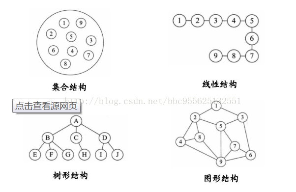

# 数据结构介绍

数据结构是一门描述现实世界实体的数学模型(非数值计算)及其上的运算在计算机中如何表示和实现

## 基本概念

1. 数据: 描述客观事物的数和字符集合

2. 数据元素(**元素、结点、记录**): 数据的基本单位

3. 数据项(**字段或域**): 具有独立含义的数据的最小单位

4. 数据对象: 相同性质的数据的集合

5. 数据结构: 相互之间存在某种特定关系数据元素的集合；
   也可以理解为数据元素以及数据元素之间的关系
   

## 数据结构的相关
1. 逻辑结构: 由数据元素之间的逻辑关系构成

2. 存储结构(物理结构): 数据元素及其关系在计算机存储器中的表示

3. 数据运算: 施加在数据之上的操作

# 逻辑结构 

逻辑结构是从数据元素的逻辑关系上描述数据，是指数据元素之间的逻辑关系的整体。
与**数据的存储无关，独立与计算机**。逻辑结构是从具体问题抽象出来的数学模型

## 逻辑结构的表示
逻辑结构通常采用二元组的方式。

## 逻辑结构的类型

1. 集合: 只有一种关系就是在同一个集合中。
2. 线性结构: 数据元素之间存在一对一的关系。
3. 树形结构: 数据元素之间存在一对多的关系。
4. 图形结构: 数据元素之间存在多对多的关系。

# 存储结构

## 顺序存储结构
采用一组连续的存储单元存放所有的数据元素，所有的数据占用一整块存储空间。

**优点**
1. 存储效率高
2. 存储单元完全存储数据，数据密度高
3. 逻辑关系没有额外占用存储空间

**缺点**
1. 不便于数据修改
2. 插入数据和删除数据需要移动大量的数据元素

## 链式存储结构

每个数据元素用一个内存节点存储，节点是单独分配的；每个结点附加指针域，用于存储下一个
结点的内存地址

**优点**
1. 便于修改数据
2. 进行插入和删除操作时不用移动元素

**缺点**
1. 内存空间利用率低，分配的内存有一部分用于存储数据元素之间的逻辑关系了
2. 不能实现随机存取

## 索引存储结构

存储数据元素信息时建立附加的索引表。存储所有数据元素信息的表称为主表，其中每个数据元素
有一个关键字和对应的存储地址

索引表中的每一项称为索引项，一般形式是`关键字.地址`。关键字唯一标识一个元素，地址对应
为关键字在主数据表中的存储地址，

**优点**
1. 查询效率高

**缺点**
1. 额外建立索引表，增加空间开销

## 哈希(散列)存储结构
根据元素的关键字通过哈希函数直接计算出一个值，并将这个值作为该关键字的地址。

**优点**
1. 查询速度快

**缺点**
1. 一般只适合要求对数据能够进行快速查找和插入的场合

# 数据运算

对数据实施的操作，也就是运算功能的描述，是抽象的，基于逻辑结构。

运算实现是完成运算实现的算法，是具体的，是基于存储结构的。

# 数据类型与抽象数据类型

数据类型: 一组性质相同的值的集合和定义在此集合上的一组操作的总称，
也就是某种程序设计语言实现的数据结构

抽象数据类型: 指用户进行软件系统设计时从问题数学模型中抽象出来的逻辑数据结构和逻辑数据
结构上的运算。不考虑计算机的具体存储结构和运算的具体实现算法。
