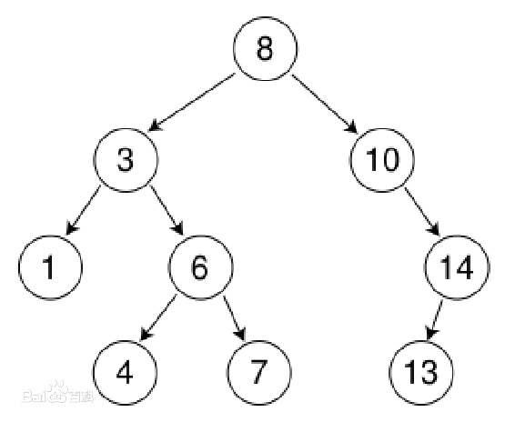
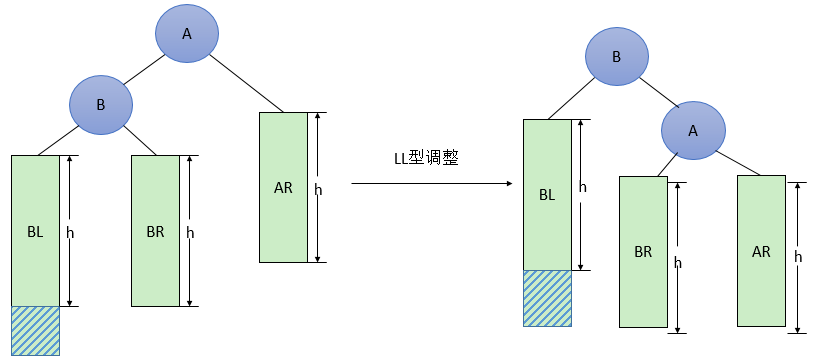
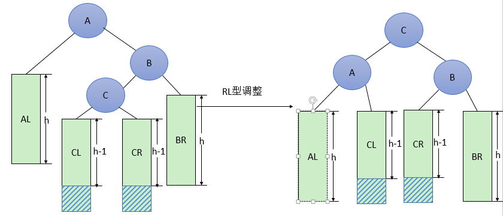

# 一 二叉排序树

二叉排序树，又叫二叉查找树，二叉搜索树，是一种有特定规则的二叉树，定义如下：

1. 它是一棵二叉树，或者是空树。

2. 左子树所有节点的值都小于它的根节点，右子树所有节点的值都大于它的根节点。

3. 左右子树也是一棵二叉查找树。




二叉排序树的特点是
* 一直往左儿子往下找左儿子，可以找到最小的元素；
* 一直往右儿子找右儿子，可以找到最大的元素。

## 二叉树排序树实现

以下是一个二叉排序树的表示：
```go
package main

// BinarySearchTree 二叉查找树
type BinarySearchTree struct {
	Root *BinarySearchTreeNode // 树根节点
}

// BinarySearchTreeNode 二叉查找树节点
type BinarySearchTreeNode struct {
	Value int64                 // 值
	Times int64                 // 值出现的次数
	Left  *BinarySearchTreeNode // 左子树
	Right *BinarySearchTreeNode // 右字树
}

// NewBinarySearchTree 初始化一个二叉查找树
func NewBinarySearchTree() (t *BinarySearchTree) {
	t = new(BinarySearchTree)
	t.Root = nil
	return
}
```

### 创建二叉排序树
一个节点代表一个元素，节点的 `Value` 值是用来进行二叉查找的关键，
当 `Value` 值重复时，我们将值出现的次数 `Times` 加 `1`，添加节点代码如下:
```go
// Add 给树添加结点
func (tree *BinarySearchTree) Add(value int64)  {
// 根结点为空 添加根节点并返回
if tree.Root == nil {
tree.Root = &BinarySearchTreeNode{Value: value}
return
}
// 否则 添加子结点
tree.Root.addNode(value)
}

// addNode 给结点添加子结点
func (node *BinarySearchTreeNode) addNode(value int64)  {
// 值 比当前结点的值 小
// 添加在左子结点
if value < node.Value {
if node.Left == nil {
// 左子树为空添加
node.Left = &BinarySearchTreeNode{Value: value}
} else {
// 否则 继续递归寻找
node.Left.addNode(value)
}
} else if value > node.Value {
// 值 比当前结点的值 大
// 添加在右子结点
if node.Right == nil {
// 右子树为空 添加
node.Right = &BinarySearchTreeNode{Value: value}
} else {
// 右子树不为空 递归寻找
node.Right.addNode(value)
}
} else {
// 相等记录出现次数
node.Times++
}
}
```
如果添加元素时是棵空树，那么初始化根节点。

然后添加的值和根节点比较，判断是要插入到根节点左子树还是右子树，还是不用插入。

当值比根节点小时，元素要插入到根节点的左子树中，当值比根节点大时，元素要插入到根节点的右子树中，相等时不插入，只更新次数。

然后再分别对根节点的左子树和右子树进行递归操作即可。

### 查找最大值和最小值
查找最大值和最小值比较简单，一直往左儿子往下找左儿子，可以找到最小的元素，
一直往右儿子找右儿子，可以找到最大的元素。

```go
// FindMinValue 查找最小值
func (tree *BinarySearchTree) FindMinValue() *BinarySearchTreeNode {
if tree.Root == nil {
return nil
}

return tree.Root.findMinValue()
}
// findMinValue 递归查询左子树
func (node *BinarySearchTreeNode) findMinValue() *BinarySearchTreeNode {
// 左子树为空，表面已经是最左的节点了，该值就是最小值
if node.Left == nil {
return node
}
// 一直左子树递归
return node.Left.findMinValue()
}

// FindMaxValue 查找最大值
func (tree *BinarySearchTree) FindMaxValue() *BinarySearchTreeNode {
if tree.Root == nil {
return nil
}
return tree.Root.findMaxValue()
}
// findMaxValue 递归查找最大值
func (node *BinarySearchTreeNode) findMaxValue() *BinarySearchTreeNode {
if node.Right == nil {
return node
}

// 递归查找又子树
return node.Right.findMaxValue()
}
```
### 查找指定元素
```go
// Find 查找指定元素
func (tree *BinarySearchTree) Find(value int64) *BinarySearchTreeNode  {
if tree.Root == nil {
return nil
}
return tree.Root.find(value)
}
// find 递归查找结点
func (node *BinarySearchTreeNode) find(value int64) *BinarySearchTreeNode  {
// 指定值 等于当前节点值 返回当前节点指针
if value == node.Value || node == nil{
return node
}
// 指定值 比当前节点值 小
if value < node.Value {
//// 递归查询左子树
//if node.Left == nil {
//	// 左子树为空，则没有查找到该值 返回nil
//	return nil
//}
// 否则递归查找左子树
return node.Left.find(value)
} else {
//// 指定值 比当前节点值 大
//// 递归查找右子树
//if node.Right == nil{
//	// 当前节点右子树指针为空，表示没有查找到值 则返回nil
//	return nil
//}
// 否则递归查找右子树
return node.Right.find(value)
}
}
```
如果是空树，返回 `nil`，否则与根节点比较。

如果刚刚好等于根节点的值，返回该节点，否则根据值的比较，继续往左子树或右字树递归查找。

### 查找指定元素的父节点

如果返回的父亲节点为空，表示没有父亲。
```go
// FindParent 查找指定元素的父节点
func (tree *BinarySearchTree) FindParent(value int64) *BinarySearchTreeNode  {
// 空树
if tree.Root == nil {
return nil
}
// 当前值是根节点，没有父节点
if tree.Root.Value == value {
return nil
}
return tree.Root.findParent(value)
}
// findParent 查找指定值节点的父节点
func (node *BinarySearchTreeNode) findParent(value int64) *BinarySearchTreeNode {
// 指定值 比当前节点值 小
if value < node.Value {
// 如果查找的值小于节点值，从节点的左子树开始找
if node.Left == nil {
// 左子树为空，表示找不到该值了，返回nil
return nil
}
// 左子树的根节点的值刚好等于该值，那么父亲就是现在的node，返回
if node.Left.Value == value {
return node
} else {
return node.Left.findParent(value)
}
// 指定值 比当前节点值 大
} else {
if node.Right == nil {
return nil
}

if node.Right.Value == value {
return node
} else {
return node.Right.findParent(value)
}
}
}
```

### 删除节点
删除元素有四种情况：

1. 删除的节点是叶子节点，直接删除即可

2. 被删除的节点只有左子树，将被删除节点的左孩子替代被删除的节点即可

3. 被删除的节点只有右子树，将被删除节点的右孩子替代被删除节点即可

4. 被删除节点同时存在左子树和右子树，将其左子树中最大的节点替代被删除节点即可
   （或右子树中最小的节点替代即可）

```go
func (tree *BinarySearchTree) Delete(value int64)  {
if tree.Root == nil {
return
}
node := tree.Root.find(value)  // 查找值是否存在
if node == nil {
return
}
parent := tree.Root.findParent(value)  // 查找该值的父节点

// 根节点 且没有子树
if parent == nil && node.Left == nil && node.Right == nil {
tree.Root = nil
return
}
// 存在父节点 但是没有子结点 叶子节点
if parent != nil && node.Left == nil && node.Right == nil {
// 删除的节点是父节点的左左子结点 直接删除
if parent.Left.Value == value {
parent.Left = nil
} else {
parent.Right = nil
}
return
}
// 存在父节点 存在左子树 但是不存在右子树
if parent != nil && node.Left != nil && node.Right == nil {
// 直接将左孩子节点替代删除节点
if parent.Left.Value == value {
parent.Left = node.Left
} else {
parent.Right = node.Left
}
return
}
// 存在父节点 左子树为空，右子树不为空
if parent != nil && node.Left == nil && node.Right != nil {
// 直接将右孩子替代算法节点接口
if parent.Left.Value == value {
parent.Left = node.Right
} else {
parent.Right = node.Right
}
return
}
// 存在父节点 左子树和右子树均不为
if parent != nil && node.Left != nil && node.Right != nil {
// 寻找右子树中最小的节点替代被算法的节点
// 只需要在右子树的左边寻找即可找到
minNode := node.Right
for minNode.Left != nil {
minNode = minNode.Left
}
// 把最小的节点删掉
tree.Delete(minNode.Value)
// 使用最小节点替代
// 最小值的节点替换被删除节点
node.Value = minNode.Value
node.Times = minNode.Times
return
}
}
```

### 中序遍历(排序)
二叉排序树的中序遍历输出的序列就是从小到大排列的序列
```go
// MidOrder 中序遍历
func (tree *BinarySearchTree) MidOrder() {
tree.Root.midOrder()
}

func (node *BinarySearchTreeNode) midOrder() {
if node == nil {
return
}

// 先打印左子树
node.Left.midOrder()

// 按照次数打印根节点
for i := 0; i <= int(node.Times); i++ {
fmt.Print(node.Value, " ")
}

// 打印右子树
node.Right.midOrder()
}
```

## 二叉排序树完整代码
```go
package main

import "fmt"

// BinarySearchTree 二叉查找树
type BinarySearchTree struct {
	Root *BinarySearchTreeNode // 树根节点
}

// BinarySearchTreeNode 二叉查找树节点
type BinarySearchTreeNode struct {
	Value int64                 // 值
	Times int64                 // 值出现的次数
	Left  *BinarySearchTreeNode // 左子树
	Right *BinarySearchTreeNode // 右字树
}

// NewBinarySearchTree 初始化一个二叉查找树
func NewBinarySearchTree() (t *BinarySearchTree) {
	t = new(BinarySearchTree)
	t.Root = nil
	return
}

// Add 给树添加结点
func (tree *BinarySearchTree) Add(value int64)  {
	// 根结点为空 添加根节点并返回
	if tree.Root == nil {
		tree.Root = &BinarySearchTreeNode{Value: value}
		return
	}
	// 否则 添加子结点
	tree.Root.addNode(value)
}
// addNode 给结点添加子结点
func (node *BinarySearchTreeNode) addNode(value int64)  {
	// 值 比当前结点的值 小
	// 添加在左子结点
	if value < node.Value {
		if node.Left == nil {
			// 左子树为空添加
			node.Left = &BinarySearchTreeNode{Value: value}
		} else {
			// 否则 继续递归寻找
			node.Left.addNode(value)
		}
	} else if value > node.Value {
		// 值 比当前结点的值 大
		// 添加在右子结点
		if node.Right == nil {
			// 右子树为空 添加
			node.Right = &BinarySearchTreeNode{Value: value}
		} else {
			// 右子树不为空 递归寻找
			node.Right.addNode(value)
		}
	} else {
		// 相等记录出现次数
		node.Times++
	}
}

// FindMinValue 查找最小值
func (tree *BinarySearchTree) FindMinValue() *BinarySearchTreeNode {
	if tree.Root == nil {
		return nil
	}

	return tree.Root.findMinValue()
}
// findMinValue 递归查询左子树
func (node *BinarySearchTreeNode) findMinValue() *BinarySearchTreeNode {
	// 左子树为空，表面已经是最左的节点了，该值就是最小值
	if node.Left == nil {
		return node
	}
	// 一直左子树递归
	return node.Left.findMinValue()
}

// FindMaxValue 查找最大值
func (tree *BinarySearchTree) FindMaxValue() *BinarySearchTreeNode {
	if tree.Root == nil {
		return nil
	}
	return tree.Root.findMaxValue()
}
// findMaxValue 递归查找最大值
func (node *BinarySearchTreeNode) findMaxValue() *BinarySearchTreeNode {
	if node.Right == nil {
		return node
	}

	// 递归查找又子树
	return node.Right.findMaxValue()
}

// Find 查找指定元素
func (tree *BinarySearchTree) Find(value int64) *BinarySearchTreeNode  {
	if tree.Root == nil {
		return nil
	}
	return tree.Root.find(value)
}
// find 递归查找结点
func (node *BinarySearchTreeNode) find(value int64) *BinarySearchTreeNode  {
	// 指定值 等于当前节点值 返回当前节点指针
	if node == nil || value == node.Value {
		return node
	}
	// 指定值 比当前节点值 小
	if value < node.Value {
		//// 递归查询左子树
		//if node.Left == nil {
		//	// 左子树为空，则没有查找到该值 返回nil
		//	return nil
		//}
		// 否则递归查找左子树
		return node.Left.find(value)
	} else {
		//// 指定值 比当前节点值 大
		//// 递归查找右子树
		//if node.Right == nil{
		//	// 当前节点右子树指针为空，表示没有查找到值 则返回nil
		//	return nil
		//}
		// 否则递归查找右子树
		return node.Right.find(value)
	}
}

// FindParent 查找指定元素的父节点
func (tree *BinarySearchTree) FindParent(value int64) *BinarySearchTreeNode  {
	// 空树
	if tree.Root == nil {
		return nil
	}
	// 当前值是根节点，没有父节点
	if tree.Root.Value == value {
		return nil
	}
	return tree.Root.findParent(value)
}
// findParent 查找指定值节点的父节点
func (node *BinarySearchTreeNode) findParent(value int64) *BinarySearchTreeNode {
	// 指定值 比当前节点值 小
	if value < node.Value {
		// 如果查找的值小于节点值，从节点的左子树开始找
		if node.Left == nil {
			// 左子树为空，表示找不到该值了，返回nil
			return nil
		}
		// 左子树的根节点的值刚好等于该值，那么父亲就是现在的node，返回
		if node.Left.Value == value {
			return node
		} else {
			return node.Left.findParent(value)
		}
		// 指定值 比当前节点值 大
	} else {
		if node.Right == nil {
			return nil
		}

		if node.Right.Value == value {
			return node
		} else {
			return node.Right.findParent(value)
		}
	}
}


/*
1. 删除的节点是叶子节点，直接删除即可

2. 被删除的节点只有左子树，将被删除节点的左孩子替代被删除的节点即可

3. 被删除的节点只有右子树，将被删除节点的右孩子替代被删除节点即可

4. 被删除节点同时存在左子树和右子树，将其左子树中最大的节点替代被删除节点即可
   （或右子树中最小的节点替代即可）
*/

func (tree *BinarySearchTree) Delete(value int64)  {
	if tree.Root == nil {
		return
	}
	node := tree.Root.find(value)  // 查找值是否存在
	if node == nil {
		return
	}
	parent := tree.Root.findParent(value)  // 查找该值的父节点

	// 根节点 且没有子树
	if parent == nil && node.Left == nil && node.Right == nil {
		tree.Root = nil
		return
	}
	// 存在父节点 但是没有子结点 叶子节点
	if parent != nil && node.Left == nil && node.Right == nil {
		// 删除的节点是父节点的左左子结点 直接删除
		if parent.Left.Value == value {
			parent.Left = nil
		} else {
			parent.Right = nil
		}
		return
	}
	// 存在父节点 存在左子树 但是不存在右子树
	if parent != nil && node.Left != nil && node.Right == nil {
		// 直接将左孩子节点替代删除节点
		if parent.Left.Value == value {
			parent.Left = node.Left
		} else {
			parent.Right = node.Left
		}
		return
	}
	// 存在父节点 左子树为空，右子树不为空
	if parent != nil && node.Left == nil && node.Right != nil {
		// 直接将右孩子替代算法节点接口
		if parent.Left.Value == value {
			parent.Left = node.Right
		} else {
			parent.Right = node.Right
		}
		return
	}
	// 存在父节点 左子树和右子树均不为
	if parent != nil && node.Left != nil && node.Right != nil {
		// 寻找右子树中最小的节点替代被算法的节点
		// 只需要在右子树的左边寻找即可找到
		minNode := node.Right
		for minNode.Left != nil {
			minNode = minNode.Left
		}
		// 把最小的节点删掉
		tree.Delete(minNode.Value)
		// 使用最小节点替代
		// 最小值的节点替换被删除节点
		node.Value = minNode.Value
		node.Times = minNode.Times
		return
	}
}

// MidOrder 中序遍历
func (tree *BinarySearchTree) MidOrder() {
	tree.Root.midOrder()
}

func (node *BinarySearchTreeNode) midOrder() {
	if node == nil {
		return
	}

	// 先打印左子树
	node.Left.midOrder()

	// 按照次数打印根节点
	for i := 0; i <= int(node.Times); i++ {
		fmt.Print(node.Value, " ")
	}

	// 打印右子树
	node.Right.midOrder()
}

func main() {

	var t *BinarySearchTree
	t = NewBinarySearchTree()
	values := []int64{9,2,3,7,1,4,10,8,6,5}
	for _, v := range values {
		t.Add(v)
	}

	t.MidOrder()

}
```

# 二 AVL树(平很二叉树)
二叉查找树的树高度影响了查找的效率，需要尽量减小树的高度，AVL树正是这样的树。

## AVL树介绍

`AVL`树是一棵严格自平衡的二叉查找树，`1962`年，发明者 `Adelson-Velsky` 和 `Landis`
发表了论文，以两个作者的名字命名了该数据结构，这是较早发明的平衡二叉树。

定义如下：
1. 首先它是一棵二叉查找树。
2. 任意一个节点的左右子树最大高度差为1。

由于树特征定义，我们可以计算出其高度 `h` 的上界 `h<=1.44log(n)`，
也就是最坏情况下，树的高度约等于 `1.44log(n)`

> 假设高度 h 的AVL树最少有 f(h) 个节点，因为左右子树的高度差不能大于1，
> 所以左子树和右子树最少节点为： f(h-1)，f(h-2)。
>
> 因此，树根节点加上左右子树的节点，满足公式 f(h) = 1 + f(h-1) + f(h-2)，
> 初始条件 f(0)=0,f(1)=1。
>
> 经过数学的推算可以得出 h<=1.44log(n)，由于计算过程超纲了，在此不进行演算。

树的高度被限制于 `1.44log(n)`， 所以查找元素时使用二分查找，最坏查找 `1.44log(n)` 次，
此时最坏时间复杂度为 `1.44log(n)`，去掉常数项，时间复杂度为：`log(n)`。

为了维持`AVL`树的特征，每次添加和删除元素都需要一次或多次旋转来调整树的平衡。
调整的依据来自于二叉树节点的平衡因子：节点的左子树与右子树的高度差称为该节点的平衡因子，
约束范围为 `[-1，0，1]`。

平衡二叉查找树比较难以理解的是添加和删除元素时的调整操作，我们将会具体分析。

## AVL树实现
下面实现AVL树的相关算法

### AVL树表示
```go
package main

// AVLTree AVL树
type AVLTree struct {
	Root *AVLTreeNode // 树根节点
}

// AVLTreeNode AVL节点
type AVLTreeNode struct {
	Value  int64        // 值
	Times  int64        // 值出现的次数
	Height int64        // 该节点作为树根节点，树的高度，方便计算平衡因子
	Left   *AVLTreeNode // 左子树
	Right  *AVLTreeNode // 右字树
}

// NewAVLTree 初始化一个AVL树
func NewAVLTree() (tree *AVLTree) {
	tree = new(AVLTree)
	tree.Root = nil
	return
}
```
其中 `Height` 表示以该节点作为树的根节点时该树的高度，方便计算平衡因子。

**更新树的高度**
```go
// updateHeight 更新节点的树高度
func (node *AVLTreeNode) updateHeight() {
	if node == nil {
		return
	}

	var leftHeight, rightHeight int64 = 0, 0
	if node.Left != nil {
		leftHeight = node.Left.Height
	}
	if node.Right != nil {
		rightHeight = node.Right.Height
	}
	// 哪个子树高算哪棵的
	maxHeight := leftHeight
	if rightHeight > maxHeight {
		maxHeight = rightHeight
	}
	// 高度加上自己那一层
	node.Height = maxHeight + 1
}
```
**计算树的平衡因子，也就是左右子树的高度差**
```go
// balanceFactor 计算平衡因子
func (node *AVLTreeNode) balanceFactor() int64 {
	var leftHeight, rightHeight int64 = 0, 0
	if node.Left != nil {
		leftHeight = node.Left.Height
	}
	if node.Right != nil {
		rightHeight = node.Right.Height
	}
	return leftHeight - rightHeight
}
```

### AVL树失衡与调整

添加元素前需要定位到元素的位置，也就是使用二分查找找到该元素需要插入的地方。

插入后，需要满足所有节点的平衡因子在 `[-1，0，1]` 范围内，如果不在，需要进行旋转调整。

旋转有四种情况：

1. 在右子树上插上右儿子导致失衡，左旋，转一次。
2. 在左子树上插上左儿子导致失衡，右旋，转一次。
3. 在左子树上插上右儿子导致失衡，先左后右旋，转两次。
4. 在右子树上插上左儿子导致失衡，先右后左旋，转两次。

旋转规律记忆法：**单旋和双旋，单旋反方向，双旋同方向**。


**最小失衡子树**：在新插入的结点向上查找，以第一个平衡因子的绝对值超过 `1` 
的结点为根的子树称为最小不平衡子树。也就是说，一棵失衡的树，
是有可能有多棵子树同时失衡的。而这个时候，我们只要调整最小的不平衡子树，
就能够将不平衡的树调整为平衡的树。

平衡二叉树的失衡调整主要是**通过旋转最小失衡子树来实现**的。
根据旋转的方向有两种处理方式，**左旋** 与 **右旋** 。

**左旋操作**
1. 节点的右孩子替代此节点位置
2. 右孩子的左子树变为该节点的右子树
3. 节点本身变为右孩子的左子树


**右旋操作**
1. 节点的左孩子代表此节点
2. 节点的左孩子的右子树变为节点的左子树
3. 将此节点作为左孩子节点的右子树。


假设一颗 `AVL` 树的某个节点为 `A`，有四种操作会使 `A` 的左右子树高度差大于 `1`，
从而破坏了原有 `AVL` 树的平衡性。平衡二叉树插入节点的情况分为以下四种：

| 插入方式 | 描述 | 旋转方式 |
| :---: | --- | :---: | 
| `LL` | 在 `A` 的左子树根节点的左子树上插入节点而破坏平衡 | 右旋转 | 
| `RR` | 在 `A` 的右子树根节点的右子树上插入节点而破坏平衡 | 左旋转 | 
| `LR` | 在 `A` 的左子树根节点的右子树上插入节点而破坏平衡 | 先左旋后右旋 | 
| `RL` | 在 `A` 的右子树根节点的左子树上插入节点而破坏平衡 | 先右旋后左旋 |


#### LL型调整
**右旋转**
> 由于在`A`的左孩子(L)的左子树(L)上插入新结点，使原来平衡二叉树变得不平衡，
> 此时`A`的平衡因子由1增至2。下面图 是LL型的最简单形式。显然，按照大小关系，
> 结点`B`应作为新的根结点，其余两个节点分别作为左右孩子节点才能平衡，
> `A`结点就好像是绕结点`B`顺时针旋转一样。
> 
> 

> LL型调整的一般形式如下图 所示，表示在`A`的左孩子`B`的左子树`BL`(不一定为空)
> 中插入结点(图中阴影部分所示)而导致不平衡( `h` 表示子树的深度)。这种情况调整如下：
> 1. 将A的左孩子B提升为新的根结点；
> 2. 将原来的根结点A降为B的右孩子；
> 3. 各子树按大小关系连接(BL和AR不变，BR调整为AL)。
> 
>

实现代码如下
```go
func (node *AVLTreeNode) LLRotate() (n *AVLTreeNode) {
	// node 为最小失衡子树的根节点
	/*
	 1. 将node 的左孩子 n 提升为新的根结点；
	 2. 将原来的根结点 node 降为 n 的右孩子；
	 3. 各子树按大小关系连接(n.Left 和 node.Right不变，n.Right调整为node.Left)。
	 */

	n = node.Left  // 1
	node.Left = n.Right // 3
	n.Right = node  // 2

	node.updateHeight()  // 更新node的高度
	n.updateHeight()  // 更新n的高度
	return
}
```

#### RR调整

> 由于在`A`的右孩子(`R`)的右子树(`R`)上插入新结点，使原来平衡二叉树变得不平衡，
> 此时`A`的平衡因子由`-1`变为`-2`。下图是 `RR` 型的最简单形式。
> 显然，按照大小关系，结点`B`应作为新的根结点，其余两个节点分别作为左右孩子节点才能平衡，
> `A`结点就好像是绕结点`B`逆时针旋转一样。
> 

> RR型调整的一般形式如下图 所示，表示在`A`的右孩子`B`的右子树`BR`(不一定为空)中
> 插入结点(图中阴影部分所示)而导致不平衡( `h` 表示子树的深度)。这种情况调整如下：
>
> 1. 将A的右孩子B提升为新的根结点；
> 2. 将原来的根结点A降为B的左孩子
> 3. 各子树按大小关系连接(AL和BR不变，BL调整为A的右子树)。
> 

实现代码如下
```go
// RRRotate 选择
func (node *AVLTreeNode) RRRotate() (n *AVLTreeNode) {
// node 为最小失衡子树的根节点
/*
	1. 将 node 的右孩子 n 提升为新的根结点；
	2. 将原来的根结点 node 降为 n 的左孩子
	3. 各子树按大小关系连接(node.Left 和 n.Right 不变，n.Left 调整为 node.Right)。
*/
n = node.Right  // 1
node.Right = n.Left  // 3
n.Left = node  // 2

node.updateHeight()  // 更新node的高度
n.updateHeight()  // 更新n的高度
return
}
```

#### LR调整
> `LR`型调整的一般形式如下图 所示，表示在`A`的左孩子`B`的右子树(根结点为`C`，
> 不一定为空)中插入结点(图中两个阴影部分之一)而导致不平衡( h 表示子树的深度)。
> 这种情况调整如下：
> 1. 将B的左孩子C提升为新的根结点
> 2. 将原来的根结点A降为C的右孩子
> 3. 各子树按大小关系连接(BL和AR不变，CL和CR分别调整为B的右子树和A的左子树)。
> 
> 具体做法就是 **先左旋后右旋**

实现代码如下
```go
// LRRotate 先左旋后右旋
func (node *AVLTreeNode) LRRotate() (n *AVLTreeNode) {
n = node.Left

node.Left = n.RRRotate()  // 左旋
return node.LLRotate()  // 右旋
}
```

#### RL调整
> `RL`型调整的一般形式如下图 所示，表示在`A`的右孩子`B`的左子树(根结点为`C`，
> 不一定为空)中插入结点(图中两个阴影部分之一)而导致不平衡( `h` 表示子树的深度)。
> 这种情况调整如下：
> 1. 将B的左孩子C提升为新的根结点；
> 2. 将原来的根结点A降为C的左孩子；
> 3. 各子树按大小关系连接(AL和BR不变，CL和CR分别调整为A的右子树和B的左子树)。
> 
> 

实现代码如下
```go
// RLRotate 先右旋后左旋
func (node *AVLTreeNode) RLRotate() (n *AVLTreeNode) {
	n = node.Right
	node.Right = n.LLRotate()  // 右旋
	return node.RRRotate()  // 左旋
}
```


### 完整示例

```go
package main

import (
	"fmt"
)

// AVL树
type AVLTree struct {
	Root *AVLTreeNode // 树根节点
}

// AVL节点
type AVLTreeNode struct {
	Value  int64        // 值
	Times  int64        // 值出现的次数
	Height int64        // 该节点作为树根节点，树的高度，方便计算平衡因子
	Left   *AVLTreeNode // 左子树
	Right  *AVLTreeNode // 右字树
}

// 初始化一个AVL树
func NewAVLTree() *AVLTree {
	return new(AVLTree)
}

// 更新节点的树高度
func (node *AVLTreeNode) UpdateHeight() {
	if node == nil {
		return
	}

	var leftHeight, rightHeight int64 = 0, 0
	if node.Left != nil {
		leftHeight = node.Left.Height
	}
	if node.Right != nil {
		rightHeight = node.Right.Height
	}
	// 哪个子树高算哪棵的
	maxHeight := leftHeight
	if rightHeight > maxHeight {
		maxHeight = rightHeight
	}
	// 高度加上自己那一层
	node.Height = maxHeight + 1
}

// 计算平衡因子
func (node *AVLTreeNode) BalanceFactor() int64 {
	var leftHeight, rightHeight int64 = 0, 0
	if node.Left != nil {
		leftHeight = node.Left.Height
	}
	if node.Right != nil {
		rightHeight = node.Right.Height
	}
	return leftHeight - rightHeight
}

// 单右旋操作，看图说话
func RightRotation(Root *AVLTreeNode) *AVLTreeNode {
	// 只有Pivot和B，Root位置变了
	Pivot := Root.Left
	B := Pivot.Right
	Pivot.Right = Root
	Root.Left = B

	// 只有Root和Pivot变化了高度
	Root.UpdateHeight()
	Pivot.UpdateHeight()
	return Pivot
}

// 单左旋操作，看图说话
func LeftRotation(Root *AVLTreeNode) *AVLTreeNode {
	// 只有Pivot和B，Root位置变了
	Pivot := Root.Right
	B := Pivot.Left
	Pivot.Left = Root
	Root.Right = B

	// 只有Root和Pivot变化了高度
	Root.UpdateHeight()
	Pivot.UpdateHeight()
	return Pivot
}

// 先左后右旋操作，看图说话
func LeftRightRotation(node *AVLTreeNode) *AVLTreeNode {
	node.Left = LeftRotation(node.Left)
	return RightRotation(node)
}

// 先右后左旋操作，看图说话
func RightLeftRotation(node *AVLTreeNode) *AVLTreeNode {
	node.Right = RightRotation(node.Right)
	return LeftRotation(node)
}

// 添加元素
func (tree *AVLTree) Add(value int64) {
	// 往树根添加元素，会返回新的树根
	tree.Root = tree.Root.Add(value)
}

func (node *AVLTreeNode) Add(value int64) *AVLTreeNode {
	// 添加值到根节点node，如果node为空，那么让值成为新的根节点，树的高度为1
	if node == nil {
		return &AVLTreeNode{Value: value, Height: 1}
	}

	// 如果值重复，什么都不用做，直接更新次数
	if node.Value == value {
		node.Times = node.Times + 1
		return node
	}

	// 辅助变量
	var newTreeNode *AVLTreeNode

	if value > node.Value {
		// 插入的值大于节点值，要从右子树继续插入
		node.Right = node.Right.Add(value)
		// 平衡因子，插入右子树后，要确保树根左子树的高度不能比右子树低一层。
		factor := node.BalanceFactor()
		// 右子树的高度变高了，导致左子树-右子树的高度从-1变成了-2。
		if factor == -2 {
			if value > node.Right.Value {
				// 表示在右子树上插上右儿子导致失衡，需要单左旋：
				newTreeNode = LeftRotation(node)
			} else {
				//表示在右子树上插上左儿子导致失衡，先右后左旋：
				newTreeNode = RightLeftRotation(node)
			}
		}
	} else {
		// 插入的值小于节点值，要从左子树继续插入
		node.Left = node.Left.Add(value)
		// 平衡因子，插入左子树后，要确保树根左子树的高度不能比右子树高一层。
		factor := node.BalanceFactor()
		// 左子树的高度变高了，导致左子树-右子树的高度从1变成了2。
		if factor == 2 {
			if value < node.Left.Value {
				// 表示在左子树上插上左儿子导致失衡，需要单右旋：
				newTreeNode = RightRotation(node)
			} else {
				//表示在左子树上插上右儿子导致失衡，先左后右旋：
				newTreeNode = LeftRightRotation(node)
			}
		}
	}

	if newTreeNode == nil {
		// 表示什么旋转都没有，根节点没变，直接刷新树高度
		node.UpdateHeight()
		return node
	} else {
		// 旋转了，树根节点变了，需要刷新新的树根高度
		newTreeNode.UpdateHeight()
		return newTreeNode
	}
}

// 找出最小值的节点
func (tree *AVLTree) FindMinValue() *AVLTreeNode {
	if tree.Root == nil {
		// 如果是空树，返回空
		return nil
	}

	return tree.Root.FindMinValue()
}

func (node *AVLTreeNode) FindMinValue() *AVLTreeNode {
	// 左子树为空，表面已经是最左的节点了，该值就是最小值
	if node.Left == nil {
		return node
	}

	// 一直左子树递归
	return node.Left.FindMinValue()
}

// 找出最大值的节点
func (tree *AVLTree) FindMaxValue() *AVLTreeNode {
	if tree.Root == nil {
		// 如果是空树，返回空
		return nil
	}

	return tree.Root.FindMaxValue()
}

func (node *AVLTreeNode) FindMaxValue() *AVLTreeNode {
	// 右子树为空，表面已经是最右的节点了，该值就是最大值
	if node.Right == nil {
		return node
	}

	// 一直右子树递归
	return node.Right.FindMaxValue()
}

// 查找指定节点
func (tree *AVLTree) Find(value int64) *AVLTreeNode {
	if tree.Root == nil {
		// 如果是空树，返回空
		return nil
	}

	return tree.Root.Find(value)
}

func (node *AVLTreeNode) Find(value int64) *AVLTreeNode {
	if value == node.Value {
		// 如果该节点刚刚等于该值，那么返回该节点
		return node
	} else if value < node.Value {
		// 如果查找的值小于节点值，从节点的左子树开始找
		if node.Left == nil {
			// 左子树为空，表示找不到该值了，返回nil
			return nil
		}
		return node.Left.Find(value)
	} else {
		// 如果查找的值大于节点值，从节点的右子树开始找
		if node.Right == nil {
			// 右子树为空，表示找不到该值了，返回nil
			return nil
		}
		return node.Right.Find(value)
	}
}

// 删除指定的元素
func (tree *AVLTree) Delete(value int64) {
	if tree.Root == nil {
		// 如果是空树，直接返回
		return
	}

	tree.Root = tree.Root.Delete(value)
}

func (node *AVLTreeNode) Delete(value int64) *AVLTreeNode {
	if node == nil {
		// 如果是空树，直接返回
		return nil
	}
	if value < node.Value {
		// 从左子树开始删除
		node.Left = node.Left.Delete(value)
		// 删除后要更新该子树高度
		node.Left.UpdateHeight()
	} else if value > node.Value {
		// 从右子树开始删除
		node.Right = node.Right.Delete(value)
		// 删除后要更新该子树高度
		node.Right.UpdateHeight()
	} else {
		// 找到该值对应的节点
		// 该节点没有左右子树
		// 第一种情况，删除的节点没有儿子，直接删除即可。
		if node.Left == nil && node.Right == nil {
			return nil // 直接返回nil，表示直接该值删除
		}

		// 该节点有两棵子树，选择更高的哪个来替换
		// 第二种情况，删除的节点下有两个子树，选择高度更高的子树下的节点来替换被删除的节点，如果左子树更高，选择左子树中最大的节点，也就是左子树最右边的叶子节点，如果右子树更高，选择右子树中最小的节点，也就是右子树最左边的叶子节点。最后，删除这个叶子节点。
		if node.Left != nil && node.Right != nil {
			// 左子树更高，拿左子树中最大值的节点替换
			if node.Left.Height > node.Right.Height {
				maxNode := node.Left
				for maxNode.Right != nil {
					maxNode = maxNode.Right
				}

				// 最大值的节点替换被删除节点
				node.Value = maxNode.Value
				node.Times = maxNode.Times

				// 把最大的节点删掉
				node.Left = node.Left.Delete(maxNode.Value)
				// 删除后要更新该子树高度
				node.Left.UpdateHeight()
			} else {
				// 右子树更高，拿右子树中最小值的节点替换
				minNode := node.Right
				for minNode.Left != nil {
					minNode = minNode.Left
				}

				// 最小值的节点替换被删除节点
				node.Value = minNode.Value
				node.Times = minNode.Times

				// 把最小的节点删掉
				node.Right = node.Right.Delete(minNode.Value)
				// 删除后要更新该子树高度
				node.Right.UpdateHeight()
			}
		} else {
			// 只有左子树或只有右子树
			// 只有一个子树，该子树也只是一个节点，将该节点替换被删除的节点，然后置子树为空
			if node.Left != nil {
				//第三种情况，删除的节点只有左子树，因为树的特征，可以知道左子树其实就只有一个节点，它本身，否则高度差就等于2了。
				node.Value = node.Left.Value
				node.Times = node.Left.Times
				node.Height = 1
				node.Left = nil
			} else if node.Right != nil {
				//第四种情况，删除的节点只有右子树，因为树的特征，可以知道右子树其实就只有一个节点，它本身，否则高度差就等于2了。
				node.Value = node.Right.Value
				node.Times = node.Right.Times
				node.Height = 1
				node.Right = nil
			}
		}

		// 找到值后，进行替换删除后，直接返回该节点
		return node
	}

	// 左右子树递归删除节点后需要平衡
	var newNode *AVLTreeNode
	// 相当删除了右子树的节点，左边比右边高了，不平衡
	if node.BalanceFactor() == 2 {
		if node.Left.BalanceFactor() >= 0 {
			newNode = RightRotation(node)
		} else {
			newNode = LeftRightRotation(node)
		}
		//  相当删除了左子树的节点，右边比左边高了，不平衡
	} else if node.BalanceFactor() == -2 {
		if node.Right.BalanceFactor() <= 0 {
			newNode = LeftRotation(node)
		} else {
			newNode = RightLeftRotation(node)
		}
	}

	if newNode == nil {
		node.UpdateHeight()
		return node
	} else {
		newNode.UpdateHeight()
		return newNode
	}
}

// 中序遍历
func (tree *AVLTree) MidOrder() {
	tree.Root.MidOrder()
}

func (node *AVLTreeNode) MidOrder() {
	if node == nil {
		return
	}

	// 先打印左子树
	node.Left.MidOrder()

	// 按照次数打印根节点
	for i := 0; i <= int(node.Times); i++ {
		fmt.Println("value:", node.Value, " tree height:", node.BalanceFactor())
	}

	// 打印右子树
	node.Right.MidOrder()
}

// 验证是不是棵AVL树
func (tree *AVLTree) IsAVLTree() bool {
	if tree == nil || tree.Root == nil {
		return true
	}

	// 判断节点是否符合 AVL 树的定义
	if tree.Root.IsRight() {
		return true
	}

	return false
}

// 判断节点是否符合 AVL 树的定义
func (node *AVLTreeNode) IsRight() bool {
	if node == nil {
		return true
	}

	// 左右子树都为空，那么是叶子节点
	if node.Left == nil && node.Right == nil {
		// 叶子节点高度应该为1
		if node.Height == 1 {
			return true
		} else {
			fmt.Println("leaf node height is ", node.Height)
			return false
		}
	} else if node.Left != nil && node.Right != nil {
		// 左右子树都是满的
		// 左儿子必须比父亲小，右儿子必须比父亲大
		if node.Left.Value < node.Value && node.Right.Value > node.Value {
		} else {
			// 不符合 AVL 树定义
			fmt.Printf("father is %v lchild is %v, rchild is %v\n", node.Value, node.Left.Value, node.Right.Value)
			return false
		}

		bal := node.Left.Height - node.Right.Height
		if bal < 0 {
			bal = -bal
		}

		// 子树高度差不能大于1
		if bal > 1 {
			fmt.Println("sub tree height bal is ", bal)
			return false
		}

		// 如果左子树比右子树高，那么父亲的高度等于左子树+1
		if node.Left.Height > node.Right.Height {
			if node.Height == node.Left.Height+1 {
			} else {
				fmt.Printf("%#v height:%v,left sub tree height: %v,right sub tree height:%v\n", node, node.Height, node.Left.Height, node.Right.Height)
				return false
			}
		} else {
			// 如果右子树比左子树高，那么父亲的高度等于右子树+1
			if node.Height == node.Right.Height+1 {
			} else {
				fmt.Printf("%#v height:%v,left sub tree height: %v,right sub tree height:%v\n", node, node.Height, node.Left.Height, node.Right.Height)
				return false
			}
		}

		// 递归判断子树
		if !node.Left.IsRight() {
			return false
		}

		// 递归判断子树
		if !node.Right.IsRight() {
			return false
		}

	} else {
		// 只存在一棵子树
		if node.Right != nil {
			// 子树高度只能是1
			if node.Right.Height == 1 && node.Right.Left == nil && node.Right.Right == nil {
				if node.Right.Value > node.Value {
					// 右节点必须比父亲大
				} else {
					fmt.Printf("%v,(%#v,%#v) child", node.Value, node.Right, node.Left)
					return false
				}
			} else {
				fmt.Printf("%v,(%#v,%#v) child", node.Value, node.Right, node.Left)
				return false
			}
		} else {
			if node.Left.Height == 1 && node.Left.Left == nil && node.Left.Right == nil {
				if node.Left.Value < node.Value {
					// 左节点必须比父亲小
				} else {
					fmt.Printf("%v,(%#v,%#v) child", node.Value, node.Right, node.Left)
					return false
				}
			} else {
				fmt.Printf("%v,(%#v,%#v) child", node.Value, node.Right, node.Left)
				return false
			}
		}
	}

	return true
}

func main() {
	values := []int64{2, 3, 7, 10, 10, 10, 10, 23, 9, 102, 109, 111, 112, 113}

	// 初始化二叉查找树并添加元素
	tree := NewAVLTree()
	for _, v := range values {
		tree.Add(v)
	}

	// 找到最大值或最小值的节点
	fmt.Println("find min value:", tree.FindMinValue())
	fmt.Println("find max value:", tree.FindMaxValue())

	// 查找不存在的99
	node := tree.Find(99)
	if node != nil {
		fmt.Println("find it 99!")
	} else {
		fmt.Println("not find it 99!")
	}

	// 查找存在的9
	node = tree.Find(9)
	if node != nil {
		fmt.Println("find it 9!")
	} else {
		fmt.Println("not find it 9!")
	}

	// 删除存在的9后，再查找9
	tree.Delete(9)
	tree.Delete(10)
	tree.Delete(2)
	tree.Delete(3)
	tree.Add(4)
	tree.Add(3)
	tree.Add(10)
	tree.Delete(111)
	node = tree.Find(9)
	if node != nil {
		fmt.Println("find it 9!")
	} else {
		fmt.Println("not find it 9!")
	}

	// 中序遍历，实现排序
	tree.MidOrder()

	if tree.IsAVLTree() {
		fmt.Println("is a avl tree")
	} else {
		fmt.Println("is not avl tree")
	}
}
```

