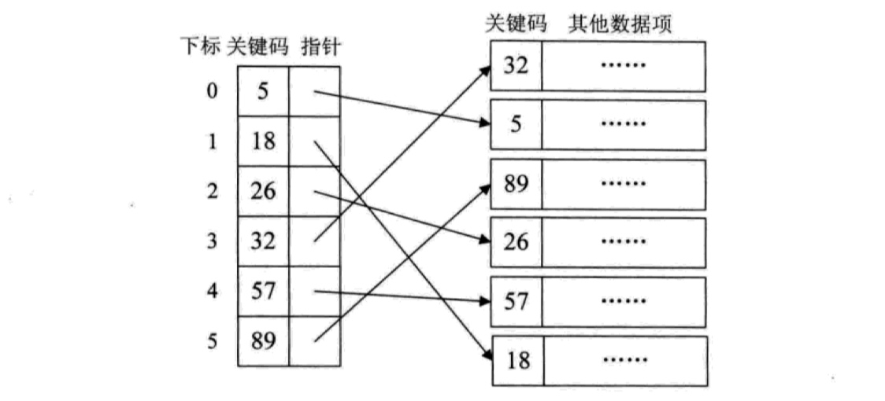
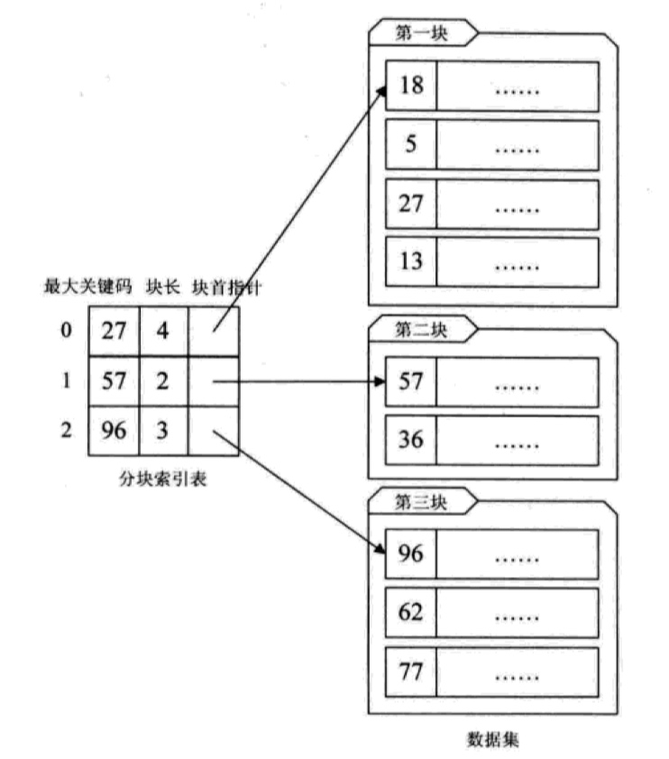

# 线性表查找
下列算法是基于顺序表实现

## 顺序查找
从表的一端向另一端逐个将元素的关键字与给的关键字对比，若相等查找成功并返回元素在表中的位置；
若没有匹配的元素，则返回 -1

```go
package main

const MAX = 100

type ElemType int

type SqList struct {
	data   *[MAX]ElemType
	length int
}

// SeqSearch 顺序查找
func (s *SqList)SeqSearch(elem ElemType)int  {
	var i int
	for i < s.length && s.data[i] != elem {
		i++
	}
	if i >= s.length {
		return -1
	}
	return i + 1
}
```
$ASL_{成功}=\frac{n+1}{2}$

## 折半查找
线性表的关键字有序，算法思路
1. 设`R[low...high]`之间存在需要查找的值
2. 计算中间为索引`mid=(low+high)/2`
3. 比较`R[mid]`与关键字`k`
    * 相等: 返回`mid+1`
    * 小于: 关键字在`R[low...mid-1]`之间
    * 大于: 关键字在`R[mid+1, high]`之间

```go
package main

const MAX = 100

type ElemType int

type SqList struct {
	data   *[MAX]ElemType
	length int
}

// BinSearch 二分查找
func (s *SqList) BinSearch(e ElemType) int {
	var low = 0
	var high = s.length - 1
	var mid int

	for low <= high {
		mid = (low + high) / 2
		if e == s.data[mid] {
			return mid+1
		}
		if e < s.data[mid] {
			high = mid - 1
		}else {
			low = mid + 1
		}
	}
	return -1
}
```
查找过程可以使用二叉树来描述:
1. 当前查询区间的中值作为根结点
2. 左子表作为左子树；右子表作为右子树

这样的树称为判定树或比较树

* 内部结点: 查找成功的结点
* 外部结点: 查找失败的结点

平均查找长度: $ASL_{bn}=\log_2(n+1)-1$


# 索引存储结构
在存储数据的时候建立附加的索引表。索引表中的每一项称为索引项，一般形式为`(关键字, 地址)`

常见的线性索引如下
1. 稠密索引：稠密索引是指在线性表中，将数据集中的每个记录对应一个索引项
   
   

   稠密索引可以左到与二反查找算法一样的查询效率，但是不要求顺序表关键字有序；由于
   存在额外的索引需要更多的存储空间

2. 分块索引：为了减少索引项个数，我们对数据集进行分块，并使其分块间有序，
   然后再给每个分块建立一个索引项；至于分块内部，不要求有序
   
   

   分块索引的时间复杂度是：`O(log(m)+n)`，其中 `m` 是分块数，`n` 是块内元素个数，
   在索引表长度和块内元素相等时，时间复杂度最优。性能要优于顺序查找，但是比二分查找要差。

3. 倒排索引

## 分块查找算法
索引表采用二分查找算法，块区域采用线性查找算法。

