# 一 树

## 1.1 定义
树（Tree）是 $n(n>=0)$ 个结点的有限集。$n=0$ 时称为空树。在任意一颗非空树中：
1. 有且仅有一个特定的称为根（Root）的结点；
2. 当 $n > 1$ 时，其余结点可分为 $m(m>0)$ 个互不相交的有限集 $T_1,T_2,\cdots,T_n$，
   其中每一个集合本身又是一棵树，并且称为根的子树。

此外，树的定义还需要强调以下两点：
1. $n > 0$ 时根结点是唯一的，不可能存在多个根结点，数据结构中的树只能有一个根结点。
2. $m > 0$ 时，子树的个数没有限制，但它们一定是互不相交的。

**普通树示例**
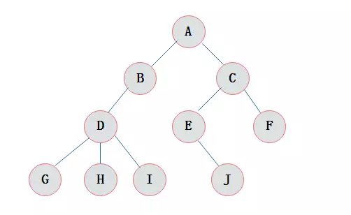
由树的定义可以看出，树的定义使用了递归的方式

## 1.2 结点的度

**结点拥有的子树数目**称为结点的度。
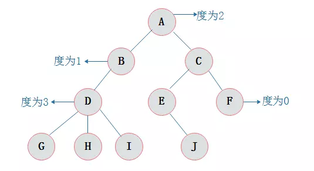

## 1.3 结点的关系
结点子树的根结点为该结点的孩子结点。相应该结点称为孩子结点的双亲结点。

同一个双亲结点的孩子结点之间互称兄弟结点。


* A为B的双亲结点，B为A的孩子结点。

* 结点B与结点C互为兄弟结点。


## 1.4 结点层次
从根开始定义起，根为第一层，根的孩子为第二层，以此类推
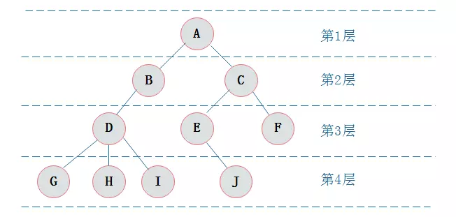

## 1.5 树的深度

树中结点的最大层次数称为树的深度或高度

# 二 二叉树
二叉树是 $n(n>=0)$ 个结点的有限集合，该集合或者为空集（称为空二叉树），
或者由一个根结点和两棵互不相交的、分别称为根结点的左子树和右子树组成。

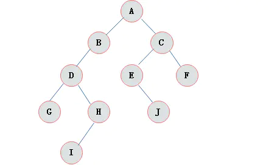

## 2.1 二叉树特点
由二叉树定义以及图示分析得出二叉树有以下特点：
1. 每个结点最多有两颗子树，所以二叉树中不存在度大于2的结点。

2. 左子树和右子树是有顺序的，次序不能任意颠倒。

3. 即使树中某结点只有一棵子树，也要区分它是左子树还是右子树。

## 2.3 二叉树性质
1. 在二叉树的第i层上最多有$2^{i-1}$ 个节点(i>=1)。

2. 二叉树中如果深度为 $k$, 那么最多有 $2^k-1$ 个节点(k>=1)。

3. $n_0 = n_2 + 1$；$n_0$ 表示度数为 $0$ 的节点数，$n_2$ 表示度数为 $2$ 的节点数。

4. 在完全二叉树中，具有 $n$ 个节点的完全二叉树的深度为$\[log_2 n \]+1$，
   其中$\[log_2 n\]$是向下取整。

5. 若对含 $n$ 个结点的完全二叉树从上到下且从左至右进行 $1$ 至 $n$ 的编号，
   则对完全二叉树中任意一个编号为 $i$ 的结点有如下特性：

   > 1. 若 $i = 1$，则该结点是二叉树的根，无双亲, 否则，编号为 $\[\frac{i}{2}\]$ 
   >    的结点为其双亲结点;
   > 2. 若 $2i > n$，则该结点无左孩子， 否则，编号为 $2i$ 的结点为其左孩子结点；
   > 3. 若 $2i+1>n$，则该结点无右孩子结点， 否则，编号为 $2i+1$ 的结点为其右孩子结点。

## 2.3 满二叉树
在一棵二叉树中。如果所有分支结点都存在左子树和右子树，并且所有叶子都在同一层上，
这样的二叉树称为满二叉树。


满二叉树的特点有：
1. 叶子只能出现在最下一层。出现在其它层就不可能达成平衡。
2. 非叶子结点的度一定是2。
3. 在同样深度的二叉树中，满二叉树的结点个数最多，叶子数最多。

## 2.4 完全二叉树
对一颗具有$n$个结点的二叉树按层编号，如果编号为 $i(1<=i<=n)$ 的结点与同样深度的满二叉树
中编号为$i$的结点在二叉树中位置完全相同，则这棵二叉树称为完全二叉树。
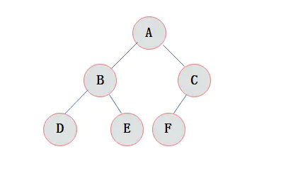


特点：
1. 叶子结点只能出现在最下层和次下层。
2. 最下层的叶子结点集中在树的左部。
3. 倒数第二层若存在叶子结点，一定在右部连续位置。
4. 如果结点度为1，则该结点只有左孩子，即没有右子树。
5. 同样结点数目的二叉树，完全二叉树深度最小。

注：**满二叉树一定是完全二叉树**，但反过来不一定成立。

# 三 二叉树的存储结构
## 3.1 顺序存储结构
二叉树的顺序存储结构就是使用一维数组存储二叉树中的结点，并且结点的存储位置，
就是数组的下标索引
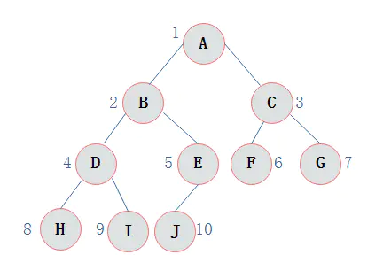

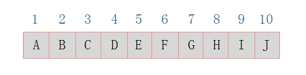

如果采用顺序存储结构存储右斜树(如下图)极端情况对应的顺序存储结构如下所示
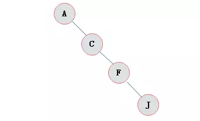
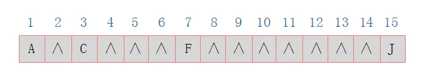
对于这种右斜树极端情况，采用顺序存储的方式是十分浪费空间的。因此，
**顺序存储一般适用于完全二叉树**。

## 3.2 链式存储结构
既然顺序存储不能满足二叉树的存储需求，那么考虑采用链式存储。由二叉树定义可知，
二叉树的每个结点最多有两个孩子。因此，可以将结点数据结构定义为一个数据和两个指针域
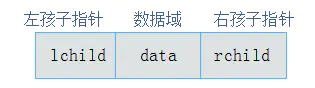

二叉链表: 采用链式存储结构保存的二叉树称为二叉链表
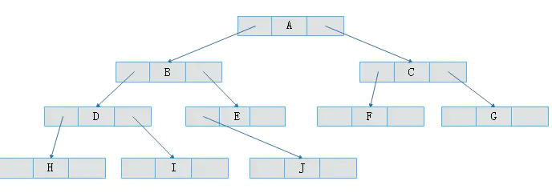

# 四 二叉树的创建

下面算法时采用括号表示法创建二叉树

例如: 二叉树`A(B(D(,G)),C(E,F))`，转为存储结构
1. 若`ch='('`: 则将前面刚创建的结点作为双亲结点入栈，并置$k=1$，表示开始处理左孩子节点
2. 若`ch=')'`: 表示栈顶结点的左右孩子结点处理完毕，退栈
3. 若`ch=','`: 表示开始处理右孩子结点，置$k=2$
4. 其他情况(结点值)
   * 创建结点 $p$，保存`ch`
   * 若 $k=1$，将`p`作为栈顶结点的左孩子
   * 若 $k=2$，将`p`作为栈顶结点的有孩子
   
```go
package main

import (
   "fmt"
)

type ElemType rune

type BTree struct {
   root *BNode
}

type BNode struct {
   data ElemType
   lchild *BNode
   rchild *BNode
}

// CreateBTree 创建二叉树
func CreateBTree(t *BTree, str string) {
   var stack = make([]*BNode, len([]rune(str)))
   var p *BNode
   var top = -1
   var k int
   for _, ch := range str {
      switch ch {
      case '(':
         top++
         stack[top] = p
         k=1
      case ')':
         top--
      case ',':
         k=2
      default:
         p=new(BNode)
         p.data= ElemType(ch)
         p.lchild = nil
         p.rchild = nil
         if t.root == nil {
            (*t).root = p
         } else {
            switch k {
            case 1:
               stack[top].lchild=p
            case 2:
               stack[top].rchild=p
            }
         }
      }
   }

}
// DisplayTree 输出二叉树，递归算法
func (t *BTree) DisplayTree(b *BNode)  {
   if b!= nil {
      fmt.Printf("%c",b.data)
      if b.lchild != nil || b.rchild != nil {
         fmt.Print("(")
         t.DisplayTree(b.lchild)
         if b.rchild != nil {
            fmt.Print(",")
         }
         t.DisplayTree(b.rchild)
         fmt.Print(")")
      }
   }
}

func main() {
   str := "A(B(D(,G)),C(E,F))"
   var t BTree
   CreateBTree(&t, str)
   fmt.Printf("%#v\n", t)
   t.DisplayTree(t.root)
}
```

# 五 二叉树遍历
二叉树的遍历是指从二叉树的根结点出发，按照某种次序依次访问二叉树中的所有结点，
使得 **每个结点被访问一次，且仅被访问一次**。

二叉树的遍历分为下面四种
```
先序遍历: 访问顺序为 根结点--左子结点--右子结点
中序遍历: 访问顺序为 左子结点--根节点--右子结点
后序遍历: 访问顺序为 左子结点--右子结点--根节点
层次遍历: 按层次 从上到下，从左到右的顺序遍历二叉树
```

## 5.1 递归算法
```go
package main

import (
	"fmt"
)

type ElemType rune

type BTree struct {
	root *BNode
}

type BNode struct {
	data ElemType
	lchild *BNode
	rchild *BNode
}


// PreOrder 先序遍历
func (t *BTree) PreOrder(b *BNode)  {
	if b!= nil {
		fmt.Printf("%c ", b.data)
		t.PreOrder(b.lchild)
		t.PreOrder(b.rchild)
	}
}
// InOrder 中序遍历
func (t *BTree) InOrder(b *BNode)  {
	if b != nil {
		t.InOrder(b.lchild)
		fmt.Printf("%c ", b.data)
		t.InOrder(b.rchild)
	}
}
// PostOrder 后序遍历
func (t *BTree) PostOrder(b *BNode)  {
	if b != nil {
		t.PostOrder(b.lchild)
		t.PostOrder(b.rchild)
		fmt.Printf("%c ", b.data)
	}
}
```


## 5.2 非递归算法
采用递归算法解决二叉树遍历，是非常易于理解，但是随着树层次的递增，递归的效率将迅速下降。
常常需要将递归算法转化为非递归的算法。递归转化为非递归通常需要借助栈这个数据结构完成

```go
package main

import (
	"fmt"
)

type ElemType rune

type BTree struct {
	root *BNode
}

type BNode struct {
	data ElemType
	lchild *BNode
	rchild *BNode
}

type SeqStack struct {
	data [] *BNode
	top int
	max int
}

func InitStack(stack *SeqStack, num int) {
	stack.top = -1
	stack.max = num
	stack.data = make([]*BNode, num)
}

func (s *SeqStack) Push(b *BNode)  {
	if s.top > s.max - 1 {
		fmt.Println("栈满")
		return
	}
	s.top++
	s.data[s.top] = b
}

// PreOrderNonRecursion 前序遍历的非递归算法
func (t *BTree) PreOrderNonRecursion()  {
	var p = t.root
	var stack SeqStack
	InitStack(&stack, 100)
	// 前序遍历的非递归1

	//if p != nil {
	//	stack.Push(p)  // 根节点入栈
	//	// 栈不空，进入循环
	//	for stack.top != -1 {
	//		p = stack.Pop()
	//		// 访问节点
	//		fmt.Printf("%c ", p.data)
	//		// 右子树入栈
	//		if p.rchild != nil {
	//			stack.Push(p.rchild)
	//		}
	//		// 左子树入栈
	//		if p.lchild != nil {
	//			stack.Push(p.lchild)
	//		}
	//	}
	//}

	// 前线遍历的非递归2

	// 栈不为空 或者 根节点不为nil
	for stack.top != -1 || p != nil {
		// 结点不为nil
		for p != nil {
			fmt.Printf("%c ", p.data)   // 访问结点
			stack.Push(p)  // 结点入栈
			p = p.lchild   // 访问左子树
		}
		// 此时栈顶结点以访问没有左孩子，或左孩子已经遍历了
		if stack.top != -1 {
			p = stack.Pop()  // 出栈
			p = p.rchild  // 处理右孩子
		}
	}
	fmt.Println()

}

// InOrderNonRecursion 中序遍历的非递归算法
func (t *BTree) InOrderNonRecursion()  {
	var p = t.root
	var stack SeqStack
	InitStack(&stack, 100)
	// 栈不空或者根节点不为nil
	for stack.top != -1 || p != nil {
		for p != nil {
			stack.Push(p)
			p = p.lchild
		}
		// 此时栈顶结点没有左孩子或左孩子已经被遍历
		if stack.top != -1{
			p = stack.Pop()
			fmt.Printf("%c ", p.data)
			p = p.rchild
		}
	}
	fmt.Println()
}

// PostOrderNonRecursion 后序遍历的非递归算法
func (t *BTree) PostOrderNonRecursion()  {
	var p = t.root
	var stack SeqStack
	var r *BNode
	var flag bool

	InitStack(&stack, 100)

	if p == nil {
		fmt.Println("树为空树")
		return
	}

	for p != nil {
		stack.Push(p)
		p = p.lchild
	}

	r = nil
	flag = true
	for stack.top != -1 && flag {
		p = stack.data[stack.top]  // 获取栈顶结点
		// 以访问右子树
		if p.rchild == r {
			fmt.Printf("%c ", p.data)
			p = stack.Pop()
			r = p
		} else {
			p = p.rchild
			flag = false
		}
	}


	for stack.top != -1 {

		for p != nil {
			stack.Push(p)
			p = p.lchild
		}

		r = nil
		flag = true
		for stack.top != -1 && flag {
			p = stack.data[stack.top]  // 获取栈顶结点
			// 以访问右子树
			if p.rchild == r {
				fmt.Printf("%c ", p.data)
				p = stack.Pop()
				r = p
			} else {
				p = p.rchild
				flag = false
			}
		}
	}

	fmt.Println()
}
```

## 5.3 层次遍历算法
二叉树的层次遍历算法需要借助队列来完成
```go
package main

import (
	"fmt"
)

type ElemType rune

type BTree struct {
	root *BNode
}

type BNode struct {
	data ElemType
	lchild *BNode
	rchild *BNode
}

// 层次遍历算法

type SeqQueue struct {
	data []*BNode
	front, rear, max int
}

func initQueue(queue *SeqQueue, num int) {
	queue.data = make([]*BNode, num)
	queue.rear = -1
	queue.front = -1
	queue.max = num
}

// IsEmpty 判断队列是否为空
func (q *SeqQueue) IsEmpty() bool {
	return q.rear == q.front
}

// IsFull 判断队列是否满队
func (q *SeqQueue) IsFull() bool {
	return (q.rear+1)%q.max == q.front
}

// Put 入队
func (q *SeqQueue) Put(b *BNode) error {
	if q.IsFull() {
		return fmt.Errorf("the queue is full")
	}

	q.rear = (q.rear + 1) % q.max
	q.data[q.rear] = b
	return nil
}

// Get 出队
func (q *SeqQueue) Get() (b *BNode, err error) {
	if q.IsEmpty() {
		return nil, fmt.Errorf("the queue is empty")
	}
	q.front = (q.front + 1) % q.max
	b = q.data[q.front]
	return b, nil
}

func (t *BTree) LevelOrder(b *BNode)  {
	var p *BNode
	var queue SeqQueue
	initQueue(&queue, 100)
	err := queue.Put(b)
	if err != nil {
		fmt.Println("入队失败")
		return
	}
	for !queue.IsEmpty() {
		p, err = queue.Get()
		if err  != nil {
			fmt.Println("出队失败")
			return
		}
		fmt.Printf("%c ", p.data)

		if p.lchild != nil {
			err = queue.Put(p.lchild)
			if err != nil {
				fmt.Println("入队失败")
				return
			}
		}
		if p.rchild != nil {
			err = queue.Put(p.rchild)
			if err != nil {
				fmt.Println("入队失败")
				return
			}
		}
	}
}
```


# 六 二叉树的构造
由于仅仅根据先序序列 中序序列 后序序列中的任何一个都无法确定二叉树，但是只要知道了中序
序列还有先序或后序中的任何一个都可以确定一个二叉树。

根据 **先序序列和中序序列** 构造二叉树
```go
package main

type ElemType rune

type BTree struct {
   root *BNode
}

type BNode struct {
   data ElemType
   lchild *BNode
   rchild *BNode
}

// CreateBTreeByPreOrderAndInOrder 通过前序和中序序列创建二叉树
func CreateBTreeByPreOrderAndInOrder(pre, in string)(b *BNode) {
	// pre先序序列 in中序序列 n 为二叉树的结点个数 b构造出二叉树的头节点

	preRune := []rune(pre)
	inRune := []rune(in)

	if len(preRune) == 0 || len(inRune) == 0{
		return nil
	}

	b = new(BNode)
	b.data = ElemType(preRune[0])
	// 2. 获取根节点在中序遍历数组中的index
	var i int
	for index,value := range inRune{
		if value == preRune[0]{
			i = index
			break
		}
	}
	b.lchild = CreateBTreeByPreOrderAndInOrder(string(preRune[1:i+1]), string(inRune[:i]))
	b.rchild = CreateBTreeByPreOrderAndInOrder(string(preRune[i+1:]), string(inRune[i+1:]))
	return
}
```

根据 **后序序列和中序序列** 构造二叉树
```go
package main

type ElemType rune

type BTree struct {
   root *BNode
}

type BNode struct {
   data ElemType
   lchild *BNode
   rchild *BNode
}

// CreateBTreeByPostOrderAndInOrder 通过后序和中序序列创建二叉树
func CreateBTreeByPostOrderAndInOrder(post, in string)(b * BNode) {
	postRune := []rune(post)
	inRune := []rune(in)

	if len(inRune)<1 ||len(postRune)<1{
		return nil
	}
	if len(inRune)==1{
		b = new(BNode)
		b.data = ElemType(inRune[0])
		return
	}
	i:=0
	for ;i<len(inRune);i++{
		if postRune[len(postRune)-1]==inRune[i]{
			break
		}
	}
	b = new(BNode)
	b.data = ElemType(postRune[len(postRune)-1])

	if i == len(postRune)-1{
		b.lchild=CreateBTreeByPostOrderAndInOrder(string(postRune[:i]), string(inRune[:i]))
	}else if i == 0{
		b.rchild=CreateBTreeByPostOrderAndInOrder(string(postRune[:len(postRune)-1]), string(inRune[1:]))
	}else{
		b.lchild=CreateBTreeByPostOrderAndInOrder(string(postRune[:i]), string(inRune[:i]))
		b.rchild=CreateBTreeByPostOrderAndInOrder(string(postRune[:len(postRune)-1]),string(inRune[i+1:]))
	}
	return
}
```
