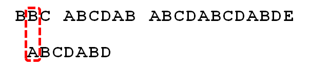

# 串基本概念
串是由零个或多个字符组成的有限序列。定义如同线性表，就是保存字符串的线性表

* 串相等: 两个串**对应位置上的字符串相等且串长度相等**。

* 子串: 一个串中任意个连续字符组成的


# 字符串匹配算法

## Brute-Force算法
简单匹配算法: 从目标串的第一个字符与模式串的一个字符串开始比较。若相等，比较后一个字符串，
否则，从目标串的第二个字符重新开始与模式串的一个字符串比较；依此类推，直到目标串的第$i$个
字符开始与模式串完全相等，则匹配成功，返回位置$i$。

```go
package main

import "fmt"

func BruteForce(dest, patten string) int {
	d := []rune(dest)
	p := []rune(patten)
	var i, j int

	// 两个串都没完成匹配继续循环
	for i<len(d) && j < len(p) {
		if d[i] == p[j] {
			i++
			j++
		} else {
			i = i-j+1
			j = 0
		}
	}

	if j >= len(p) {
		return i - len(p)
	} else {
		return -1
	}
}


func main() {

	fmt.Println(BruteForce("aaa哎", "哎"))

}
```

## KMP匹配算法

### KMP匹配算法简介


1. 首先，字符串"BBC ABCDAB ABCDABCDABDE"的第一个字符与搜索词"ABCDABD"的第一个字符，
   进行比较。因为B与A不匹配，所以搜索词后移一位。


2. 因为B与A不匹配，搜索词再往后移。


3. 就这样，直到字符串有一个字符，与搜索词的第一个字符相同为止。


4. 接着比较字符串和搜索词的下一个字符，还是相同。


5. 直到字符串有一个字符，与搜索词对应的字符不相同为止。


6. 这时，最自然的反应是，将搜索词整个后移一位，再从头逐个比较。
   这样做虽然可行，但是效率很差，因为你要把"搜索位置"移到已经比较过的位置，重比一遍。


7. 一个基本事实是，当空格与`D`不匹配时，你其实知道前面六个字符是"`ABCDAB`"匹配的。
   `KMP`算法的想法是，设法利用这个已知信息，不要把"搜索位置"移回已经比较过的位置，
   继续把它向后移，这样就提高了效率。


8. 获取部分匹配值的表


9. 已知空格与`D`不匹配时，前面六个字符"`ABCDAB`"是匹配的。查表可知，
   最后一个匹配字符`B`对应的"部分匹配值"为`2`，因此按照下面的公式算出向后移动的位数： 
   $移动位数 = 已匹配的字符数 - 对应的部分匹配值; 因为 `6 - 2` 等于`4`, 
   所以将搜索词向后移动`4`位。


10. 因为空格与`Ｃ`不匹配，搜索词还要继续往后移。这时，已匹配的字符数为`2`（"AB"），
    `B`对应的"部分匹配值"为`0`。所以，`移动位数 = 2 - 0`，结果为 `2`，
    于是将搜索词向后移`2`位。


11. 因为空格与`A`不匹配，继续后移一位。


12. 逐位比较，直到发现`C`与`D`不匹配。于是，`移动位数 = 6 - 2`，
    继续将搜索词向后移动`4`位。
    

13. 逐位比较，直到搜索词的最后一位，发现完全匹配，于是搜索完成。
    如果还要继续搜索（即找出全部匹配），`移动位数 = 7 - 0`，
    再将搜索词向后移动`7`位，这里就不再重复了。

### 部分匹配值表获取

首先，要了解两个概念："前缀"和"后缀"。 
* "前缀"指除了最后一个字符以外，一个字符串的全部头部组合；
* "后缀"指除了第一个字符以外，一个字符串的全部尾部组合。

"部分匹配值"就是 **"前缀"和"后缀"的最长的共有元素的长度** ；以"ABCDABD"为例，

```
"A"的前缀和后缀都为空集，共有元素的长度为0；

"AB"的前缀为[A]，后缀为[B]，共有元素的长度为0；

"ABC"的前缀为[A, AB]，后缀为[BC, C]，共有元素的长度0；

"ABCD"的前缀为[A, AB, ABC]，后缀为[BCD, CD, D]，共有元素的长度为0；

"ABCDA"的前缀为[A, AB, ABC, ABCD]，后缀为[BCDA, CDA, DA, A]，共有元素为"A"，长度为1；

"ABCDAB"的前缀为[A, AB, ABC, ABCD, ABCDA]，后缀为[BCDAB, CDAB, DAB, AB, B]，共有元素为"AB"，长度为2；

"ABCDABD"的前缀为[A, AB, ABC, ABCD, ABCDA, ABCDAB]，后缀为[BCDABD, CDABD, DABD, ABD, BD, D]，共有元素的长度为0。
```

求部分匹配值表也是依次KMP的比较过程。

**完整的KMP算法实现**
```go
package main

import (
	"fmt"
)

func GetNext(patten string) (next [] int){
	next = make([]int, len(patten))
	j := 0
	k := -1
	next[0] = -1
	p := []rune(patten)
	for j < len(p) - 1 {
		if k == -1 || p[j] == p[k] {
			j++
			k++
			next[j] = k
		} else {
			k = next[k]
		}
	}
	return
}

func KMP(dest, patten string) int {
	next := GetNext(patten)
	i := 0
	j := 0
	d := []rune(dest)
	p := []rune(patten)
	fmt.Println(next)
	for i < len(d) && j < len(p) {
		if j ==- 1 || d[i] == p[j] {
			i++
			j++
		} else {
			j = next[j]
		}
	}
	if j >= len(p) {
		return  i - len(p)
	} else {
		return -1
	}
}
func main() {
	
	fmt.Println(KMP("aaaabbaa", "aabba"))

}
```
**改进KMP算法**

如果模式串中由$t_j=t_k$时，当目标串中的字符$s_i$和模式串中的字符$t_j$比较不相同时，
$s_i$一定于$t_k$不同，所以$s_i$于$t_k$没必要进行比较。直接比较$s_i$于$t_{next\[k\]}$
即可。

```go
package main

import (
	"fmt"
)

func GetNextval(patten string)(next []int)  {
	p := []rune(patten)
	next = make([]int, len(p))
	j := 0
	k := -1
	next[0] = -1
	for j < len(p) - 1 {
		if k == -1 || p[j] == p[k] {
			j++
			k++
			if p[j] != p[k] {
				next[j] = k
			} else {
				next[j] = next[k]
			}
		} else {
			k = next[k]
		}
	}
	return
}

func KMP(dest, patten string) int {
	next := GetNextval(patten)
	i := 0
	j := 0
	d := []rune(dest)
	p := []rune(patten)
	fmt.Println(next)
	for i < len(d) && j < len(p) {
		if j ==- 1 || d[i] == p[j] {
			i++
			j++
		} else {
			j = next[j]
		}
	}
	if j >= len(p) {
		return  i - len(p)
	} else {
		return -1
	}
}
func main() {

	fmt.Println(KMP("aaaabbaa", "aabba"))

}
```
