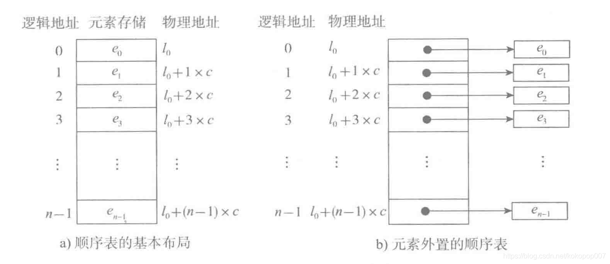

# 顺序表定义
线性表的顺序存储结构；元素之间的逻辑关系，由数据在存储器中的位置体现。



# 顺序表基本运算实现

## 顺序表定义

```go
const MAX = 100

type ElemType int

// SqList 顺序表结构体
type SqList struct {
	data *[MAX]ElemType  // 保存数据，需要申请空间
	length int  // 顺序表的长度
}
```

## 初始化顺序表
```go
// initList 初始化顺序表
func initList(list *SqList, a... ElemType)  {
	list.data = new([MAX]ElemType)
	list.length = 0
	for i, v := range a{
		list.data[i] = v
		list.length++
	}
}
```
申请内存空间，并将数据存放在顺序表中

## 判断顺序表是否为空
```go
// ListEmpty 判断顺序表是否为空
func (l *SqList) ListEmpty() bool  {
	return l.length == 0
}
```
判断顺序表是否为空，只需要判断顺序表的length域是否为0

## 清空顺序表
```go
// ClearList 清空顺序表
func (l *SqList) ClearList() {
	l.length = 0
}
```
只需要将顺序表长度变为0即可

## 输出顺序表的内容
```go
// DisplayList 输出顺序表的内容
func (l *SqList) DisplayList()  {
	for i, v := range *l.data {
		fmt.Printf("%v ", v)
		if i == l.length-1 {
			break
		}
	}
	fmt.Println()
}
```

## 按位置查找
```go
// GetElem 按位置查找
func (l *SqList) GetElem(i int, e *ElemType)(err error)  {
	if i < 1 || i > l.length {
		return fmt.Errorf("%d out of range", i)
	}
	*e = l.data[i]
	return nil
}
```

## 按元素查找
```go
// LocateElem 按元素查找
func (l *SqList) LocateElem(e ElemType)(i int) {
	for i < l.length && l.data[i]!=e {
		i++
	}
	if i >= l.length {
		return -1
	}
	return i + 1
}
```

## 按位置插入
```go
// ListInsert 按位置插入
func (l *SqList) ListInsert(i int, e ElemType) (err error)  {
	if i < 1 || i > l.length+1 {
		return fmt.Errorf("%d out of range", i)
	}
	if l.length == MAX {
		return fmt.Errorf("the sequence list is full")
	}
	i--
	for j:=l.length;j>i;j-- {
		l.data[j]=l.data[j-1]
	}
	l.data[i]=e
	l.length++

	return nil
}
```

## 删除元素并返回
```go
// ListDelete 删除元素并返回
func (l *SqList) ListDelete(i int, e *ElemType) (err error) {
	if i < 1 || i > l.length {
		return fmt.Errorf("%d out of range", i)
	}
	i--;
	*e=l.data[i]

	for j:=i; j < l.length-1;j++ {
		l.data[j] = l.data[j+1]
	}
	l.length--
	return nil
}
```


## 完整代码
```go
package main

import (
	"fmt"
)

const MAX = 100

type ElemType int

type SqList struct {
	data *[MAX]ElemType
	length int
}

// initList 初始化顺序表
func initList(list *SqList, a... ElemType)  {
	list.data = new([MAX]ElemType)
	list.length = 0
	for i, v := range a{
		list.data[i] = v
		list.length++
	}
}

// ListEmpty 判断顺序表是否为空
func (l *SqList) ListEmpty() bool  {
	return l.length == 0
}

// ClearList 清空顺序表
func (l *SqList) ClearList() {
	l.length = 0
}

// DisplayList 输出顺序表的内容
func (l *SqList) DisplayList()  {
	for i, v := range *l.data {
		fmt.Printf("%v ", v)
		if i == l.length-1 {
			break
		}
	}
	fmt.Println()
}

// GetElem 按位置查找
func (l *SqList) GetElem(i int, e *ElemType)(err error)  {
	if i < 1 || i > l.length {
		return fmt.Errorf("%d out of range", i)
	}
	*e = l.data[i]
	return nil
}

// LocateElem 按元素查找
func (l *SqList) LocateElem(e ElemType)(i int) {
	for i < l.length && l.data[i]!=e {
		i++
	}
	if i >= l.length {
		return -1
	}
	return i + 1
}

// ListInsert 按位置插入
func (l *SqList) ListInsert(i int, e ElemType) (err error)  {
	if i < 1 || i > l.length+1 {
		return fmt.Errorf("%d out of range", i)
	}
	if l.length == MAX {
		return fmt.Errorf("the sequence list is full")
	}
	i--
	for j:=l.length;j>i;j-- {
		l.data[j]=l.data[j-1]
	}
	l.data[i]=e
	l.length++

	return nil
}

// ListDelete 删除元素并返回
func (l *SqList) ListDelete(i int, e *ElemType) (err error) {
	if i < 1 || i > l.length {
		return fmt.Errorf("%d out of range", i)
	}
	i--;
	*e=l.data[i]

	for j:=i; j < l.length-1;j++ {
		l.data[j] = l.data[j+1]
	}
	l.length--
	return nil
}

func main() {
	var l SqList

	initList(&l, 1,2,3,4,5)

	l.DisplayList()

	err := l.ListInsert(2, 10)
	if err != nil {
		return
	}
	l.DisplayList()
}
```
