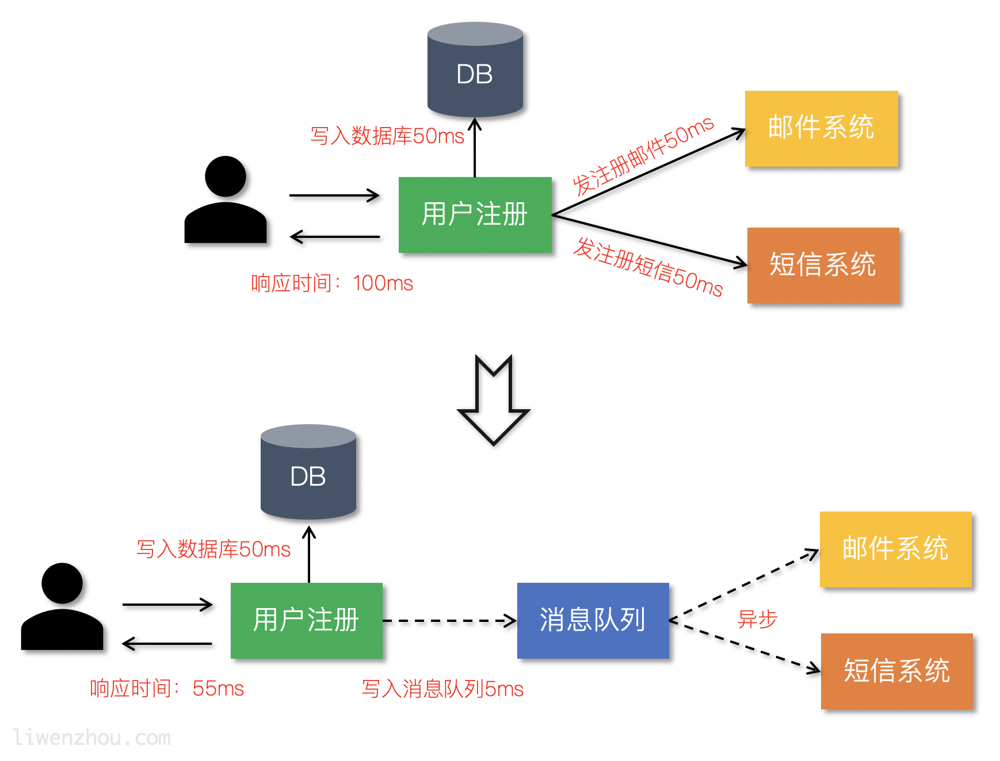

# NSQ介绍
NSQ是Go语言编写的一个开源的实时分布式内存消息队列，其性能十分优异。 NSQ的优势有以下优势：

1. NSQ提倡分布式和分散的拓扑，没有单点故障，支持容错和高可用性，并提供可靠的消息交付保证
2. NSQ支持横向扩展，没有任何集中式代理。
3. NSQ易于配置和部署，并且内置了管理界面。

## 应用场景

### 异步处理


### 应用解耦
通过使用消息队列将不同的业务逻辑解耦，降低系统间的耦合，提高系统的健壮性。
后续有其他业务要使用订单数据可直接订阅消息队列，提高系统的灵活性。


### 流量削峰
类似秒杀（大秒）等场景下，某一时间可能会产生大量的请求，
使用消息队列能够为后端处理请求提供一定的缓冲区，保证后端服务的稳定性。


## NSQ架构

### 工作模式


### Topic和Channel

每个`nsqd`实例旨在一次处理多个数据流。这些数据流称为“`topics`”，
一个`topic`具有`1`个或多个“`channels`”。每个`channel`都会收到`topic`所有消息的副本，
实际上下游的服务是通过对应的`channel`来消费`topic`消息。

`topic`和`channel`不是预先配置的。`topic`在首次使用时创建，方法是将其发布到指定
`topic`，或者订阅指定`topic`上的`channel`。`channel`是通过订阅指定的`channel`
在第一次使用时创建的。

`topic`和`channel`都相互独立地缓冲数据，防止缓慢的消费者导致其他`chennel`的积压
（同样适用于`topic`级别）。

`channel`可以并且通常会连接多个客户端。假设所有连接的客户端都处于准备接收消息的状态，
则每条消息将被传递到随机客户端。例如：


总而言之，消息是从`topic -> channel`（每个`channel`接收该`topic`的所有消息的副本）
多播的，但是从`channel -> consumers`均匀分布（每个消费者接收该`channel`的一部分消息）。

### NSQ接收和发送消息流程


## NSQ特性
* 消息默认不持久化，可以配置成持久化模式。`nsq`采用的方式时内存+硬盘的模式，
  当内存到达一定程度时就会将数据持久化到硬盘。
    * 如果将`--mem-queue-size`设置为0，所有的消息将会存储到磁盘。
    * 服务器重启时也会将当时在内存中的消息持久化。
* 每条消息至少传递一次。
* 消息不保证有序。

## 安装

[官方下载页面](https://nsq.io/deployment/installing.html) 根据自己的平台下载并解压即可。

### nsqd
`NSQD`是接收、排队和向客户端传递消息的守护进程。

它可以独立运行，但通常在集群中配置`nsqlookupd`实例
(在这种情况下，它将宣布要发现 Topic和Channel)。

它侦听两个端口，一个用于客户机，另一个用于`HTTP API`。它可以选择在第三个端口上监听`HTTPS`。

#### 命令行选项
```shell
-auth-http-address value
    <addr>:<port> to query auth server (may be given multiple times)
-broadcast-address string
    address that will be registered with lookupd (defaults to the OS hostname) (default "yourhost.local")
-broadcast-http-port int
    HTTP port that will be registered with lookupd (defaults to the HTTP port that this nsqd is listening to)
-broadcast-tcp-port int
    TCP port that will be registered with lookupd (defaults to the TCP port that this nsqd is listening to)
-config string
    path to config file
-data-path string
    path to store disk-backed messages
-deflate
    enable deflate feature negotiation (client compression) (default true)
-e2e-processing-latency-percentile value
    message processing time percentiles (as float (0, 1.0]) to track (can be specified multiple times or comma separated '1.0,0.99,0.95', default none)
-e2e-processing-latency-window-time duration
    calculate high to high latency quantiles for this duration of time (ie: 60s would only show quantile calculations from the past 60 seconds) (default 10m0s)
-http-address string
    <addr>:<port> to listen on for HTTP clients (default "0.0.0.0:4151")
-http-client-connect-timeout duration
    timeout for HTTP connect (default 2s)
-http-client-request-timeout duration
    timeout for HTTP request (default 5s)
-https-address string
    <addr>:<port> to listen on for HTTPS clients (default "0.0.0.0:4152")
-log-level value
    set log verbosity: debug, info, warn, error, or fatal (default INFO)
-log-prefix string
    log message prefix (default "[nsqd] ")
-lookupd-tcp-address value
    lookupd TCP address (may be given multiple times)
-max-body-size int
    maximum size of a single command body (default 5242880)
-max-bytes-per-file int
    number of bytes per diskqueue file before rolling (default 104857600)
-max-channel-consumers int
    maximum channel consumer connection count per nsqd instance (default 0, i.e., unlimited)
-max-deflate-level int
    max deflate compression level a client can negotiate (> values == > nsqd CPU usage) (default 6)
-max-heartbeat-interval duration
    maximum client configurable duration of time between client heartbeats (default 1m0s)
-max-msg-size int
    maximum size of a single message in bytes (default 1048576)
-max-msg-timeout duration
    maximum duration before a message will timeout (default 15m0s)
-max-output-buffer-size int
    maximum client configurable size (in bytes) for a client output buffer (default 65536)
-max-output-buffer-timeout duration
    maximum client configurable duration of time between flushing to a client (default 30s)
-max-rdy-count int
    maximum RDY count for a client (default 2500)
-max-req-timeout duration
    maximum requeuing timeout for a message (default 1h0m0s)
-mem-queue-size int
    number of messages to keep in memory (per topic/channel) (default 10000)
-min-output-buffer-timeout duration
    minimum client configurable duration of time between flushing to a client (default 25ms)
-msg-timeout duration
    default duration to wait before auto-requeing a message (default 1m0s)
-node-id int
    unique part for message IDs, (int) in range [0,1024) (default is hash of hostname) (default 248)
-output-buffer-timeout duration
    default duration of time between flushing data to clients (default 250ms)
-snappy
    enable snappy feature negotiation (client compression) (default true)
-statsd-address string
    UDP <addr>:<port> of a statsd daemon for pushing stats
-statsd-interval duration
    duration between pushing to statsd (default 1m0s)
-statsd-mem-stats
    toggle sending memory and GC stats to statsd (default true)
-statsd-prefix string
    prefix used for keys sent to statsd (%s for host replacement) (default "nsq.%s")
-statsd-udp-packet-size int
    the size in bytes of statsd UDP packets (default 508)
-sync-every int
    number of messages per diskqueue fsync (default 2500)
-sync-timeout duration
    duration of time per diskqueue fsync (default 2s)
-tcp-address string
    <addr>:<port> to listen on for TCP clients (default "0.0.0.0:4150")
-tls-cert string
    path to certificate file
-tls-client-auth-policy string
    client certificate auth policy ('require' or 'require-verify')
-tls-key string
    path to key file
-tls-min-version value
    minimum SSL/TLS version acceptable ('ssl3.0', 'tls1.0', 'tls1.1', or 'tls1.2') (default 769)
-tls-required
    require TLS for client connections (true, false, tcp-https)
-tls-root-ca-file string
    path to certificate authority file
-verbose
    [deprecated] has no effect, use --log-level
-version
    print version string
-worker-id
    [deprecated] use --node-id
```


### nsqlookupd
`Nsqlookupd`是管理拓扑信息的守护进程。客户端查询`nsqlookupd`以发现特定主题的
`nsqd`生产者，而`nsqd`节点广播主题和通道信息。

监听两个端口:
* 一个`TCP`端口(4160)被`nsqd`用于广播
* 另一个`HTTP`端口(4161)用于客户机执行发现和管理操作。


#### 命令行选项
```shell
-broadcast-address string
    address of this lookupd node, (default to the OS hostname) (default "yourhost.local")
-config string
    path to config file
-http-address string
    <addr>:<port> to listen on for HTTP clients (default "0.0.0.0:4161")
-inactive-producer-timeout duration
    duration of time a producer will remain in the active list since its last ping (default 5m0s)
-log-level value
    set log verbosity: debug, info, warn, error, or fatal (default INFO)
-log-prefix string
    log message prefix (default "[nsqlookupd] ")
-tcp-address string
    <addr>:<port> to listen on for TCP clients (default "0.0.0.0:4160")
-tombstone-lifetime duration
    duration of time a producer will remain tombstoned if registration remains (default 45s)
-verbose
    [deprecated] has no effect, use --log-level
-version
    print version string
```

### nsqadmin
`nsqadmin`是一个`Web UI`，用于实时查看聚合的集群统计信息并执行各种管理任务。

#### 命令行选项
```shell
-acl-http-header string
    HTTP header to check for authenticated admin users (default "X-Forwarded-User")
-admin-user value
    admin user (may be given multiple times; if specified, only these users will be able to perform privileged actions; acl-http-header is used to determine the authenticated user)
-allow-config-from-cidr string
    A CIDR from which to allow HTTP requests to the /config endpoint (default "127.0.0.1/8")
-base-path string
    URL base path (default "/")
-config string
    path to config file
-graphite-url string
    graphite HTTP address
-http-address string
    <addr>:<port> to listen on for HTTP clients (default "0.0.0.0:4171")
-http-client-connect-timeout duration
    timeout for HTTP connect (default 2s)
-http-client-request-timeout duration
    timeout for HTTP request (default 5s)
-http-client-tls-cert string
    path to certificate file for the HTTP client
-http-client-tls-insecure-skip-verify
    configure the HTTP client to skip verification of TLS certificates
-http-client-tls-key string
    path to key file for the HTTP client
-http-client-tls-root-ca-file string
    path to CA file for the HTTP client
-log-level value
    set log verbosity: debug, info, warn, error, or fatal (default INFO)
-log-prefix string
    log message prefix (default "[nsqadmin] ")
-lookupd-http-address value
    lookupd HTTP address (may be given multiple times)
-notification-http-endpoint string
    HTTP endpoint (fully qualified) to which POST notifications of admin actions will be sent
-nsqd-http-address value
    nsqd HTTP address (may be given multiple times)
-proxy-graphite
    proxy HTTP requests to graphite
-statsd-counter-format string
    The counter stats key formatting applied by the implementation of statsd. If no formatting is desired, set this to an empty string. (default "stats.counters.%s.count")
-statsd-gauge-format string
    The gauge stats key formatting applied by the implementation of statsd. If no formatting is desired, set this to an empty string. (default "stats.gauges.%s")
-statsd-interval duration
    time interval nsqd is configured to push to statsd (must match nsqd) (default 1m0s)
-statsd-prefix string
    prefix used for keys sent to statsd (%s for host replacement, must match nsqd) (default "nsq.%s")
-verbose
    [deprecated] has no effect, use --log-level
-version
    print version string
```
## 快速开始

1. 先启动`nsqlookupd`
  ```shell
  nsqlookupd
  ```

2. 另起一个终端，启动`nsqd`
  ```shell
  nsqd --lookupd-tcp-address=127.0.0.1:4160
  ```
  * `--lookupd-tcp-address`: 注册给nsqlookupd
  * 如果您的系统主机名没有解析为`127.0.0.1`，
    那么添加`--broadcast-address=127.0.0.1`

3. 在另一个终端，启动`nsqadmin`:

  ```shell
  nsqadmin --lookupd-http-address=127.0.0.1:4161
  ```
  * `--lookupd-http-address`: `nsqadmin`管理的`nsqlookupd`

## go-nsq

### 生产者
```shell
package main

import (
"bufio"
"fmt"
"os"
"strings"

"github.com/nsqio/go-nsq"
)

// NSQ Producer Demo

var producer *nsq.Producer

// 初始化生产者
func initProducer(str string) (err error) {
	config := nsq.NewConfig()
	producer, err = nsq.NewProducer(str, config)
	if err != nil {
		fmt.Printf("create producer failed, err:%v\n", err)
		return err
	}
	return nil
}

func main() {
	nsqAddress := "127.0.0.1:4150"
	err := initProducer(nsqAddress)
	if err != nil {
		fmt.Printf("init producer failed, err:%v\n", err)
		return
	}

	reader := bufio.NewReader(os.Stdin) // 从标准输入读取
	for {
		data, err := reader.ReadString('\n')
		if err != nil {
			fmt.Printf("read string from stdin failed, err:%v\n", err)
			continue
		}
		data = strings.TrimSpace(data)
		if strings.ToUpper(data) == "Q" { // 输入Q退出
			break
		}
		// 向 'topic_demo' publish 数据
		err = producer.Publish("test", []byte(data))
		if err != nil {
			fmt.Printf("publish msg to nsq failed, err:%v\n", err)
			continue
		}
	}
}
```

### 消费者
```shell
// nsq_consumer/main.go
package main

import (
	"fmt"
	"os"
	"os/signal"
	"syscall"
	"time"

	"github.com/nsqio/go-nsq"
)

// NSQ Consumer Demo

// MyHandler 是一个消费者类型
type MyHandler struct {
	Title string
}

// HandleMessage 是需要实现的处理消息的方法
func (m *MyHandler) HandleMessage(msg *nsq.Message) (err error) {
	fmt.Printf("%s recv from %v, msg:%v\n", m.Title, msg.NSQDAddress, string(msg.Body))
	return
}

// 初始化消费者
func initConsumer(topic string, channel string, address string) (err error) {
	config := nsq.NewConfig()
	config.LookupdPollInterval = 15 * time.Second
	c, err := nsq.NewConsumer(topic, channel, config)
	if err != nil {
		fmt.Printf("create consumer failed, err:%v\n", err)
		return
	}
	consumer := &MyHandler{
		Title: "消费者一号",
	}
	c.AddHandler(consumer)

	// if err := c.ConnectToNSQD(address); err != nil { // 直接连NSQD
	if err := c.ConnectToNSQLookupd(address); err != nil { // 通过lookupd查询
		return err
	}
	return nil

}

func main() {
	err := initConsumer("test", "first", "127.0.0.1:4161")
	if err != nil {
		fmt.Printf("init consumer failed, err:%v\n", err)
		return
	}
	c := make(chan os.Signal)        // 定义一个信号的通道
	signal.Notify(c, syscall.SIGINT) // 转发键盘中断信号到c
	<-c                              // 阻塞
}
```


