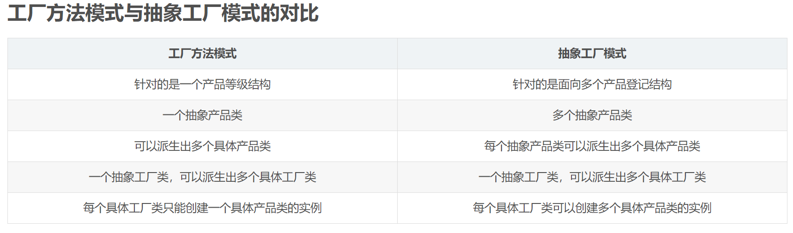

# 抽象工厂模式

在抽象工厂模式中创建了一个超级工厂，它提供了创建抽象工厂的接口。比如现在有一个超级工厂，
它可以根据传入的参数创建不同的抽象工厂实例。

抽象工厂是一个接口，它提供了一组生产一些列产品的方法。比如现在有一个抽象工厂接口，
它提供了生产手机和Ipad两种产品的方法。

一些普通的工厂实现了这个抽象工厂接口，这就意味着它们都可以生产手机与Ipad，
例如华为工厂，小米工厂。只不过华为生产的是华为手机和华为Ipad，
小米生产的是小米手机和小米Ipad。

抽象工厂模式提供了一种模式，**即可以通过一个接口，创建一系列产品族中的某个产品的模式**。
例如对于超级工厂而言，它可以生产华为手机和小米手机，也可以生产华为Ipad和小米Ipad，
即两个产品族（手机产品族和Ipad产品族），一个产品族下面可能会有多个产品
（例如手机产品族下面有华为手机和小米手机两个产品）。

所以本质上来讲，**抽象工厂模式是用于生产一系列产品族下的某个产品**。


## 抽象工厂模式的要素与示例
* 模式名称：抽象工厂模式

* 目的（What）：提供一个创建一系列相关或相互依赖对象的接口（抽象工厂接口），而无需指定它们具体的类

* 解决的问题（Why）：当系统中有多于一个的产品族，而系统只消费其中某一族的产品的时候，使用这种模式

* 解决方案（How）：在一个产品族里，定义多种产品。每个工厂生产所有产品族中的某种产品，如果该工厂不生产这个产品族的产品，可以返回空，但是必须要实现相对应的抽象工厂的接口

* 解决效果：
    * 优点：
      
        * 当一个产品族中的多个对象被设计成一起工作时，
          它能保证客户端始终只使用同一个产品族中的对象。
          
    * 缺点：
      
        * 产品族扩展十分困难，当需要增加一个产品族的时候，
          抽象工厂需要多提供一个接口创建此产品族的产品，
          而具体的工厂也需要增加方法实现该接口

```go
package main

import "fmt"

const (
	Huawei = iota
	Xiaomi
	Unsupported
)

// AbstractFactory 抽象工厂接口,需要能够生产手机、Ipad、智能音箱
type AbstractFactory interface {
	CreateCellphone() Cellphone
	CreateIpad() Ipad
	CreateSmartSoundBox() SmartSoundBox
}

// HyperFactory 超级工厂接口，创建一个工厂
type HyperFactory interface {
	CreateFactory(typ int) AbstractFactory
}

// HypeFactoryImpl 超级工厂实例
type HypeFactoryImpl struct{}

// CreateFactory 根据给定参数创建工厂
func (*HypeFactoryImpl) CreateFactory(typ int) AbstractFactory {
	switch typ {
	case Huawei:
		return &HuaweiFactory{}
	case Xiaomi:
		return &XiaomiFactory{}
	default:
		return nil
	}
}

// Cellphone 手机接口
type Cellphone interface {
	Call()
}

// Ipad Ipad接口
type Ipad interface {
	Play()
}

// SmartSoundBox 智能音箱接口
type SmartSoundBox interface {
	Listen()
}

// HuaweiFactory 华为工厂,实现了抽象工厂的接口
type HuaweiFactory struct{}

func (*HuaweiFactory) CreateCellphone() Cellphone {
	return &HuaweiCellphone{}
}

func (*HuaweiFactory) CreateIpad() Ipad {
	return &HuaweiIpad{}
}

func (*HuaweiFactory) CreateSmartSoundBox() SmartSoundBox {
	fmt.Println("Huawei not produce SmartSoundBox")
	return nil
}

// HuaweiCellphone 华为手机，实现了手机接口
type HuaweiCellphone struct{}

func (*HuaweiCellphone) Call() {
	fmt.Println("I made a call on my HuaweiCellphone")
}

// HuaweiIpad 华为Ipad
type HuaweiIpad struct{}

func (*HuaweiIpad) Play() {
	fmt.Println("I am playing with HuaweiIpad")
}

// XiaomiFactory 小米工厂,实现了抽象工厂的接口
type XiaomiFactory struct{}

func (*XiaomiFactory) CreateCellphone() Cellphone {
	return &XiaomiCellphone{}
}

func (*XiaomiFactory) CreateIpad() Ipad {
	return &XiaomiIpad{}
}

func (*XiaomiFactory) CreateSmartSoundBox() SmartSoundBox {
	return &XiaomiSmartSoundBox{}
}

// XiaomiCellphone 小米手机，实现了手机接口
type XiaomiCellphone struct{}

func (*XiaomiCellphone) Call() {
	fmt.Println("I made a call on my XiaomiCellphone")
}

// XiaomiIpad 小米Ipad
type XiaomiIpad struct{}

func (*XiaomiIpad) Play() {
	fmt.Println("I am playing with XiaomiIpad")
}

// XiaomiSmartSoundBox 小米智能音箱
type XiaomiSmartSoundBox struct{}

func (*XiaomiSmartSoundBox) Listen() {
	fmt.Println("I am listening with XiaomiSmartSoundBox")
}

func main() {
	// 创建一个超级工厂，用于生产工厂
	var hyperFactory HyperFactory
	hyperFactory = &HypeFactoryImpl{}

	// 创建具体的工厂
	var factory AbstractFactory

	// 创建华为工厂
	factory = hyperFactory.CreateFactory(Huawei)
	factory.CreateCellphone().Call()
	factory.CreateIpad().Play()
	if factory.CreateSmartSoundBox() != nil {
		fmt.Println("错误，华为工厂不能生产智能音箱")
	}

	// 创建小米工厂
	factory = hyperFactory.CreateFactory(Xiaomi)
	factory.CreateCellphone().Call()
	factory.CreateIpad().Play()
	factory.CreateSmartSoundBox().Listen()
}
```


### 工厂方法模式与抽象工厂对比
