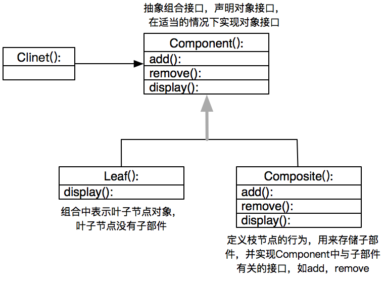

# 组合模式

将对象组合成树形结构以表示“部分-整体”的层次结构。组合模式使得用户对单个对象和组合对象
的使用具有一致性

角色
1. 抽象组件
2. 叶子组件
3. 复合组件
4. 客户端



适用场景
1. 表示对象的“部分-整体”层次结构
2. 希望用户忽略组合对象与单个对象的不同，统一使用

优点
1. 定义了包含基本对象和组合对象的类层次结构
2. 简化客户端代码，客户端代码可以一致的使用组合对象和单个对象
3. 更容易增加类型的组件

```go
package main

import "fmt"

/**
# 将对象组合成树形结构以表示“部分-整体”的层次结构。组合模式使得用户对单个对象和组合对象的使用具有一致性

# 要使得单个对象和成组对象有共同的接口，
 */


// Graph 图形接口
type Graph interface {
	plot()
}

// Point 点
type Point struct {
	x int
	y int
}
// NewPoint 创建一个点
func NewPoint(x, y int) *Point  {
	return &Point{
		x: x,
		y: y,
	}
}

func (g *Point) plot()  {
	//"点(%s, %s)" % (self.x, self.y)
	fmt.Printf("点(%d, %d)\n", g.x, g.y)
}

// Line 线
type Line struct {
	p1 *Point
	p2 *Point
}

func NewLine(p1, p2 *Point) *Line  {
	return &Line{p1: p1, p2: p2}
}

func (g *Line) plot()  {
	//"点(%s, %s)" % (self.x, self.y)
	fmt.Printf("线段(点(%d, %d),点((%d, %d))\n", g.p1.x, g.p1.y, g.p2.x, g.p2.y)
}

// Picture 图
type Picture struct {
	children []Graph
}

func NewPicture(a... Graph) *Picture {
	return &Picture{children: a}
}

func (g *Picture) add(graph Graph) *Picture {
	g.children = append(g.children, graph)
	return g
}

func (g *Picture) plot()  {
	fmt.Println("===start 复合图===")
	for _, v := range g.children {
		v.plot()
	}
	fmt.Println("===end 复合图===")
}

func main() {
	p1 := NewPoint(1,2)
	p2 := NewPoint(2,3)

	line := NewLine(p1, p2)

	picture := NewPicture(p1,p2,line)
	picture1 := NewPicture(p1,p2)
	picture.add(picture1)
	picture.plot()

}
```


