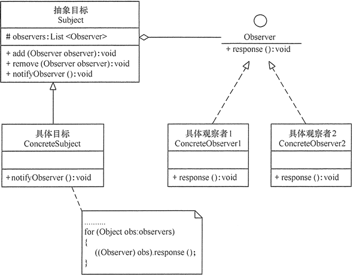

# 观察者模式

指多个对象间存在一对多的依赖关系，当一个对象的状态发生改变时，
所有依赖于它的对象都得到通知并被自动更新。这种模式有时又称作发布-订阅模式、
模型-视图模式，它是对象行为型模式。

角色
1. 抽象主题
2. 具体主题（发布者）
3. 抽象观察者
4. 具体观察者（订阅者）




适用场景
1. 一个抽象模型由两个方面，其中一个方面依赖于另一个方面。将这两者封装在独立对象中以使它们
   可以独立的改变和服用
   
2. 当对一个对象的改变需要同时改变其它对象，而不知道具体有多少对象发生改变

3. 当一个对象必须通知其他对象，而它又不能假定对其它对象是谁。
   换言之，你不希望这些对象是紧密耦合的

优点
1. 目标和观察者之间的抽象耦合小
2. 支持广播通信

```python

# 指多个对象间存在一对多的依赖关系，当一个对象的状态发生改变时，
# 所有依赖于它的对象都得到通知并被自动更新。这种模式有时又称作发布-订阅模式、
# 模型-视图模式，它是对象行为型模式。

from abc import ABCMeta, abstractmethod


# 抽象订阅者
class Observer(metaclass=ABCMeta):

    @ abstractmethod
    def update(self, notice):
        """
        收到消息更新状态，接收一个notice对象
        """
        pass


# 抽象发布者
class Notice:

    def __init__(self):
        self.observers = []  # 存储发布者的所有订阅者

    # 订阅
    def attach(self, observer):
        self.observers.append(observer)

    # 取消订阅
    def detach(self, observer):
        self.observers.remove(observer)

    # 通知所有观察者
    def notify(self):
        for observer in self.observers:
            observer.update(self)


# 具体发布者
class StaffNotice(Notice):
    def __init__(self, info=None):
        super(StaffNotice, self).__init__()
        self.__info = info

    @property
    def info(self):
        return self.__info

    @info.setter
    def info(self, info):
        self.__info = info
        self.notify()  # 通知所有观察者

    def attach(self, observer):
        super(StaffNotice, self).attach(observer)
        self.notify()


# 具体订阅者
class Staff(Observer):

    def __init__(self):
        self.info = None  # 维护直接的信息

    def update(self, notice):
        self.info = notice.info


if __name__ == '__main__':

    notice = StaffNotice("欢迎进入本公司")

    s1 = Staff()
    s2 = Staff()

    notice.attach(s1)
    notice.attach(s2)

    print(s1.info)
    print(s2.info)

    notice.info = "第一个月，表现好"  # 更新

    print(s1.info)
    print(s2.info)
```

