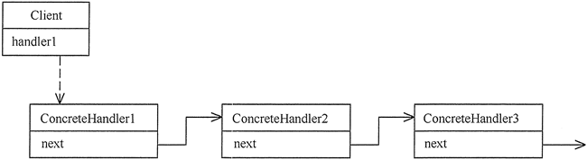

# 责任链模式

为了避免请求发送者与多个请求处理者耦合在一起，于是将所有请求的处理者通过前一对象记住
其下一个对象的引用而连成一条链；当有请求发生时，可将请求沿着这条链传递，直到有对象处理它为止。

角色
1. 抽象处理者
2. 具体处理者
3. 客户端

适用场景
1. 有多个对象可以处理一个请求，哪个对象处理由运行时决定
2. 在不明确接收者的情况下，向多个对象的一个提交一个请求

优点
1. 降低耦合：一个对象无需知道是其他哪一个对象处理其请求




```python
# 为了避免请求发送者与多个请求处理者耦合在一起，于是将所有请求的处理者通过前一对象记住
# 其下一个对象的引用而连成一条链；当有请求发生时，可将请求沿着这条链传递，直到有对象处理它为止。

#

from abc import ABCMeta, abstractmethod


class Handler(metaclass=ABCMeta):

    @abstractmethod
    def handle_leave(self, day):
        pass


class GeneralManager(Handler):

    def handle_leave(self, day):
        if day < 10:
            print("总经理准假%d天" % day)
        else:
            print("辞职吧")


class DepartmentManager(Handler):

    def __init__(self):
        self.next = GeneralManager()

    def handle_leave(self, day):
        if day < 5:
            print("部门经理准假%d天" % day)
        else:
            print("部门经理职权不足")
            self.next.handle_leave(day)


class ProjectDirector(Handler):

    def __init__(self):
        self.next = DepartmentManager()

    def handle_leave(self, day):
        if day <= 3:
            print("项目主管准假%d天" % day)
        else:
            print("项目主管职权不足")
            self.next.handle_leave(day)


if __name__ == '__main__':
    day = 4
    h = ProjectDirector()
    h.handle_leave(day)
```


